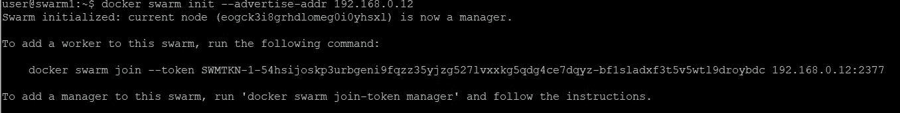
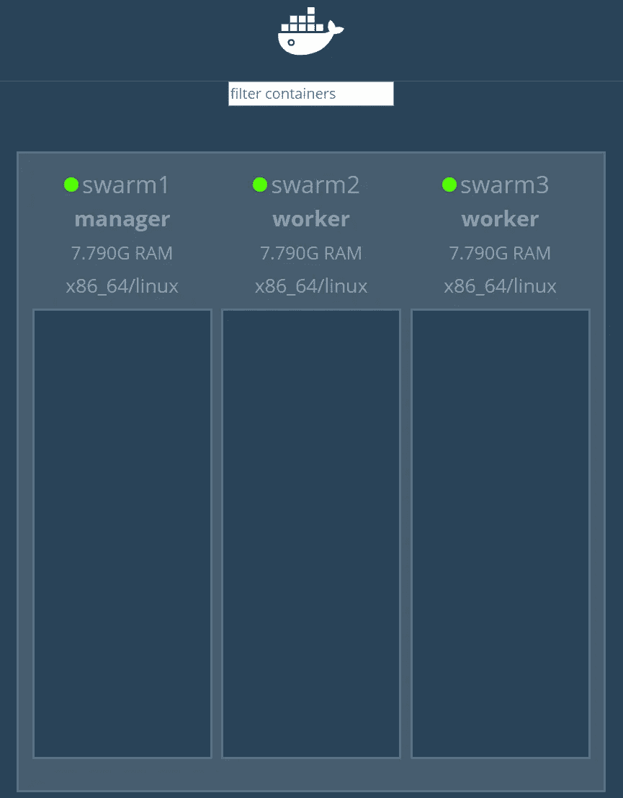
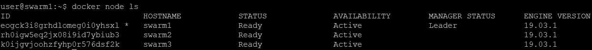
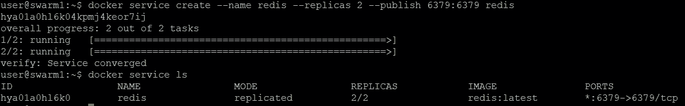
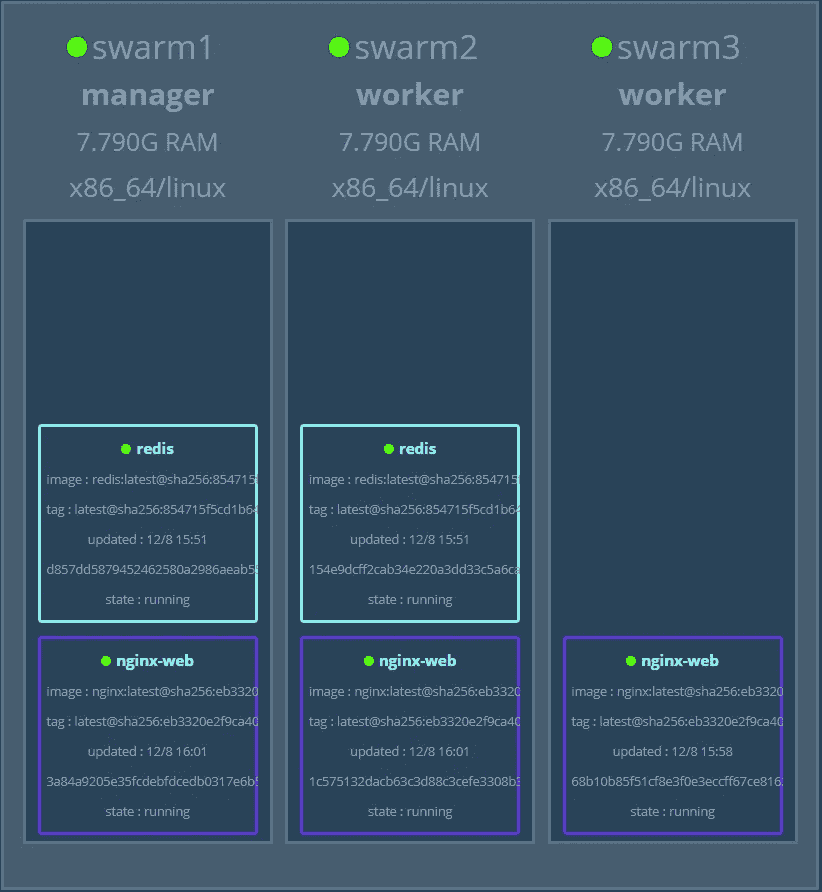

# 安装和配置 Docker swarm

> 原文：<https://itnext.io/install-and-monitor-docker-swarm-e9db8a8fbbc4?source=collection_archive---------1----------------------->

这篇文章描述了使用运行在 VMware vSphere 之上的 Ubuntu 18.04 服务器虚拟机安装 [Docker swarm](https://docs.docker.com/engine/swarm/) 。

安装完成后，为 ESXi、Ubuntu Linux 和 Docker Swarm 准备了一些容器。

这一步是为以后的文章做准备，包括 Docker Swarm 和所有组件的监控。

我们在 [Opvizor](https://www.opvizor.com) 为我们的内部开发和产品测试运行了几十个演示环境。除了 Kubernetes，我们目前正在研究 Docker Swarm 集成。因此，将来会有更多类似于 Kubernetes 示例的监控选项:


# 设置

该设置由 3 台在 vSphere 6.7 上运行 Ubuntu 18.04 LTS 的虚拟机组成。

作为测试环境，虚拟机配置了 4 个虚拟 CPU、8 GB 内存和 32 GB 磁盘。请确保调整您的环境以满足您的需求。

虚拟机命名为 swarm1、swarm2 和 swarm3。

# 安装 Docker CE

在常见的 sudo apt 更新& sudo apt 升级之后，我们安装 Docker CE。

```
sudo apt install apt-transport-https ca-certificates curl software-properties-commoncurl -fsSL [https://download.docker.com/linux/ubuntu/gpg](https://download.docker.com/linux/ubuntu/gpg) | sudo apt-key add -sudo add-apt-repository "deb [arch=amd64] [https://download.docker.com/linux/ubuntu](https://download.docker.com/linux/ubuntu) bionic stable"sudo apt updatesudo apt install docker-cesudo systemctl status dockersudo usermod -aG docker ${USER}apt-cache policy docker-cesudo systemctl start docker sudo systemctl enable docker
```

# 安装 Docker 群

Swarm 自动成为 Docker CE 安装的一部分，但是我们需要做一些准备。

1 个节点应该是管理器，而其他节点成为工作节点。让我们在 hosts 文件中反映这一点(当然 dns 更好，但是在测试环境中并不重要)。

```
# sudo vi /etc/hosts 192.168.0.12 swarm1 manager1 192.168.0.14 swarm2 worker1 192.168.0.15 swarm3 worker2
```

# 初始化 Docker 群

您可能会注意到，我们将 192.168.0.12 命名为 manager1 —请仅在 manager 节点上运行以下命令

```
docker swarm init --advertise-addr 192.168.0.12
```



根据 docker swarm init 命令的输出，在两个 worker 节点上运行以下命令。

```
docker swarm join --token SWMTKN-1-54hsijoskp3urbgeni9fqzz35yjzg527lvxxkg5qdg4ce7dqyz-bf1sladxf3t5v5wtl9droybdc 192.168.0.12:2377
```

您应该会收到如下消息:

这个节点作为一个工作者加入了一个群体。

# 设置 Docker swarm UI

```
sudo apt install unzip wget [https://github.com/dockersamples/docker-swarm-visualizer/archive/master.zip](https://github.com/dockersamples/docker-swarm-visualizer/archive/master.zip) unzip master.zip mv docker-swarm-visualizer-master dockersamples docker run -it -d -p 5000:8080 -v /var/run/docker.sock:/var/run/docker.sock dockersamples/visualizer
```



# 检查码头工人群状态

你可以随时使用 **docker node ls** 检查你的 Docker Swarm 集群以及有多少节点可用



使用 docker 服务 ls 检查正在运行的服务: **docker 服务 ls**

或者具体服务的更多细节: **docker service ps redis**

# 部署第一个服务

由于 Docker 现在为容器服务管理一个主机集群，而不是一个单独的主机引擎，所以您需要以不同的方式部署容器(服务)。让我们将一个 redis 数据库部署为具有两个副本的服务。

复制品是一种实例。多个副本的好处是，总是有更多的容器运行来接管服务。如果一个容器或容器主机将关闭，Docker Swarm 将重新启动该服务的容器，但它不是即时的(可能需要几秒钟)。拥有多个副本意味着无需重启即可即时接管剩余副本。

```
docker service create --name redis --replicas 2 --publish 6379:6379 redis
```

**—发布**

当 Docker 为一个服务发布一个端口时，它通过**在集群集群**内的所有节点上监听该端口来实现。当流量到达该端口时，该流量被路由到为该服务运行的容器。当所有节点都运行一个服务的容器时，这个概念是非常标准的，但是当我们的节点比副本多时，这个概念就变得有趣了。尽管没有在所有群节点上运行副本，发布的服务将在所有节点上可用。



您也可以先创建一个服务，然后再扩展——让我们部署 nginx

```
# start with one service docker service create --name nginx-web --publish 8080:80 nginx# scale out to 3 replicas docker service scale nginx-web=3
```



```
docker service ls ID NAME MODE REPLICAS IMAGE PORTS 8a0wumpvlm7u nginx-web replicated 3/3 nginx:latest *:8080->80/tcp hya01a0hl6k0 redis replicated 2/2 redis:latest *:6379->6379/tcp
```

您现在可以简单地检查 Redis 是否在所有节点上都有响应，尽管它只在 swarm1 和 swarm2 上运行。

```
redis-cli -h 192.168.0.12 -p 6379 redis-cli -h 192.168.0.14 -p 6379 redis-cli -h 192.168.0.15 -p 6379
```

# 多容器——WordPress+数据库

这个设置由多个组件组成:secrets、network、MariaDB 数据库服务和 WordPress 服务。

**秘密**

让我们首先为根数据库和 wordpress 数据库创建密码，并将它们作为秘密存储在每个 Swarm 节点上。

```
openssl rand -base64 20 | docker secret create root_db_password - openssl rand -base64 20 | docker secret create wp_db_password -
```

**docker secret ls** 显示所有秘密

# 网络

现在，我们需要一个跨群集的网络连接。

```
docker network create -d overlay wordpress-net
```

# 创建 MariaDB 服务

```
docker service create --name mariadb --replicas 1 --constraint=node.role==manager --network wordpress-net --secret source=root_db_password,target=root_db_password --secret source=wp_db_password,target=wp_db_password -e MYSQL_ROOT_PASSWORD_FILE=/run/secrets/root_db_password -e MYSQL_PASSWORD_FILE=/run/secrets/wp_db_password -e MYSQL_USER=wp -e MYSQL_DATABASE=wp mariadb:10.1
```

# 创建 WordPress 服务

```
docker service create --name wp --constraint=node.role==worker --replicas 1 --network wordpress-net --publish 80:80 --secret source=wp_db_password,target=wp_db_password,mode=0400 -e WORDPRESS_DB_USER=wp -e WORDPRESS_DB_PASSWORD_FILE=/run/secrets/wp_db_password -e WORDPRESS_DB_HOST=mariadb -e WORDPRESS_DB_NAME=wp wordpress:4.7
```

如果你在端口 80 上访问任何 Docker Swarm 节点，你应该会看到 WordPress 安装程序。

*原载于 2019 年 8 月 13 日*[*https://www.opvizor.com*](https://www.opvizor.com/install-and-use-docker-swarm)*。*