# 在 vSphere 上安装和监控 Photon OS、Kubernetes

> 原文：<https://itnext.io/install-and-monitor-photon-os-kubernetes-on-vsphere-e6d92ee13b52?source=collection_archive---------1----------------------->

在 [VMware vSphere](http://www.vmware.com) 之上运行容器是现代开发环境中的热门话题。 [Kubernetes](https://kubernetes.io/) 管理容器集群和容器应用程序是非常流行和有效的。

以下博客文章介绍了在 vSphere 上安装和监控 [Photon OS](https://vmware.github.io/photon/) 、Kubernetes(使用 Kubernetes Anywhere)以直接方式管理容器和应用程序。

虽然一个稳定而敏捷的平台对于一个成功的项目来说至关重要，但是监控正常运行时间和性能真的让它变得非常神奇！

**ISO 镜像:**

包含安装 Photon OS 的最小安装或完整安装所需的一切。可引导 ISO 有一个手动安装程序，或者可以与 PXE/kickstart 环境一起用于自动安装。

**OVA 图像:**

预装的最小环境，为 VMware 虚拟机管理程序环境定制。这些定制包括一个高度净化和优化的内核，为容器和 Linux 应用程序提供改进的引导和运行时性能。由于 OVA 是一个完整的虚拟机定义，我们已经提供了一个具有虚拟硬件版本 11 的 Photon OS OVA 这将允许与多个版本的 VMware 平台兼容，或者允许最新和最大的虚拟硬件增强。

在本指南中，我将下载 OVA 映像并将其导入到 vSphere，并使该虚拟机成为我的管理系统，以部署未来的 Kubernetes 集群。

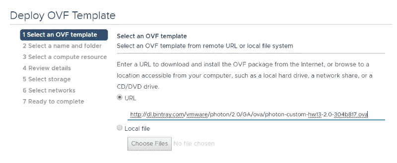

引导导入的 Photon OS 虚拟机后，您可以使用 VMware 控制台访问配置向导。

**为了简化这篇博文中的系统标识，我将这个虚拟机命名为 Photon01**

默认凭证是用户名 ***root*** 和密码 ***changeme***

首次登录时，系统会要求您更改密码。

# 更改网络配置

尽管您在 OVA 导入过程中配置了网络设置，但有些情况下您需要更改网络配置。

负责的 systemd-networkd 守护进程正在检查***/etc/systemd/network***中的配置文件。

这些被命名为 10 或 99…***DHCP . network***或***static . network***取决于您的配置。

要将配置从 dhcp 更改为静态，您需要删除 dhcp 文件并创建。相应的网络文件。

```
***cd /etc/systemd/network******mv 99-dhcp-en.network 10-static-en.network***
```

然后更改文件的内容。

有一篇很棒的博文是这样描述的:[https://virtualnomadblog . com/2017/03/30/configuring-photonos-network-settings/](https://virtualnomadblog.com/2017/03/30/configuring-photonos-network-settings/)

```
*[Match]Name=e*[Network]
DHCP=no
Address=192.168.1.101/24
Gateway=192.168.1.1
DNS=192.168.1.21 192.168.1.1
Domains=testorg.local*
```

只需重新启动设备，更改网络配置应该会出现。交替类型

```
***systemctl stop systemd-networkd******systemctl start systemd-networkd***
```

# 更新 Photon OS 系统

我总是在添加任何应用程序之前更新操作系统，以确保一切都是最新的，包括安全补丁。

```
***tdnf update***
```

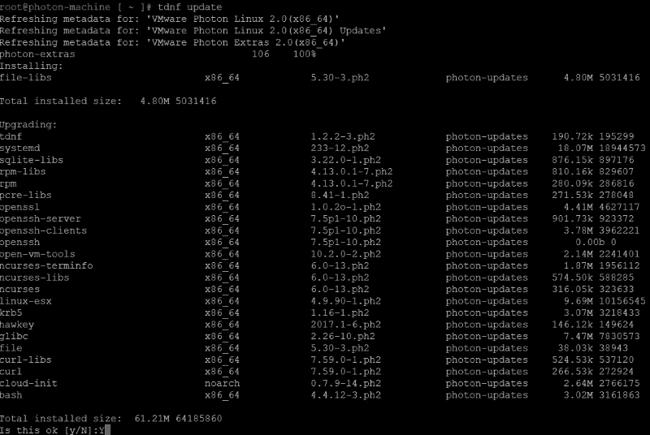

***tdnf 升级*** 升级发行版如果有的话

# Kubernetes 制剂

在开始安装 vSphere 上的 Kubernetes 之前的第一步，我们需要获得要用于 Kubernetes 的 Photon OS 映像。

查看描述(请注意，容器图像是光子 v1)

[https://github . com/kubernetes/kubernetes-anywhere/blob/master/phase 1/VSP here/readme . MD #部署](https://github.com/kubernetes/kubernetes-anywhere/blob/master/phase1/vsphere/README.md#deployment)

复制下载 URL 或下载虚拟设备并将其导入到您的 vSphere 环境中。请不要打开它—就把它放在那里，记住虚拟机的名称以备后用。

```
***git clone*** [***https://github.com/kubernetes/kubernetes-anywhere***](https://github.com/kubernetes/kubernetes-anywhere)***cd kubernetes-anywhere***
```

#启用 docker

```
***systemctl start docker******systemctl enable docker***
```

#下载 kubernetes-anywhere 部署容器

```
***docker pull cnastorage/kubernetes-anywhere***
```

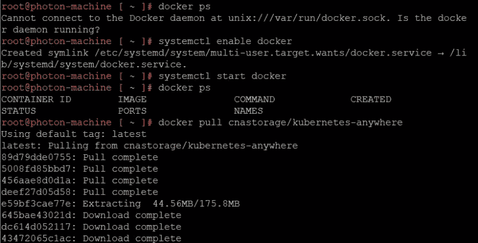

#启动容器

```
**docker run -it -v /tmp:/tmp –rm –env=”PS1=[container]:w> ” –net=host cnastorage/kubernetes-anywhere:latest /bin/bash**
```

docker run 命令启动容器，并在容器内启动远程 bash 会话。在提示符下，您可以直接开始为以后的部署创建 Kubernetes 集群配置。

```
***make config***
```

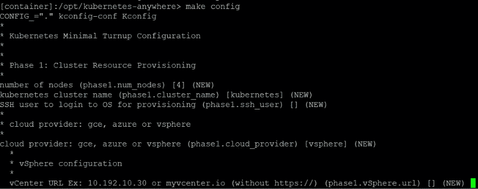

命令启动配置设置，我主要使用默认设置在 vSphere 上部署 4 个集群节点。

只需确保使用具有足够权限的 vCenter 用户帐户来创建和运行虚拟机，并按照 vCenter 中的定义配置正确的数据中心、群集和存储名称。

还要确保使用正确的映像进行部署！

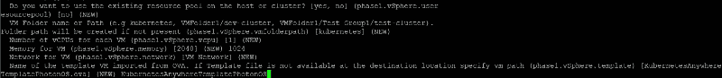

在这种情况下，我使用默认值:

**kubernetasanywhere template photonos**

如果您不想为任何细节而烦恼，您可以保留默认值:

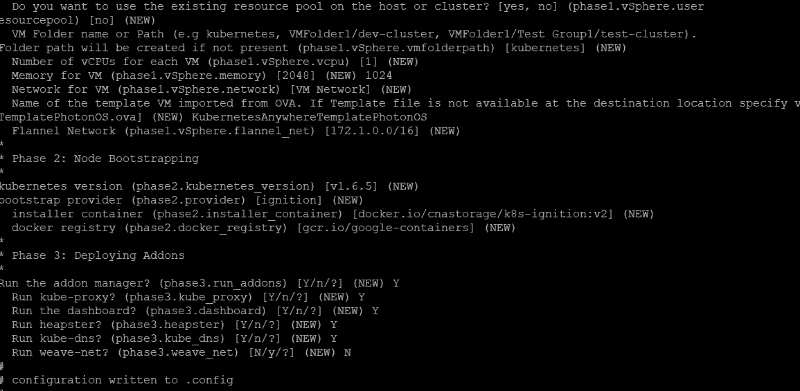

确保运行代理、仪表板和堆集器等插件，因为它们大大简化了管理和监控。可以忽略 weave-net，选择 n。

# 部署 Kubernetes 集群

设置好配置后，我们可以使用 make deploy 命令在由一个主虚拟机和 4 个节点组成的 vSphere 集群上部署 Kubernetes:

```
**make deploy**
```

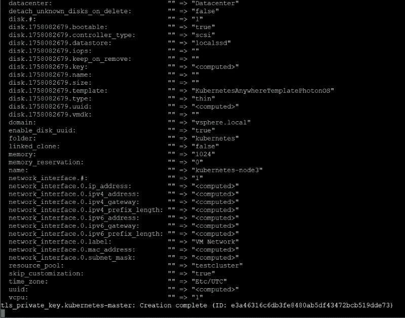

脚本运行完毕后，您可以在 vCenter 管理中找到 5 台虚拟机。

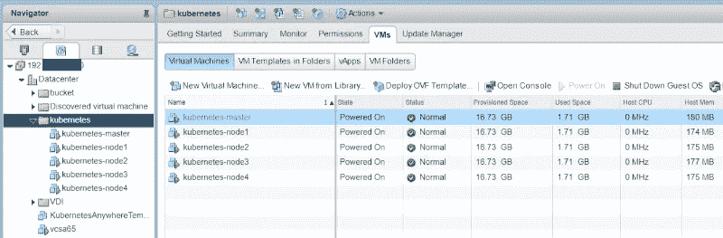

# 访问 Kubernetes 管理仪表板

Kubernetes Anywhere 会自动部署 dashboard 扩展，我们只需要找出 dashboard 服务在 kubernetes-master 虚拟机上使用的端口。所以首先获取 Kubernetes-Master VM 的 ip，并使用 SSH 进行连接。

默认凭证是 **root** 和 **kubernetes**

要找到端口，请使用以下命令:

```
**kubectl describe service kubernetes-dashboard –namespace=kube-system| grep -i NodePort**
```

您将得到与下面类似的输出，并使用它连接到 kubernetes-master VM:[http://kubernetes-master-IP:**31673**](http://kubernetes-master-ip:31673)

```
Type: NodePort
NodePort: <unset> **31673**/TCP
```

请注意，这个设置没有使用 SSL，因此它并不真正安全，但却是一个很好的开端。

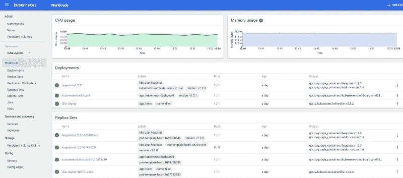

# 使用性能分析器监控 Kubernetes 环境

在任何地方部署 Kubernetes 时，您安装了一个名为 heapster 的服务，它允许收集和转发性能指标。它还允许将指标直接发送到我们的性能分析器设备。

要转发指标，请确保转到工作负载-部署视图:

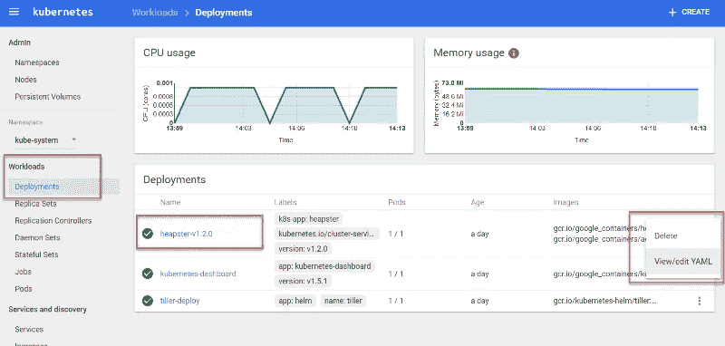

单击右侧的 3 按钮图标，并选择查看/编辑 YAML。

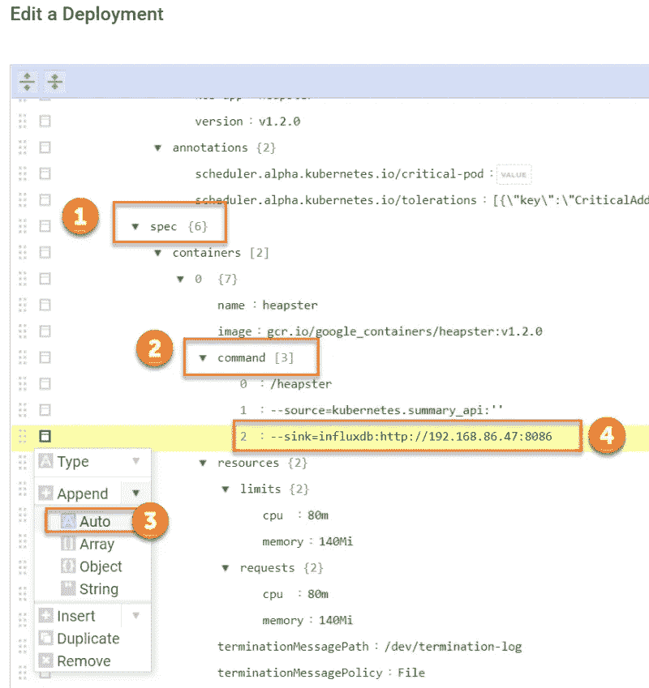

搜索规范部分(1)，然后搜索命令部分(2)，然后单击左侧的按钮追加一个自动条目(3)，并添加以下文本:***–sink = influxdb:http://performance _ analyzer _ appliance _ DNS _ or _ IP:8086***

然后单击 update，现有的 heapster 容器将被销毁，并创建一个包含更新配置的新容器。

在 Performance Analyzer 中，您可以导入 Kubernetes 仪表板来监视 Kubernetes 面板和节点统计信息。

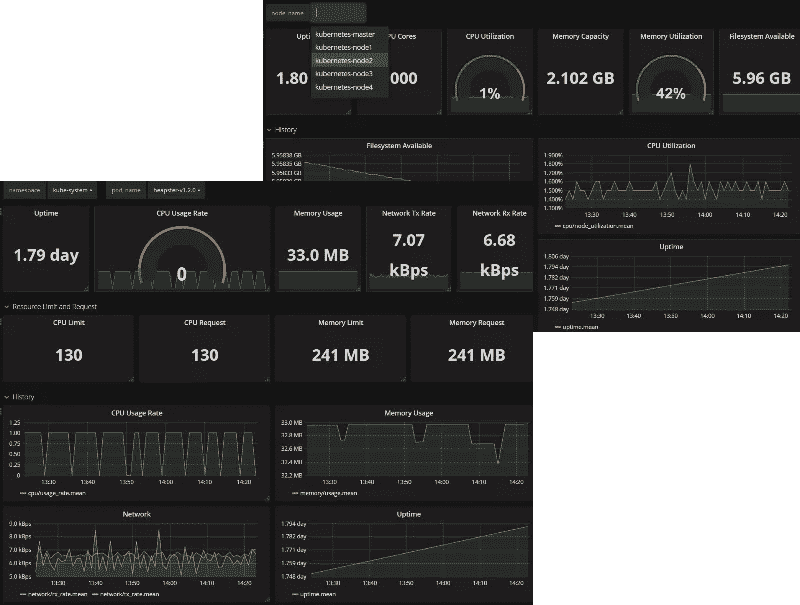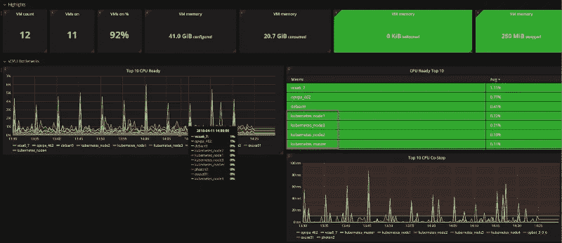

如果您想开始监控 VMware vSphere、Photon OS 以及 Kubernetes，请开始试用 Performance Analyzer，并联系我们以获取特殊详细信息。


*原载于 2018 年 4 月 17 日*[*www.opvizor.com*](https://www.opvizor.com/?p=11546&preview=true&spokaldraftshare=28906d5a-a481-4b4a-b923-50cc4bb61d21)*。*