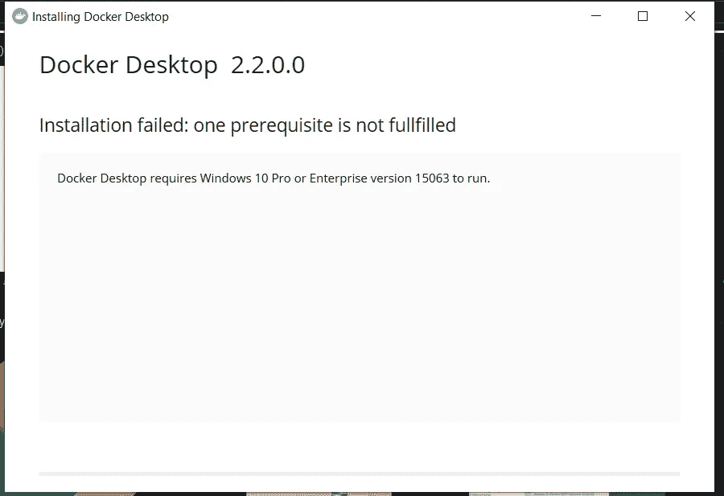
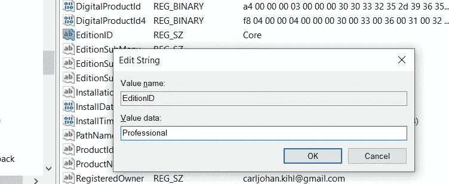
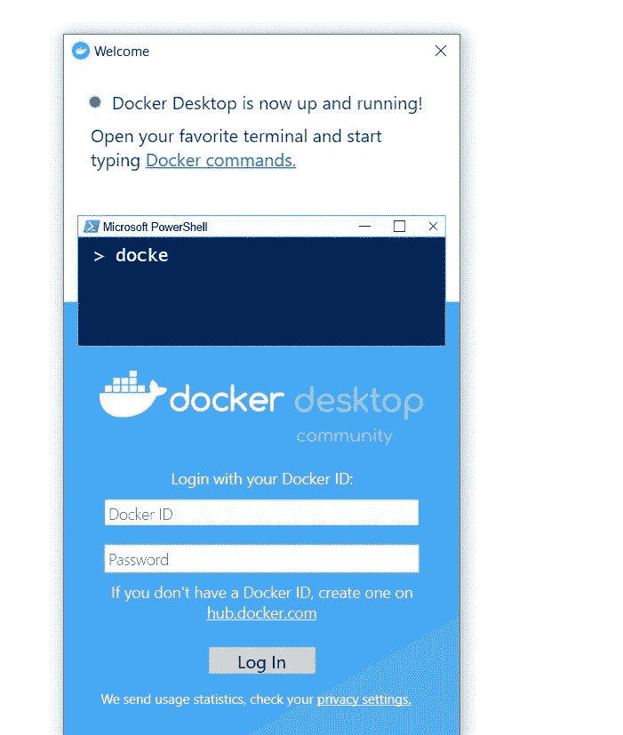

# 在 Windows 10 Home 上安装 Docker

> 原文：<https://itnext.io/install-docker-on-windows-10-home-d8e621997c1d?source=collection_archive---------0----------------------->


如果你曾经试图在 Windows 10 家庭版上安装 Docker，你会遇到这个问题:

*安装失败:未满足一个先决条件
Docker Desktop 要求运行 Windows 10 Pro 或企业版 15063。*



在你花 200 美元购买 Windows Pro 许可证之前💸
先试试这个！😃

Docker 需要 Windows Pro 或 Enterprise 的原因是他们在使用 [Hyper-V](https://docs.microsoft.com/en-us/virtualization/hyper-v-on-windows/about/) 和[容器](https://docs.microsoft.com/en-us/virtualization/windowscontainers/about/)。让我们安装这些。

# 安装 Hyper-V 和容器

1.  创建一个名为`InstallHyperV.bat`的文件
2.  添加此内容:

```
pushd "%~dp0"
dir /b %SystemRoot%\servicing\Packages\*Hyper-V*.mum >hyper-v.txt
for /f %%i in ('findstr /i . hyper-v.txt 2^>nul') do dism /online /norestart /add-package:"%SystemRoot%\servicing\Packages\%%i"
del hyper-v.txt
dism /online /enable-feature /featurename:Microsoft-Hyper-V -All /LimitAccess /ALL
pause
```

3.在管理员模式下运行`InstallHyperV.bat`。

4.创建一个名为`InstallContainers.bat`的文件

5.添加此内容:

```
pushd "%~dp0"
dir /b %SystemRoot%\servicing\Packages\*containers*.mum >containers.txt
for /f %%i in ('findstr /i . containers.txt 2^>nul') do dism /online /norestart /add-package:"%SystemRoot%\servicing\Packages\%%i"
del containers.txt
dism /online /enable-feature /featurename:Containers -All /LimitAccess /ALL
pause
```

6.在管理员模式下运行`InstallContainers.bat`。

**更新:**一些用户对脚本的媒体格式和包装有问题。如果你有问题，试着照抄这个要点。

7.重新启动计算机

好极了。现在我们已经安装了 Hyper-V 和容器，是时候欺骗 Docker 我们正在 Windows Pro 上运行了。😎

# 在注册表中编辑 Windows 版本

1.  按下`Windows + R`并写入`regedit`

2.在注册表编辑器中，转到`\HKEY_LOCAL_MACHINE\SOFTWARE\Microsoft\Windows NT\CurrentVersion`

3.右击`EditionID`并点击`Modify`

4.将数值数据更改为`Professional`



5.按确定。

# 安装 Docker

⚠️ *如果你重启电脑，EditionID 会被重置，你必须重新设置。*

干得好！⭐️现在，再次运行 Docker 安装程序。它应该没有任何问题。安装完成后，您可以将 EditionID 改回`Core`

就是这样！我希望你得到了一切工作，并启动和运行与 docker！



感谢 [Docker 论坛](https://forums.docker.com/t/installing-docker-on-windows-10-home/11722/28)的`hessi9`和`mapk`找到了这个解决方案。⭐️