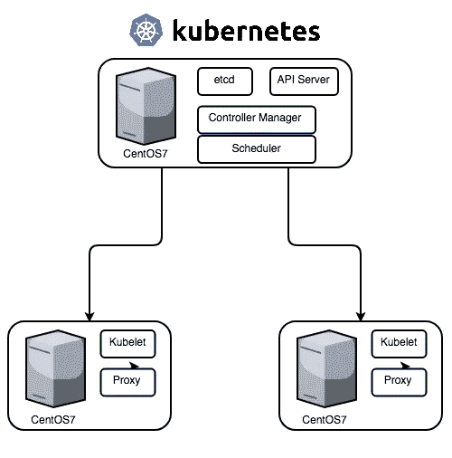
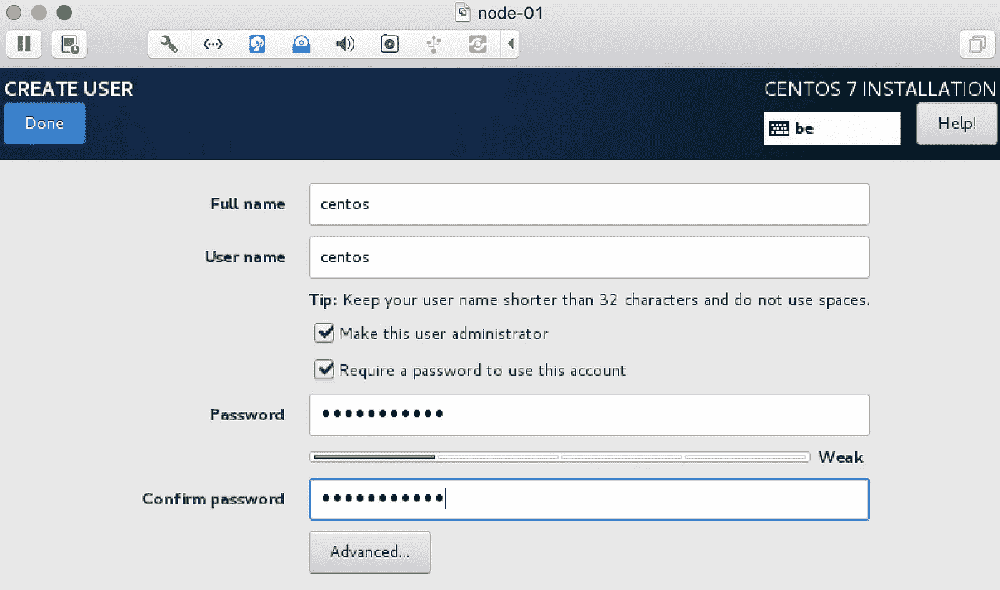
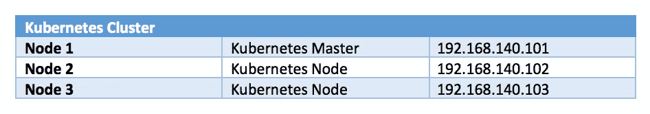
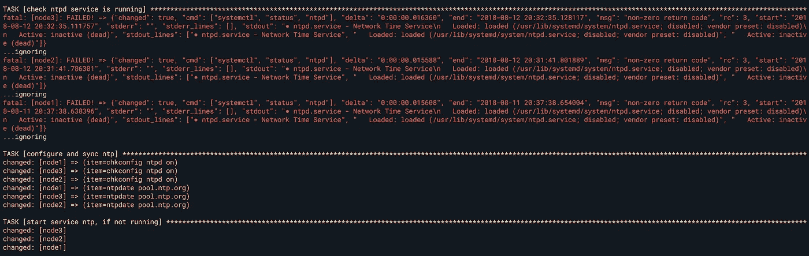
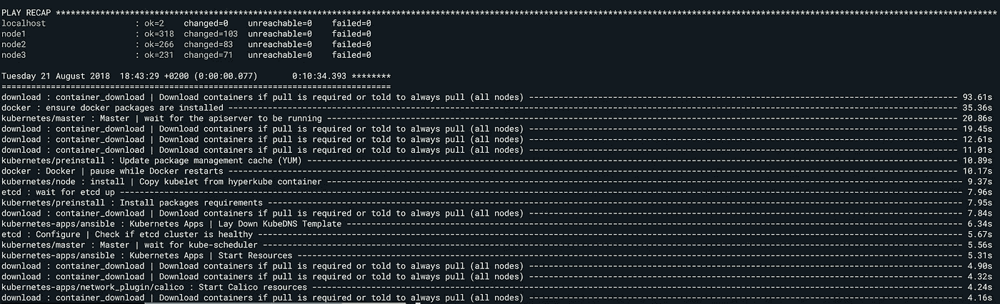
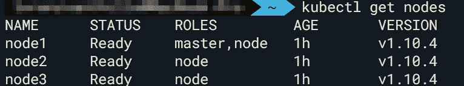
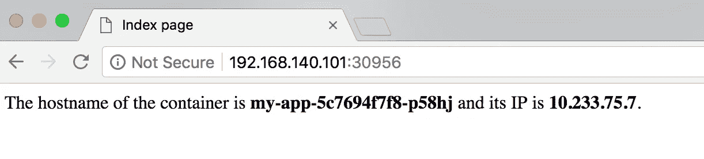

# 在裸机 CentOS7 上安装 Kubernetes

> 原文：<https://itnext.io/install-kubernetes-on-bare-metal-centos7-fba40e9bb3de?source=collection_archive---------0----------------------->

> 如今，大多数云提供商都提供托管解决方案来在其环境中运行 Kubernetes 集群。尽管在云中安装 Kubernetes 非常容易，但仍然需要非基于云的 Kubernetes 解决方案。
> 在这篇博客中，我将解释如何使用 Ansible 和 [kubespray](https://github.com/kubernetes-incubator/kubespray) 在 CentOS7 机器上安装 Kubernetes 集群，这将使我们的工作自动化。



## 服务器设置

我们需要创建 3 台虚拟机，用于创建我们的集群:

*   操作系统:CentOS7/RHEL7
*   2048MB 内存+ 2 个 CPU + 20 GB 硬盘(最低)/节点
*   互联网接入/ eth0 接口
*   具有 root 权限的用户

我在本地计算机上创建了 3 个满足 VMware Fusion 最低要求的虚拟机。我用过[CentOS-7-x86 _ 64-Minimal-1805–01 . iso](https://buildlogs.centos.org/rolling/7/isos/x86_64/CentOS-7-x86_64-Minimal-1805-01.iso)。

我创建的用户名为`centos`，密码为`supersecret`。您可以使用任何用户名/密码，但需要 root 权限。



这个服务器已经预装了`openssh`。我第一台服务器的 IP 是`192.168.140.101`。

我们需要确保我们可以通过 SSH 连接到集群中的每台服务器:

```
$ ssh centos@192.168.140.101
centos@192.168.140.101's password:
[centos@localhost ~]$ exit
$ ssh centos@192.168.140.102
centos@192.168.140.102's password:
[centos@localhost ~]$ exit
$ ssh centos@192.168.140.103
centos@192.168.140.103's password:
[centos@localhost ~]$ exit
```



## 服务器配置

在我们使用 [kubespray](https://github.com/kubernetes-incubator/kubespray) 安装 Kubernetes 集群之前，需要配置我们的 3 台服务器。有一些先决条件:

*   最新的软件包
*   所有服务器都需要有相同的日期和时间(ntpd)
*   禁用防火墙
*   禁用交换
*   无密码的 sudo
*   无密码 SSH(推荐)

我们可以通过在每个服务器或节点上执行所有必要的命令来分别配置每个服务器。但是为了实现这些步骤的自动化，我写了一个基本的 [Ansible](https://www.ansible.com/) 剧本，可以在我的 [GitHub](https://github.com/lvthillo/ansible-centos7-kubespray) 上找到。本行动手册将配置我们的 CentOS7 机器。

## 运行可行的行动手册以满足先决条件

在您的机器上安装 Ansible，从这里您将开始行动手册。我在做 MacOS。

```
$ brew install ansible
$ ansible --version
ansible 2.6.2
```

剧本将通过使用公钥来配置无密码 SSH。这个 public 存储在`~/.ssh/id_rsa.pub`但是位置可以定制。如博客开头所示:我正在使用用户`centos`，它在组`centos`中，密码为`supersecret`。这些名称也可以定制。

现在克隆包含行动手册的存储库。

```
$ git clone [https://github.com/lvthillo/ansible-centos7-kubespray.git](https://github.com/lvthillo/ansible-centos7-kubespray.git)
$ cd ansible-centos7-kubespray
```

更新`hosts.ini`文件并添加服务器的 IP 地址。

```
[all]
node1 ansible_host=192.168.140.101
node2 ansible_host=192.168.140.102
node3 ansible_host=192.168.140.103
```

现在我们将运行剧本并定义我们的变量。同样，确保您可以与您的用户进行 ssh(通过使用密码)。我的命令是这样的(更新变量！):

```
$ ansible-playbook -i hosts.ini -u centos -k playbook.yml --extra-vars "ansible_sudo_pass=supersecret user=centos group=centos pubkeypath=~/.ssh/id_rsa.pub"
```

剧本将检查`ntpd`服务是否正在运行。如果该服务没有运行，这将导致一个错误，该错误将被行动手册忽略。将安装并启用`ntpd`服务。



最后，服务器重新启动，我们的服务器满足了先决条件。

## 运行 Ansible Playbook 安装 Kubernetes

现在我们终于可以安装 Kubernetes 了。在这里，我们将使用 kubespray，它也使用 Ansible 剧本。我们将使用当前的最新版本(v.2.6.0)。
Kubespray 会配置我们的集群，安装 Docker，etcd，calico 网络插件(默认)，…。

```
$ git clone [https://github.com/kubernetes-incubator/kubespray](https://github.com/kubernetes-incubator/kubespray)
$ cd kubespray
$ git checkout v2.6.0
```

遵循 Kubespray 的 [GitHub 自述文件中的说明。](https://github.com/kubernetes-incubator/kubespray/blob/master/README.md)

```
# Install dependencies from ``requirements.txt``
$ sudo pip install -r requirements.txt

# Copy inventory/sample as inventory/mycluster
$ cp -rfp inventory/sample inventory/mycluster

# Update Ansible inventory file with inventory builder
$ declare -a IPS=(192.168.140.101 192.168.140.102 192.168.140.103)
$ CONFIG_FILE=inventory/mycluster/hosts.ini python3 contrib/inventory_builder/inventory.py ${IPS[@]}

# Review and change parameters under inventory/mycluster/group_var
$ cat inventory/mycluster/group_vars/all.yml
$ cat inventory/mycluster/group_vars/k8s-cluster.yml# Optional: modify the hosts.ini file to your needs.
$ vi inventory/mycluster/hosts.ini[all]
node1   ansible_host=192.168.140.101 ip=192.168.140.101
node2   ansible_host=192.168.140.102 ip=192.168.140.102
node3   ansible_host=192.168.140.103 ip=192.168.140.103# possible to add additional masters
[kube-master]
node1[kube-node]
node2
node3# possible to add additional etcd's
[etcd]
node1[k8s-cluster:children]
kube-node
kube-master[calico-rr][vault]
node1
node2
node3# Deploy Kubespray with Ansible Playbook. In my case with the centos user.
$ ansible-playbook -u centos -b -i inventory/mycluster/hosts.ini cluster.yml
```



在您的本地机器上安装`kubectl` CLI。

```
$ brew install kubernetes-cli
```

现在配置 CLI 以使用您的 Kubernetes 集群。

```
$ ssh centos@192.168.140.101 sudo ls /etc/kubernetes/ssl/$ ssh centos@192.168.140.101 sudo cat /etc/kubernetes/ssl/admin-node1-key.pem > admin-key.pem$ ssh centos@192.168.140.101 sudo cat /etc/kubernetes/ssl/admin-node1.pem > admin.pem$ ssh centos@192.168.140.101 sudo cat /etc/kubernetes/ssl/ca.pem > ca.pem$ kubectl config set-cluster default-cluster --server=[https://192.168.140.101:6443](https://192.168.140.101:6443) --certificate-authority=ca.pem$ kubectl config set-credentials default-admin \
    --certificate-authority=ca.pem \
    --client-key=admin-key.pem \
    --client-certificate=admin.pem$ kubectl config set-context default-system --cluster=default-cluster --user=default-admin$ kubectl config use-context default-system$ kubectl version$ kubectl get pods -n kube-system
NAME                                    READY     STATUS    RESTARTS   AGE
calico-node-cbptm                       1/1       Running   0          9m
calico-node-q5mlp                       1/1       Running   0          9m
calico-node-qtvrf                       1/1       Running   0          9m
kube-apiserver-node1                    1/1       Running   0          9m
kube-controller-manager-node1           1/1       Running   0          10m
kube-dns-69f4c8fc58-mpwz6               3/3       Running   0          9m
kube-dns-69f4c8fc58-zpffn               3/3       Running   0          9m
kube-proxy-node1                        1/1       Running   0          10m
kube-proxy-node2                        1/1       Running   0          10m
kube-proxy-node3                        1/1       Running   0          10m
kube-scheduler-node1                    1/1       Running   0          10m
kubedns-autoscaler-565b49bbc6-227rh     1/1       Running   0          9m
kubernetes-dashboard-6d4dfd56cb-phvzd   1/1       Running   0          9m
nginx-proxy-node2                       1/1       Running   0          10m
nginx-proxy-node3                       1/1       Running   0          10m
```



## 在 Kubernetes 中部署一个基本应用程序

通过部署一个非常基本的 Python 应用程序，我们可以证明 Kubernetes 集群正在运行和工作。我们将部署两个 pod，它们将打印它们的 IP 和一个 NodePort 类型的服务。我的 [GitHub](https://github.com/lvthillo/python-flask-docker) 上有这个应用。

`deployment.yaml`:

创建部署和服务。

```
$ kubectl create -f deployment.yaml
deployment.apps/my-nginx created
service/my-nginx created$ kubectl get pods -n default
NAME                      READY     STATUS    RESTARTS   AGE
my-app-5c7694f7f8-b4lrm   1/1       Running   0          2m
my-app-5c7694f7f8-p58hj   1/1       Running   0          2m$ kubectl get svc -n default
NAME         TYPE        CLUSTER-IP       PORT(S)          AGE
kubernetes   ClusterIP   10.233.0.1       443/TCP          37m
my-app       NodePort    10.233.62.17     8080:30956/TCP   2m
```

现在访问[http://192 . 168 . 140 . 101:30956](http://192.168.140.101:30956)并刷新页面，直到您被路由到另一个 pod。



豆荚在我们的节点上运行。

```
$ kubectl describe pod my-app-5c7694f7f8-b4lrm | grep ‘Node:’
Node: node3/192.168.140.103
$ kubectl describe pod my-app-5c7694f7f8-p58hj | grep ‘Node:’
Node: node2/192.168.140.102
```

## 结论

我们在三台裸机 CentOS7 机器上创建了一个 Kubernetes 集群，其中有一个主节点和两个节点。Kubernetes 的安装相当复杂，但是通过使用 Ansible 和 Kubespray，我们能够在不进行大量手动交互的情况下安装集群。不要忘记配置集群的防火墙规则。这超出了本教程的范围。希望你喜欢！

[](https://www.buymeacoffee.com/dZb8fLN)

如果真的对你有帮助…:)