# 使用 Ubuntu juju 在 vSphere 上安装 Kubernetes

> 原文：<https://itnext.io/install-kubernetes-on-vsphere-using-ubuntu-juju-5d6169176ae0?source=collection_archive---------3----------------------->

我们中的更多客户( [Opvizor](https://www.opvizor.com) )正在使用 [Kubernetes](https://www.kubernetes.io) ，并且希望监控他们的 VMware vSphere 环境以及在其上运行的 Kubernetes 节点和容器。Performance Analyzer 将很快支持所有这些设置(还有几周)。一如既往，我们希望分享如何设置我们的测试环境，以便在我们的 vSphere 6.7 环境之上运行完整的 Kubernetes 环境。

我们将使用 Ubuntu 18.10、变色龙、juju，最后是常见的 Kubernetes 管理工具。

# 变戏法

我们需要在我们的 Ubuntu 管理系统上使用魔法，我们用它在 vSphere 上部署 Kubernetes。如果您没有安装 dream-up，请运行:

```
**sudo snap install conjure-up –classic**
```

下一步是安装向导:

```
**conjure-up kubernetes**
```

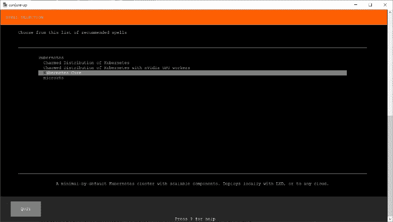

当然，你可以选择一个更全面的安装，但我们很好的 Kubernetes 核心设置。

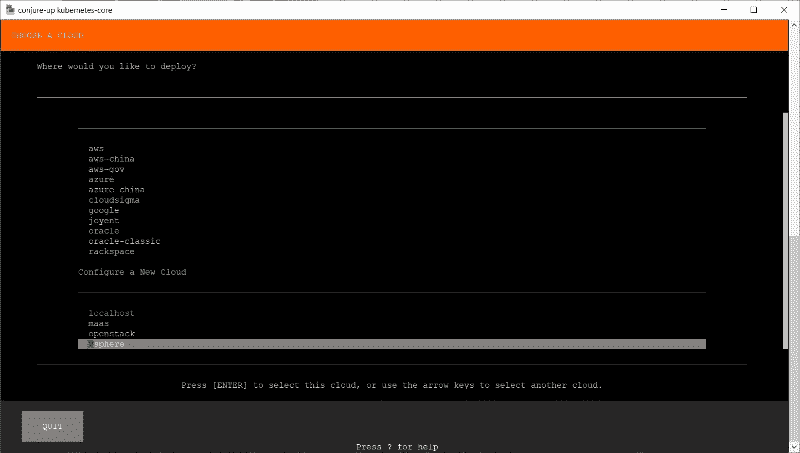

您需要向下滚动到**配置新云**部分，并选择 **vSphere** 。

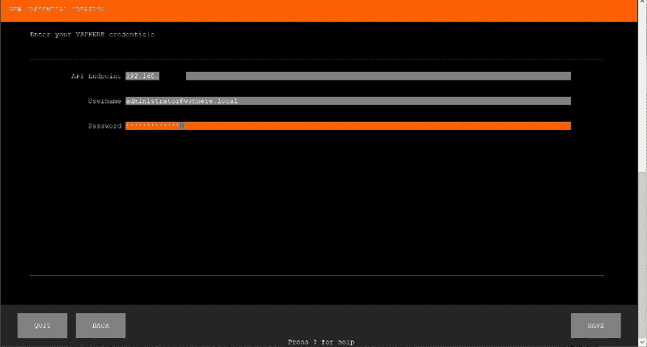

确保使用具有管理权限的凭据，因为将部署虚拟机。API 端点可以是 vCenter ip 或 FQDN。

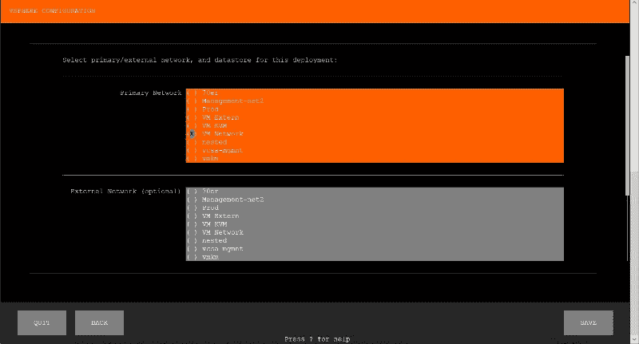

下一个重要的选择是 Kubernetes 环境的外部网络。虽然所有 Kubernetes pods(容器)都自动获得一个内部 ip，该 IP 只能在 Kubernetes 集群内到达，但外部网络将用于来自外部(通常是您的局域网)的通信。

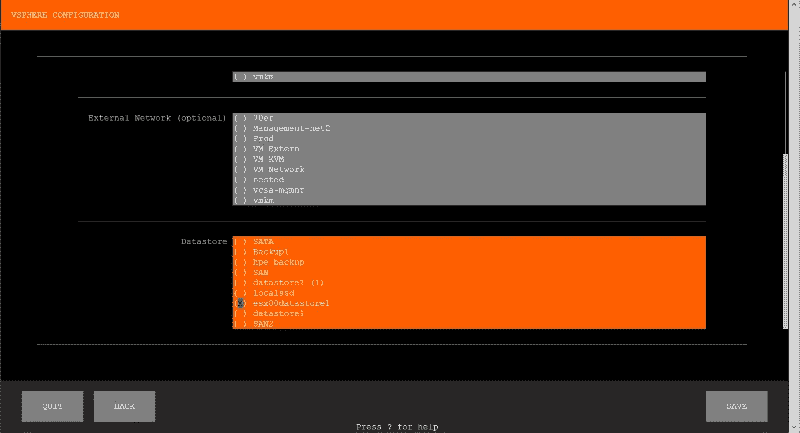

然后您需要选择 Kubernetes 节点应该部署在哪个数据存储上。一个重要的注意事项是，VMware vSAN 目前在运行 conjure 部署时不被正确支持。最坏的情况是，如果您只是部署开发或测试环境，在 vSAN 上运行 NFS 数据存储。

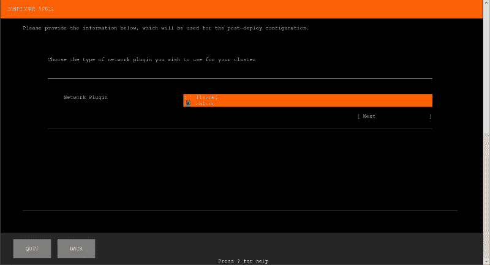

你可以使用法兰绒或印花布作为你的网络插件。以下信息将帮助您找到适合您的网络技术。我们将在博客中使用印花棉布。

# 法兰绒

**什么是** [**CoreOS 法兰绒？定义**](https://www.sdxcentral.com/containers/definitions/what-is-coreos-flannel-definition/)

法兰绒是一种用于连接 Linux [容器](https://www.sdxcentral.com/cloud/containers/)的网络技术。它由 CoreOS 发布和维护，CoreOS 是精简的 CoreOS Linux 容器操作系统的生产商，也是与 Docker 竞争的 rkt 容器系统的生产商。

虽然是为 CoreOS 操作系统定制的，但法兰绒也兼容 Docker。法兰绒是作为一种集装箱联网的替代方法出现的，它源于一个最初名为 Rudder 的开源概念，2014 年更名为法兰绒。它是用 Go [编程](https://www.sdxcentral.com/cloud/devops/definitions/programmability-network-automation-sdn-networks/)语言编写的。

【https://github.com/coreos/flannel 号

# 白棉布

**什么是印花布？**

Calico 是一款面向容器、虚拟机和基于本地主机的工作负载的开源网络和网络安全解决方案。Calico 支持广泛的平台，包括 Kubernetes、OpenShift、Docker EE、OpenStack 和裸机服务。

Calico 将灵活的网络功能与随处运行的安全实施相结合，提供了一个具有本机 Linux 内核性能和真正的云本机可扩展性的解决方案。Calico 为开发人员和集群运营商提供了一致的体验和一系列功能，无论是在公共云中运行还是在本地运行，是在单个节点上运行还是跨数千个节点的集群运行。

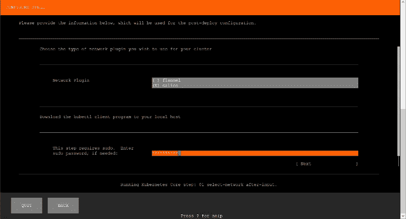

在安装过程中，可能会需要 sudo 命令，所以如果您需要 sudo 权限，请确保在这里输入密码。


默认设置已经完成，您可以单击 Deploy 按钮开始设置。在那篇文章中，我们想要定制工人设置。Kubernetes worker 将是运行容器的节点。

# 库伯内特工人报

在 Kubernetes 中，节点是一个工作机，以前称为 minion。根据群集的不同，节点可以是虚拟机或物理机。每个节点都包含运行 pod 所需的服务，并由主组件管理。节点上的服务包括容器运行时、kubelet 和 kube-proxy。详见架构设计文档中的[Kubernetes 节点](https://kubernetes.io/docs/concepts/architecture/nodes/)部分。

我们需要比默认 worker 多一点的资源，所以让我们配置 kubernetes-worker 部分。

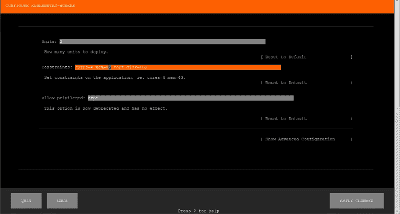

您可以在这里更改 vCPU 核心的数量以及内存的大小。我们把它改成 8GB 内存。

# 部署

现在，我们已经准备好在 vSphere 上部署 Kubernetes，让 magic re 发挥它的魔力。

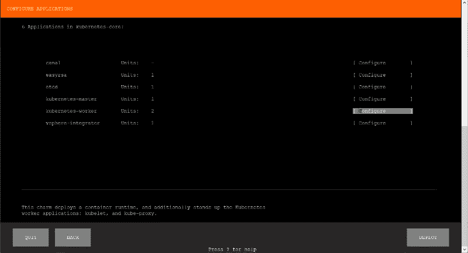

根据您的设置，部署整个设置可能需要一个小时，您可以遵循向导中的整个过程。

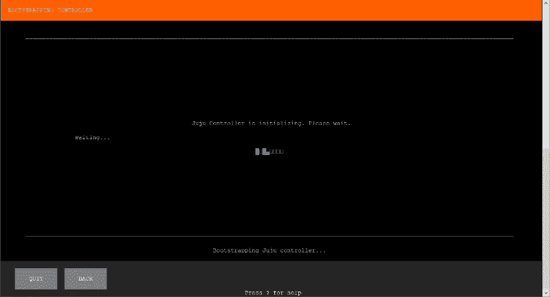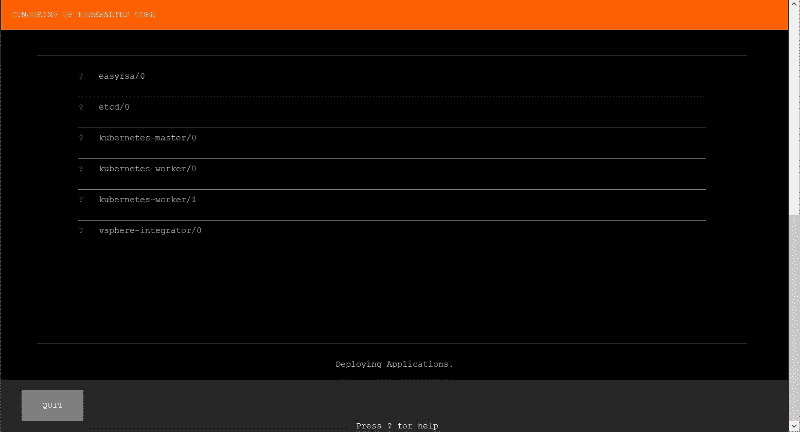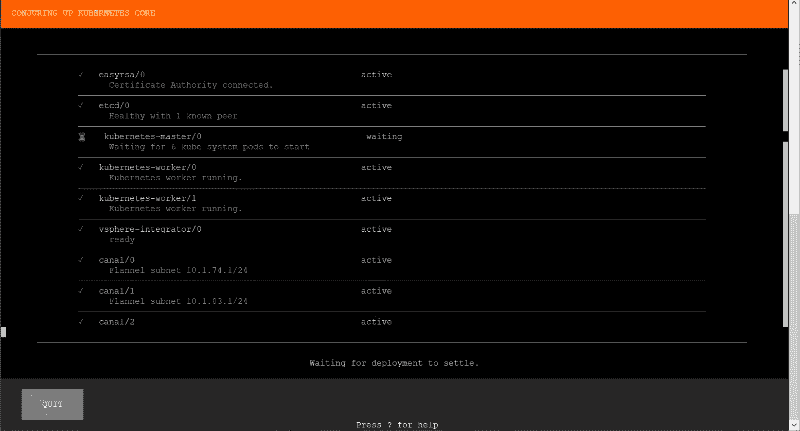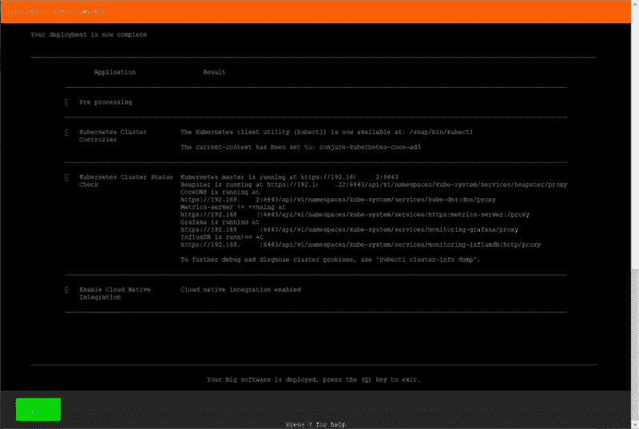

这就是全部部署就绪。您可以对列出的所有 URL 进行截图，以访问 Kubernetes 管理和其他部署的服务，或者使用 Kubernetes (k8s)命令再次获取所有信息。

`kubectl cluster-info`

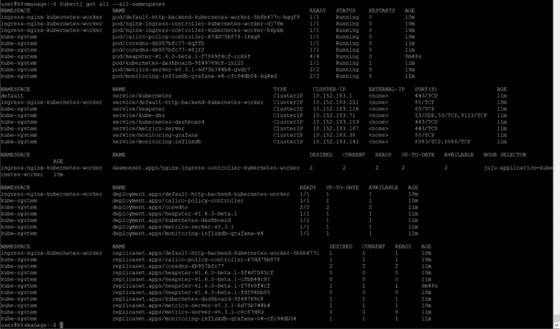

dream-up 会自动配置您的本地 kubectl 配置文件，因此您可以立即开始输入命令。

`kubectl get all`

该命令列出了默认名称空间的所有资源。如果要查看所有名称空间的所有资源，请使用–all-namespaces 作为参数。

`kubectl get all --all-namespaces`

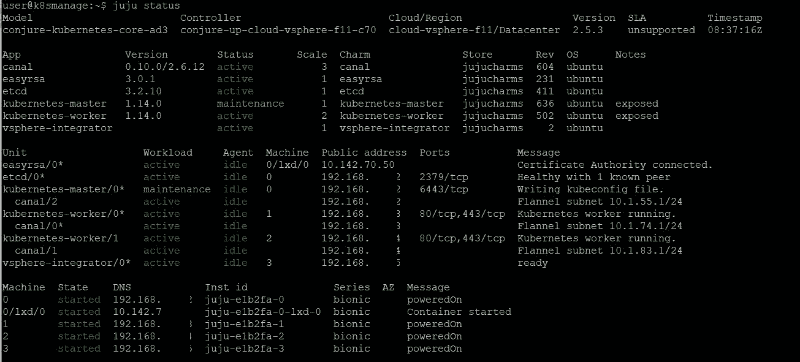

我们在 vSphere 环境上的 Kubernetes 是使用 dream-up 和 juju 部署的。juju 是一个非常强大的自动化工具，使得控制和扩展您的 Kubernetes 设置非常容易。 [juju 命令行参考](https://docs.jujucharms.com/2.5/en/commands)

我们从获取所有组件的状态开始。

`juju status`

现在我们需要知道我们的 Kubernetes 管理在哪里运行，以及 Kubernetes 的凭证。

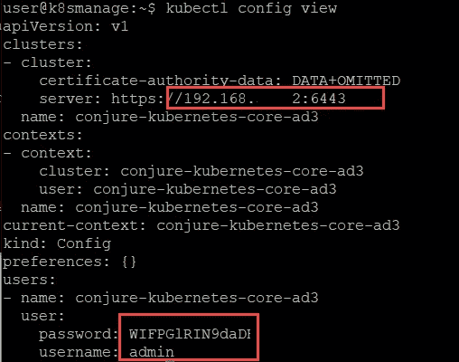

`kubectl config view`

如果您想使用不同的部署选项，也可以在这里找到完整的 Ubuntu 教程:

[https://tutorials . Ubuntu . com/tutorial/install-kubernetes-with-conjuve-up # 0](https://tutorials.ubuntu.com/tutorial/install-kubernetes-with-conjure-up#0)

# SSH 到 Kubernetes 节点

juju 使得使用 SSH 进入任何 Kubernetes 节点进行故障排除或重新配置变得非常简单。

```
juju status # to get information about the master and worker names juju ssh kubernetes-master/0 # enter the master 
sudo apt update # update package manager 
sudo apt upgrade # install patches 
sudo apt autoremove # remove obsolete packages exit # get out of ssh
```

# 添加新员工

您可以添加一个 worker，该 worker 配置了与其他正在运行的容器相同的资源

```
**juju add-unit kubernetes-worker**
```

或者您可以更改资源设置，然后添加一个新的工作线程

```
juju set-constraints kubernetes-worker cpu-cores=8 mem=32G 
juju add-unit kubernetes-worker
```

# 小故障排除指南

# 域名服务器(Domain Name Server)

在部署新容器时，您可能会收到一条显示查找错误的消息，或者您希望输入一个正在运行的容器。在这种情况下，Kubernetes 主节点和/或工作节点可能没有有效的名称服务器配置。

```
Error: forwarding ports: error upgrading connection: error dialing backend: dial tcp: lookup juju-e1b2fa-2 on 127.0.0.53:53: server misbehaving
```

解决这个问题的最佳方法是使用 ssh 进入节点，尝试 ping 主节点或工作节点，并在需要时修复 dns 配置。您可以像在任何其他 Ubuntu 系统中一样修复名称解析错误。

# 日志

您始终可以对任何正在运行的资源运行 logs 命令。

```
kubectl get pods # show all pods (container) 
kubectl logs pod/my-wordpress-mariadb-0 # or any other pod name
```

*最初发表于*[*www.opvizor.com*](https://www.opvizor.com/install-kubernetes-on-vsphere-using-ubuntu-juju)*。*