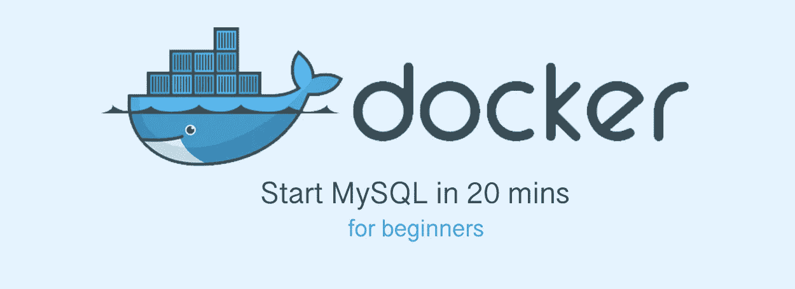
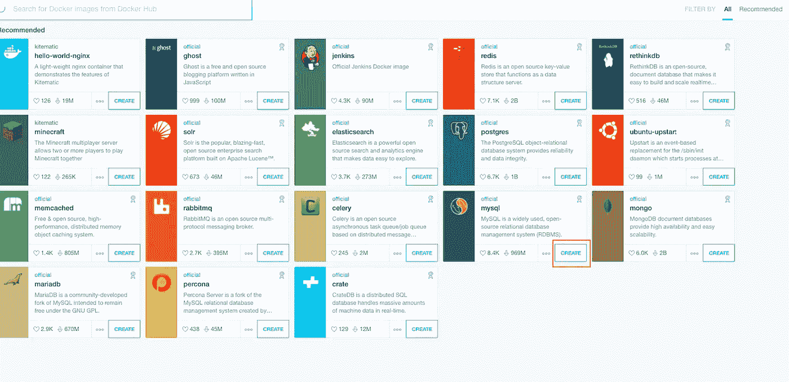
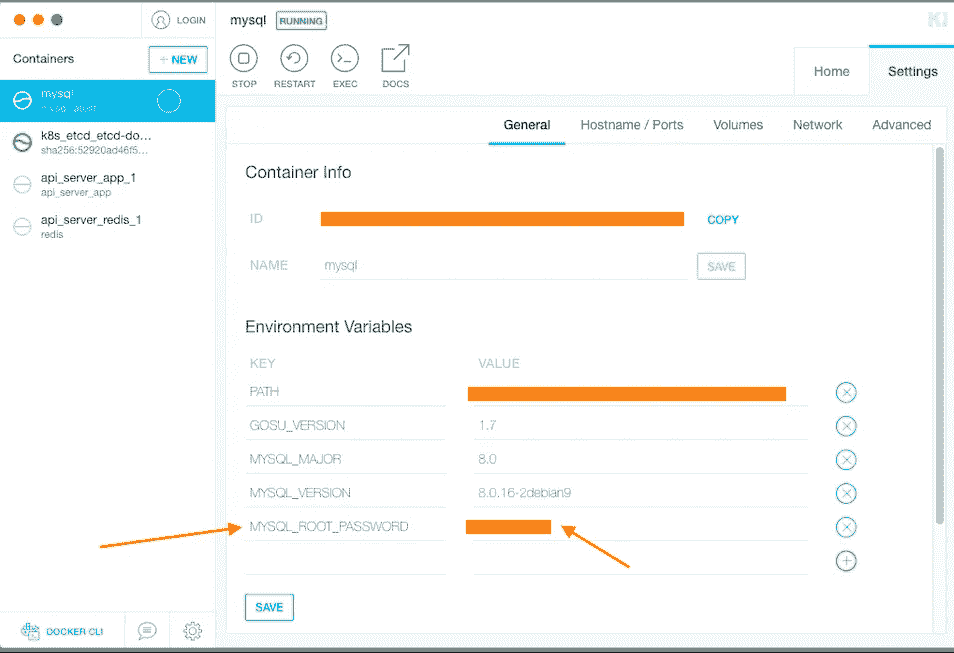
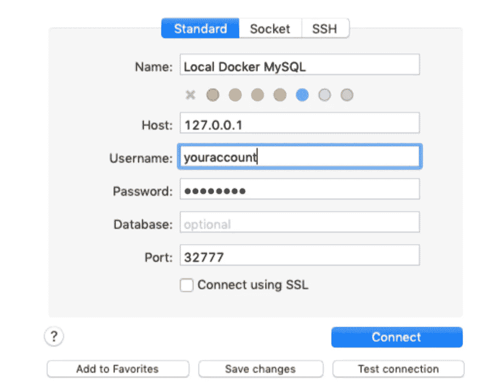
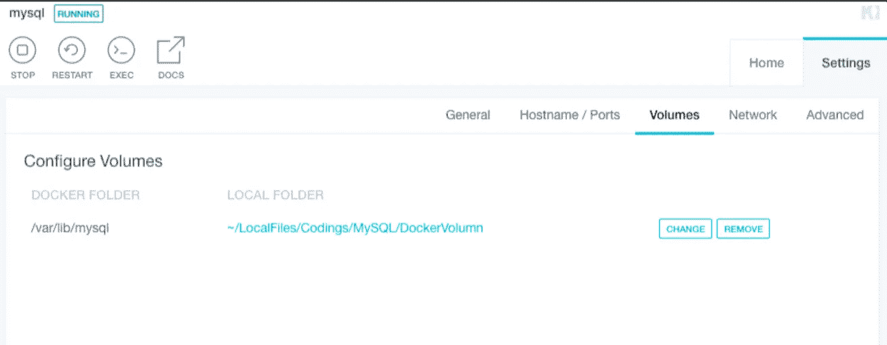

# 使用 Docker 在 20 分钟内安装 MySQL

> 原文：<https://itnext.io/install-mysql-in-20mins-by-using-docker-3751819e7815?source=collection_archive---------0----------------------->



# 介绍

如果您以前没有使用过 Docker，这是一个很好的练习，让您开始使用 Docker 来启动一个简单的服务。

在以前，如果我们想使用 MySQL，在 Window、Mac 和 Linux 中的安装步骤会有很大的不同。但是，如果我们使用 docker，安装步骤将更加容易和相似。

你可以在 Docker 中启动大量令人惊叹的服务，比如 Jenkins、mongoDB 和 Redis。我们开始吧！

# 安装 Docker 桌面

[](https://docs.docker.com/docker-for-mac/install/) [## 安装 Mac 版 Docker 桌面

### 要下载 Mac 版 Docker 桌面，请访问 Docker Hub。从 Docker Hub 下载安装 README 前需要了解的内容…

docs.docker.com](https://docs.docker.com/docker-for-mac/install/) [](https://docs.docker.com/docker-for-windows/install/) [## 为 Windows 安装 Docker 桌面

### Docker Desktop for Windows 是 Docker for Microsoft Windows 的社区版(CE)。要下载 Docker 桌面…

docs.docker.com](https://docs.docker.com/docker-for-windows/install/) 

# 启动 MySQL Docker 容器

你可以使用命令行或 kite matic(docker 的 GUI)来启动容器，你不需要两者都做。

## 使用命令行:

```
docker run --name some-mysql -e MYSQL_ROOT_PASSWORD=my-secret-pw -d mysql:tag
```

## 使用 Kitematic:

下载 Docker 图像



更新环境变量中的 MySQL 密码:



# 设置 MySQL 帐户

通过以下方式远程进入 docker:

```
docker exec -it mysql bash // login docker container
mysql -uroot -p  // login mysql, type your password in MYSQL_ROOT_PASSWORD
```

创建新的 MySQL 用户:

```
mysql> CREATE USER 'youraccount'@'%' IDENTIFIED BY 'password';
Query OK, 0 rows affected (0.00 sec)
mysql> GRANT ALL PRIVILEGES ON * . * TO 'youraccount'@'%';
Query OK, 0 rows affected (0.00 sec)
mysql> FLUSH PRIVILEGES;
mysql> quit
```

# 在 docker 外部连接到 MySQL

您可以使用 SQLyog、MySQL Workbench 或 Sequal Pro 连接到服务器:

[](https://www.sequelpro.com/) [## 续集专业版

### Sequel Pro 是开源的，由像你这样的人来构建。我们欢迎您的意见——无论您是否发现了一个 bug，有没有…

www.sequelpro.com](https://www.sequelpro.com/) 

您现在可以连接到 MySQL 了。如果你有任何问题，你可以继续阅读。

# 常见错误

> *无法加载认证插件‘caching _ sha2 _ password’*

以这种方式更改密码:

```
ALTER USER 'yourusername'@'localhost' IDENTIFIED WITH mysql_native_password BY 'youpassword';
```

> *2019–07–10 18:25:08，525 错误 27672 nodejs。SequelizeConnectionError:客户端不支持服务器请求的身份验证协议；考虑升级 MySQL 客户端*

与上一个错误相同，只是:

```
ALTER USER 'yourusername'@'localhost' IDENTIFIED WITH mysql_native_password BY 'youpassword';
```

[](https://stackoverflow.com/questions/49194719/authentication-plugin-caching-sha2-password-cannot-be-loaded) [## 无法加载身份验证插件“caching_sha2_password”

### 我正在用 MySQL Workbench 连接 MySQL - 8.0，并得到以下错误:认证插件…

stackoverflow.com](https://stackoverflow.com/questions/49194719/authentication-plugin-caching-sha2-password-cannot-be-loaded) 

# 如果您想要持久性数据

默认情况下，更新配置后，docker **中的所有内容都将丢失。如果您希望数据是持久的，您应该为容器配置卷。这意味着`/var/lib/mysql`中的所有文件都将保存到您的主机上。**

## 通过使用命令行:

```
docker run --name some-mysql -e MYSQL_ROOT_PASSWORD=my-secret-pw -d /
	mysql:tag --volume /path/on/your/host/machine:/var/lib/mysql
```

## 通过使用 Kitematic



# 完成的

恭喜你！希望你喜欢使用 docker =]