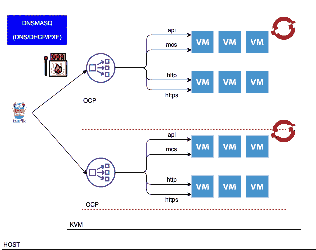

# 在 KVM 上安装 OpenShift 4.2

> 原文：<https://itnext.io/install-openshift-4-2-on-kvm-1117162333d0?source=collection_archive---------2----------------------->

假设我们有一个足够大的盒子，让我们使用 KVM 创建和管理的虚拟机来设置 OpenShift 容器平台(OCP) 4.2。

## 架构考虑

OCP 4.2 需要 DHCP 和网络启动，它还需要成熟的 DNS 功能来提供 A、PTR 和 SRV 记录。科索沃核查团能够满足其中一些要求，但不能完全满足。因此，我们将使用外部 DNS、DHCP 服务来完全满足这些要求。我使用 **Dnsmasq** 作为 DNS、DHCP 和 netboot 服务器。另外， [**火柴盒**](https://github.com/poseidon/matchbox) 用于分别为不同的节点角色提供 CoreOS 启动时的点火。

在 KVM 内部，我们调配虚拟机以形成 OCP 集群。OCP 4.2 要求负载平衡器为 API (6443)、机器配置服务(22623)、应用程序 HTTP 和 HTTPS 分配负载。我在集群中使用了一个最小化的 Ubuntu VM 作为负载均衡器，以避免不必要的内部流量通过外部。我在 之间选择 L4 LB 软件 **g** [**。**](https://github.com/yyyar/gobetween)



设置好 OCP 集群后，为了从 KVM 主机服务器访问集群，我们需要一个 L7 反向代理来根据主机信息将流量重定向到底层的 OCP 集群。这里我用的是 [**traefik**](https://github.com/containous/traefik) 。

在下一节中，我将介绍

*   KVM 设置
*   Dnsmasq 设置和常见配置
*   配置 Ubuntu 使用本地 Dnsmasq
*   Dnsmasq 特定于群集的配置
*   火柴盒设置
*   负载平衡器虚拟机和 Gobetween 配置
*   OCP 安装配置
*   OCP VMs
*   OCP 集群引导并完成安装
*   OCP 身份验证配置
*   Traefik 配置

## KVM 设置

在主机操作系统 Ubuntu 18.04 上安装 KVM。

首先，验证此计算机是否支持 KVM。运行以下命令

```
sudo apt install -y cpu-checker
sudo kvm-ok
```

如果我们看到下面的输出，那么 KVM 就可以安装和使用了。

```
INFO: /dev/kvm exists
KVM acceleration can be used
```

安装 KVM，启动它

```
sudo apt install -y libosinfo-bin
sudo apt -y install qemu qemu-kvm libvirt-bin bridge-utils virt-managersudo systemctl enable libvirtd
sudo systemctl start libvirtd
```

此外，安装 [uvt-kvm](http://manpages.ubuntu.com/manpages/bionic/man1/uvt-kvm.1.html) 工具并在本地同步 Ubuntu 18.04，以便我们可以轻松创建基于 Ubuntu 的虚拟机。

```
sudo apt -y install uvtoolsudo uvt-simplestreams-libvirt --verbose sync release=bionic arch=amd64# create the key to access the VM
ssh-keygen -b 4096 -t rsa -f ~/.ssh/id_rsa -N ""
```

创建一个 KVM 网络，但是禁用 DNS 和 DHCP*(IP 元素中没有 DHCP 设置)*，如下面的 XML 文件`net_ocp.xml`所示

```
<network>
  <name>ocp</name>
  <forward mode='nat'/>
  <bridge name='br-ocp' stp='on' delay='0'/>
  <dns enable="no"/> 
  <ip address='192.168.10.1' netmask='255.255.255.0'>
  </ip>
</network>
```

定义网络并使其自动启动。

```
virsh net-define net_ocp.xml
virsh net-autostart ocp
virsh net-start ocpsystemctl restart libvirt-bin
```

虚拟网桥被创建

```
# ifconfig  br-ocp
br-ocp: flags=4163<UP,BROADCAST,RUNNING,MULTICAST>  mtu 1500
        inet 192.168.10.1  netmask 255.255.255.0  broadcast 192.168.10.255
        ether 52:54:00:d1:12:f6  txqueuelen 1000  (Ethernet)
        RX packets 43449450  bytes 37736240429 (37.7 GB)
        RX errors 0  dropped 0  overruns 0  frame 0
        TX packets 54047625  bytes 179923041069 (179.9 GB)
        TX errors 0  dropped 0 overruns 0  carrier 0  collisions 0
```

## **Dnsmasq 设置和通用配置**

在 KVM 主机上，安装 Dnsmasq 和所需的 tftp、ipxe。

```
sudo apt install -y dnsmasq
sudo systemctl enable dnsmasq
sudo systemctl start dnsmasqsudo apt -y install ipxe
sudo mkdir -p /var/lib/tftp
sudo cp /usr/lib/ipxe/{undionly.kpxe,ipxe.efi} /var/lib/tftp
sudo chown dnsmasq:nogroup /var/lib/tftp/*
```

创建文件`/etc/dnsmasq.d/common.conf`，该文件定义了不同 OCP 集群的公共部分。

```
# Listen on lo and br-ocp only
bind-interfaces
interface=lo,br-ocp# DHCP
dhcp-option=option:router,192.168.10.1
dhcp-option=option:dns-server,192.168.10.1
dhcp-range=192.168.10.10,192.168.10.254,12h# forward, use original DNS server
server=10.0.xxx.xxx
server=10.0.xxx.xxxenable-tftp
tftp-root=/var/lib/tftp
tftp-secure# Legacy PXE
dhcp-match=set:bios,option:client-arch,0
dhcp-boot=tag:bios,undionly.kpxe# UEFI
dhcp-match=set:efi32,option:client-arch,6
dhcp-boot=tag:efi32,ipxe.efi
dhcp-match=set:efibc,option:client-arch,7
dhcp-boot=tag:efibc,ipxe.efi
dhcp-match=set:efi64,option:client-arch,9
dhcp-boot=tag:efi64,ipxe.efi# iPXE - chainload to matchbox ipxe boot script
dhcp-userclass=set:ipxe,iPXE
# matchbox can be shared across different cluster
dhcp-boot=tag:ipxe,[http://matchbox.ibmcloud.io.cpak:8080/boot.ipxe](http://matchbox.ibmcloud.io.cpak:8080/boot.ipxe)address=/matchbox.ibmcloud.io.cpak/192.168.10.1
```

只监听`lo`和`br-ocp`接口。

定义 DHCP 默认路由和默认 DNS 服务器。

将 iPXE 链接到火柴盒服务器，`matchbox.ibmcloud.io.cpak`，我们将安装它并让它在桥接口上监听。为它定义 DNS 条目，以便虚拟机能够在 netboot 期间解析火柴盒服务器。

## **配置 Ubuntu 使用本地 Dnsmasq**

此外，将 Ubuntu 服务器(18.04)配置为使用此 DNS 服务器。

重命名传统的 resolv.conf 文件，因为 ping 等一些传统应用程序仍在使用此配置。

```
mv /etc/resolv.conf  /etc/resolv.conf.orig
```

备份和替换文件`/etc/systemd/resolved.conf`与内容、

```
[Resolve]
DNS=127.0.0.1
```

重新启动 systemd 解决的服务

```
sudo systemctl restart systemd-resolved 
systemd-resolve --status
```

现在 KVM 主机将使用本地 Dnsmasq 作为它的 DNS 服务器。

## **Dnsmasq 集群特定配置**

对于要在 KVM 中创建的每个 OCP 集群，创建一个 Dnsmasq 配置文件，例如`/etc/dnsmasq.d/exp-ocp4.conf`。

在该文件中，为集群中的每个虚拟机定义以下内容

1.  按 MAC 地址划分的 DHCP Ip 地址
2.  DNS A 记录
3.  DNS PTR 记录。这是 RHCOS 设置其主机名所必需的。

下面列出了一个示例片段，

```
dhcp-host=52:54:00:25:2e:77,192.168.10.40
address=/exp-bootstrap.exp-ocp4.ibmcloud.io.cpak/192.168.10.40
ptr-record=40.10.168.192.in-addr.arpa,exp-bootstrap.exp-ocp4.ibmcloud.io.cpak
```

接下来定义指向 LB 的集群 DNS 记录，包括应用程序的通配符记录。

```
address=/api.exp-ocp4.ibmcloud.io.cpak/192.168.10.49
address=/api-int.exp-ocp4.ibmcloud.io.cpak/192.168.10.49
address=/.apps.exp-ocp4.ibmcloud.io.cpak/192.168.10.49
```

最后，为每个 etcd 实例定义 A 和 SRV 记录。如果 3 个主机中各有一个 etcd 成员，则

```
address=/etcd-0.exp-ocp4.ibmcloud.io.cpak/192.168.10.41
srv-host=_etcd-server-ssl._tcp.exp-ocp4.ibmcloud.io.cpak,etcd-0.exp-ocp4.ibmcloud.io.cpak,2380address=/etcd-1.exp-ocp4.ibmcloud.io.cpak/192.168.10.42
srv-host=_etcd-server-ssl._tcp.exp-ocp4.ibmcloud.io.cpak,etcd-1.exp-ocp4.ibmcloud.io.cpak,2380address=/etcd-2.exp-ocp4.ibmcloud.io.cpak/192.168.10.43
srv-host=_etcd-server-ssl._tcp.exp-ocp4.ibmcloud.io.cpak,etcd-2.exp-ocp4.ibmcloud.io.cpak,2380
```

重新启动 Dnsmasq 服务以使更改生效。在重新启动服务之前，我们可能需要清除租用缓存，以确保 DHCP Ip 分配没有被缓存。

```
sudo rm -rf /var/lib/misc/dnsmasq.leases 
sudo touch /var/lib/misc/dnsmasq.leasessudo systemctl restart dnsmasq
```

## **火柴盒设置**

在 KVM 主机上安装火柴盒并进行设置，

```
curl -LO [https://github.com/poseidon/matchbox/releases/download/v0.8.3/matchbox-v0.8.3-linux-amd64.tar.gz](https://github.com/poseidon/matchbox/releases/download/v0.8.3/matchbox-v0.8.3-linux-amd64.tar.gz) 
tar zxvf matchbox-v0.8.3-linux-amd64.tar.gz
cd matchbox-v0.8.3-linux-amd64
sudo cp matchbox /usr/local/binsudo useradd -U matchbox
sudo mkdir -p /var/lib/matchbox/{assets,groups,ignition,profiles}
sudo chown -R matchbox:matchbox /var/lib/matchbox
sudo cp contrib/systemd/matchbox-local.service /etc/systemd/system/matchbox.servicesudo systemctl enable matchbox
sudo systemctl start matchbox
```

***资产***

将 RHCOS 映像下载到资产目录中，

```
cd /var/lib/matchbox/assets

sudo axel -o rhcos-{{ .ver }}.0-x86_64-installer-initramfs.img [https://mirror.openshift.com/pub/openshift-v4/dependencies/rhcos/{{](https://mirror.openshift.com/pub/openshift-v4/dependencies/rhcos/{{) .ver }}/latest/rhcos-{{ .ver }}.0-x86_64-installer-initramfs.imgsudo axel -o rhcos-{{ .ver }}.0-x86_64-installer-kernel [https://mirror.openshift.com/pub/openshift-v4/dependencies/rhcos/{{](https://mirror.openshift.com/pub/openshift-v4/dependencies/rhcos/{{) .ver }}/latest/rhcos-{{ .ver }}.0-x86_64-installer-kernelsudo axel -o rhcos-{{ .ver }}.0-x86_64-metal-bios.raw.gz [https://mirror.openshift.com/pub/openshift-v4/dependencies/rhcos/{{](https://mirror.openshift.com/pub/openshift-v4/dependencies/rhcos/{{) .ver }}/latest/rhcos-{{ .ver }}.0-x86_64-metal-bios.raw.gzsudo chown -R matchbox:matchbox /var/lib/matchbox
```

*我使用的是 Golang 模板格式。{{ .ver }}可能是 4.2.0*

**组*组*组**

对于每个虚拟机，根据其 Mac 地址准备组文件。例如，`/var/lib/matchbox/groups/exp-master1.json`

```
{
  "id": "exp-master1",
  "name": "exp-master1",
  "profile": "exp-master1",
  "selector": {
    "mac": "52:54:00:34:c7:90"
  }
}
```

***简介***

为每个虚拟机准备其配置文件。例如，对于第一个主虚拟机 exp-master1，创建以下内容并将其另存为`/var/lib/matchbox/profiles/exp-master1.json`

```
{
  "id": "exp-master1",
  "name": "exp-master1",
  "ignition_id": "master.ign",
  "boot": {
    "kernel": "/assets/rhcos-4.2.0-x86_64-installer-kernel",
    "initrd": [
      "/assets/rhcos-4.2.0-x86_64-installer-initramfs.img"
      ],
      "args": [
        "ip=dhcp",
        "rd.neednet=1",
        "console=tty0",
        "console=ttyS0",
        "coreos.inst=yes",
        "coreos.inst.install_dev=**vda**",
        "coreos.inst.image_url=[http://matchbox.ibmcloud.io.cpak:8080/assets/rhcos-4.2.0-x86_64-metal-bios.raw.gz](http://matchbox.ibmcloud.io.cpak:8080/assets/rhcos-4.2.0-x86_64-metal-bios.raw.gz)",
        "coreos.inst.ignition_url=[http://matchbox.ibmcloud.io.cpak:8080/ignition?mac=${mac:hexhyp](http://matchbox.ibmcloud.io.cpak:8080/ignition?mac=${mac:hexhyp)}"
      ]
  }
}
```

将内核、initrd 参数更新到 assets 目录中下载的相应文件。将 coreos URL 参数更新为火柴盒 URL。由于我们使用的是 KVM，这个磁盘被命名为`vda`。

***点火***

OpenShift 安装程序根据`install-config.yaml` 文件创建点火文件。将那些点火文件上传到`/var/lib/matchbox/iginition`目录。记得把所有权改成用户火柴盒。更多细节参见 **OCP 安装配置**一节。

在网络启动时，CoreOS VM 将根据其 Mac 地址联系 matchbox 服务，并因此获得相应的安装映像和点火文件。

## **负载平衡器 VM 和 Gobetween 配置**

对于每个 OCP 集群，创建一个最小的 Ubuntu 虚拟机，

```
uvt-kvm create exp-lb release=bionic --memory 4 --cpu 4 --disk 50 --bridge br-ocp --password password
```

网桥是定义的 KVM 网桥。

找出 Mac 地址，

```
virsh dumpxml exp-lb | grep 'mac address' | cut -d\' -f 2
```

更新 LB 的 Dnsmasq DHCP Mac 和 IP 地址对、DNS A 和 PTR 记录。

```
dhcp-host=52:54:00:71:a6:e0,192.168.10.49
address=/exp-lb.exp-ocp4.ibmcloud.io.cpak/192.168.10.49
ptr-record=49.10.168.192.in-addr.arpa,exp-lb.exp-ocp4.ibmcloud.io.cpak
```

清除租用缓存，重新启动 Dnsmasq。重启虚拟机以确保它获得分配的 IP，

```
virsh destroy exp-lb
virsh start exp-lb
```

在 LB 软件之间安装 Gobetween，

```
curl -LO [https://github.com/yyyar/gobetween/releases/download/0.7.0/gobetween_0.7.0_linux_amd64.tar.gz](https://github.com/yyyar/gobetween/releases/download/0.7.0/gobetween_0.7.0_linux_amd64.tar.gz)
mkdir -p gobetween
cd gobetween
tar xzvf ../gobetween_0.7.0_linux_amd64.tar.gz
sudo cp gobetween /usr/local/bin
```

创建 Systemd 服务，

```
[Unit]
Description=Gobetween - modern LB for cloud era
Documentation=[https://github.com/yyyar/gobetween/wiki](https://github.com/yyyar/gobetween/wiki)
After=network.target[Service]
Type=simple
PIDFile=/run/gobetween.pid
#ExecStartPre=prestart some command
ExecStart=/usr/local/bin/gobetween -c /etc/gobetween/gobetween.toml
ExecReload=/bin/kill -s HUP $MAINPID
ExecStop=/bin/kill -s QUIT $MAINPID
PrivateTmp=true[Install]
WantedBy=multi-user.target
```

准备下面的 TOML 配置文件`/etc/gobetween/gobetween.toml`

```
[servers]
[servers.api]
protocol = "tcp"
bind = "0.0.0.0:6443"[servers.api.discovery]
  kind = "static"
  static_list = [ "192.168.10.40:6443","192.168.10.41:6443","192.168.10.42:6443","192.168.10.43:6443" ][servers.api.healthcheck]
  kind = "ping"
  fails = 1
  passes = 1
  interval = "2s"
  timeout="1s"
  ping_timeout_duration = "500ms"[servers.mcs]
protocol = "tcp"
bind = "0.0.0.0:22623"[servers.mcs.discovery]
  kind = "static"
  static_list = [ "192.168.10.40:22623","192.168.10.41:22623","192.168.10.42:22623","192.168.10.43:22623" ][servers.mcs.healthcheck]
  kind = "ping"
  fails = 1
  passes = 1
  interval = "2s"
  timeout="1s"
  ping_timeout_duration = "500ms"[servers.http]
protocol = "tcp"
bind = "0.0.0.0:80"[servers.http.discovery]
  kind = "static"
  static_list = [ "192.168.10.44:80","192.168.10.45:80","192.168.10.46:80" ][servers.http.healthcheck]
  kind = "ping"
  fails = 1
  passes = 1
  interval = "2s"
  timeout="1s"
  ping_timeout_duration = "500ms"[servers.https]
protocol = "tcp"
bind = "0.0.0.0:443"[servers.https.discovery]
  kind = "static"
  static_list = [ "192.168.10.44:443","192.168.10.45:443","192.168.10.46:443" ][servers.https.healthcheck]
  kind = "ping"
  fails = 1
  passes = 1
  interval = "2s"
  timeout="1s"
  ping_timeout_duration = "500ms"
```

目前，API 和 MCS 服务器包括引导服务器。集群启动后，需要更新记录以删除启动虚拟机的 Ip。

重新启动服务以使配置生效。

**OCP 安装配置**

准备以下配置，`install-config.yaml`

```
apiVersion: v1
baseDomain: ibmcloud.io.cpak
compute:
- hyperthreading: Enabled
  name: worker
  # must be 0 for user provisioned infra as cluster will not create these workers
  replicas: 0
controlPlane:
  hyperthreading: Enabled
  name: master
  replicas: 3
metadata:
  name: exp-ocp4
networking:
  clusterNetwork:
  - cidr: 10.128.0.0/14
    hostPrefix: 23
  networkType: OpenShiftSDN
  serviceNetwork:
  - 172.30.0.0/16
platform:
  none: {}pullSecret: 'Get From the Redhat Website, copy and paste here'
sshKey: 'SSH Public Key to access the coreos'
```

创建一个目录，生成点火文件，复制到火柴盒文件夹。

```
rm -rf ocp-install
mkdir -p ocp-installcp install-config.yaml ocp-install
cd ocp-install
openshift-install create ignition-configs --dir .cp *ign /var/lib/matchbox/ignition
sudo chown -R matchbox:matchbox /var/lib/matchbox
```

*注意，这里我们删除了旧目录，以清除上次安装的所有临时文件。*

## **OCP VMs**

根据建议的规模创建所需的 OCP 虚拟机。假设有 3 个主虚拟机、3 个工作虚拟机和一个引导虚拟机。举个例子，

```
virsh vol-create-as ocp-pool exp-bootstrap.qcow2 120Gvirt-install --name=exp-bootstrap --ram=16 --vcpus=8 --disk path=/ocp-pool/kvm-image/exp-bootstrap.qcow2,bus=virtio --pxe --noautoconsole --graphics=vnc --hvm --network network=ocp,model=virtio --boot hd,network
```

请注意，虚拟机已经为网络启动指定了“pxe”。启动顺序设置为硬盘和网络。第一次网络启动后，CoreOS 将安装在硬盘上，随后的启动将从硬盘进行。

获取虚拟机 Mac 地址，并按照 Dnsmasq 一节中的描述更新 Dnsmasq 配置文件。请删除租用缓存文件，重新启动 Dnsmasq 服务。

根据每个虚拟机的 mac 地址准备火柴盒组和配置文件。重新启动火柴盒服务。

建议将这些过程自动化，以避免任何打字错误和其他人为错误。我是用[*magefile*](https://github.com/magefile/mage)*和*[*ssh kit*](https://github.com/zhiminwen/magetool)*来实现自动化的。*

使用`virsh destroy`和`virsh start`命令重启虚拟机，让内核操作系统安装完毕。

> 提示:我们可以使用`virsh console vmName`来监控开机。

## **OCP 集群自举并完成安装**

一旦虚拟机启动，甚至更早，我们就可以启动 OCP 集群引导。

```
cd ocp-installopenshift-install --dir=. wait-for bootstrap-complete --log-level=debug
```

等待命令成功完成。您将看到如下所示的日志，

```
level=debug msg="OpenShift Installer v4.2.11"
level=debug msg="Built from commit 6b629f0c847887f22c7a95586e49b0e2434161c3"
level=info msg="Waiting up to 30m0s for the Kubernetes API at [https://api.exp-ocp4.ibmcloud.io.cpak:6443](https://api.exp-ocp4.ibmcloud.io.cpak:6443)..."
level=debug msg="Still waiting for the Kubernetes API: the server could not find the requested resource"
level=debug msg="Still waiting for the Kubernetes API: the server could not find the requested resource"...SKIP SOME LINES...level=info msg="API v1.14.6+32dc4a0 up"
level=info msg="Waiting up to 30m0s for bootstrapping to complete..."
level=debug msg="Bootstrap status: complete"
level=info msg="It is now safe to remove the bootstrap resources"
```

更新 LB Gobetween 配置以删除引导 Ip 并重新启动 Gobetween 服务。我们现在还可以停止并删除引导虚拟机。

如果我们已经准备好了外部持久存储，比如 GlusterFS，那么创建存储类，为图像注册中心创建 PVC。更新注册表配置以使存储持久化。

```
export KUBECONFIG=/root/ocp-install/auth/kubeconfig oc patch configs.imageregistry.operator.openshift.io cluster --type merge --patch '{"spec":{"storage":{"pvc":{"claim": "pvc-image-registry"}}}}'
```

*您也可以使用 emptyDir 为存储完成配置，但不建议在生产设置中使用。*

```
*oc patch configs.imageregistry.operator.openshift.io cluster --type merge --patch '{"spec":{"storage":{"emptyDir":{}}}}'*
```

使用下面的命令完成集群创建，

```
cd ocp-install
openshift-install --dir=. wait-for install-complete --log-level=debug
```

您将看到如下一些日志，

```
level=debug msg="OpenShift Installer v4.2.11"
level=debug msg="Built from commit 6b629f0c847887f22c7a95586e49b0e2434161c3"
level=info msg="Waiting up to 30m0s for the cluster at [https://api.exp-ocp4.ibmcloud.io.cpak:6443](https://api.exp-ocp4.ibmcloud.io.cpak:6443) to initialize..."
level=debug msg="Still waiting for the cluster to initialize: Working towards 4.2.12: 100% complete, waiting on image-registry"
level=debug msg="Cluster is initialized"
level=info msg="Waiting up to 10m0s for the openshift-console route to be created..."
level=debug msg="Route found in openshift-console namespace: console"
level=debug msg="Route found in openshift-console namespace: downloads"
level=debug msg="OpenShift console route is created"
level=info msg="Install complete!"
level=info msg="To access the cluster as the system:admin user when using 'oc', run 'export KUBECONFIG=/root/ocp-install/auth/kubeconfig'"
level=info msg="Access the OpenShift web-console here: [https://console-openshift-console.apps.exp-ocp4.ibmcloud.io.cpak](https://console-openshift-console.apps.exp-ocp4.ibmcloud.io.cpak)"
level=info msg="Login to the console with user: kubeadmin, password: xxxxxxxxx"
```

**OCP 认证配置**

我们可以配置 http-passwd 文件进行身份验证。

```
apt install -y apache2-utils
htpasswd -c -B -b htpasswd.txt admin passwordexport KUBECONFIG=/root/ocp-install/auth/kubeconfig
oc create secret generic htpass-secret  --from-file=htpasswd=htpasswd.txt -n openshift-config
```

准备以下 YAML 文件`htpasswd.yaml`

```
apiVersion: config.openshift.io/v1
kind: OAuth
metadata:
  name: cluster
spec:
  identityProviders:
  - name: my_htpasswd_provider 
    mappingMethod: claim 
    type: HTPasswd
    htpasswd:
      fileData:
        name: htpass-secret
```

应用它并分配集群管理权限。

```
export KUBECONFIG=/root/ocp-install/auth/kubeconfig
oc apply -f htpasswd.yamloc adm policy add-cluster-role-to-user cluster-admin admin
```

现在，我们准备使用 oc 命令登录集群

```
oc login [https://api](https://api.{{).exp-ocp4.ibmcloud.io.cpak:6443 --insecure-skip-tls-verify=true
```

输入用户名和密码登录。

**Traefik 配置**

为了允许远程访问 KVM 内部的集群，我们需要配置 L7 反向代理。

在 KVM 主机上安装 traefik，

```
curl -LO [https://github.com/containous/traefik/releases/download/v2.1.1/traefik_v2.1.1_linux_amd64.tar.gz](https://github.com/containous/traefik/releases/download/v2.1.1/traefik_v2.1.1_linux_amd64.tar.gz) tar zxvf traefik_v2.1.1_linux_amd64.tar.gz
sudo mv traefik /usr/local/binsudo mkdir -p /etc/traefik
sudo mkdir -p /etc/traefik/conf.d
```

创建以下 Systemd 服务文件并启用该服务

```
[Unit]
Description=Traefik
After=network.target[Service]
Type=simple
PIDFile=/run/traefik.pid
ExecStart=/usr/local/bin/traefik
ExecReload=/bin/kill -s HUP $MAINPID
ExecStop=/bin/kill -s QUIT $MAINPID
PrivateTmp=true[Install]
WantedBy=multi-user.target
```

创建一个基本的公共配置文件`/etc/traefik/traefik.toml`

```
[log]
level = "DEBUG"
[accessLog][entryPoints][entryPoints.api]
  address = ":6443"[entryPoints.https]
  address = ":443"[providers]
[providers.file]
  directory = "/etc/traefik/conf.d"
  watch = true
```

监听 KVM 主机端口 6443 进行集群 API 访问，监听端口 443 进行 https 访问。

对于每个集群，例如名为 exp-ocp 的集群，创建以下文件`/etc/traefik/conf.d/exp-ocp.toml`

```
[tcp.routers]
[tcp.routers.exp-ocp4-api]
  entryPoints = ["api"] #entry points are shared among the clusters
  rule = "HostSNI(`api.exp-ocp4.ibmcloud.io.cpak`)"
  service = "service-exp-ocp4-api"
  [tcp.routers.exp-ocp4-api.tls]
  passthrough = true[tcp.routers.exp-ocp4-https]
  entryPoints = ["https"]
  rule = "HostSNI(`oauth-openshift.apps.exp-ocp4.ibmcloud.io.cpak`,`console-openshift-console.apps.exp-ocp4.ibmcloud.io.cpak`)"
  service = "service-exp-ocp4-https"
  [tcp.routers.exp-ocp4-https.tls]
  passthrough = true[tcp.services]
[tcp.services.service-exp-ocp4-api.loadBalancer]
[[tcp.services.service-exp-ocp4-api.loadBalancer.servers]]
  address = "192.168.10.49:6443"[tcp.services.service-exp-ocp4-https.loadBalancer]
[[tcp.services.service-exp-ocp4-https.loadBalancer.servers]]
  address = "192.168.10.49:443"
```

我们通过 https 创建了两个路由器，一个用于集群 API，一个用于集群 app。TLS 模式是直通模式。使用 HostSNI 让 Traefik 将请求路由到相应的 OCP 集群。目前，每个主机的全名都需要在 HostSNI 表达式中定义为一个列表。例如，集群 HTTPS 路由器必须为控制台登录成功定义两台主机。

```
HostSNI(`oauth-openshift.apps.exp-ocp4.ibmcloud.io.cpak`,`console-openshift-console.apps.exp-ocp4.ibmcloud.io.cpak`)
```

定义 Traefik 服务以指向特定集群的负载平衡器。

注意 Traefik 路由器和服务都以 OCP 集群的名称命名，这样配置就不会相互覆盖。

在远程笔记本电脑上，配置本地 DNS 服务器，将集群的名称解析为 KVM 的主机。详见我的论文[https://medium . com/@ Zhimin . Wen/setup-local-DNS-server-on-macbook-82ad 22 e 76 f2a](https://medium.com/@zhimin.wen/setup-local-dns-server-on-macbook-82ad22e76f2a)。

现在，我们可以使用 URL https://console-open shift-console . apps . exp-oc P4 . IBM cloud . io . cpak 访问 OCP4.2 web 控制台