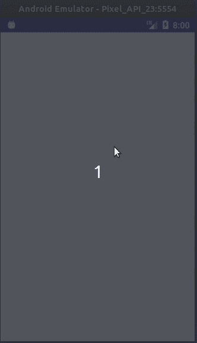
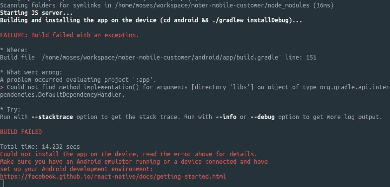

# 在 Android 上安装带有 Gradle 3 的 react-native-maps

> 原文：<https://itnext.io/install-react-native-maps-with-gradle-3-on-android-44f91a70a395?source=collection_archive---------0----------------------->

这是一个关于如何正确安装`react-native-maps` 和 **gradle 3** 而不破坏你的应用的快速教程。



所以我试着在安卓系统上安装了`react-native-maps` *(我已经安装了最新版本的*`*0.21.0*`*)***，不幸的是我不能让它工作。运行`react-native run-android`时，构建失败并返回以下错误:**

```
error while run android in(**Could not find method compileOnly()** for arguments [com.facebook.react:react-native:+] on object of type org.gradle.api.internal.artifacts.dsl.dependencies.DefaultDependencyHandler.)
```

> **[可以访问](https://github.com/react-community/react-native-maps/issues/2188) `[react-native-maps](https://github.com/react-community/react-native-maps/issues/2188)` [github 中开通的问题。](https://github.com/react-community/react-native-maps/issues/2188)**

**即使你正确地遵循了`react-native-maps`的官方安装指南，它仍然不会工作。所以经过一些研究、尝试和错误之后，我找到了一个让`react-native-maps`工作的解决方案。**

**让我们从。。。**

# **如何正确安装 react-native-map**

## **装置**

1.  **安装`react-native-maps`库。**

```
# using yarnyarn add react-native-maps# using npmnpm install react-native-maps --save
```

**2.通过运行以下命令将`react-native-maps`链接到您的项目:**

```
react-native link
```

**3.在您的`android/app/build.gradle`中，将`dependencies`的内容替换为:**

```
dependencies { implementation fileTree(dir: "libs", include: ["*.jar"])
  implementation "com.android.support:appcompat-v7:23.0.1"
  implementation "com.facebook.react:react-native:+"
  implementation(project(':react-native-maps')){
    exclude group: 'com.google.android.gms', module: 'play-services-base'
    exclude group: 'com.google.android.gms', module: 'play-services-maps'
  }
  implementation 'com.google.android.gms:play-services-base:10.0.1'
  implementation 'com.google.android.gms:play-services-maps:10.0.1'}
```

> **语法`compile` 是针对 gradle 版本 2 的。由于`react-native-maps`现在使用的是 gradle 版本 3，我们必须将`compile`更新到`implementation`才能让它工作。**

**4.指定您的 Google Maps API 密钥。在`android/app/src/main/AndroidManifest.xml`中将您的 API 密钥添加到您的清单文件中:**

```
*<application>
*  <!-- You will only need to add this meta-data tag, but make sure it's a child of application --> <meta-data 
    android:name="com.google.android.geo.API_KEY"
    android:value="Your Google maps API Key Here"/>*</application>*
```

> **要获取您的**谷歌地图 API 密钥，**请访问[https://developers . Google . com/maps/documentation/android-API/sign up](https://developers.google.com/maps/documentation/android-api/signup)获取您的 Android 密钥。**
> 
> **确保当前项目启用了 Google Maps Android API。[https://console . developers . Google . com/APIs/library/maps-Android-back end . Google APIs . com](https://console.developers.google.com/apis/library/maps-android-backend.googleapis.com/)**
> 
> **没有 API 密匙，谷歌地图不会显示任何内容。**

**5.**搞定！****

**我们对`react-native-maps`的安装和配置现已完成！**

****

**但是现在庆祝还为时过早，因为如果你试图运行`react-native run-android`——它不会成功构建。**

**您可能会看到类似这样的错误:**

****

## *****—问题*****

**这是一个关于`react-native-maps`使用 gradle 版本 3 语法的问题。我们需要的是直接从`node_modules/`破解并修改`react-native-maps`包。是啊！内部`node_modules`。但是这不是一个好的方法，因为每次一个新的开发者获得你的项目的副本，他们必须总是修改`node_modules/`里面的库，这是不可取的。**

## *****—解决方案*****

**我们必须将 gradle 升级到版本 3，这样`react-native-maps`才能在你的项目中工作。**

# **升级我们的 Gradle**

**1 .修改`android/build.gradle`:**

**在`repositories`内添加`google()`**

```
buildscript {
    repositories {
        jcenter()
        // add google() here
        **google()**
```

**将`com.android.tools.build.gradle`更新为`3.1.0`**

```
buildscript {
    repositories {
        jcenter()
        google()
    }
    dependencies {
      // classpath 'com.android.tools.build:gradle:2.2.3'
      // update from 2.2.3 to 3.1.0 
      **classpath 'com.android.tools.build:gradle:3.1.0'**
```

**在`dependencies`后的`repositories`内增加`google()`:**

```
buildscript {
    repositories {
        jcenter()
        google()
    }
    dependencies {
      classpath 'com.android.tools.build:gradle:3.1.0'
    }
    allprojects {
      repositories {
        mavenLocal()
        jcenter()
        // add googgle() here
        **google()**
```

**2.将`android.enableAapt2=false`添加到`android/gradle.properties`**

```
**android.enableAapt2=false** // < ---  add here
android.useDeprecatedNdk=true
MYAPP_RELEASE_STORE_FILE=my-release-key.keystore
MYAPP_RELEASE_KEY_ALIAS=my-key-alias
```

**3.在`android/gradle/wrapper/gradle-wrapper.properties`中更新梯度版本:**

```
// from version 2.14.1distributionUrl=https\://services.gradle.org/distributions/gradle-2.14.1-all.zip// change to 4.4**distributionUrl=https\://services.gradle.org/distributions/gradle-4.4-all.zip**
```

**4.运行`react-native run-android`。这可能需要一段时间，因为它将下载更新的 gradle 版本。)**

**5.如果您的应用程序构建成功并在模拟器中打开。那么我们的升级就完成了。**搞定！****

**现在我们已经在 react 本地项目中正确安装了`react-native-maps`。让我们尝试创建一个呈现地图的组件。**

```
import React, { Component } from 'react'
import MapView, { PROVIDER_GOOGLE } from 'react-native-maps'
import { View, StyleSheet } from 'react-native'class MapTest extends Component {
  render () {
    return (
      <View style={styles.container}>
        <MapView
          provider={PROVIDER_GOOGLE}
          style={styles.map}
          region={{
            latitude: 37.78825,
            longitude: -122.4324,
            latitudeDelta: 0.015,
            longitudeDelta: 0.0121,
          }}
        ></MapView>
      </View>
    )   
  }
}const styles = StyleSheet.create({
  container: { ... StyleSheet.absoluteFillObject },
  map: { ...StyleSheet.absoluteFillObject }
})export default MapTest
```

> **重建/重新加载我们的应用程序应该渲染地图**

****

**工作反应原生地图**

**这就结束了我们使用 gradle 3 安装`react-native-maps`的快速教程。**谢谢！****

****

> ***你可以按住拍手按钮，留下许多拍手声！\m/谢谢！***