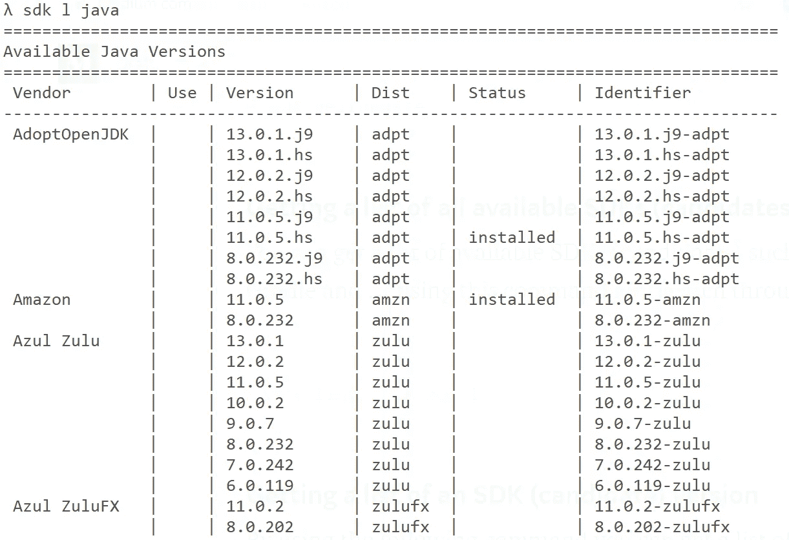

# 在你的操作系统上并行安装几个版本的 JDK、格拉德、科特林、Scala、Spark 和……

> 原文：<https://itnext.io/install-several-versions-of-jdk-gradle-kotlin-scala-spark-and-on-your-os-in-parallel-a7de30f691ad?source=collection_archive---------1----------------------->

## 通用软件开发工具包管理器


你可能听说过 [pyenv](https://github.com/pyenv/pyenv) 、 [RVM](https://rvm.io/) 或 [NVM](https://github.com/nvm-sh/nvm) ，它们允许 Python、Ruby 和 Node.js 开发人员同时拥有多个版本的开发环境，并轻松管理它们(安装和卸载)，最重要的是通过运行一个简单的命令在这些版本之间切换。

以前有一个叫做 [GVM](https://www.methodsandtools.com/tools/gvm.php) (Groovy 环境管理器)的工具，主要用于在大多数基于 Unix 的系统上管理并行版本的 Groovy、Grails 和 Gradle。

## SDKMAN！浮现

[SDKMAN！](https://sdkman.io/)是 GVM[的演进、更名和通用版本](https://www.methodsandtools.com/tools/gvm.php)，用于管理任何 SDK(软件开发套件)的并行版本。利用 [SDKMAN！](https://sdkman.io/)你可以在任何支持 [bash](https://www.gnu.org/software/bash/) 的操作系统上并行安装和使用任何 SDK 的几个版本(从 JDK 到 Apache Spark)，比如 Linux、macOS 或 Windows(通过 WLS 或 Cygwin)。

## SDKMAN 的好处！

想象一下，你想在你的机器上测试和评估 JDK 14 或 Gradle 6.0 的新功能，同时你已经安装了其他版本。通过使用 [SDKMAN！](https://sdkman.io/)这并不麻烦，您可以通过运行几个命令来进行测试，更改您的环境，然后再恢复。

[SDKMAN！](https://sdkman.io/)不仅限于 JVM SDKs。用 SDKMAN！开放 Broker REST API，每个团队或公司都可以使用 SDKMAN 发布自己的 SDK！

# 如何安装 SDKMAN！

SDKMAN！是用 [bash](https://www.gnu.org/software/bash/) 编写的，要安装它，你只需要在你的路径中有 [curl](http://curl.haxx.se/) 、 [zip 和 unzip](http://www.info-zip.org/) 。

## 安装在类似 UNIX 的操作系统上(Linux、macOS 或…)

SDKMAN！支持 Bash 和 ZSH shell，您可以通过运行以下命令轻松安装它:

```
curl -s "https://get.sdkman.io" | bash
```

## 在 windows 上安装

据 SDKMAN 说！网站的文档，你可以通过运行上面的命令，使用 [windows Linux 子系统](https://docs.microsoft.com/en-us/windows/wsl/install-win10) (WLS)或 [Cygwin](https://www.cygwin.com/install.html) 或 [Git Bash for Windows](https://git-scm.com/download/win) 轻松地在 Windows 上安装它。你只需要在你的路径中有压缩、解压和卷曲。

如果你在像 [cmder](https://cmder.net/) 或 Git bash 这样的工具中使用 MinGW 或 Cygwin 安装 zip 和 unzip 有任何问题，你可以使用[这个链接](https://ranxing.wordpress.com/2016/12/13/add-zip-into-git-bash-on-windows/)的方法下载并手动使用它们。

# 如何使用 SDKMAN！

安装过程完成后，您应该关闭当前终端并打开新的终端，或者在当前终端中运行以下命令:

```
source "$HOME/.sdkman/bin/sdkman-init.sh"
```

对于第一个命令，您可以运行 version 命令以确保安装成功:

```
sdk version //or sdk v
```

这个命令打印 SDKMAN 的版本！安装在你的机器上。如果有 SDKMAN 的更新！它会要求你升级(`Would you like to upgrade now? (Y/n):`)。如果要更新 SDKMAN！对于新版本，您可以运行以下命令:

```
sdk selfupdate
```

## 获取要安装的所有可用 SDK(候选)的列表

您可以使用这个命令获得可用 SDK(候选)的列表，例如 JDK、Scala、Maven、Gradle 和……并搜索结果:

```
sdk list //or sdk l
```

## 获取 SDK(候选)版本列表

通过使用以下命令，您可以获得一个 SDK 的所有可用版本的列表:

```
sdk l java
```

打印列表中最重要的列是`Status`和`Identifier`(或者对于那些没有`Vendor`的 SDK 是`Version`)，它们指示了该 SDK 的哪些版本安装在您的机器上，以及安装或删除这些版本的标识符是什么。



## 安装 SDK

在您的计算机上安装 SDK 的最快方法是通过运行以下命令来安装该 SDK 的默认供应商(如果存在)的最新稳定版本:

```
sdk i java
```

如果您想安装特定版本，您可以使用`Version`或`Identifier`:

```
sdk i scala 2.12.10
```

或者

```
sdk i java 11.0.5-amzn
```

## 安装 SDK 的本地版本

这个特性对于开发或测试 SDK 快照或测试版的人来说非常有用。如果您已经本地安装了 SDK，则可以通过指定其路径并为其分配唯一名称来安装该本地版本:

```
sdk i java openjdk-14-ea25 /path/to/installation
```

## 获取当前安装的 SDK 版本

通过以下命令，您可以看到 SDK 当前使用的版本是什么:

```
sdk c java
```

或者使用此命令查找所有 SDK 使用的当前版本:

```
sdk c
```

## 在已安装的 SDK 版本之间切换(针对当前终端)

当您可以并行安装几个版本的 SDK 时，能够在它们之间进行切换是非常重要的，请注意，该命令仅切换当前终端的版本:

```
sdk u java 11.0.5-amzn
```

## 将 SDK 的一个版本设置为默认值(永久适用于所有终端)

如果您想将 SDKs 特定版本设置为默认版本(永久适用于所有终端)，您可以使用以下命令:

```
sdk d java 11.0.5-amzn
```

# 结论

我找到了 SDKMAN！对于跨 SDK 开发和测试非常有用，对于需要多个 SDK 并行版本的项目，还可以实现复杂的部署脚本场景。