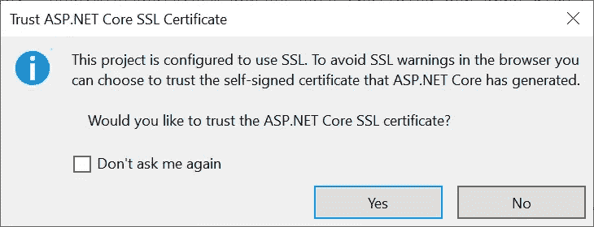
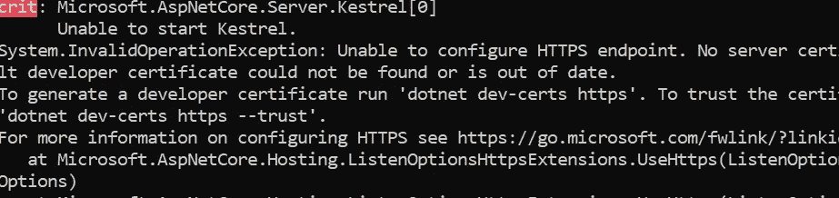
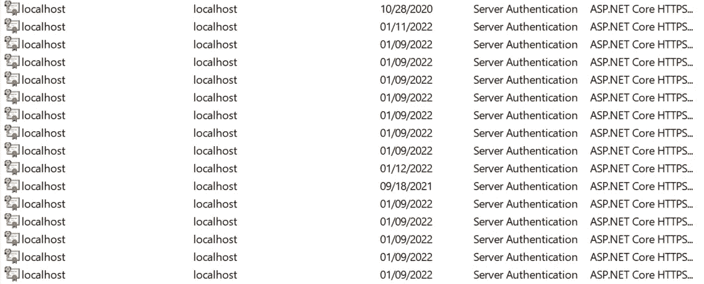
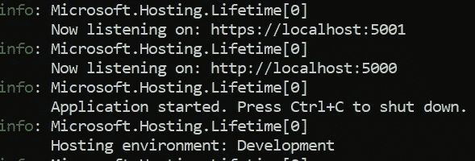

# 已安装 ASP.NET 核心开发人员证书，但仍然“无法配置 HTTPS 端点”。没有指定服务器证书"

> 原文：<https://itnext.io/installed-asp-net-16702767e7b3?source=collection_archive---------1----------------------->

与。NET，为您的 web 应用程序生成自签名证书总是很容易的。您可以在 Visual Studio 或 dotnet SDK 命令行中发出它们。如果您在 Visual Studio 中创建新的 web 应用程序，首先，您会看到以下消息:



或者，您可以使用以下命令快速为本地主机颁发自签名证书:

```
dotnet dev-certs https# the possible result after succesful execution would b:
# The HTTPS developer certificate was generated successfully.
```

但有时，就像我的情况一样，这不会有什么帮助，你会看到这个令人讨厌的例外:



## 补救措施#1

如果您在 Google 上搜索该问题，您可能会发现有关运行清理命令然后重新颁发证书的信息，如下所示:

```
dotnet dev-certs https --clean# HTTPS development certificates successfully removed from the machine.dotnet dev-certs https
# The HTTPS developer certificate was generated successfully.
```

这应该有用，但是有时候，就像我的情况一样，它不会有任何好处；每次 Visual Studio 启动后，关于**问题和信任自签名证书的消息不断出现！**

## **补救措施#2(终极)**

**当事情没有按预期运行时，没有什么比手动完成所有事情更好的了。**

**为了跟踪该问题，我检查了 Windows 证书存储中的个人证书，以查看证书是否安装正确。我遇到了一长串为本地主机颁发的证书！**

**😒不确定是我机器上的 bug 还是环境问题，但是 Visual Studio 和。NET SDK 每次都会颁发一个新的证书。**

****

**我删除了证书，并用命令行重新发布了它:**

```
dotnet dev-certs https
```

**问题解决了:**

****

## **如何访问 Windows 证书存储以及如何删除这些证书？**

1.  **打开`Run`和打开`mmc.exe`**
2.  **在 MMC 中，从“文件”菜单单击“添加/删除管理单元”**
3.  **在“添加/删除管理单元”窗口中，在可用的管理单元中找到证书，并将其添加到选定的**
4.  **选择使用帐户**
5.  **在控制台根->证书当前用户->个人点击证书**
6.  **您将看到为当前用户颁发和安装的证书列表。**不要删除或更改任何你不知道的证书**，只删除与自签本地主机 ASP.NET 核心相关的证书。**