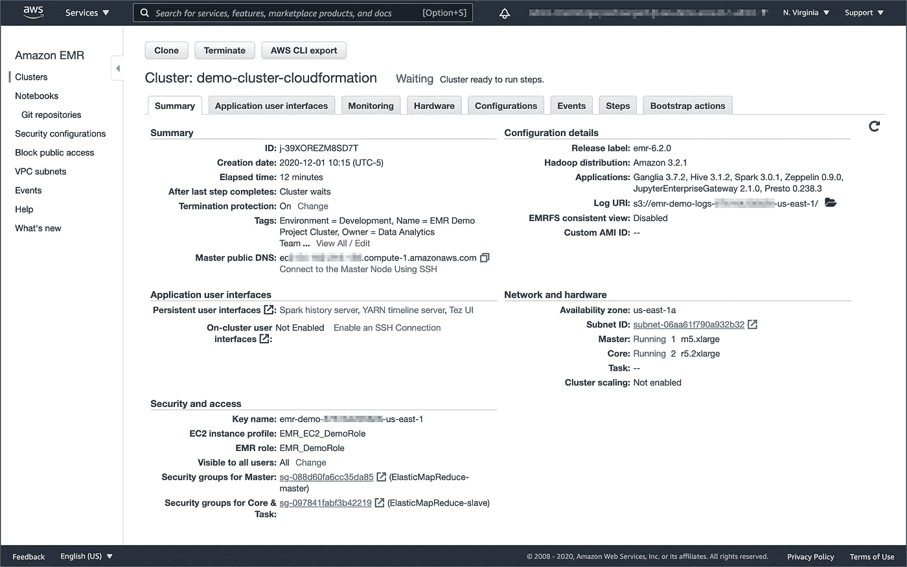
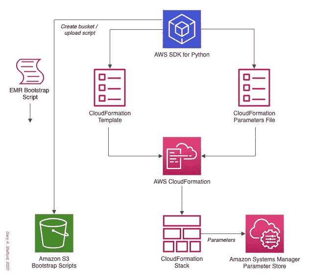
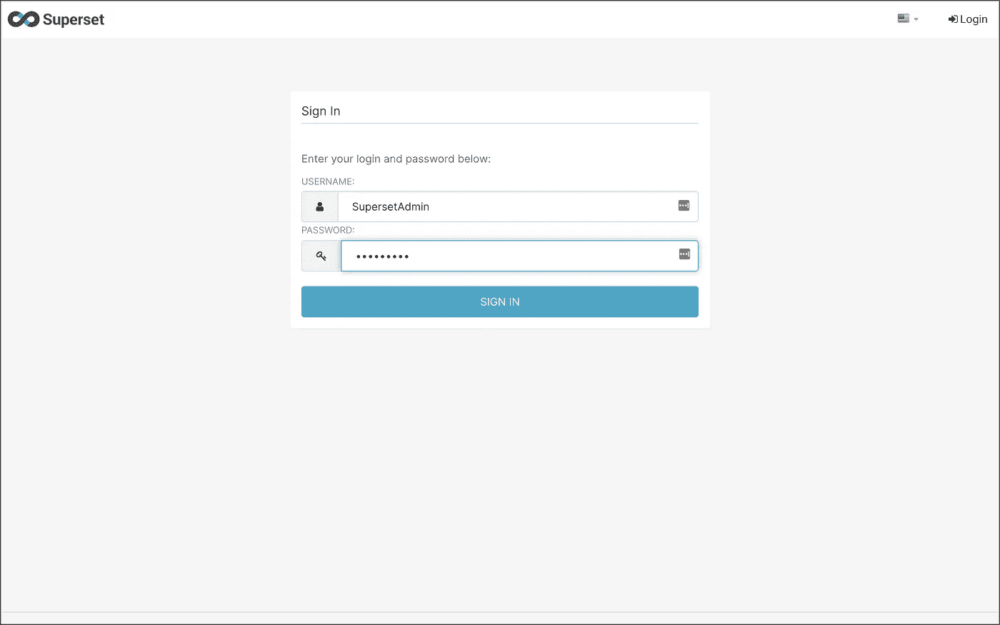
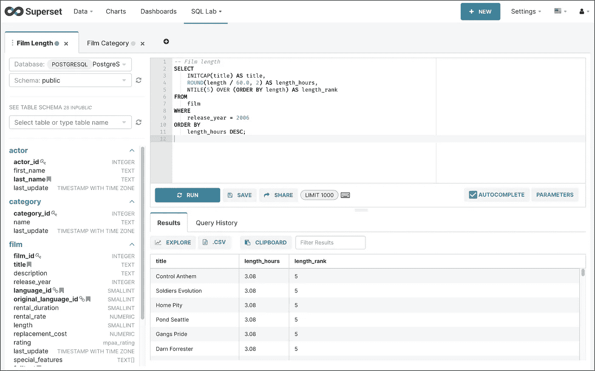

# 在 Amazon EMR 上安装 Apache 超集

> 原文：<https://itnext.io/installing-apache-superset-on-amazon-emr-5e2444f6d242?source=collection_archive---------7----------------------->

## 将数据探索和可视化添加到您的分析集群中

# 介绍

AWS 提供了近 25 种不同的开源数据分析应用程序，可以在 Amazon Elastic MapReduce(Amazon EMR)上自动安装和配置。在所有这些选项中，EMR 没有提供通用的数据探索和可视化工具。但是，使用 EMR，您可以在集群创建过程或集群创建后自动安装其他软件。这篇简短的帖子将探索如何在 Amazon EMR 的主节点上安装、配置和访问 [Apache 超集](https://superset.apache.org/)，这是一个现代化的数据探索和可视化平台，作为后集群创建步骤。您也可以使用这些相同的技术在 EMR 上安装其他软件包，手动或作为自动化数据管道的一部分。

# 亚马逊电子病历

据 AWS 介绍，[亚马逊 EMR](https://aws.amazon.com/emr) 是一个基于云的大数据平台，使用开源工具处理海量数据，如 [Apache Spark](https://aws.amazon.com/emr/features/spark/) 、 [Hive](https://aws.amazon.com/emr/features/hive/) 、 [HBase](https://aws.amazon.com/emr/features/hbase/) 、 [Flink](https://aws.amazon.com/blogs/big-data/use-apache-flink-on-amazon-emr/) 、[胡迪](https://aws.amazon.com/emr/features/hudi/)和 [Zeppelin](https://zeppelin.apache.org/) 、 [Jupyter](https://jupyter.org/) 和 [Presto](https://aws.amazon.com/emr/features/presto/) 。使用 Amazon EMR，数据分析师、工程师和科学家可以自由地探索、处理和可视化数据。EMR 负责调配、配置和调整底层计算集群，使您能够专注于运行分析。



Amazon EMR 控制台的集群摘要选项卡

AWS 目前提供 5.x 和 6.x 版本的亚马逊 EMR。最新的[亚马逊 EMR 版本](https://docs.aws.amazon.com/emr/latest/ReleaseGuide/emr-release-components.html)是亚马逊 EMR 版本 6.2.0 和亚马逊 EMR 版本 5.32.0。亚马逊 EMR 的每个版本都提供了近 25 个不同的、流行的开源大数据软件包的增量主版本和次版本供选择，亚马逊 EMR 将在创建集群时安装和配置这些软件包。

# Apache 超集

据其网站介绍， [Apache Superset](https://superset.apache.org/) 是一个现代化的数据探索和可视化平台。Superset 快速、轻量、直观，并加载了选项，使所有技能集的用户都可以轻松地浏览和可视化他们的数据，从简单的折线图到非常详细的地理空间图。

超集本身支持超过 25 个数据源，包括 Amazon Athena 和 Redshift、Apache Drill、Druid、Hive、Impala、Kylin、Pinot 和 Spark SQL、Elasticsearch、Google BigQuery、Hana、MySQL、Oracle、Postgres、Presto、Snowflake、Microsoft SQL Server 和 Teradata。

如他们的[图库](https://superset.apache.org/gallery)所示，超集包括数十种可视化类型，包括数据透视表、折线图、标记图、饼图、过滤框、气泡图、箱线图、直方图、热图、旭日图、日历热图和几种地理空间类型。


Apache 超集可视化图库

# 设置

使用这个`git clone`命令，将本文的开源 [GitHub 库](https://github.com/garystafford/emr-superset-demo)下载到您的本地环境中。

```
git clone --branch main --single-branch --depth 1 --no-tags \
    https://github.com/garystafford/emr-superset-demo.git
```

为了演示如何在 EMR 上安装 Apache 超集，我准备了一个 AWS CloudFormation 模板。将模板`cloudformation/superset-emr-demo.yml`部署到 AWS 将导致 AWS 云形成栈`superset-emr-demo-dev`。该堆栈创建了一个最小规模的双节点 EMR 集群、两个亚马逊 S3 存储桶和几个 [AWS 系统管理器(SSM)参数存储库](https://docs.aws.amazon.com/systems-manager/latest/userguide/systems-manager-parameter-store.html)参数。

还有一个 JSON 格式的云形成参数文件，`cloudformation/superset-emr-demo-params-dev.json`。参数文件包含 CloudFormation 模板中十个必需参数中八个的值，所有这些参数都可以调整。对于剩余的两个必需参数，您需要提供现有 EC2 密钥对的名称来访问 EMR 主节点。需要将密钥对部署到您正在部署 EMR 的同一个 AWS 帐户。您还需要为要安装到的 EMR 集群提供一个子网 ID。子网必须能够访问互联网，以安装 Superset 所需的系统和 Python 包，并访问 Superset 基于 web 的用户界面。如果你需要帮助创建一个 VPC 和子网来部署 EMR，请参考我之前的博客文章[在 Amazon EMR 上运行 PySpark 应用程序:在 Amazon Elastic MapReduce 上与 PySpark 交互的方法](https://link.medium.com/q5jJdiO08bb)。

使用 Python 脚本`create_cfn_stack.py`创建 CloudFormation 堆栈。python 脚本使用 AWS `boto3` Python SDK。

要执行 Python 脚本并创建 CloudFormation 堆栈(这将创建 EMR 集群),请运行以下命令。记住将参数更新为 EC2 密钥对的名称和 EMR 集群的子网 ID。

```
python3 ./create_cfn_stack.py \
    --ec2-key-name ***<your_key_pair_name>*** \
    --ec2-subnet-id ***<your_subnet_id>*** \
    --environment dev
```

这是完整的云形成工作流程的样子。



AWS CloudFormation 堆栈创建

## 安全组进入规则

要通过 SSH 在 EMR 集群的主节点上安装超集，您需要在与 EMR 集群的主节点相关联的安全组上打开端口`22`，允许从您的 IP 地址进行访问。您可以使用 AWS 管理控制台或 AWS CLI 打开端口`22`。我们将从 AWS CLI 使用`jq`和 AWS `ec2` API 来获取与 EMR 集群的主节点相关联的安全组 ID，并创建两个入口规则。

```
export EMR_MASTER_SG_ID=$(aws ec2 describe-security-groups | \
    jq -r ".SecurityGroups[] | \
    select(.GroupName==\"ElasticMapReduce-master\").GroupId" | \
    head -n 1)aws ec2 authorize-security-group-ingress \
    --group-id ${EMR_MASTER_SG_ID} \
    --protocol tcp \
    --port 22 \
    --cidr $(curl ipinfo.io/ip)/32
```

# 超集脚本

一旦创建了 CloudFormation 堆栈并且打开了端口，我们就可以在 EMR 主节点上安装 Apache 超集。引导脚本`bootstrap_emr/bootstrap_superset.sh`将用于作为`hadoop`用户将 Apache 超集安装到 EMR 集群的主节点上。该脚本大致基于超集的[从头安装](https://superset.apache.org/docs/installation/installing-superset-from-scratch)指令。

作为安装超集的一部分，该脚本还将部署几个常见的[数据库驱动](https://superset.apache.org/docs/databases/installing-database-drivers)，包括 Amazon Athena、Amazon Redshift、Apache Spark SQL、Presto、PostgreSQL 和 MySQL。该脚本还将创建一个[超集管理角色](https://apache-superset.readthedocs.io/en/0.28.1/security.html#admin)，以及两个超集用户角色——Alpha[和 Gamma](https://apache-superset.readthedocs.io/en/0.28.1/security.html#alpha) 。

为了使用引导脚本安装超集，我们将使用另一个 Python 脚本`install_superset.py`。该脚本使用了 SSHv2 的 Python 实现`paramiko`。该脚本还使用了`scp`，这是一个通过 scp1 协议使用`paramiko`传输来发送和接收文件的模块。

该脚本需要一个输入参数`ec2-key-path`，它是 EC2 密钥对的完整路径(例如`~/.ssh/my-key-pair.pem`)。或者，您可以使用`superset-port`参数更改默认的`8280`超集端口。

```
python3 ./install_superset.py \
    --ec2-key-path ***</path/to/my-key-pair.pem>*** *\
    --superset-port 8280*
```

该脚本使用 SSH 和 SCP 来部署和执行引导脚本`bootstrap_superset.sh`。脚本的输出包括运行在 EMR 集群上的 Apache 超集的 URL。输出还包含超集管理员的用户名和密码。

```
********************************************************************Superset URL: [http://ec2-111-22-333-44.compute-1.amazonaws.com:8280](http://ec2-184-72-144-74.compute-1.amazonaws.com:280)Admin Username: SupersetAdminAdmin Password: Admin1234********************************************************************
```

# SSH 隧道

根据 [AWS](https://docs.aws.amazon.com/emr/latest/ManagementGuide/emr-web-interfaces.html) ，EMR 应用程序将用户界面发布为主节点上托管的网站。出于安全原因，这些网站仅在主节点的本地 web 服务器上可用。要访问任何 web 接口，您必须使用动态或本地端口转发与主节点建立一个 [SSH 隧道](https://en.wikipedia.org/wiki/Tunneling_protocol)。如果使用动态端口转发，还必须配置代理服务器来查看 web 界面。


创建 SSH 隧道以访问 EMR 上的 UI 的说明

在您的终端中运行该命令将在端口`8157`上启动 SSH 隧道。一旦启用了隧道，您就可以在 web 浏览器中访问 Apache 超集，使用上面的脚本输出中显示的脚本输出的 URL[。](http://ec2-111-22-333-44.compute-1.amazonaws.com:8280).)使用管理员凭据或两个用户凭据中的任何一个登录到超集。



Apache 超集登录屏幕

登录后，您将能够连接到您的数据源并[探索](https://superset.apache.org/docs/creating-charts-dashboards/exploring-data)和可视化数据。下面，我们看到一个针对 Amazon RDS for PostgreSQL 数据库执行的 SQL 查询示例，它运行在与 EMR 不同的 VPC 中。



使用超集的 SQL 编辑器查询 Amazon RDS PostgreSQL 数据库的示例

# 结论

在这篇文章中，我们学习了如何在 Amazon EMR 集群的主节点上安装 Apache 超集。如果您想在 EMR 集群的所有节点上安装一个应用程序，您可以将命令添加到引导脚本中，该脚本在 CloudFormation 创建集群时运行。

*这篇博客代表我自己的观点，而不是我的雇主亚马逊网络服务公司的观点。所有产品名称、徽标和品牌都是其各自所有者的财产。*