# 以快速有效的方式在库伯内特斯上安装纤毛

> 原文：<https://itnext.io/installing-cilium-on-kubernetes-in-a-fast-and-efficient-way-dbcb79ce9699?source=collection_archive---------0----------------------->

# 纤毛是什么

[Cilium](https://cilium.io/) 是一个专注于容器网络的开源项目。它可以部署在容器平台上，透明地保护应用程序工作负载(如应用程序容器或进程)之间的网络连接和负载平衡。

Cilium 运行在第 3 层和第 4 层，提供传统的网络和安全服务。它还运行在第 7 层，以保护现代应用协议的使用，如 HTTP、gRPC 和 Kafka。Cilium 可以集成到流行的容器编排框架中，如 Kubernetes 和 Mesos。

基于一种称为 eBPF 的新 Linux 内核技术，Cilium 支持在 Linux 本身中动态插入强大的安全可见性和控制逻辑。因为 eBPF 运行在 Linux 内核中，所以可以应用和更新 Cilium 安全策略，而无需对应用程序代码或容器配置进行任何更改。

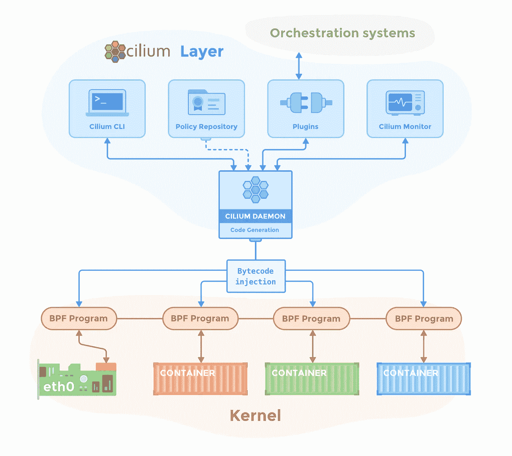

在这篇博客中，我将尝试探索 Cilium 作为 Kubernetes 集群上的 CNI(容器网络接口)。如果您对 Cilium 的性能细节感兴趣，请查看 [CNI 基准测试:了解 Cilium 网络性能](https://cilium.io/blog/2021/05/11/cni-benchmark)。

# 什么是 KubeKey

KubeKey 在 Go 中开发，是一个轻量级的安装程序，提供了一种简单灵活的方法来安装 Kubernetes 和 KubeSphere。使用 KubeKey，您可以只安装 Kubernetes，也可以同时安装 Kubernetes 和 KubeSphere。

您可以使用 KubeKey 的场景:

*   仅安装 Kubernetes。
*   使用一个命令同时安装 Kubernetes 和 KubeSphere。
*   扩展集群。
*   升级集群。
*   安装 Kubernetes 相关的附加组件(图表或 YAML)。

目前，KubeKey 支持在 Kubernetes 集群上安装 Cilium，这使得部署过程更加简单和高效。

# 在 Kubernetes 集群上安装纤毛

## 系统需求

在安装 Cilium 之前，您必须确保您的系统满足最低要求。例如，如果您使用容器映像`cilium/cilium`运行 Cilium，那么您的主机系统的 Linux 内核版本必须是 4.9.17 和更高版本。

有关系统要求的更多信息，请查看[纤毛系统要求](https://docs.cilium.io/en/v1.10/operations/system_requirements/)。

## **主机准备**

在这篇博客中，让我们以一个 LTS 64 位的 Ubuntu Server 20.04.1 为例。

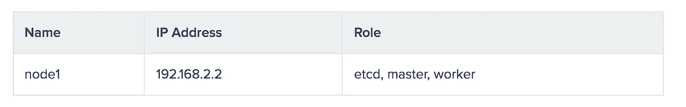

有关 Linux 兼容性的更多信息，请查看 [Linux 发行版兼容性列表](https://docs.cilium.io/en/v1.10/operations/system_requirements/#linux-distribution-compatibility-matrix)。

# 安装 KubeKey

1.  运行以下命令来获取 KubeKey:

```
sudo wget [https://github.com/kubesphere/kubekey/releases/download/v1.1.0/kubekey-v1.1.0-linux-64bit.deb](https://github.com/kubesphere/kubekey/releases/download/v1.1.0/kubekey-v1.1.0-linux-64bit.deb)
```

2.运行以下命令安装 KubeKey:

`sudo dpkg -i kubekey-v1.1.0-linux-64bit.deb`

# 生成配置文件

1.  运行以下命令生成配置文件:

`sudo kk create config --with-kubernetes v1.19.8`

2.配置文件生成后，运行以下命令配置`spec.hosts`，并将`spec.network.plugin`设置为`cilium`:

`sudo vi config-sample.yaml`

```
apiVersion: kubekey.kubesphere.io/v1alpha1
kind: Cluster
metadata:
  name: sample
spec:
  hosts:
  - {name: node1, address: 192.168.2.2, internalAddress: 192.168.2.2, user: ubuntu, password: ********}
  roleGroups:
    etcd:
    - node1
    master:
    - node1
    worker:
    - node1
  controlPlaneEndpoint:
    domain: lb.kubesphere.local
    address: ""
    port: 6443
  kubernetes:
    version: v1.19.8
    imageRepo: kubesphere
    clusterName: cluster.local
  network:
    plugin: cilium
    kubePodsCIDR: 10.233.64.0/18
    kubeServiceCIDR: 10.233.0.0/18
  registry:
    registryMirrors: []
    insecureRegistries: []
  addons: []
```

# 部署一个安装了 KubeSphere 的 Kubernetes 集群

1.  运行以下命令来部署依赖项:

`sudo kk init os -f config-sample.yaml`

2.部署完依赖项后，运行以下命令将 Kubernetes 和 KubeSphere 一起部署:

`sudo kk create cluster -f config-sample.yaml --with-kubesphere v3.1.0`

3.等待一段时间，如果安装成功，您将看到类似以下示例的提示:

```
#####################################################
###              Welcome to KubeSphere!           ###
#####################################################

Console: [http://192.168.2.2:30880](http://192.168.2.2:30880)
Account: admin
Password: P@88w0rd

NOTES：
  1\. After you log into the console, please check the
     monitoring status of service components in
     "Cluster Management". If any service is not
     ready, please wait patiently until all components
     are up and running.
  2\. Please change the default password after login.

#####################################################
[https://kubesphere.io](https://kubesphere.io)             20xx-xx-xx xx:xx:xx
########################################################################################################## ###              Welcome to KubeSphere!           ### #####################################################     Console: http://192.168.2.2:30880 Account: admin Password: P@88w0rd     NOTES：   1\. After you log into the console, please check the      monitoring status of service components in      "Cluster Management". If any service is not      ready, please wait patiently until all components      are up and running.   2\. Please change the default password after login.     ##################################################### https://kubesphere.io             20xx-xx-xx xx:xx:xx #####################################################
```

# 检查纤毛荚

1.  使用默认用户名和密码(`admin` / `P@88w0rd`)登录 KubeSphere。

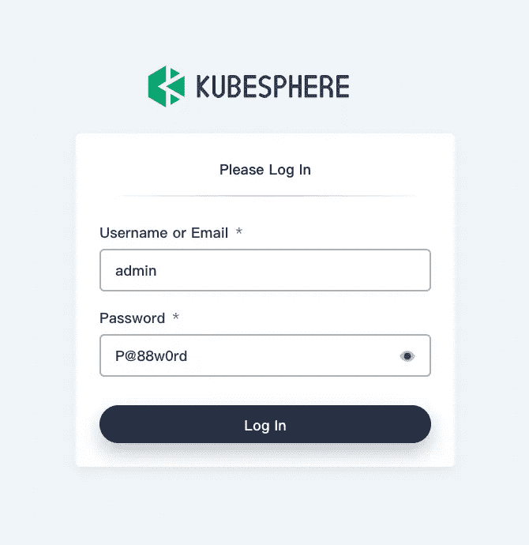

2.点击左上角的**平台**，选择**集群管理**。

3.在左侧导航窗格中，选择**应用工作负载** > **Pods** ，从下拉列表中选择`kube-system`，在搜索框中输入`cilium`，按**进入**。纤毛荚将显示在列表中。

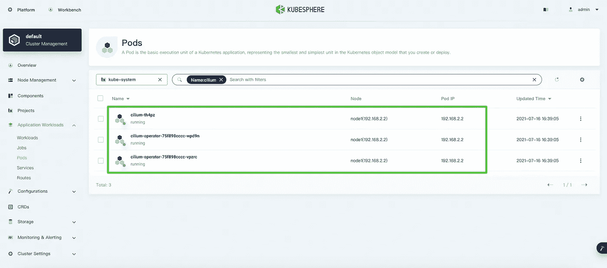

# 安装哈勃用户界面

哈勃是为网络可视化而设计的。通过 Cilium 提供的 eBPF 数据路径，Hubble 能够深入了解 Kubernetes 上运行的应用程序和服务的网络流量。您可以使用 Hubble CLI 或 UI 工具来实现对 DNS 相关问题的快速交互式诊断。除了 Hubble 自己的监控工具，您还可以通过集成其他流行的云原生监控系统(如 Prometheus 和 Grafana)来扩展您的监控策略。

1.  将光标悬停在“设置”图标上，并选择 **Kubectl** 。

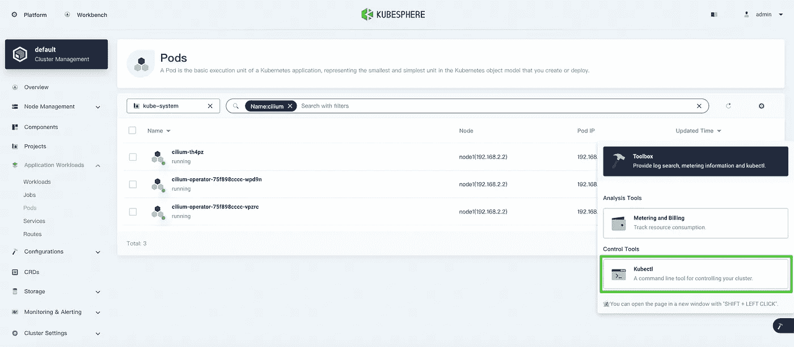

2.在显示的对话框中，运行以下命令安装 Hubble:

```
kubectl apply -f [https://raw.githubusercontent.com/cilium/cilium/v1.8/install/kubernetes/experimental-install.yaml](https://raw.githubusercontent.com/cilium/cilium/v1.8/install/kubernetes/experimental-install.yaml)
```

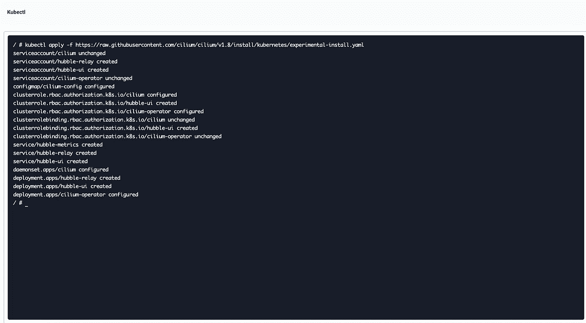

3.在 **Pods** 页面，从下拉列表中选择`kube-system`，在搜索框中输入`hubble`，按**键输入**。哈勃舱将显示在列表中。

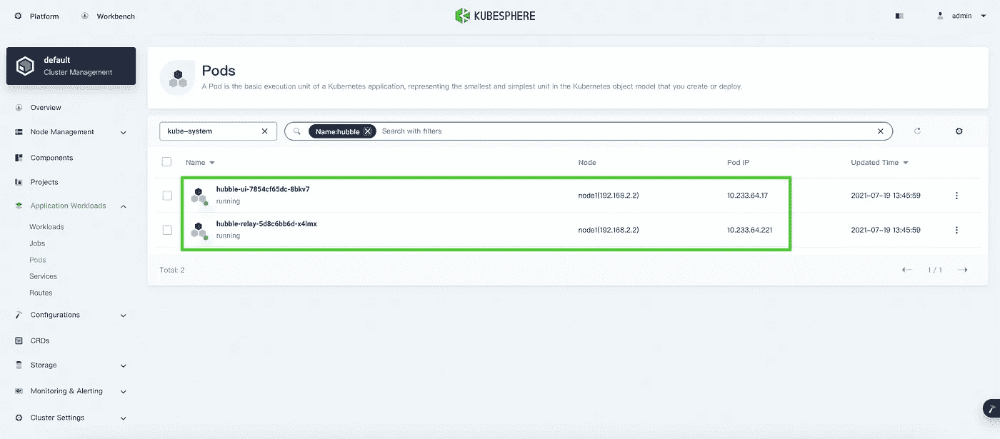

# 创建演示服务

1.  在您的主机上运行以下命令来创建演示服务:

```
kubectl create -f [https://raw.githubusercontent.com/cilium/cilium/1.9.7/examples/minikube/http-sw-app.yaml](https://raw.githubusercontent.com/cilium/cilium/1.9.7/examples/minikube/http-sw-app.yaml) -n default
```

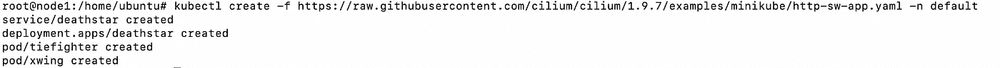

2.运行以下命令来访问演示资源:

```
$ kubectl exec xwing -n default -- curl -s -XPOST deathstar.default.svc.cluster.local/v1/request-landing
Ship landed
$ kubectl exec tiefighter -n default -- curl -s -XPOST deathstar.default.svc.cluster.local/v1/request-landing
Ship landed
```

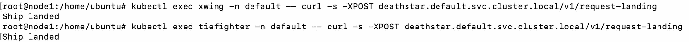

3.在 KubeSphere 控制台的**服务**页面，从下拉列表中选择`kube-system`，在搜索框中输入`hubble`，按**进入**。点击`hubble-ui`右侧的详细图标，选择**编辑上网**。

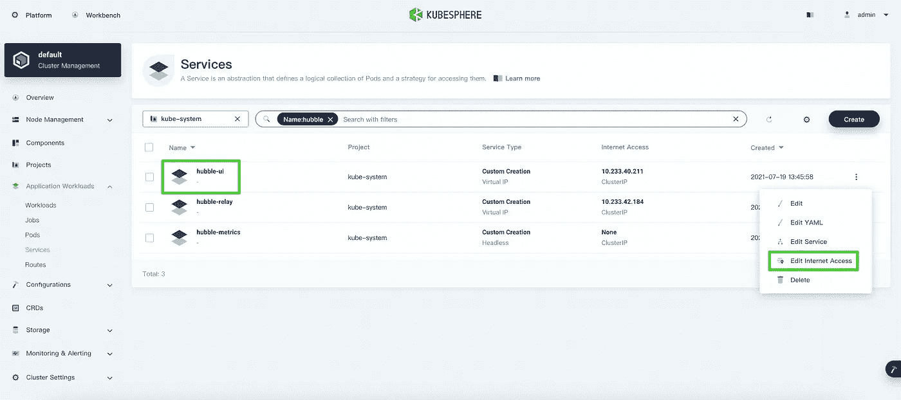

4.将**访问方法**设置为**节点端口**并点击**确定**。

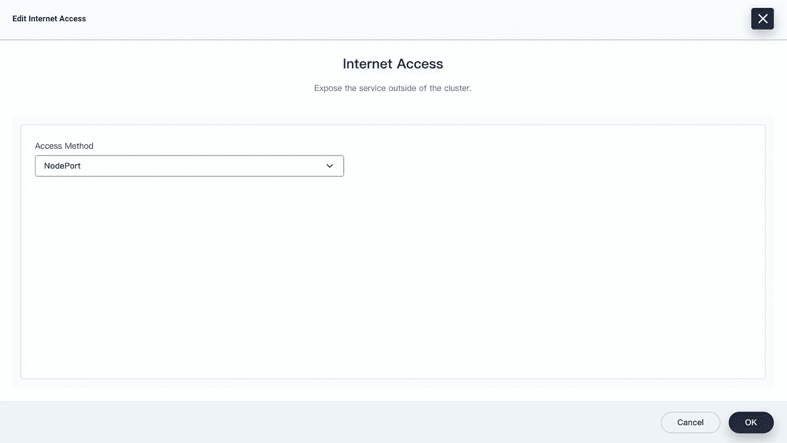

5.现在，你可以在哈勃仪表盘上查看图形化的服务地图。

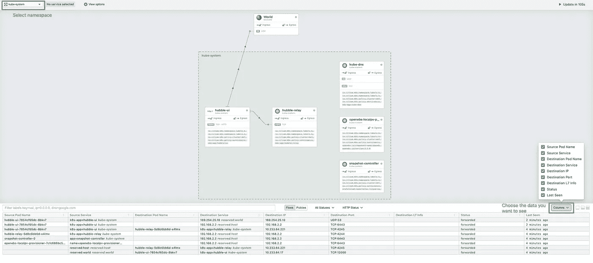

*注*

*在访问 Hubble 仪表盘之前，您需要在基础设施环境中配置流量转发和防火墙策略。*

如果您想要在第 7 层上启用网络可视化，您必须向您的目标 pod 添加注释。在[第 7 层协议可见性](https://docs.cilium.io/en/stable/policy/visibility/)中了解更多信息。

# 概述

根据我自己使用 Cilium 的经验，它可以满足大多数容器网络用例中的要求。而且哈勃以云原生的方式实现了数据平面的可视化，比 Istio 好很多。我相信 Cilium 不久将成为 Kubernetes 社区中大多数人使用的网络解决方案。

# 关于 KubeSphere

KubeSphere 是一个基于 Kubernetes 的开源容器平台，其核心是应用程序。它提供全栈 It 自动化操作和简化的开发运维工作流。

[KubeSphere](https://kubesphere.io/) 已被全球数千家企业采用，如 **Aqara、新浪、奔来、中国太平、华夏银行、国药控股、微众银行、Geko Cloud、VNG 公司、Radore** 。KubeSphere 为运维提供向导界面和各种企业级功能，包括 Kubernetes 资源管理、 [DevOps (CI/CD)](https://kubesphere.io/devops/) 、应用生命周期管理、服务网格、多租户管理、[监控](https://kubesphere.io/observability/)、日志记录、警报、通知、存储和网络管理以及 GPU 支持。有了 KubeSphere，企业能够快速建立一个强大且功能丰富的容器平台。

欲了解更多信息，请访问 [https://kubesphere.io](https://kubesphere.io/)