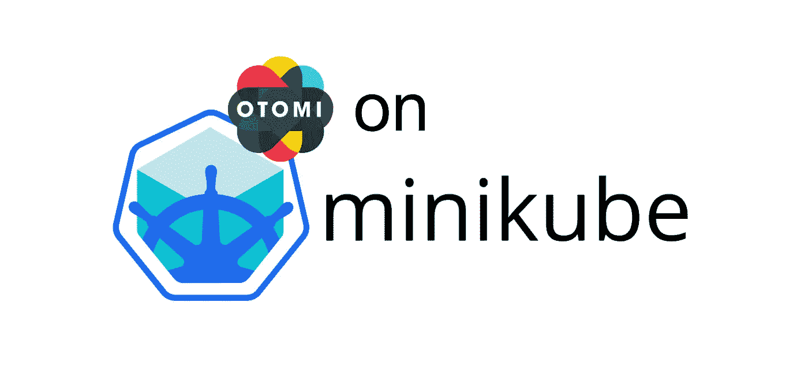
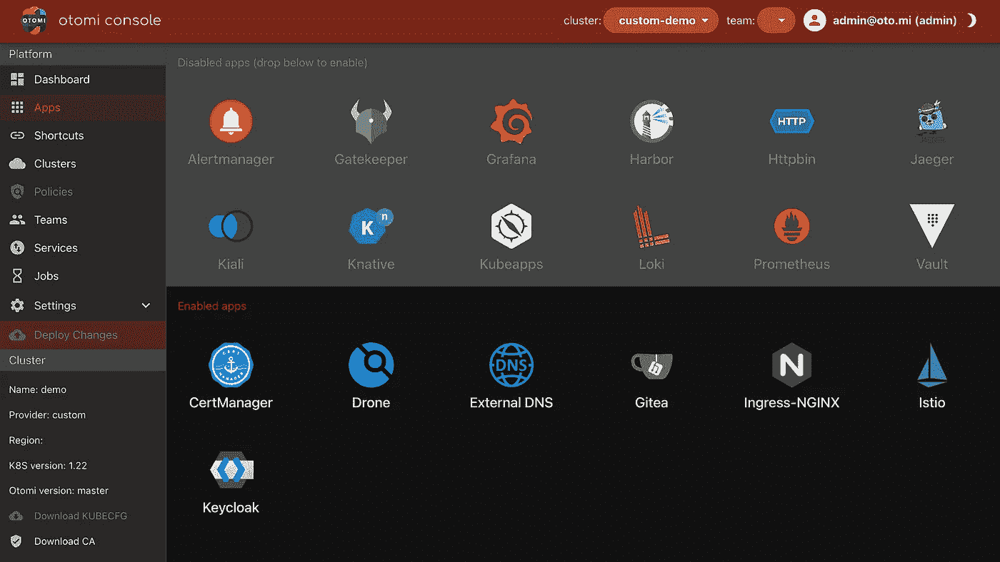

# 在 Minikube 上安装 Otomi

> 原文：<https://itnext.io/installing-otomi-on-minikube-2f83dfc421d2?source=collection_archive---------0----------------------->



[Otomi](https://github.com/redkubes/otomi-core) 是一个面向 Kubernetes 的自托管平台即服务(PaaS ),提供一整套集成的、预配置的应用程序，并结合自动化。Otomi 针对在托管的 Kubernetes 服务(如 AKS、EKS 和 GCP)上运行进行了优化，但现在可以安装在任何 K8s 集群上，甚至是 Minikube 上。因此，如果你想尝试 Otomi，但不想在云中旋转集群，现在你可以了！

默认情况下，新版本的 Otomi 现在安装了一个最小的应用程序集，称为核心。该内核提供了基于 Istio、Nginx 入口控制器、Keycloak、Oauth2 代理和 cert-manager 的高级入口架构。通过 web UI (Otomi 控制台),您可以将服务添加到网格中，并且只需一次点击就可以安全地公开它们。所有其他集成的应用程序现在都是可选的，可以通过将它们拖到已启用的应用程序部分来激活。在这篇文章中，我将解释如何在 Minikube(在 Mac 上)上安装 Otomi，以便您可以在 cloud K8s 集群上运行它并启用更多应用程序和功能之前使用它。

如果你曾经运行过 Minikube，你可能会使用 Docker 驱动程序。遗憾的是，使用 Docker 驱动时，无法从 Mac 访问 Minikube IP。只能用 127.0.0.1。在很多情况下这不是问题，但是 Otomi 需要一个可以从你的机器浏览器和集群内部解析的 IP。

因此，为了能够在 Minikube 上安装 Otomi，我将使用 hyperkit 驱动程序(参见:[https://minikube.sigs.k8s.io/docs/drivers/hyperkit/](https://minikube.sigs.k8s.io/docs/drivers/hyperkit/))和 metallb(参见:[https://metallb.universe.tf/](https://metallb.universe.tf/))

让我们开始吧:

确保您安装了以下软件:

*   库贝特尔
*   舵
*   码头工人
*   Minikube 版本 1.25.2(已测试)

首先，配置 minikube:

```
minikube config set memory 8gminikube config set cpus 8
```

但是如果你有多余的，请使用它们；-)

如果你想玩 Otomi 中的网络策略功能，那么也需要使用 Calico CLI。

现在启动 Minikube:

```
> minikube start --driver=hyperkit --kubernetes-version=v1.22.4 --cni calico😄  minikube v1.25.2 on Darwin 11.1✨  Using the hyperkit driver based on user configuration👍  Starting control plane node minikube in cluster minikube💾  Downloading Kubernetes v1.21.9 preload ...> preloaded-images-k8s-v17-v1...: 478.87 MiB / 478.87 MiB  100.00% 10.77 Mi🔥  Creating hyperkit VM (CPUs=8, Memory=8192MB, Disk=20000MB) ...🐳  Preparing Kubernetes v1.21.9 on Docker 20.10.12 ...▪ kubelet.housekeeping-interval=5m▪ Generating certificates and keys ...▪ Booting up control plane ...▪ Configuring RBAC rules ...🔎  Verifying Kubernetes components...▪ Using image gcr.io/k8s-minikube/storage-provisioner:v5🌟  Enabled addons: storage-provisioner, default-storageclass🏄  Done! kubectl is now configured to use "minikube" cluster and "default" namespace by default
```

现在启用 metallb:

```
> minikube addons enable metallb▪ Using image metallb/speaker:v0.9.6▪ Using image metallb/controller:v0.9.6🌟  The 'metallb' addon is enabled
```

现在我们需要用 Minikube IP 配置 metallb。所以首先要问 IP 地址

```
> minikube ip192.168.64.16
```

并使用 IP 配置 metallb

```
> minikube addons configure metallb-- Enter Load Balancer Start IP: 192.168.64.16-- Enter Load Balancer End IP: 192.168.64.16▪ Using image metallb/controller:v0.9.6▪ Using image metallb/speaker:v0.9.6✅  metallb was successfully configuredkubectl is now configured to use "minikube" cluster and "default" namespace by default
```

现在我们可以安装大友了。首先添加存储库

```
helm repo add otomi https://otomi.io/otomi-core \helm repo update
```

然后安装图表

```
helm install otomi otomi/otomi \
--set cluster.k8sVersion="1.22" \
--set cluster.name=minikube \
--set cluster.provider=custom \
--set apps.host-mods.enabled=false
```

您可以监控图表安装

```
kubectl get job otomi -w# or watch the helm chart install status (optional)watch helm list -Aa
```

安装程序作业完成后，转到安装程序作业日志的末尾

```
kubectl logs jobs/otomi -n default -f
```

在那里，您将看到以下内容:

```
####################################################################
#  To start using Otomi, go to https://192.168.64.16.nip.io and sign in to the web console
#  with username "otomi-admin" and password "password".
#  Then activate Drone. For more information see: [https://otomi.io/docs/installation//activation](https://otomi.io/docs/installation//activation)
####################################################################
```

现在打开 web UI，使用用户`otomi-admin`和提供的密码登录。

由于我们安装 Otomi 时没有提供自定义 CA 或使用 LetsEncrypt，安装程序生成了一个 CA。这个 CA 在您的本地机器上当然是不可信的。为了防止您点开浏览器中的大量安全警告，您可以将生成的 CA 添加到您的钥匙串中。在控制台的左侧菜单中，单击“下载 CA”。

现在我们只需要激活无人机:

*   在 Otomi 控制台的侧菜单平台下点击无人机应用程序
*   点击右上角的播放按钮。将为无人机打开一个新标签
*   使用 otomi-admin 和安装程序作业日志中提供的密码在本地登录
*   点击*授权申请*
*   点击完成无人机注册页面上的*提交*。如果你不愿意，你可以不填写你的电子邮件、全名或公司名称
*   点击 *otomi/values* 储存库
*   点击 *+激活存储库*

搞定了。现在你可以创建一个团队，添加服务，公开它们，配置网络策略和探索 Otomi。



喜欢你看到的吗？请加入观星者来支持我们:[https://github.com/redkubes/otomi-core](https://github.com/redkubes/otomi-core)