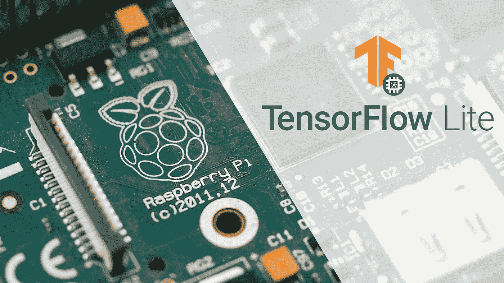
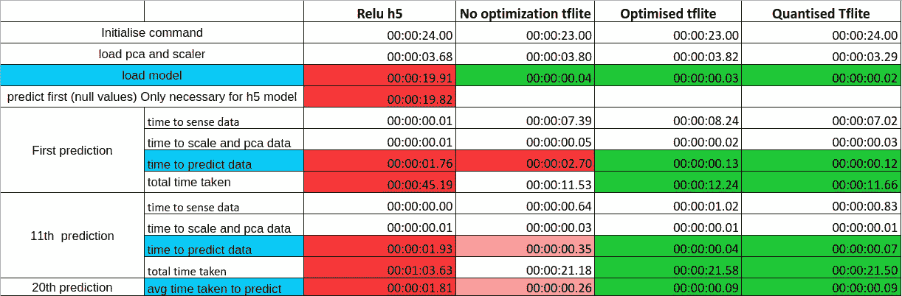
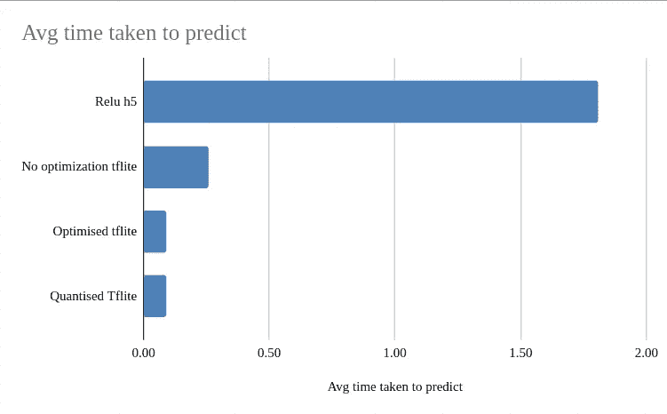

# 为 Raspberry Pi3+/4 安装 tensor flow 2 . 3 . 0(Debian Buster)

> 原文：<https://itnext.io/installing-tensorflow-2-3-0-for-raspberry-pi3-4-debian-buster-11447cb31fc4?source=collection_archive---------0----------------------->

## 只有重要的东西。



# 介绍

随着最近发布的用于 Raspberry pi 的 TensorFlow lite，以前在嵌入式系统上缓慢的模型预测率得到了极大的改善。像 Raspberry Pi 这样的小型单板计算机作为用于机器学习的设备已经变得更加可行。尤其是当与后量化和模型修剪等模型压缩技术结合使用时，情况更是如此。当我试图将 TF 2 安装到我的覆盆子上时，我遇到了无数的陷阱，我预见到可能会有很多陷阱，因此我写了这篇文章来提供一个清晰可行的步骤指南。

更多信息:[https://www . tensor flow . org/lite/performance/post _ training _ quantization](https://www.tensorflow.org/lite/performance/post_training_quantization)

TLDR:阅读**开始**。

# 先决条件

树莓 Pi 型号:树莓 3/4(在 3B 上测试)
树莓版本:Debian Buster(Debian 10)
Python 版本:3.7(默认 python 3.7.3 带有清新的树莓镜像)

安装尝试:
Debian Stretch 9
python 2.7(无法安装 TF2)
python 3.5.3(失败)
python 3.6(错误:**tensor flow . python . platform**未找到)
python 3.7(**GLIBC _ 2.27**未找到)

[Tensorflow](https://medium.com/@cawin.chan/installing-tensorflow-2-3-0-for-raspberry-pi3-4-debian-buster-11447cb31fc4) 2 要求 GNU C 库(也称为 **GLIBC** )
为≥ **2.27** 然而 Debian Stretch 的最高 **GLIBC** 版本为 **2.24** 。因此，Debian Stretch 被发现是不可用的。
了解更多信息:[https://github.com/PINTO0309/Tensorflow-bin/#usage:](https://github.com/PINTO0309/Tensorflow-bin/#usage:)

**判决:Debian Stretch 无法支持 Tensorflow 2。**

# 开始做事:

如果你已经有一个可启动的 Raspberry Pi 操作系统，你可以跳过这一步。

从[https://www.raspberrypi.org/downloads/](https://www.raspberrypi.org/downloads/)下载 Raspberry Pi Imager，用推荐的 Raspberry Pi 操作系统(32 位)(≥16GB)闪存你的 SD 卡。

注意:截至 **06/09/20** ，**不使用 Anaconda** ，因为 Anaconda 的 python 版本最新版本是 3.6.3，遇到“错误:**tensor flow . python . platform**未找到”的情况。

**第 0 步:检查树莓 Pi (GNU/Linux 10 (Buster))、Python 和 Pip 版本。**

```
cat /etc/os-release 
python3 --version
pip3 --version 
```

第一步:确保所有东西都更新了。

```
sudo apt update
sudo apt dist-upgrade
sudo apt clean
```

**第二步:升级 pip ( > 19.0)，setuptools (≥41.0.0)，安装 Tensorflow 2 依赖项。**

```
sudo pip install --upgrade pip
sudo pip3 install --upgrade setuptools
sudo pip3 install numpy==1.19.0sudo apt-get install -y libhdf5-dev libc-ares-dev libeigen3-dev gcc gfortran python-dev libgfortran5 libatlas3-base libatlas-base-dev libopenblas-dev libopenblas-base libblas-dev liblapack-dev cython libatlas-base-dev openmpi-bin libopenmpi-dev python3-devsudo pip3 install keras_applications==1.0.8 --no-deps
sudo pip3 install keras_preprocessing==1.1.0 --no-deps
sudo pip3 install h5py==2.9.0
sudo pip3 install pybind11pip3 install -U --user six wheel mock
```

**第三步:安装 Tensorflow 2***

```
$ wget "https://raw.githubusercontent.com/PINTO0309/Tensorflow-bin/master/tensorflow-2.3.0-cp37-none-linux_armv7l_download.sh"$ sudo chmod +x tensorflow-2.3.0-cp37-none-linux_armv7l_download.sh$ ./tensorflow-2.3.0-cp37-none-linux_armv7l_download.sh$ sudo pip3 uninstall tensorflow$ sudo -H pip3 install tensorflow-2.3.0-cp37-none-linux_armv7l.whl
```

其他版本或架构可以在这个链接找到(只需用想要的 TF 2 版本替换 2.3.0 即可):[https://github.com/PINTO0309/Tensorflow-bin/#usage](https://github.com/PINTO0309/Tensorflow-bin/#usage):

**步骤 4:检查 TF 2 是否安装正确**

```
$ python3 
>>> import tensorflow
>>> tensorflow.__version__
'2.3.0'
>>> exit()
```

**步骤 5:从保存的模型创建一个 TF Lite 模型文件**

```
import os
import tempfile

from matplotlib import pyplot as plt
import numpy as np
import tensorflow as tf

tmpdir = tempfile.mkdtemp()
#Train model here....saved_model_dir = os.path.join(tmpdir, "path")
tf.saved_model.save(trained_model, saved_model_dir)

converter = tf.lite.TFLiteConverter.from_saved_model(saved_model_dir)
tflite_model = converter.convert()
open("converted_model.tflite", "wb").write(tflite_model)
```

**步骤 6:创建 TF 模型文件后测试 TF Lite】**

```
import numpy as np
import tensorflow as tf# Load the TFLite model and allocate tensors.
interpreter = tf.lite.Interpreter(model_path="converted_model.tflite")
interpreter.allocate_tensors()

# Get input and output tensors.
input_details = interpreter.get_input_details()
output_details = interpreter.get_output_details()

# Test the model on random input data.
input_shape = input_details[0]['shape']
input_data = np.array(np.random.random_sample(input_shape), dtype=np.float32)
interpreter.set_tensor(input_details[0]['index'], input_data)

interpreter.invoke()

# The function `get_tensor()` returns a copy of the tensor data.
# Use `tensor()` in order to get a pointer to the tensor.
output_data = interpreter.get_tensor(output_details[0]['index'])
print(output_data)
```

***安装 Tensorflow 的注意事项:**
从 **06/09/20 起，**为了简单地安装 tensorflow 2.3.0，我们将使用来自胜矢兵库(PINTO0309)的预构建二进制文件，后者是一家著名的英特尔软件创新公司。因此，这不是正式发布的 Tensorflow 2.3.0 **。**请务必始终仔细检查[https://raw . githubusercontent . com/pinto 0309/tensor flow-bin/master/tensor flow-2 . 3 . 0-cp37-none-Linux _ arm v7l _ download . sh](https://raw.githubusercontent.com/PINTO0309/Tensorflow-bin/master/tensorflow-2.3.0-cp37-none-linux_armv7l_download.sh)链接。

```
#!/bin/bashcurl -sc /tmp/cookie "https://drive.google.com/uc?export=download&id=11iycpKFZc267gryq06sdV1zrz0St_Kox" > /dev/null
CODE="$(awk '/_warning_/ {print $NF}' /tmp/cookie)"
curl -Lb /tmp/cookie "https://drive.google.com/uc?export=download&confirm=${CODE}&id=11iycpKFZc267gryq06sdV1zrz0St_Kox" -o tensorflow-2.3.0-cp37-none-linux_armv7l.whl
echo Download finished.
```

如你所见，这里有谷歌驱动下载的链接，当你从未知来源下载时，一定要小心。

# 为什么选择 TFlite 型号而不是传统的 h5 型号？



总结 5 次不同运行的平均结果



20 次预测后平均预测时间的比较

我们看到 TensorFlow Lite 不仅大大提高了我们的预测速度，而且与我们的基准模型(Relu h5)相比，它还提高了模型的加载速度。这非常适合计算资源有限的设备，比如我们的 raspberry pi，甚至可能是微控制器。

尽管在我的项目和 TensorFlow 的测试中发现 TensorFlow Lite 模型转换对准确性的影响可以忽略不计，但每个项目都应该在自己的情况下检查转换和压缩的效果。
链接 TensorFlow 的 TF Lite vs 原模型性能:
[https://www . tensor flow . org/Lite/performance/model _ optimization](https://www.tensorflow.org/lite/performance/model_optimization)

就这样，我们结束了！希望你们不要经历和我一样的痛苦！感谢那些帮助我创建这个步骤指南的人，你们的工作对我来说是非常宝贵的。

非常感谢 [Chitrung](https://medium.com/u/be237ef77756?source=post_page-----11447cb31fc4--------------------------------) 的指导。【https://www.linkedin.com/in/cindy-yu-61a8a01ab/】也要感谢我出色的平面设计师 Cindy Yu

支持我的工作，看看吧！

[](https://cawin-chan.medium.com/membership) [## 通过我的推荐链接加入媒体-陈嘉文

### 作为一个媒体会员，你的会员费的一部分会给你阅读的作家，你可以完全接触到每一个故事…

cawin-chan.medium.com](https://cawin-chan.medium.com/membership) 

**推荐人:** [*https://github.com/PINTO0309/Tensorflow-bin/#usage*](https://github.com/PINTO0309/Tensorflow-bin/#usage)*:* [*https://www.tensorflow.org/guide/saved_model*](https://www.tensorflow.org/guide/saved_model)[*https://www.tensorflow.org/lite/guide/inference*](https://www.tensorflow.org/lite/guide/inference)

**图片来源:**
[*https://www . tensor flow . org/site-assets/images/project-logos/tensor flow-lite-logo-social . pn*](https://www.tensorflow.org/site-assets/images/project-logos/tensorflow-lite-logo-social.png)*g*