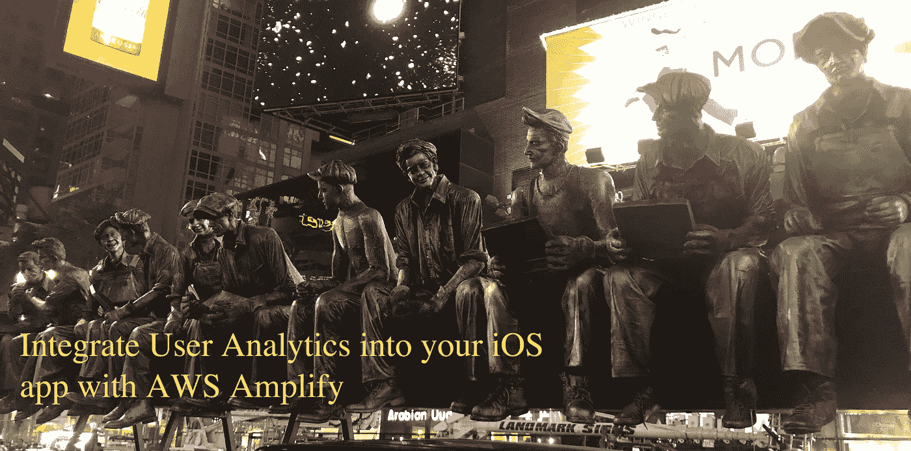

# 使用 AWS Amplify 将分析集成到您的 iOS Swift 应用程序中

> 原文：<https://itnext.io/integrate-analytics-into-your-ios-swift-applications-with-aws-amplify-20d31fe0a20e?source=collection_archive---------1----------------------->



时代广场拍摄的移动广告牌

分析不再是移动开发者的选择——如果你想让你的应用成功，分析是必须的。

分析在移动应用增长和成功的两个最重要领域发挥了巨大作用:**获取**和**保持**。获取 iOS 客户成本高昂。一旦你赢得了客户，留住客户的努力就必须开始。

> 要留住 iOS 客户，你需要了解并吸引他们。了解客户细分和行为是定义正确客户体验的关键。

在这篇文章(第 1 篇，共 3 篇)中，我将带领您收集用户统计数据和应用程序会话活动，以更好地了解客户平台和行为。在下面的文章中，我们将根据我们将要收集的行为和人口统计数据，探索客户细分和信息渠道，以吸引这些客户。

## **工作原理**

我们将从现有的离线应用程序开始，然后使用[**AWS Amplify**CLI](https://aws-amplify.github.io/media/get_started?utm_source=da&utm_medium=blog&utm_campaign=denhills&utm_term=ios_native)对其进行云支持，该应用程序提供云资源并配置 iOS 客户端以将分析事件发送到云。

## 从本地开始

您不需要在云中创建任何服务来开始分析。我首先为分析定义了一个协议(Swift 代表“接口”):

下面是一个 LocalAnalyticsService 类实现，它采用并符合上面的 AnalyticsService 协议:

在我可以使用这个分析模块之前，最后一步是创建一个服务实例。在这个例子中，我使用`AppDelegate.swift`文件来实例化一个本地分析服务:

现在我可以在任何我想记录的地方记录事件。首先，获取一个对服务的引用(通常在`init()`或`viewDidLoad()`中)，然后调用`recordEvent()`函数来记录一个事件:

当你运行你的应用程序时，你会看到在 Xcode 的调试日志中打印出来的分析事件。请记住，我们仍然是本地的，但这样做的好处是，您可以轻松地用真正的分析服务替换实现，而无需更改任何 UI 代码！现在，让我们从本地分析转向亚马逊精确分析。

## 使用 Amazon Pinpoint 添加分析服务

F 首先，[安装并配置 AWS Amplify CLI](https://aws-amplify.github.io/media/get_started?utm_source=da&utm_medium=blog&utm_campaign=denhills&utm_term=ios_native) 。AWS Amplify 网站上有详细的说明和视频，可以帮助您开始使用。

一旦安装并配置了 Amplify CLI，打开一个终端到您的 iOS 项目目录(带有`Project.xcodeproj`文件的文件夹)。

首先，初始化项目:

```
$ amplify init
```

我们将指导您完成整个过程，包括命名项目、确认您正在开发一个 iOS 项目，以及选择合适的凭证来将资源部署到 AWS。这个命令将创建一个/ `amplify`目录来存储后端的细节。现在，让我们添加一个用于存储分析的 Amazon Pinpoint 资源:

```
$ amplify add analytics
```

您可以按 enter 键继续完成该过程。这个应用程序的所有默认设置都很好。最后，让我们部署资源:

```
$ amplify push
```

将要求您确认部署，然后创建资源。

刚刚发生了什么？

为了使我们的应用程序能够将分析数据发送到云中，我们首先使用 AWS Amplify CLI 初始化一个支持云的 iOS 项目。然后，CLI 创建了一个新的 Amazon Pinpoint 应用程序，并为您的 iOS 应用程序提供了发送分析事件的适当权限。然后，CLI 用 Amazon Pinpoint 端点和区域创建了一个 *awsconfiguration.json* 文件。下面我将向您展示如何将这个配置文件添加到 Xcode 项目中。

## 将 iOS 版 AWS SDK 添加到您的项目中

iOS 版 AWS SDK 包含连接 AWS 云资源所需的所有代码，包括 Amazon Pinpoint。我使用 [Cocoapods](https://cocoapods.org/) 来加载库依赖项。首先，为您的项目初始化 Cocoapods:

```
$ pod init
```

这将产生一个空白的`Podfile`。编辑文件以包含 Amazon Pinpoint 库并保存。注:确保目标名称与您的 iOS 应用程序名称匹配:

```
$ pod install --repo-update
```

现在关闭 Xcode 并打开项目的工作空间版本:

```
$ open <yourprojectname>.xcworkspace
```

快速构建以编译新的库。

## 集成 awsconfiguration.json 文件

当使用 AWS Amplify CLI 提供后端资源时，它会在 iOS 项目的根目录下生成一个名为`awsconfiguration.json`的文件。此文件包含您可通过应用程序访问的资源的描述，并且在 CLI 添加、更新或删除资源时会与您的项目同步更新。这是使用 Amplify CLI 为您的项目提供资源的最大好处之一。

您只需将`awsconfiguration.json`文件添加到 Xcode 项目中一次。您可以通过将它拖到 Xcode 项目管理器中的 Finder 来完成此操作。

如果要复制文件，系统会提示您。**取消勾选复制项目框**。当情况发生变化时，AWS Amplify CLI 会更新该文件。如果您选中目标框，那么您的项目在被复制时可能不会收到更新。如果取消选中该框，每当您通过 Amplify CLI 修改项目资源时，AWS Amplify CLI 都会更新该文件。

## 创建新的 AWSAnalyticsService

现在，我们可以创建一个新的分析云服务来取代我们的本地分析服务。

将此类添加到您的 Xcode 项目:

`init()`方法使用`awsconfiguration.json`文件中定义的常量初始化 Amazon Pinpoint 的 AWS SDK。初始化 Pinpoint 客户端会触发 SDK 自动开始跟踪应用会话数据和用户统计数据，而无需任何开发人员代码。`recordEvent()`方法是发送定制事件给 Pinpoint 的实现。您可以在 Pinpoint 控制台的**分析** > **事件**选项卡下查看这些聚合事件。

剩下的就是用 AWS analyticsService 替换掉`AppDelegate.swift`文件中的本地`analyticsService`。

将`LocalAnalyticsService()`改为`AWSAnalyticsService()`。

## 在 Amazon Pinpoint 控制台中查看分析

一旦你运行你的应用程序，并做一些事情来生成用户分析和自定义事件流量，你可以使用 Amplify CLI 打开 Pinpoint 控制台:

```
$ amplify analytics console
```

可能会要求您登录控制台—只需使用您的 AWS 凭据。您将直接进入 Pinpoint 应用程序的分析选项卡，并可以开始浏览图表。

## 记录自定义事件

默认情况下，Amazon Pinpoint SDK 自动收集用户人口统计数据和应用程序会话活动，无需任何额外代码。然而，如果您想要收集非默认事件，通常会添加特定于应用程序的自定义分析事件，如里程碑、游戏级别成就或[收入事件](https://aws.github.io/aws-sdk-ios/docs/reference/Classes/AWSPinpointAnalyticsClient.html#//api/name/createVirtualMonetizationEventWithProductId:withItemPrice:withQuantity:withCurrency:)。如果您已经实现了应用内购买，那么您可能希望在协议中添加一个`recordRevenue()`函数(以及具体的实现)。这对于查看你通过应用内购买赚了多少钱的实时更新(在 Pinpoint 控制台上)非常有用。

您还可以使用辅助信息来扩充用户人口统计事件，如当前已验证的用户、设备位置和其他自定义字段。我们现在收集的越多，我们的用户群就越有利于有针对性的参与。所以，花点时间想想你想收集什么，然后尝试一下。在后面的文章中，当我们讨论通过推送通知、sms 和电子邮件等沟通渠道进行有针对性的互动时，我们将使用这些客户群。