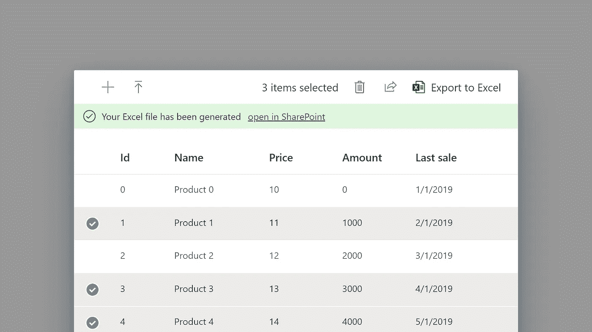

# 使用 Microsoft Graph 将 Excel 集成到 React 应用程序中

> 原文：<https://itnext.io/integrate-excel-into-your-react-application-with-microsoft-graph-94e02f71d847?source=collection_archive---------0----------------------->

## 从您的应用程序创建和编辑在线 Excel 文件

我们将使用 Excel 导出功能创建的示例应用程序

微软的 Excel 是商业软件有史以来最大的应用之一。即使在今天，在一个有“大数据”、“数据湖”和更多时髦词汇的世界里，许多公司仍然主要使用 Excel 进行管理和商业智能。即使像 Power BI 这样的工具可用，Excel 在生成和处理原始数据方面仍然是一个强大的工具。正是由于这个原因，Excel 导出是企业软件系统中的一个常见功能，因为它提供了一个从 it 到您可能想对应用程序中的数据做的任何事情的网关。

然而，Excel 文件的生成总是相对复杂，许多开发人员在他们的应用程序中坚持使用简单得多的 csv 文件。但是在这个“一切皆有可能”的时代，Excel 也只是你正在使用的任何系统的另一个 API。在本文中，我将向您展示如何使用 Microsoft Graph API 处理 OneDrive / SharePoint 中的 Excel 文件。

# 我们的示例应用程序

我们将创建的应用程序有一个产品列表，可以选择多个项目并将它们导出到一个在线 Excel 文件中。主要组件将是一个流畅的 UI `[DetailList](https://developer.microsoft.com/en-us/fluentui#/controls/web/detailslist/basic)`，它已经内置了一个非常复杂的多选功能。标题图片的完整组件可以在 GitHub 的[这里找到。](https://gist.github.com/WimJongeneel/7d213259b4164be1affc39ac4bf1fb21)

我们将使用的基本 React 组件

`getAccessToken`属性的值来自微软身份实现。如果您从未使用 Microsoft Identity 设置过 SSO，请务必查看相关的[文档](https://docs.microsoft.com/en-us/graph/tutorials/react)。这将为您提供一个获取访问令牌的函数，您可以使用这个组件。

# 创建一个 Excel 文件

创建导出功能的第一步是在当前用户的 OneDrive 文件夹中创建一个空的 Excel 文件。理论上，我们可以向`/me/drive/root/children`端点发送一个 POST 来创建一个新文件。虽然这确实创建了一个文件，但不幸的是，对于 Excel 文件，它创建了一个无效的 Excel 文件(对于其他 office 文件，这确实有效)。

创建文件的 HTTP 请求，只要它不是。xlsx 文件

另一种可行的方法是将一个空的 Excel 文档上传到 OneDrive 中的一个路径，然后从那里开始工作。这方面的代码可以在下面找到，它假设您的项目拥有一个`empty.xlsx`文件，可以用作创建新 Excel 文件的模板。

在 OneDrive 上创建 Excel 文件

# 向 Excel 文件添加数据

现在我们已经有了一个 Excel 文件，我们需要开始向其中添加数据。为此，我们可以用我们的数据向工作表中的单元格区域发送一个`PATCH`请求。为此，我们需要采取一些步骤来确保我们的 JavaScript 对象被 Excel 正确解释:

第一步是编写一个函数来计算我们的数据将占用的 Excel 范围。这由左上角和右下角的坐标定义，例如`A1:F7`。左上角很简单，这将始终是`A1`单元格。然而，右下角的坐标取决于我们数据的大小。Y 分量是我们要插入的行数组的长度。对于 X 组件，这是单个对象的键的计数(假设我们所有的行都是相同的类型)，转换成一个字母。

一个简单(有点幼稚)的方法来获取 Excel 对象数组的范围

在将数据发送到 Excel 之前，我们需要从数据中提取的第二样东西是*数字格式*。数字格式告诉 Excel 如何将数值解释为其内部类型系统。从技术上讲，这是一个可选的东西，但是不提供数字格式意味着，例如，整数“1”在 Excel 中将作为日期 1/1/1900 结束。显然不是我们想要的，所以我们必须确保向 Excel 提供一些关于我们所有值的提示。根据我的经验，你只需要两种格式:`m/d/yyyy`表示日期，而`General`表示其他日期。

从对象数组生成数字格式

API 期望的最后一件事是公式，但是这些都可以用于我们的预期目的。只需知道，您还可以用它来添加包含 Excel 公式而不仅仅是固定值的单元格。

用数据的形状创建一个空的公式定义

有了这三样东西，我们就可以将选定的项目发送到我们创建的 Excel 文档中:

将行发送到工作表中的 Excel 区域

# 完成它

为了完成我们的组件，我们必须填充空的`toExcel`函数，并实现带有到生成的 Excel 文件的链接的消息栏。在新的`toExcel`函数中，我们创建了一个 Excel 文件，然后将所有从详细列表中选择的行添加到其中。Excel 文件的创建为我们提供了它在 SharePoint 上的 URL，我们将它保存在状态中以备后用。

“导出到 Excel”按钮的处理程序

通知是 Fluent UI 中的一个`[MessageBar](https://developer.microsoft.com/en-us/fluentui#/controls/web/messagebar)`组件，位于命令栏和细节列表之间。这里我们使用创建文档时保存在状态中的 URL，并允许用户访问我们刚刚创建的文件。

当我们成功地将选择导出到 Excel 时，消息的 JSX 代码

# 结论

消息栏完成后，我们现在有了一个完整的列表组件，可以选择将选择的项目导出到 Excel。当然，这只是一个可能的例子，通过使用本文中的不同函数，您可以将 React 应用程序中的任何数据写入 Excel 工作表。

如果你喜欢这篇文章，你可能也想看看我的另一篇关于在 React 中使用 Microsoft Graph 的文章:

 [## 使用 Microsoft Graph 和 Fluent UI 在 React 中创建 SharePoint 文件选择器

### 让您的 React 应用成为微软 365 生态系统的一部分

itnext.io](/create-a-sharepoint-file-picker-in-react-with-microsoft-graph-and-fluent-ui-8653e3342942)