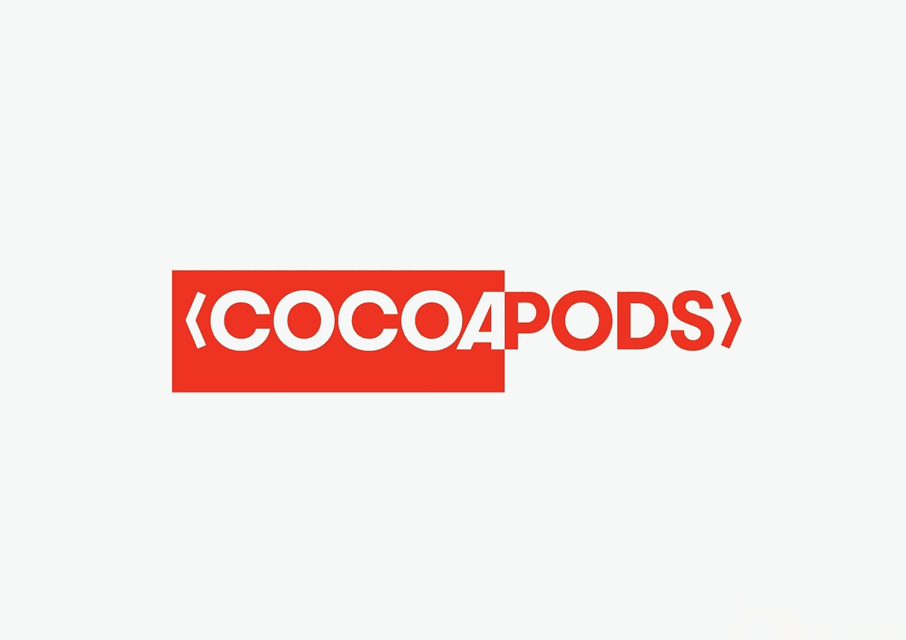

# 用协同吊舱集成颤振模块

> 原文：<https://itnext.io/integrate-flutter-modules-with-cocoapods-a984dc671382?source=collection_archive---------1----------------------->



> 公布 cocoapods 插件:[cocoa pods-embed-flutter](https://github.com/DartBuild/cocoapods-embed-flutter)，提供了一种在`Podfile`中将 flutter 模块声明为目标依赖的方式。

目前，如果你想在现有的 iOS 项目中集成一个 flutter 模块，你可以遵循官方的[指南](https://docs.flutter.dev/development/add-to-app/ios/project-setup)。那么，你问一个单独的插件有什么必要？[cocoa pods-embed-flutter](https://github.com/DartBuild/cocoapods-embed-flutter)解决了官方解决方案的复杂性，同时保持您的`Podfile`非常简单。

你必须确保官方解决方案是在运行`pod install`之前运行`flutter pub get`。如果你的 flutter 模块和你的 iOS 项目不在同一个存储库中，那么你必须深入 git 子模块。

# 解决方案？

如果你对`Gemfile`不熟悉，我强烈建议你去看看 cocopods 的[指南](https://guides.cocoapods.org/using/a-gemfile.html)，它有很深的深度。对于本文的范围，您可以像这样将[cocoa pods-embed-flutter](https://github.com/DartBuild/cocoapods-embed-flutter)声明为您在`Gemfile`中的依赖项:

```
gem 'cocoapods-embed-flutter'
```

并运行`bundle install`。或者，如果你不想使用`Gemfile`(尽管我强烈建议这么做)，你可以使用`sudo gem install cocoapods-embed-flutter`来安装这个插件。

现在你已经设置好了，在你的`Podfile`顶部添加[cocoapods-embed-flutter](https://github.com/DartBuild/cocoapods-embed-flutter)作为插件:

```
plugin 'cocoapods-embed-flutter'
```

在此之后，对于任何目标，您都可以通过用`pub`替换关键字`pod`，使用与 pods 相同的语法声明一个 flutter 模块依赖项。要使用名为`my_cool_module`的颤振模块，请在本地使用:

```
target 'my_app' do
  pub 'my_cool_module', :path => 'path/to/module'
end
```

这里的`:path`可以直接指向`pubspec.yaml`文件或者包含`pubspec.yaml`的目录。如果你的颤振模块与项目文件夹同名，那么你也可以提供你的颤振模块项目的父目录。

现在对于更复杂的场景，flutter 模块可能托管在外部 git 存储库中，您可以使用:

```
target 'my_app' do
  pub 'my_cool_module', :git => 'https://github.com/me/my_cool_module.git', :branch => 'dev'
  pub 'flutter_module', :git => 'https://github.com/me/my_cool_module.git', :tag => '0.7.0'
  pub 'flutter_module', :git => 'https://github.com/me/my_cool_module.git', :commit => '082f8319af'
end
```

从版本`0.6`开始，如果你的 flutter 模块项目不在你的库的根目录，你也可以在你的库中指定相对路径:

```
pub 'flutter_module', :git => 'https://github.com/me/my_cool_module.git', :tag => '0.7.0', :path => 'custom/path
```

您可以非常灵活地在 git 源代码中提供一个分支或标记或特定的提交。在声明了所有的依赖项之后，你可以运行`pod install`，让 cocoapods 为你做所有的工作。如需更详细的示例或工作示例，请查看 GitHub repo 中的[示例](https://github.com/DartBuild/cocoapods-embed-flutter/tree/main/example)应用程序。

# 链接

感谢阅读！希望这对你有所帮助，如果你需要额外的功能或者有一些建议，请加入 GitHub repo。

[dart build/cocoa pods-embed-flutter:cocoa pods 插件，允许将 flutter 模块声明为依赖(github.com)](https://github.com/DartBuild/cocoapods-embed-flutter)