# 将 GitLab 集成到 JetBrains TeamCity CI 中

> 原文：<https://itnext.io/integrate-gitlab-into-jetbrains-teamcity-ci-2d0a44df7a1?source=collection_archive---------2----------------------->

> 我总是努力让这篇文章与 TeamCity 和 GitLab 的最新发布保持同步。(更新于 2019 年 10 月 25 日— GitLab 12.14 和 TeamCity 2019.1.4)

如果你曾经试图将 GitLab 集成到 TeamCity 中，你可能会因为缺少文档和指南而感到困惑。

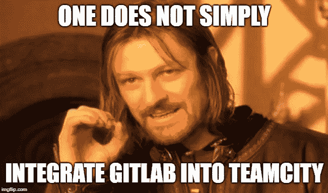

💡希望本文能为您提供进行这种集成的指导。

## 集成要求

1.  在您的项目中具有开发人员角色的 GitLab 用户
2.  拥有私有令牌的 TeamCity 用户

## 步骤 1 —在 GitLab 上启用“JetBrains TeamCity CI”项目服务

这个选项可以在项目*设置- >集成*中找到。您也可以直接重定向到下面的地址来访问 TeamCity 项目服务设置:

**http(s)://git lab _ IP/group/project/services/team city/edit(***eg:*[*http://github.com/foo/bar/settings/s*](http://github.com/foo/bar/settings/integration))*services/team city/edit)*

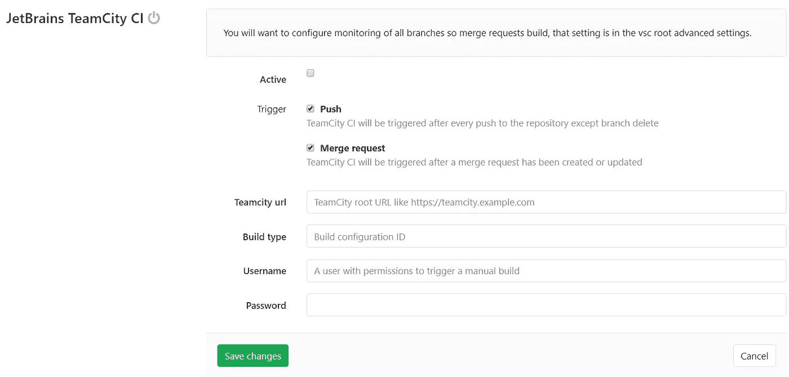

1.  确保**激活**复选框已被选中
2.  **URI 团队城市**例如:[http://IP _ addres _ of _ team _ city _ server](http://ip_addres_of_team_city_server)
3.  **构建类型**是 TeamCity 中您的项目的[构建配置 ID](https://confluence.jetbrains.com/display/TCD18/Build+Configuration+General+Settings)
4.  **用户名**和**密码**与团队城市用户相关

💡设置页面上有两种类型的触发器，您可以选择**推**或**合并请求**中的哪一种。

您可以通过按下`Test settings and save changes,`来检查您的设置。如果一切正常，它应该会被启用，没有任何问题。

📝**重要提示:** TeamCity 表明:

> 您将需要配置对所有分支的监视，以便构建合并请求，该设置位于 vsc root 高级设置中。

要进行更改，请导航到 TeamCity build 编辑页面。(TeamCity home ->点击你的项目 build ->点击 [**编辑配置设置**](https://confluence.jetbrains.com/display/TCD18/Creating+and+Editing+Build+Configurations) **)**

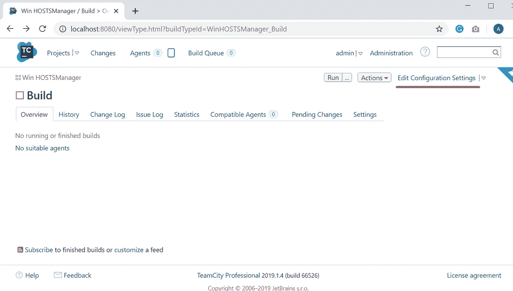

编辑配置设置

## 为您的项目配置 TeamCity [VCS 根分支规范](https://confluence.jetbrains.com/display/TCD18/Working+with+Feature+Branches)

TeamCity 要求了解 GitLab 的每一项变更(如提交、合并请求等)。在[编辑配置设置](https://confluence.jetbrains.com/display/TCD18/Creating+and+Editing+Build+Configurations)中，左侧面板有版本控制设置链接，导航至该链接。

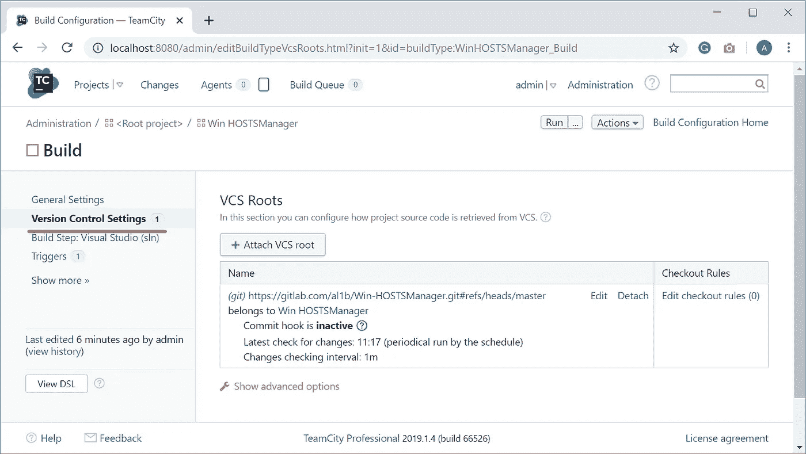

编辑你的 VCS 根:

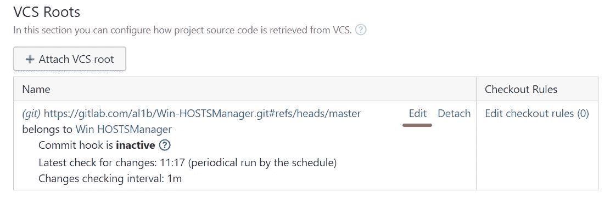

然后找到[分支规范](https://confluence.jetbrains.com/display/TCD18/Working+with+Feature+Branches)(如果看不到，点击显示高级选项)，用下面的值填充并保存更改。

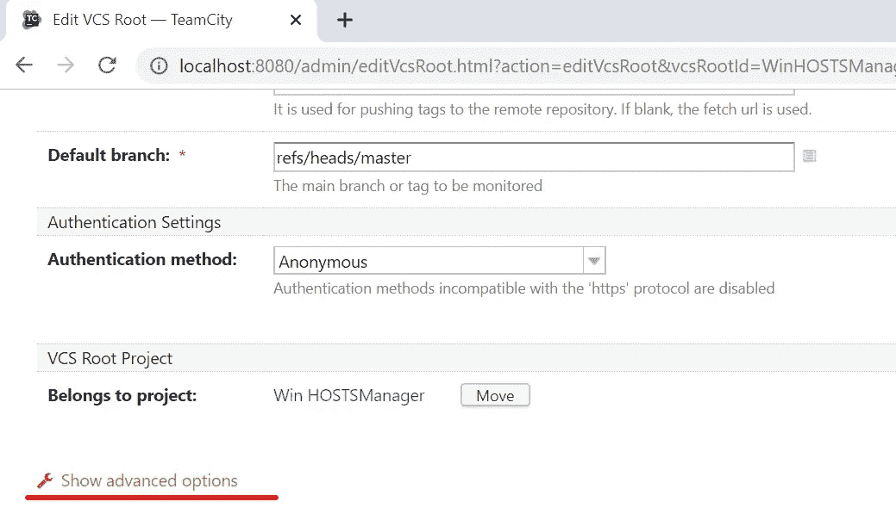

高级选项

然后在分支规范中添加以下规则:

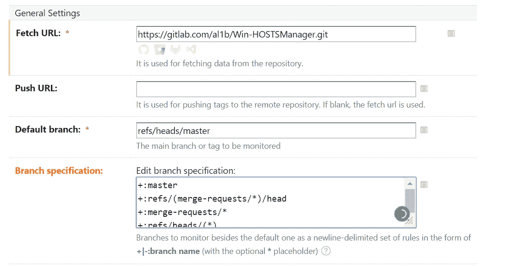

```
+:master
+:refs/(merge-requests/*)/head
+:merge-requests/*
+:refs/heads/(*)
```

## 步骤 2——为您的项目构建配置 [TeamCity 构建特性](https://confluence.jetbrains.com/display/TCD18/Adding+Build+Features)

在**编辑配置页面**上，您可以找到**构建特性**链接，导航至该链接并点击**添加构建特性**。

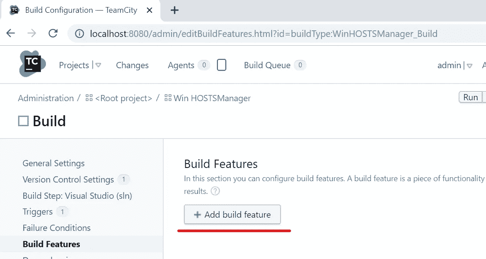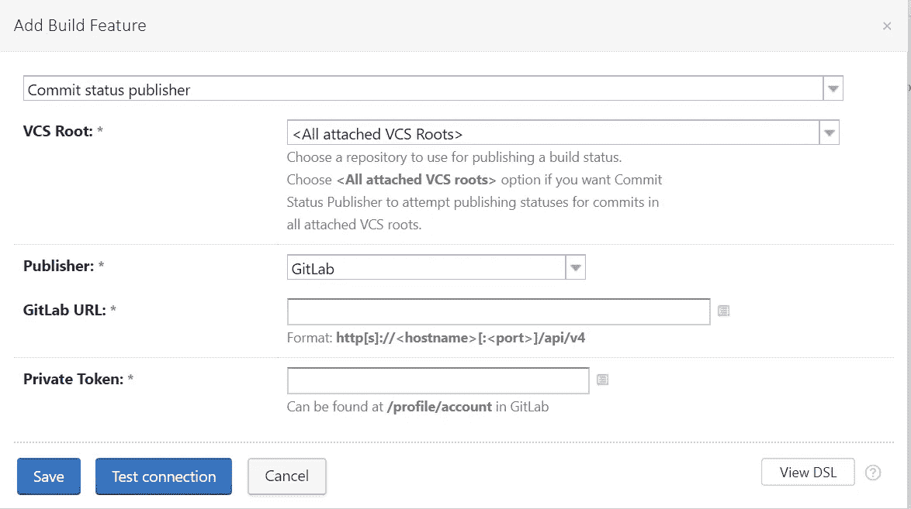

添加构建功能

在第一个组合框中找到 ***提交状态发布者*，**并将 **VCS 根**设置为 ***所有附加的 VCS 根。***

通过将**发布者**更改为 ***GitLab*** 您可以配置 GitLab。 **GitLab URL** 必须类似于下面的链接:

```
http(s)://gitlab_ip/api/v4
```

正如我在故事开始时提到的，你需要一个 GitLab 用户，至少拥有对你的 GitLab 组的**开发者角色**访问权。[为 GitLab 用户生成一个私有令牌](https://docs.gitlab.com/ee/user/profile/personal_access_tokens.html)，并输入到**私有令牌中。**

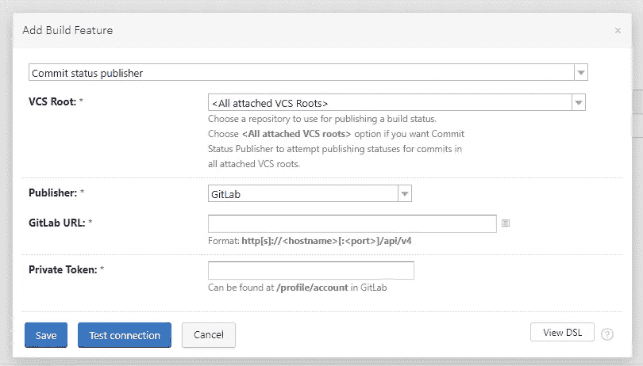

添加构建功能

点击**测试连接**按钮，可以测试设置。保存更改。

## 步骤 3 —在合并请求中测试构建管道

如果一切正常，您可以在每个 pull 请求中看到管道行。

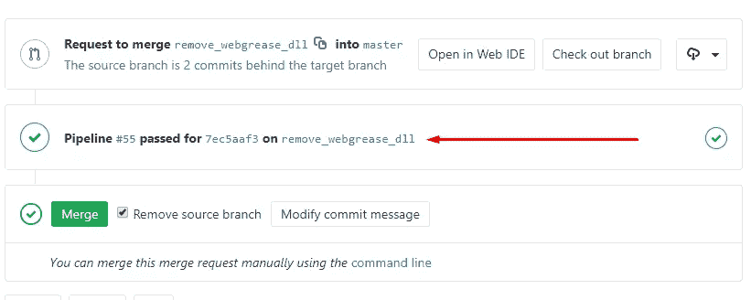

我希望这篇文章能帮助你将 GitLab 集成到 TeamCity CI 中，我在集成过程中遇到了很多问题，不幸的是，没有任何简单的指南。