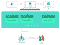
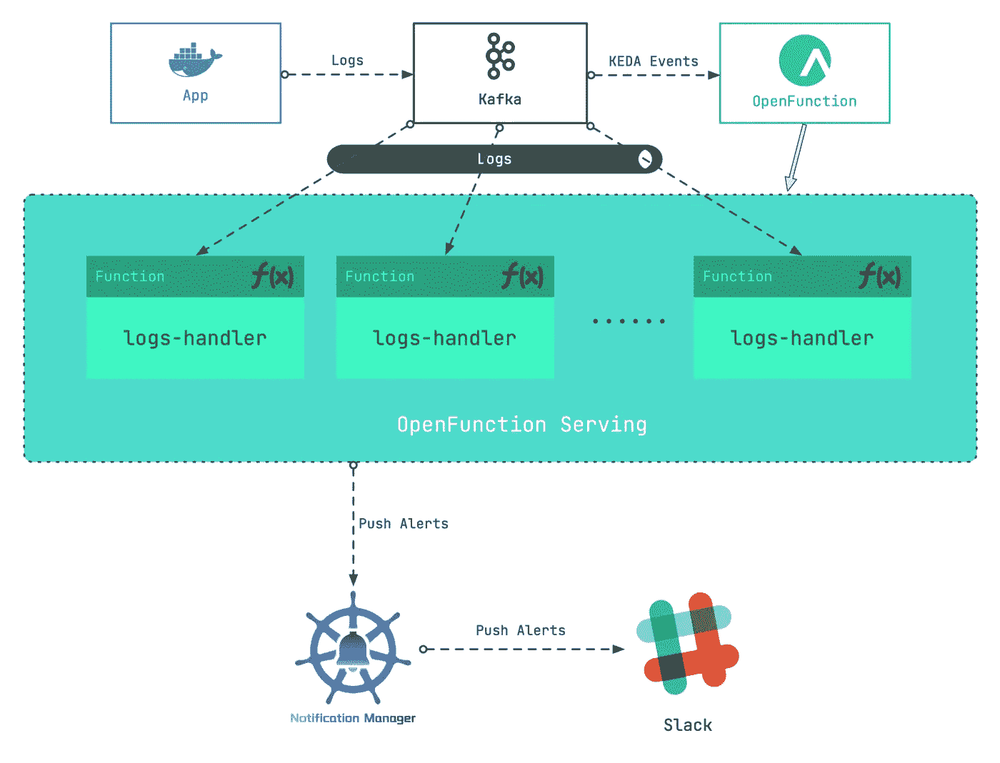
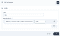
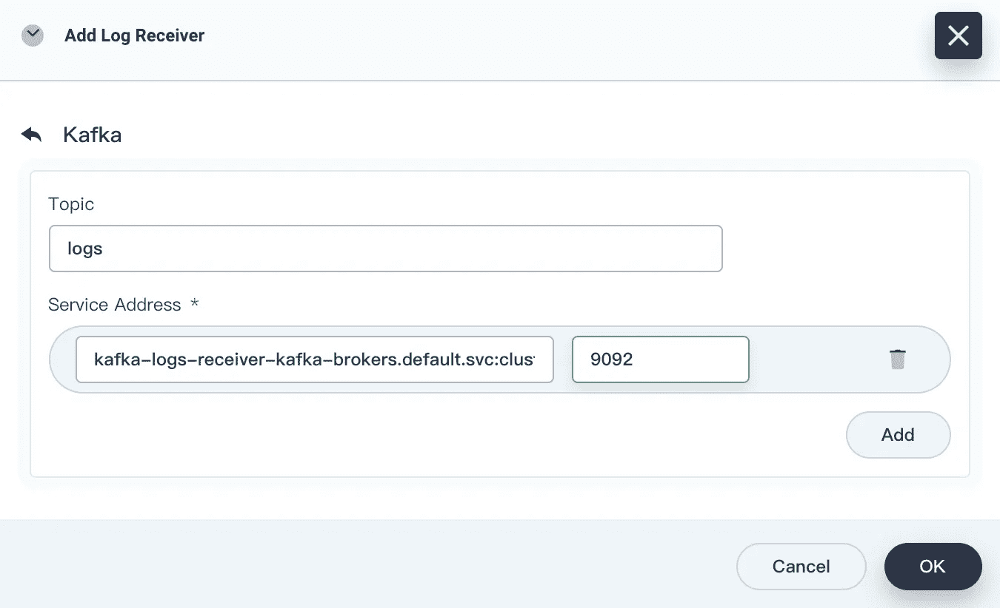
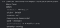
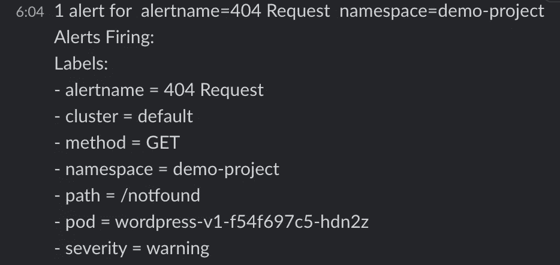

# 集成 Kafka 和 OpenFuction 实现弹性 Kubernetes 日志提醒

> 原文：<https://itnext.io/integrate-kafka-and-openfuction-to-realize-elastic-kubernetes-log-alerts-30c38967b710?source=collection_archive---------1----------------------->

如何处理消息服务器收集的容器日志？您可能会面临一个困境:部署一个专用的日志处理工作负载可能成本很高，而且当日志数量大幅波动时，很难评估所需的备用日志处理工作负载的数量。这篇博客文章提供了无服务器日志处理的想法，在提高灵活性的同时降低了链接成本。

我们的总体设计思想是添加一个 Kafka 服务器作为日志接收器，然后使用 Kafka 服务器的日志输入作为事件来驱动无服务器工作负载处理日志。大致包括以下步骤:

1.  设置 Kafka 服务器作为 Kubernetes 集群的日志接收器。
2.  部署 OpenFunction，为日志处理工作负载提供无服务器功能。
3.  编写日志处理函数来抓取特定的日志以生成警报消息。
4.  配置[通知管理器](https://github.com/kubesphere/notification-manager/)向 Slack 发送警报。



在这个场景中，我们将利用 [OpenFunction](https://github.com/OpenFunction/OpenFunction) 的无服务器功能。

> [*open function*](https://github.com/OpenFunction/OpenFunction)*是由 KubeSphere 社区发起的开源 FaaS(无服务器)项目。它旨在允许用户专注于他们的业务逻辑，而不必担心底层的操作环境和基础设施。目前，该项目提供了以下关键能力:*

*   *从 Dockerfile 或 Buildpacks 构建 OCI 映像。*
*   *使用 Knative Serving 或 OpenFunctionAsync(由 KEDA + Dapr 支持)作为运行时运行无服务器工作负载。*
*   *内置事件驱动框架。*

# 使用卡夫卡作为日志接收器

首先，为 KubeSphere 平台启用**日志**组件(更多信息，请参考[启用可插拔组件](https://kubesphere.io/docs/pluggable-components/))。接下来，我们可以使用 [strimzi-kafka-operator](https://github.com/strimzi/strimzi-kafka-operator) 构建一个最小的 kafka 服务器。

1.  在`default`名称空间中，安装 [strimzi-kafka-operator。](https://github.com/strimzi/strimzi-kafka-operator)

`helm repo add strimzi https://strimzi.io/charts/ helm install kafka-operator -n default strimzi/strimzi-kafka-operator`

2.运行以下命令在`default`名称空间中创建一个 Kafka 集群和一个 Kafka 主题。创建的 Kafka 和 ZooKeeper 集群的存储类型是**短暂的**。在这里，我们用`emptyDir`进行演示。

> *注意，我们已经创建了一个名为* `*logs*` *的主题供后续使用。*

```
cat <<EOF | kubectl apply -f -
apiVersion: kafka.strimzi.io/v1beta2
kind: Kafka
metadata:
  name: kafka-logs-receiver
  namespace: default
spec:
  kafka:
    version: 2.8.0
    replicas: 1
    listeners:
      - name: plain
        port: 9092
        type: internal
        tls: false
      - name: tls
        port: 9093
        type: internal
        tls: true
    config:
      offsets.topic.replication.factor: 1
      transaction.state.log.replication.factor: 1
      transaction.state.log.min.isr: 1
      log.message.format.version: '2.8'
      inter.broker.protocol.version: "2.8"
    storage:
      type: ephemeral
  zookeeper:
    replicas: 1
    storage:
      type: ephemeral
  entityOperator:
    topicOperator: {}
    userOperator: {}
---
apiVersion: kafka.strimzi.io/v1beta1
kind: KafkaTopic
metadata:
  name: logs
  namespace: default
  labels:
    strimzi.io/cluster: kafka-logs-receiver
spec:
  partitions: 10
  replicas: 3
  config:
    retention.ms: 7200000
    segment.bytes: 1073741824
EOF
```

3.运行以下命令检查 Pod 的状态，并等待 Kafka 和 ZooKeeper 运行并启动。

```
$ kubectl get po
NAME                          READY   STATUS        RESTARTS   AGE
kafka-logs-receiver-entity
-operator-568957ff84-nmtlw    3/3     Running       0          8m42s
kafka-logs-receiver-kafka-0   1/1     Running       0          9m13s
kafka-logs-receiver
-zookeeper-0                  1/1     Running       0          9m46s
strimzi-cluster-operator
-687fdd6f77-cwmgm             1/1     Running       0          11m
```

运行以下命令查看 Kafka 集群的元数据:

```
# Starts a utility pod.
$ kubectl run utils --image=arunvelsriram/utils -i --tty --rm
# Checks metadata of the Kafka cluster.
$ kafkacat -L -b kafka-logs-receiver-kafka-brokers:9092
```

将此 Kafka 服务器添加为日志接收器。

1.  以管理员**身份**登录 KubeSphere 的 web 控制台。在左上角选择**平台** > **集群管理**。

> *如果您已经启用了* [*多集群功能*](https://kubesphere.io/docs/multicluster-management/) *，您需要选择一个集群。*

2.在**集群管理**页面中，点击**集群设置**下的**日志收集**。

3.点击**添加日志接收器，**然后点击 **Kafka** 。输入 Kafka 的服务地址和端口号，然后点击**确定**。



4.运行以下命令来验证 Kafka 集群可以从 Fluent Bit 收集日志。

```
# Starts a utility pod.
$ kubectl run utils --image=arunvelsriram/utils -i --tty --rm 
# Checks logs in the `logs` topic
$ kafkacat -C -b kafka-logs-receiver-kafka-0.kafka-logs-receiver-kafka-brokers.default.svc:9092 -t logs
```

# 部署 OpenFunction

根据概述中的设计，我们需要首先部署 OpenFunction。由于 OpenFunction 引用了多个第三方项目，如 Knative、Tekton、ShipWright、Dapr、KEDA 等，如果手动部署会很麻烦。建议您参考[先决条件](https://github.com/OpenFunction/OpenFunction#prerequisites)快速部署 OpenFunction 的依赖项。

> *在命令中，* `*--with-shipwright*` *表示 Shipwright 被部署为该功能的构建驱动程序；* `*--with-openFuncAsync*` *表示将 OpenFuncAsync 运行时部署为函数的加载驱动。当你对 GitHub 和 Google 的访问受限时，可以添加* `*--poor-network*` *参数下载相关组件。*

```
sh hack/deploy.sh --with-shipwright --with-openFuncAsync --poor-network
```

部署 OpenFunction。

> *我们在这里安装最新的稳定版本。或者，您可以使用开发版本。更多信息，请参考* [*安装 OpenFunction*](https://github.com/OpenFunction/OpenFunction#install) *章节。*
> 
> 为了确保 Shipwright 正常工作，我们提供了一个默认的构建策略，您可以运行以下命令来设置该策略。

```
kubectl apply -f [https://raw.githubusercontent.com/OpenFunction/OpenFunction/main/config/strategy/openfunction.yaml](https://raw.githubusercontent.com/OpenFunction/OpenFunction/main/config/strategy/openfunction.yaml)kubectl apply -f [https://github.com/OpenFunction/OpenFunction/releases/download/v0.3.0/bundle.yaml](https://github.com/OpenFunction/OpenFunction/releases/download/v0.3.0/bundle.yaml)
```

# 写一个日志处理函数

在这个例子中，我们安装 WordPress 作为日志生成器。应用程序的工作负载驻留在`demo-project`名称空间中，Pod 的名称是`wordpress-v1-f54f697c5-hdn2z`。

当请求返回 **404** 时，日志内容如下:

```
{"@timestamp":1629856477.226758,"log":"*.*.*.* - - [25/Aug/2021:01:54:36 +0000] \"GET /notfound HTTP/1.1\" 404 49923 \"-\" \"curl/7.58.0\"\n","time":"2021-08-25T01:54:37.226757612Z","kubernetes":{"pod_name":"wordpress-v1-f54f697c5-hdn2z","namespace_name":"demo-project","container_name":"container-nrdsp1","docker_id":"bb7b48e2883be0c05b22c04b1d1573729dd06223ae0b1676e33a4fac655958a5","container_image":"wordpress:4.8-apache"}}
```

下面是我们的需求:当一个请求返回 **404** 时，通知管理器向接收者发送一个通知(根据[配置松弛通知](https://kubesphere.io/docs/cluster-administration/platform-settings/notification-management/configure-slack/)配置一个松弛警报接收者，并记录名称空间、Pod 名称、请求路径、请求方法和其他信息。因此，我们编写一个简单的函数:

> *可以从* [*OpenFunction 上下文规范、*](https://github.com/OpenFunction/functions-framework/blob/main/docs/OpenFunction-context-specs.md) *学习如何使用* `*openfunction-context*` *，这是 OpenFunction 提供的一个编写函数的工具库。您可以从* [*OpenFunction 示例中了解更多关于 OpenFunction 函数的信息。*](https://github.com/OpenFunction/samples)

```
package logshandlerimport (
	"encoding/json"
	"fmt"
	"log"
	"regexp"
	"time"	ofctx "github.com/OpenFunction/functions-framework-go/openfunction-context"
	alert "github.com/prometheus/alertmanager/template"
)const (
	HTTPCodeNotFound = "404"
	Namespace        = "demo-project"
	PodName          = "wordpress-v1-[A-Za-z0-9]{9}-[A-Za-z0-9]{5}"
	AlertName        = "404 Request"
	Severity         = "warning"
)// The ctx parameter of the LogHandler function provides a context handle for user functions in the cluster. For example, ctx.SendTo is used to send data to a specified destination.
// The in parameter in the LogsHandle function is used to pass byte data (if any) from the input to the function.
func LogsHandler(ctx *ofctx.OpenFunctionContext, in []byte) int {
	content := string(in)
	// We set three regular expressions here for matching the HTTP status code, resource namespace, and Pod name of resources, respectively.
	matchHTTPCode, _ := regexp.MatchString(fmt.Sprintf(" %s ", HTTPCodeNotFound), content)
	matchNamespace, _ := regexp.MatchString(fmt.Sprintf("namespace_name\":\"%s", Namespace), content)
	matchPodName := regexp.MustCompile(fmt.Sprintf(`(%s)`, PodName)).FindStringSubmatch(content)	if matchHTTPCode && matchNamespace && matchPodName != nil {
		log.Printf("Match log - Content: %s", content)		// If the input data matches all three regular expressions above, we need to extract some log information to be used in the alert.
		// The alert contains the following information: HTTP method of the 404 request, HTTP path, and Pod name.
		match := regexp.MustCompile(`([A-Z]+) (/\S*) HTTP`).FindStringSubmatch(content)
		if match == nil {
			return 500
		}
		path := match[len(match)-1]
		method := match[len(match)-2]
		podName := matchPodName[len(matchPodName)-1]		// After we collect major information, we can use the data struct of altermanager to compose an alert.
		notify := &alert.Data{
			Receiver:          "notification_manager",
			Status:            "firing",
			Alerts:            alert.Alerts{},
			GroupLabels:       alert.KV{"alertname": AlertName, "namespace": Namespace},
			CommonLabels:      alert.KV{"alertname": AlertName, "namespace": Namespace, "severity": Severity},
			CommonAnnotations: alert.KV{},
			ExternalURL:       "",
		}
		alt := alert.Alert{
			Status: "firing",
			Labels: alert.KV{
				"alertname": AlertName,
				"namespace": Namespace,
				"severity":  Severity,
				"pod":       podName,
				"path":      path,
				"method":    method,
			},
			Annotations:  alert.KV{},
			StartsAt:     time.Now(),
			EndsAt:       time.Time{},
			GeneratorURL: "",
			Fingerprint:  "",
		}
		notify.Alerts = append(notify.Alerts, alt)
		notifyBytes, _ := json.Marshal(notify)		// Use ctx.SendTo to send the content to the "notification-manager" output (you can find its definition in the following logs-handler-function.yaml function configuration file.
		if err := ctx.SendTo(notifyBytes, "notification-manager"); err != nil {
			panic(err)
		}
		log.Printf("Send log to notification manager.")
	}
	return 200
}
```

将该函数上传到代码库中，记录代码库的 **URL 和代码库**中代码的**路径，这些将在**创建函数**步骤中使用。**

> *你可以在* [*OpenFunction 示例*](https://github.com/OpenFunction/samples/tree/main/functions/OpenFuncAsync/logs-handler-function) *中找到这个案例。*

# 创建一个函数

使用 OpenFunction 构建上述函数。首先，设置一个密钥文件`push-secret`来访问映像库(在使用代码构建了 OCI 映像之后，OpenFunction 会将映像上传到映像库，以便后续的加载启动。):

```
REGISTRY_SERVER=https://index.docker.io/v1/ REGISTRY_USER=<your username> REGISTRY_PASSWORD=<your password>
kubectl create secret docker-registry push-secret \
    --docker-server=$REGISTRY_SERVER \
    --docker-username=$REGISTRY_USER \
    --docker-password=$REGISTRY_PASSWORD
```

应用功能配置文件`logs-handler-function.yaml`。

> *功能定义解释了两个关键组件的使用:*
> 
> [*Dapr*](https://dapr.io/) *将复杂的中间件屏蔽于应用程序之外，使得* `*logs-handler*` *函数可以轻松处理 Kafka 事件。*
> 
> [](https://keda.sh/)**通过监控消息服务器中的事件流量来驱动* `*logs-handler*` *功能的启动，并基于 Kafka 消息的消费延迟来动态扩展* `*logs-handler*` *实例。**

```
*apiVersion: core.openfunction.io/v1alpha1
kind: Function
metadata:
  name: logs-handler
spec:
  version: "v1.0.0"
  # Defines the upload path for the built image.
  image: openfunctiondev/logs-async-handler:v1
  imageCredentials:
    name: push-secret
  build:
    builder: openfunctiondev/go115-builder:v0.2.0
    env:
      FUNC_NAME: "LogsHandler"
    # Defines the path of the source code.
    # url specifies the URL of the above-mentioned code repository.
    # sourceSubPath specifies the path of the code in the repository.
    srcRepo:
      url: "https://github.com/OpenFunction/samples.git"
      sourceSubPath: "functions/OpenFuncAsync/logs-handler-function/"
  serving:
    # OpenFuncAsync is an event-driven, asynchronous runtime implemented in OpenFunction by using KEDA_Dapr.
    runtime: "OpenFuncAsync"
    openFuncAsync:
      # This section defines the function input (kafka-receiver) and the output (notification-manager), which correspond to definitions in the components section.
      dapr:
        inputs:
          - name: kafka-receiver
            type: bindings
        outputs:
          - name: notification-manager
            type: bindings
            params:
              operation: "post"
              type: "bindings"
        annotations:
          dapr.io/log-level: "debug"
        # This section defines the above-mentioned input and output (that is, Dapr Components).
        components:
          - name: kafka-receiver
            type: bindings.kafka
            version: v1
            metadata:
              - name: brokers
                value: "kafka-logs-receiver-kafka-brokers:9092"
              - name: authRequired
                value: "false"
              - name: publishTopic
                value: "logs"
              - name: topics
                value: "logs"
              - name: consumerGroup
                value: "logs-handler"
          # This is the URL of KubeSphere notification-manager.
          - name: notification-manager
            type: bindings.http
            version: v1
            metadata:
              - name: url
                value: [http://notification-manager-svc.kubesphere-monitoring-system.svc.cluster.local:19093/api/v2/alerts](http://notification-manager-svc.kubesphere-monitoring-system.svc.cluster.local:19093/api/v2/alerts)
      keda:
        scaledObject:
          pollingInterval: 15
          minReplicaCount: 0
          maxReplicaCount: 10
          cooldownPeriod: 30
          # This section defines the trigger of the function, that is, the log topic of the Kafka server.
          # This section also defines the message lag threshold (the value is 10), which means that when the number of lagged messages exceeds 10, the number of logs-handler instances will automatically scale out.
          triggers:
            - type: kafka
              metadata:
                topic: logs
                bootstrapServers: kafka-logs-receiver-kafka-brokers.default.svc.cluster.local:9092
                consumerGroup: logs-handler
                lagThreshold: "10"*
```

# *展示结果*

*先关闭 Kafka 日志接收器:在**日志收藏**页面，点击 **Kafka** 进入详情页，选择**更多** > **更改状态** > **关闭**。*

*等待一会儿，然后可以观察到`logs-handler`函数的实例数量已经减少到 0。*

*然后将 Kafka 日志接收器的状态设置为**收集**，同时`logs-handler`也开始。*

```
*~# kubectl get po --watch
NAME                           READY STATUS        RESTARTS    AGE
kafka-logs-receiver-entity
-operator-568957ff84-tdrrx     3/3    Running      0          7m27s
kafka-logs-receiver-kafka-0    1/1    Running      0          7m48s
kafka-logs-receiver
-zookeeper-0                   1/1    Running      0          8m12s
logs-handler-serving-kpngc
-v100-zcj4q-5f46996f8c-b9d6f   2/2    Terminating  0          34s
strimzi-cluster-operator
-687fdd6f77-kc8cv              1/1    Running      0          10m
logs-handler-serving-kpngc
-v100-zcj4q-5f46996f8c-b9d6f   2/2    Terminating  0          36s
logs-handler-serving
-kpngc-v100-zcj4q-5f46996f8c
-b9d6f                         0/2    Terminating   0         37s
logs-handler-serving-kpngc
-v100-zcj4q-5f46996f8c-b9d6f   0/2    Terminating   0         38s
logs-handler-serving-kpngc
-v100-zcj4q-5f46996f8c-b9d6f   0/2    Terminating   0         38s
logs-handler-serving-kpngc
-v100-zcj4q-5f46996f8c-9kj2c   0/2    Pending       0         0s
logs-handler-serving-kpngc
-v100-zcj4q-5f46996f8c-9kj2c   0/2    Pending       0         0s
logs-handler-serving-kpngc
-v100-zcj4q-5f46996f8c-9kj2c   0/2    ContainerCreating   0   0s
logs-handler-serving-kpngc
-v100-zcj4q-5f46996f8c-9kj2c   0/2    ContainerCreating   0   2s
logs-handler-serving-kpngc
-v100-zcj4q-5f46996f8c-9kj2c   1/2     Running      0         4s
logs-handler-serving-kpngc
-v100-zcj4q-5f46996f8c-9kj2c   2/2     Running      0         11s*
```

*接下来，初始化一个不存在的 WordPress 应用程序路径请求:*

```
*curl http://<wp-svc-address>/notfound*
```

*你可以看到 Slack 收到了这条消息(当我们正常访问 WordPress 站点时，Slack 不会收到提醒消息)。*

****

# *探索更多可能性*

*我们可以进一步讨论使用同步函数的解决方案:*

*为了正确使用 Knative 服务，我们需要设置其网关的负载平衡器地址。(您可以使用本地地址作为解决方法。)*

```
*# Repalce the following "1.2.3.4" with the actual values.
$ kubectl patch svc -n kourier-system kourier \
-p '{"spec": {"type": "LoadBalancer", "externalIPs": ["1.2.3.4"]}}'$ kubectl patch configmap/config-domain -n knative-serving \
-type merge --patch '{"data":{"1.2.3.4.sslip.io":""}}'*
```

*OpenFunction 通过两种方式驱动`Knative`函数的运行:(1)以异步方式使用 Kafka 服务器；(2)使用自己的事件框架连接 Kafka 服务器，然后以 Sink 模式运行。可以参考 [OpenFunction 样例](https://github.com/OpenFunction/samples/tree/main/functions/Knative/logs-handler-function)中的案例。*

*在这种解决方案中，同步函数的处理速度低于异步函数。我们也可以用 KEDA 来触发 Knative Serving 的并发机制，但是没有异步函数那么方便。(未来我们会对 OpenFunction 事件框架进行优化，弥补同步函数的不足。)*

*可以看出，根据任务场景的不同，不同类型的无服务器功能有其独特的优势。例如，在处理有序的控制流函数时，同步函数比异步函数更好。*

# *摘要*

*无服务器符合我们对业务场景快速拆解和重构的期望。*

*正如您在本例中所看到的，OpenFunction 不仅通过使用无服务器技术增加了日志处理和警报通知链接的灵活性，还使用了一个函数框架来将连接 Kafka 通常所需的复杂设置简化为语义清晰的代码。此外，我们还在不断开发 OpenFunction，以便在后续版本中，组件可以由我们自己的无服务器功能提供支持。*

# *关于 KubeSphere*

*KubeSphere 是一个基于 Kubernetes 的开源容器平台，其核心是应用程序。它提供全栈 It 自动化操作和简化的开发运维工作流。*

*[KubeSphere](https://kubesphere.io/) 已被全球数千家企业采用，如 **Aqara、新浪、奔来、中国太平、华夏银行、国药控股、微众银行、Geko Cloud、VNG 公司、Radore** 。KubeSphere 为运维提供向导界面和各种企业级功能，包括 Kubernetes 资源管理、[、DevOps (CI/CD)](https://kubesphere.io/devops/) 、应用生命周期管理、服务网格、多租户管理、[监控](https://kubesphere.io/observability/)、日志记录、警报、通知、存储和网络管理以及 GPU 支持。有了 KubeSphere，企业能够快速建立一个强大且功能丰富的容器平台。*

*欲了解更多信息，请访问 [https://kubesphere.io](https://kubesphere.io/)*