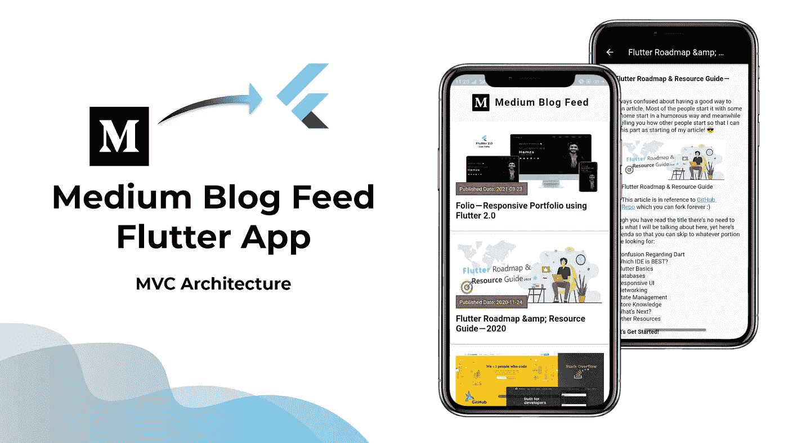
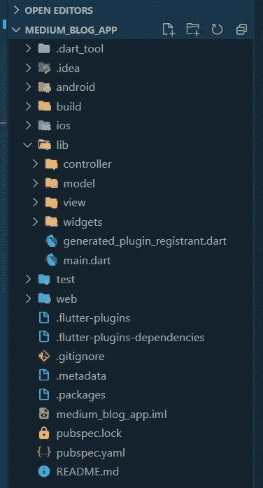
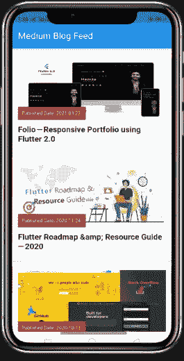
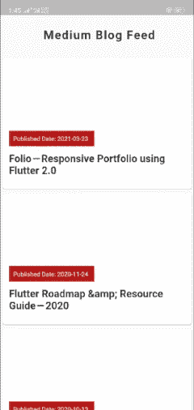

# 在 Flutter 应用程序中集成媒体博客提要— MVC 架构

> 原文：<https://itnext.io/integrate-medium-blog-feed-in-flutter-app-mvc-architecture-3e0b3c90bfa3?source=collection_archive---------2----------------------->

我一直在寻找将我的媒体博客整合到我的[作品集](http://m-hamzashakeel.github.io/)中的资源。但遗憾的是， [Medium 官方 API Doc](https://github.com/Medium/medium-api-docs)没有 GET 文章或博客方法(如果有人发现请通知我)。

无论如何，我发现了这种使用 [RSS2Json](https://rss2json.com/docs) 的新方法，并生成了获取您的**媒体博客提要的端点。**

> 注意:它的中型博客源，意味着当你点击你的[个人资料](https://mhamzadev.medium.com/)时显示的所有博客都可以被获取。



# MVC 结构

让我总结一下我们将要做的事情，因为我们也在使用 MVC 架构。

1.  创建博客的**模型**类
2.  创建一个**控制器**类的博客
3.  创建一个**视图**类来显示 medium feed 博客

因此，项目结构应该是这样的:



项目结构

# 需要插件

我们将需要以下插件:

1.  [**https**](https://pub.dev/packages/http)**:**用于利用 API/端点
2.  [**flutter _ html**](https://pub.dev/packages/flutter_html)**:**用于渲染我们将从 API 响应中得到的 *html* 。

## 让我们开始吧…！

RSS2Json 端点:`https://api.rss2json.com/v1/api.json?rss_url=https://medium.com/feed/@**username**`

将“username”替换为您的中间用户名，例如在我的例子中为@mhamzadev

回应会是这样的😃

```
{
 "status": "ok",
 "feed": {
          "url": "https://medium.com/@**username",
          "**title": "Stories by <Your Name> on Medium",
          "link": "https://medium.com/@**username**?source=rss-198a--2",
          "author": ""
 **"**description": "Stories by <Your Name> on Medium",
          "image": "<profile URL to medium profile>"
  },***These are your Blogs on the Medium Feed***
 "items": [
        {
            "title": DevFolio-Portfolio using Flutter 2.0",
            "pubDate": "2021-03-23 15:38:24",
            "link": "***<URL link to blog on MEDIUM>***",
            "guid": "https://medium.com/p/86ae3e6cce4f",
            "author": "Muhammad Hamza",
            "thumbnail": "***<URL for your Blog Header Image>***",
            "description": "***Actual Description of Blog on Medium***",
            "content": "***Full Blog Content (HTML)***",
            "enclosure": {},
            "categories": [
                 "web-development",
                 "flutter",
                 "portfolio",
                 "dart",
                 "flutter-app-development"
             ]
         },
         {
             Next Blog Object....
         }.....
    ]
}
```

# 模型类

我们这里，我们需要的**物品**实际上基本上就是`**list**`的`**Map<String, dynamic>**`的**的**明白了吗？？！！

因此，我们将有两个基本的模型类。

1.  **博客列表:**从**“项目”**中获取所有博客

2.**博客:**单个博客的模型类

# 控制器类别

它只是一个类，我们在其中调用端点，就这样:)

# 查看类别

这里我们将用户`**FutureBuilder()**` 将我们的`**getAllBlogs()**` 方法作为`Future`传递，并返回我们的`**BlogCard()**` ，这基本上是一个 [**自定义小部件。**](https://gist.github.com/m-hamzashakeel/95113debfc5595107cff42529f05018c)

在这之后，我们的输出将是这样的:)



# 博客详细信息

现在是时候在我们的应用程序中显示我们的博客内容了。但是等等..！！😟API 响应中的内容是一个我们需要渲染的 **HTML** ，否则屏幕上会出现 **< p >和< img >** 等元素。

你猜对了！我们将使用我们的包`**flutter_html**`

所以现在…？？神奇！！


W uhuu！🥳:我们已经将我们的中型博客完全整合到我们的应用程序中。但是如果我们的用户想要查看更多的博客呢？现在我们可以有一个按钮，简单地引导用户到我们的媒体配置文件。为此，我的朋友，我们将用户`**url_launcher**` 包。

所以，我要做的是，我将在我们的博客底部添加一个按钮“阅读更多”,并传递我的中型用户配置文件 URL 作为参数，即`https://mhamzadev/medium.com`

最后，我们的最终产品对用户界面做了很小的改动！！！🌟



最终应用

> 确保在你的 androidmenifest.xml 文件中添加**互联网权限，否则它在发布模式下无法工作**

现在，继续将你的中型博客内容嵌入到你的 Flutter 应用程序中，从现在起，有了 Flutter 2.0，你也可以拥有 Web 应用程序了。这里有一个 [**的例子**](http://m-hamzashakeel.github.io/) **:)** 这个 app 的代码也可以在 [**GitHub**](https://github.com/m-hamzashakeel/Medium-Blog-Feed-Flutter-App) 随意使用！

## 最后！！！😄

```
bool **helped** = true;
if (helped){ 
    **claps(50)👏** } else {
    let me know how to improve :)
}
```

# 谢谢大家和# happyFluttering💙