# 将 React 与 Firebase 集成，并使用 Gitlab + Netlify 进行部署

> 原文：<https://itnext.io/integrate-react-with-firebase-and-deploying-with-gitlab-netlify-8b47654c70bb?source=collection_archive---------1----------------------->

([Revisa este post en Spain ol](https://medium.com/@edades/integrando-react-con-firebase-y-deployando-con-gitlab-netlify-855241f6b9a))

我一直在做一个个人项目，学习和练习一些东西。我将分享一些我在 React 中开始开发这个项目之前必须做的配置。

1-创建 React 应用程序
2-添加 Sass 和 SemanticUI
3-与 Firebase
集成 4-使用 jest/enzyme
配置单元测试 5-将代码上传到 Gitlab
6-使用 Netlify 部署

您可以在这里查看原始存储库(如果您愿意，您也可以投稿):[https://gitlab.com/edades/treasure](https://gitlab.com/edades/treasure)和部署的项目 URL:[https://admiring-perlman-f15f11.netlify.com/](https://admiring-perlman-f15f11.netlify.com/)

# **1-创建 React 应用程序**

首先，我们需要创建 React 应用程序`npx create-react-app treasure`(查看完整文档:[https://github.com/facebook/create-react-app](https://github.com/facebook/create-react-app))。然后，转到项目文件夹，在本地环境中运行我们的项目。

# **2-添加 Sass 和 SemanticUI**

默认情况下，我们的应用程序支持 css，但我们可以给它额外的权力，并使用 Sass。为了管理我们的风格，我们需要安装`npm install node-sass -s`-有了它，我们现在就可以在我们的项目中使用 Sass。
现在，我们需要从**更改样式文件的名称。css** 至**。例如，我们可以用一个通用文件来导入和管理我们所有的样式文件，每个 React 组件都有 Sass。**

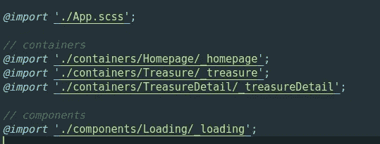

这是我们路由路径中的 index.scss。

现在，让我们来看一点语义反应。
[https://github.com/Semantic-Org/Semantic-UI-React](https://github.com/Semantic-Org/Semantic-UI-React)

`npm install semantic-ui-react -s`

安装了库之后，我们可以很容易地导入和使用任何组件。
这是一个使用加载器组件的示例:

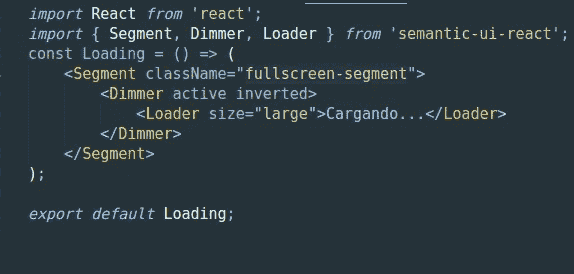

在这里，我创建一个加载组件，我使用 SemanticUI 的 Segment，Dimmer y Loader。此外，我们可以覆盖每个组件的样式，在这种情况下，我向 Segment 组件添加了一个 className 属性，为它们提供特定的样式规则。

# **3- Firebase 集成**

在这种情况下我会试着更实际一点:

*   安装火力基地`npm install firebase -s`
*   (这部分是建议)在 src 中创建一个文件夹，并将其命名为 **config，**然后，在 config 中创建一个文件 **firebase.js** ，这是我们将要初始化 firebase 并放置配置密钥的地方。

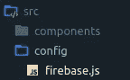

*   配置文件(config/firebase.js):

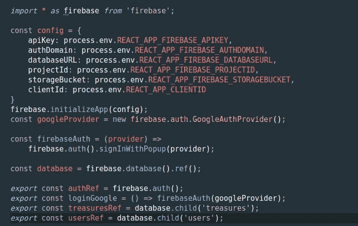

这里我们有对 firebase 库的唯一导入调用。
我们得到了一个包含 firebase 应用程序“秘密”的对象。(为此，我们需要在[https://firebase.google.com](https://firebase.google.com)/中创建一个应用程序，它是免费的)

用`firebase.initializeApp(config)`我们用我们的环境变量初始化应用程序。我们有一个名为。根路径中的 env。
这是文件的一个例子。环境:

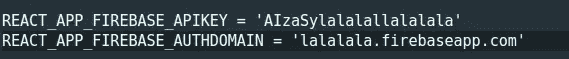

因此，我们可以上传我们的代码，而不会在代码中暴露我们的凭证。

在 firebase 文件配置的最后，我们可以看到我们正在导出一些函数，以便将它们暴露给项目。在本例中，我们引用了 Auth、google login、treasures list 和 users list。

因此，要在我们项目的任何地方使用 firebase，我们可以这样做:

*从导入{ treasuresRef，authRef }../../config/firebase "；*

从这里开始，我们可以使用 firebase 的官方文档在我们的组件中创建函数。

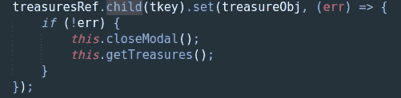

这里我用 id 获取一个宝藏，用一个新的对象进行设置，之后我调用两个函数。

# **4-用 jest/enzyme 配置单元测试**

安装`npm install -s enzyme enzyme-adapter-react-16 react-test-render`

在 src 路径下创建一个文件: **setupTests.js**

```
import { configure } from 'enzyme';
import Adapter from 'enzyme-adapter-react-16';configure({ adapter: new Adapter() });
```

准备好了。现在，我们可以用酶创建我们的单元测试。
这是加载组件的基本示例。

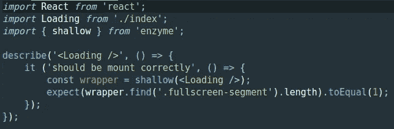

我们可以在终端中检查我们的测试运行 **npm 运行测试**。

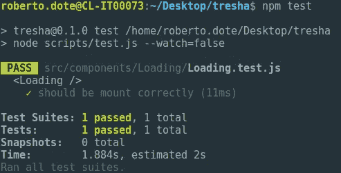

此外，我们可以检查我们的测试的细节，并检查我们的覆盖运行:
`npm run test -- --coverage`

或者也可以修改 package.json y run `npm run coverage`

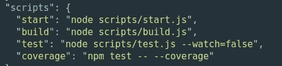

acá creamos el 脚本“覆盖范围”

当我们运行 coverage 命令时，我们会看到类似这样的内容:

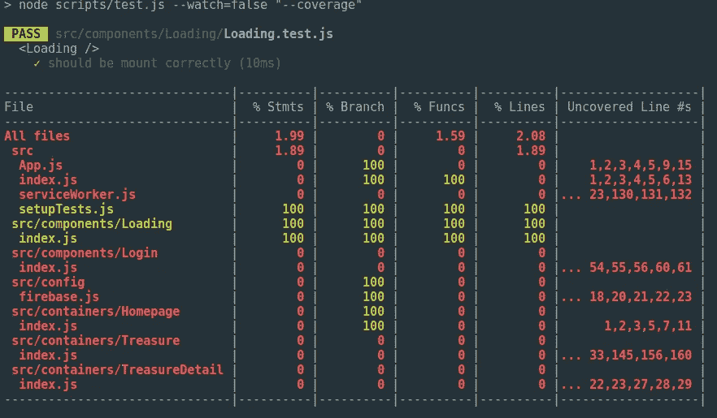

# **5-将我们的项目上传到 Gitlab**

这是如此之快，我们在 Gitlab 中创建一个帐户(免费)，然后点击**新项目**

在**空白项目**选项卡中，我们可以配置项目的名称和隐私。

在这一部分，您的存储库已经准备好了，但是我们需要确保可以使用 git 从我们的终端上传代码。也许你正在 Gitlab 上使用一个新账户，你会在网站顶部看到一个橙色的栏，你需要创建你的 ssh 密钥[https://gitlab.com/profile/keys](https://gitlab.com/profile/keys)

按照这个指令:[https://git lab . com/help/ssh/README # generating-a-new-ssh-key-pair](https://gitlab.com/help/ssh/README#generating-a-new-ssh-key-pair)获取一个新的 ssh 密钥
这基本上是:
ssh-key gen-t ed 25519-C " email @ example . com "
运行这个命令的一些部分(这取决于你的操作系统)

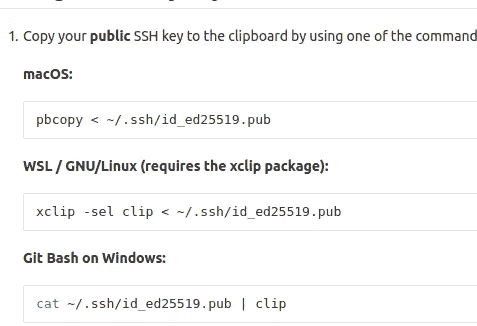

回到 Gitlab 上的 shh keys 屏幕，粘贴你的剪贴板内容(ssh key 从你的终端生成并复制)

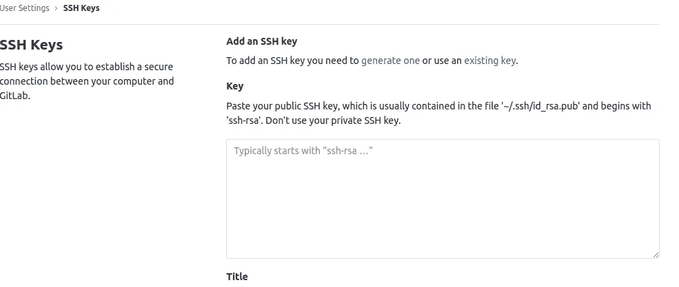

保存这个！你可以在你的终端上检查这是否正常。


如果一切正常，您将看到一条成功消息。

在我的例子中，我注册了一个 google 登录名，所以在屏幕上方我看到了另一个橙色的栏，用于更改/创建我的 google 电子邮件的密码(出于安全原因)。

现在，为了将我们的 react 项目上传到 Gitlab 资源库，我们需要遵循项目主页中的步骤:(与此类似)

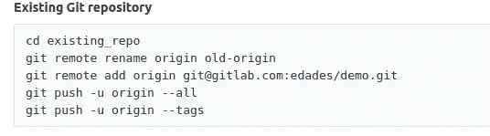

之后，你就可以在 Gitlab 中查看你的项目文件了！:D

# **6-网络部署**

前往[https://www.netlify.com/](https://www.netlify.com/)创建一个免费账户。

然后，点击 Git 中的**新站点**

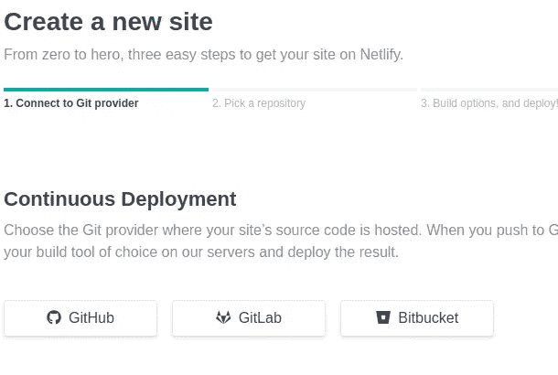

因此，在这个屏幕中选择 Gitlab。然后 Netlify 会请求我们允许进入我们的 Gitlab 库。

在我们的例子中，我们需要为部署 react 应用程序设置以下配置:

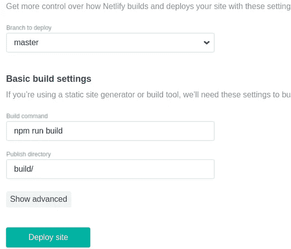

点击部署网站！！

现在我们的应用程序正在部署，之后，我们将在应用程序的仪表板中看到部署过程的状态。

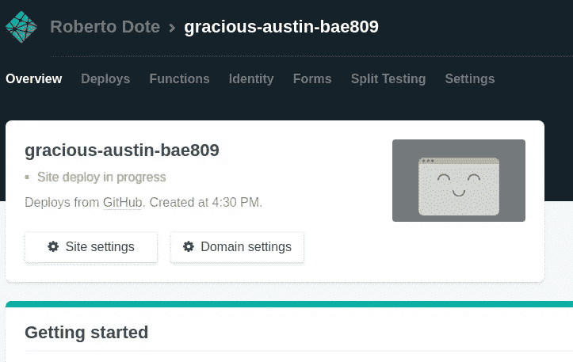

完成后，Netlify 为我们的项目提供了一个随机域。

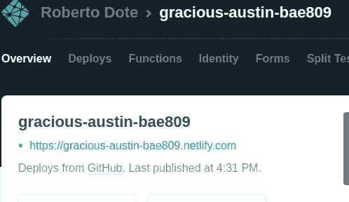

有了这个，我们就准备好了！
该项目与 Gitlab 连接，当我们发出合并请求(或者如果您来自 bitbucket，则发出 pull 请求)并且合并完成时，Netlify 会自动部署更改。

现在，如果您还记得，我们的项目有 firebase 配置的环境变量。此外，我们的应用程序是一个 SPA，因此，我们需要做一些更改:

首先，netlify 有一些管理 SPA 中路由的规则(在我的项目中，我使用 react-router)，所以，当我直接访问任何路由时(例如/treasure)，我会看到一个 404 页面。

[https://www . slight dge coder . com/2018/12/18/page-not-found-on-netlify-with-react-router/](https://www.slightedgecoder.com/2018/12/18/page-not-found-on-netlify-with-react-router/)

您可以通过在公共文件夹中创建一个名为 _redirects 的文件来解决这个问题，该文件的内容为:
/* /index.html 200

你可以查看这个案例的官方文档:[https://www . netlify . com/docs/redirects/# history-pushstate-and-single-page-apps](https://www.netlify.com/docs/redirects/#history-pushstate-and-single-page-apps)

最后一件事是将环境变量添加到网络配置中:

在 netlify 中，转到设置，然后转到构建/部署部分查找“构建环境变量”。这里只需添加我们在。环境本地文件。

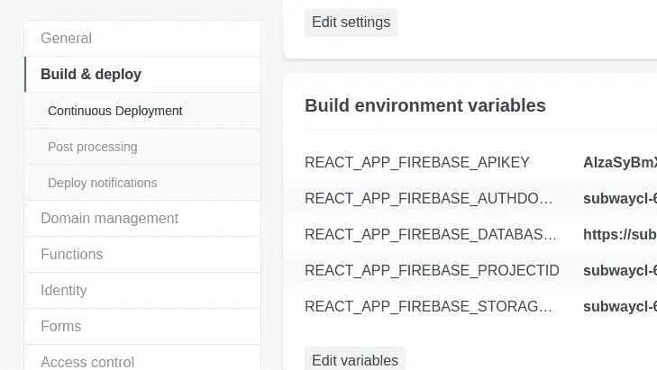

保存它，然后在 Netlify 中重新部署应用程序。
现在检查一下，一切正常！:D

这是一篇非常实用的教程和评论，介绍了如何用 firebase(还有 sass、enzyme)创建 React 应用程序，如何在 gitlab 中管理代码，以及如何用 Netlify 部署应用程序。

在原始存储库中，您可以找到一个使用 react-router 的简单示例和使用 formik 的简单表单验证。

如果你有任何疑问，就给我写信:)