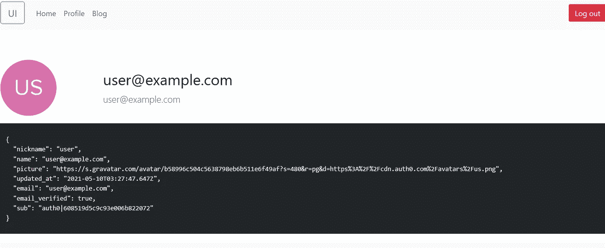
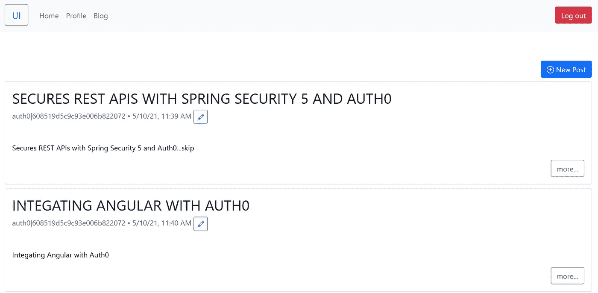

# 将 Auth0 集成到您的 Angular 应用中

> 原文：<https://itnext.io/integrating-auth0-into-your-angular-applications-42fabef31f3e?source=collection_archive---------3----------------------->

Auth0 为 Angular 提供了 SDK 来认证用户，并简单地授权用户访问受保护的 API。


图片来自[https://unsplash.com/photos/SEYO0Botkgc](https://unsplash.com/photos/SEYO0Botkgc)

在这篇文章中，我们将创建一个简单的 Angular SPA 应用程序，并尝试访问我们在上一篇文章中在[创建的*后端 API* 。](https://hantsy.medium.com/secures-rest-apis-with-spring-security-5-and-auth0-41d579ca1e27)

首先，让我们在 Auth0 管理控制台中创建新的应用程序。一个应用程序呈现一个 OAuth2 *客户端*角色，每个客户端应该有一个唯一的客户端 id 来标识它。

在仪表板 UI 中，展开左侧窗格中的*应用程序/应用程序*。点击*创建应用*按钮，开始创建进程。

*   在应用名称中，为这个新的角度应用设置一个名称，例如，我在这里使用了 *spa* 。
*   然后选择*单页应用*。
*   点击*创建*按钮。

创建完成后，打开*设置*页面，您会发现*客户端 ID* 和*客户端机密*都在页面中生成。在*应用程序 URL*部分，将[*http://localhost:4200*](http://localhost:4200)添加到以下字段。

*   *允许的回调 URL*
*   *允许的注销网址*
*   *允许的网络来源*
*   *允许原产地(CORS)*

在*快速入门*选项卡中，Auth0 提供了一系列教程，将 Auth0 与流行的 SPA 框架进行整合，包括 Angular/React/Vue 等。

我遵循了官方的 Angular Quickstart 教程，但是我根据 [Angular 编码风格指南](https://angular.io/guide/styleguide)重构了项目文件结构，并从[hantsy/Angular-spring-reactive-sample](https://github.com/hantsy/angular-spring-reactive-sample)移植了现有代码，以简化开发工作。最终的源代码可以在我的 Github 账号下找到。

> *关于逐步创建这个示例应用程序的更多细节，请阅读* [*官方 Angular 快速入门教程*](https://auth0.com/docs/quickstart/spa/angular) *。*
> 
> *关于访问后端 API 的实现细节，查看* [*我在 Medium 上发表的这篇文章*](https://hantsy.medium.com/build-a-reactive-application-with-spring-boot-2-0-and-angular-de0ee5837fed) *和这篇旧的* [*Angular2 样例代码*](https://github.com/hantsy/angular2-sample) *。*

这里我们要介绍集成 Auth0 Angular SDK 的细节。

安装 Auth0 Angular SDK。

```
$ npm i @auth0/auth0-angular
```

Auth0 Angular SDK 提供了一系列开箱即用的认证相关设施，包括`AuthModule`、`AuthService`、`AuthGuard`和`AuthHttpInterceptor`。我们在[hantsy/角弹簧反作用样品](https://github.com/hantsy/angular-spring-reactive-sample)中从头开始构建这些组件。

在 *app.module.ts* 中配置`AuthModule`和`AuthHttpInterceptor`。

```
// Import the module from the SDK
import { AuthHttpInterceptor, AuthModule } from '@auth0/auth0-angular';@NgModule({
  declarations: [AppComponent],
  imports: [
    BrowserModule,
    BrowserAnimationsModule,
    CoreModule,
    SharedModule,
    // Import the module into the application, with configuration
    AuthModule.forRoot({
      domain: 'dev-ese8241b.us.auth0.com',
      clientId: 'xwulkQN219vK2LU9MKowCo0HQLRi0WQU',
      audience: 'https://hantsy.github.io/api',
      scope: 'openid profile email read:posts write:posts delete:posts',
      // The AuthHttpInterceptor configuration
      httpInterceptor: {
        allowedList: [
          '/api/*',
        ],
      },
    }),
    HomeModule,
    AppRoutingModule,
  ],
  providers: [
    {
      provide: HTTP_INTERCEPTORS,
      useClass: AuthHttpInterceptor,
      multi: true,
    },
  ],
  bootstrap: [AppComponent],
})
export class AppModule {}
```

我们来看看`AppRoutingModule`的内容。在 profile 模块和 admin 模块的路径中，添加一个`AuthGuard`来确保当前用户已经过身份验证。

```
import { AuthGuard } from '@auth0/auth0-angular';
//...const routes: Routes = [
  { path: '', redirectTo: '/home', pathMatch: 'full' },
  {
    path: 'profile',
    loadChildren: () =>
      import('./profile/profile.module').then((m) => m.ProfileModule),
    canActivate: [AuthGuard],
  },
  {
    path: 'posts',
    loadChildren: () =>
      import('./posts/posts.module').then((m) => m.PostsModule),
  },
  {
    path: 'admin',
    loadChildren: () =>
      import('./admin/admin.module').then((m) => m.AdminModule),
    canActivate: [AuthGuard],
  },
  //{ path: '**', component:PageNotFoundComponent}
];@NgModule({
  imports: [RouterModule.forRoot(routes)],
  exports: [RouterModule],
})
export class AppRoutingModule {}
```

要显示/隐藏登录和注销按钮，插入一个`AuthService`并通过其`isAuthenticated`方法检测认证状态。

```
export class AuthenticationButtonComponent implements OnInit {
  constructor(public auth: AuthService) {} ngOnInit(): void {}
}
```

`AuthenticationButtonComponent`的模板文件。

```
<app-login-button *ngIf="(auth.isAuthenticated$ | async) === false">
</app-login-button><app-logout-button *ngIf="auth.isAuthenticated$ | async">
</app-logout-button>
```

为了测试应用程序，我们必须在 Auth0 中添加一些测试用户(您也可以使用*注册*表单来注册一个用户)。

转到 Auth0 管理控制台。展开左侧窗格中的*认证/数据库*，我们将在此使用默认的*用户名-密码-认证*，单击选项按钮打开*设置*页面，确保*需要用户名*被选中，我希望使用用户名而不是电子邮件登录。切换到*密码策略*选项卡，降低*密码强度*，它允许您为您的测试用户创建简单的密码。切换到*应用*选项卡，确保您的应用在那里被激活。

现在让我们添加一些用户。打开仪表板中的*用户管理/用户*。点击*创建用户*开始添加新用户。添加以下新用户(用户名/密码/电子邮件)，并为他们分配权限。

*   user/password/user@example.com—读:帖子，写:帖子
*   admin/password/admin@example.com—读:帖子，写:帖子，删除:帖子

进入每个用户的用户详情页面，在邮件下，直接将邮件标记为已验证，避免邮件验证。

现在回到您的应用程序，运行以下命令来启动它。

```
$ npm run start
```

点击登录按钮显示 Auth0 登录表单，输入用户/密码登录。

导航到*个人资料*页面，您将看到类似于以下的屏幕。



博客访问我们创建的*后端 API* 。要体验它，请确保后端 API 正在运行。



尝试注销，应该会返回到[*http://localhost:4200*](http://localhost:4200)。

## 从我的 Github 获取源代码。