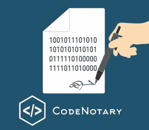
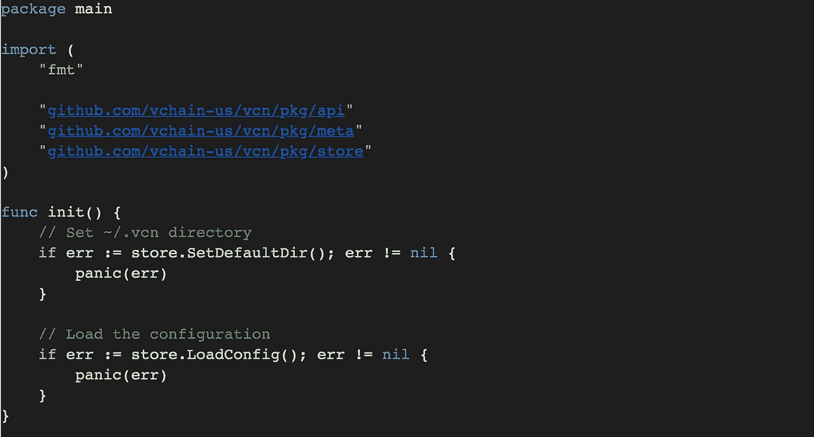
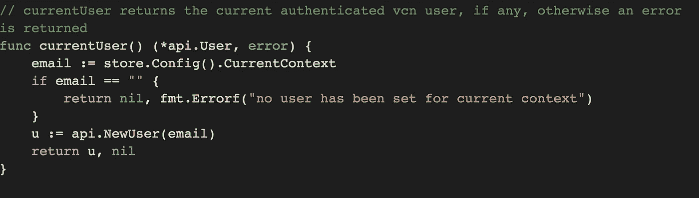
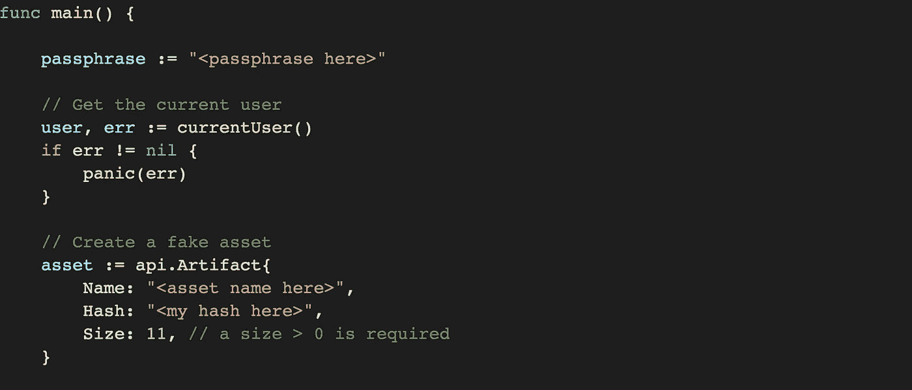
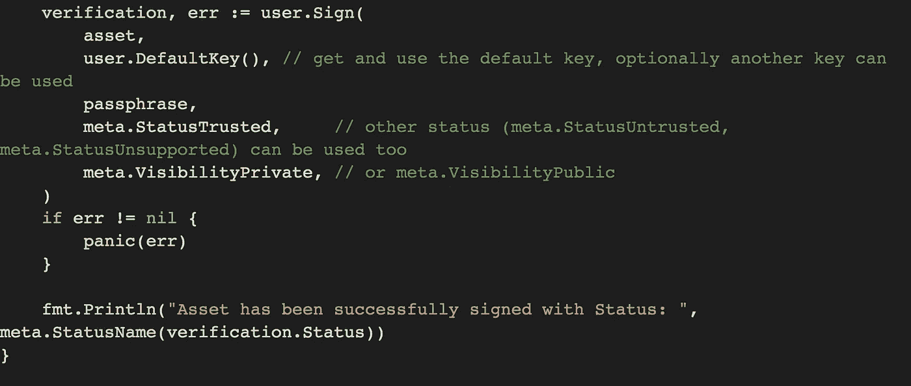

# 使用 Golang 将基于区块链的代码签名集成到您的应用中

> 原文：<https://itnext.io/integrating-blockchain-based-code-signing-into-your-application-using-golang-2ba5aaef96d6?source=collection_archive---------3----------------------->



# 介绍

了解您的数字资产是否可以安全使用，将有助于您避免在开发、测试和生产环境中运行的受损或错误代码带来的复杂性。这篇博客将带您了解使用 Golang 将基于区块链的代码签名集成到您的应用程序中的过程。

# 签署资产

为了让您的应用程序验证您想要使用的资产，需要对这些资产进行签名，并将其签名存储在区块链上。这样，无论托管服务或存储位置如何，它们都可以被全局引用。但是，在开始签署资产之前，您需要准备一些东西。

# 先决条件

首先，您需要创建您的 code 公证人帐户，您可以这样做，并观看如何做的视频。一旦您设置了帐户，您将能够开始使用 code 公证人`vcn` CLI 工具签署资产。下一步是准备您的`vcn`配置，您可以简单地通过运行`vcn login`来完成。第一次执行该命令时，将使用配置创建一个`$HOME/.vcn`文件夹，并为您生成一个用户密钥。更多细节，请查看我们的 GitHub 用户配置指南。另外，你要确保`$HOME~/.vcn`文件夹可以被你正在编写的程序访问。

# 在 Go 代码中使用资产签名

我们创建`vcn`是为了能够在单个应用程序的代码结构中直接使用。提取一个像`vcn`这样的全局验证检查器并直接放入你的项目中，这样你就可以配置它在你需要或想要的时候运行。

要在代码中包含资产签名，请使用下面的代码片段:

```
package main

import (
    "fmt"

    [github.com/vchain-us/vcn/pkg/api](http://github.com/vchain-us/vcn/pkg/api)"
    [github.com/vchain-us/vcn/pkg/meta](http://github.com/vchain-us/vcn/pkg/meta)"
    [github.com/vchain-us/vcn/pkg/store](http://github.com/vchain-us/vcn/pkg/store)"
)

func init() {
    // Set ~/.vcn directory
    if err := store.SetDefaultDir(); err != nil {
        panic(err)  

    // Load the configuration
    if err := store.LoadConfig(); err != nil {
        panic(err) 
}

// currentUser returns the current authenticated vcn user, if any, 
otherwise an error is returned
func currentUser() (*api.User, error) {
    email := store.Config().CurrentContext
    if email == "" {
        return nil, fmt.Errorf("no user has been set for current context")
}
    u := api.NewUser(email)
    return u, nil
}

func main() {
    passphrase := "<passphrase here>"
    // Get the current user
    user, err := currentUser()
    if err != nil {
        panic(err) 

    // Create a fake asset
    asset := api.Artifact{
        Name: "<asset name here>",
        Hash: "<my hash here>",
        Size: 11, // a size > 0 is required 

    verification, err := user.Sign(
        asset,
        user.DefaultKey(), // get and use the default key, optionally another key can be used
        passphrase,
        meta.StatusTrusted,     // other status (meta.StatusUntrusted, meta.StatusUnsupported) can be used too
        meta.VisibilityPrivate, // or meta.VisibilityPublic 
    if err != nil {
        panic(err) 
}
     fmt.Println("Asset has been successfully signed with Status: ", meta.StatusName(verification.Status))
}
```

# 它是如何工作的



`github.com/vchain-us/vcn/pkg/api`包让你可以访问所有的底层功能。

`github.com/vchain-us/vcn/pkg/storepackage`拉进`vcn` API，允许你直接写区块链。

然后`store.SetDefaultDir`设置您的默认目录，您将在本地存储您的资产签名。然后`store.LoadConfig`将在本地设置配置，使您能够写入区块链。



接下来，您需要创建函数`currentUser`来验证当前的`vcn`用户是否存在于系统中。如果输入的信息是正确的，那么允许用户继续，否则，返回一个错误。



在设置路径以检查您的用户信息是否存储在系统中之后，您需要创建一个允许您输入密码的函数，这将使您能够对资产进行签名并将其哈希写入区块链。然后,`vcn`应用程序会将之前输入的`currentUser`与输入的密码相匹配。如果成功，系统将允许您继续操作。否则，将返回一个错误。

下一步是选择您想要加载以便以后签名的资产。(如果您只是测试功能，也可以创建一个假资产。)但是首先，您需要设置输出字段，以便正确存储新签名资产的名称、散列和大小，供`api.Artifact`函数将创建的数据插入其中。

你可以在[https://godoc . org/github . com/vchain-us/vcn/pkg/API # Artifact 阅读更多关于我们 Go 文档中所有字段的信息。](https://godoc.org/github.com/vchain-us/vcn/pkg/api#Artifact.)



一旦您的字段被设置为存储您的签名工件，您需要获得您第一次使用`vcn login`登录时系统为您生成的密钥，默认情况下，该密钥存储在`~/.vcn`文件夹中。(如果您愿意，您也可以选择使用另一个密钥进行签名，尽管您必须专门指定它。)在您告诉系统在签名过程中使用哪个密钥之后，您需要指定允许您的密钥用于签名资产的密码短语。

如果一切顺利，系统会将指定的`meta.Status`和`meta.Visibility`添加到您的签名中。您应该看到的输出是如下例所示的打印行:

`Asset has been successfully signed with Status: TRUSTED`

# 结论

为您的应用程序添加对您创建或使用的数字资产进行签名的功能，可让您从区块链的不变性中获益，并确保您的代码、组件、应用程序等与您离开时一样安全。

关于我们整个`vcn`项目的信息可以在我们的 GitHub 资源库中找到，您可以通过下面的链接查看。

[**带我去 GitHub 回购**](https://github.com/vchain-us)

或者

[**了解更多详情**](https://www.codenotary.io/)

*原载于 2019 年 6 月 26 日*[*https://www . code 公证人. io*](https://www.codenotary.io/integrating-blockchain-based-code-signing-into-your-application-using-golang/) *。*