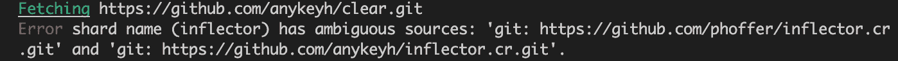
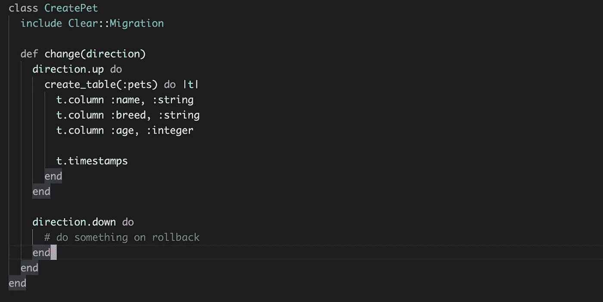
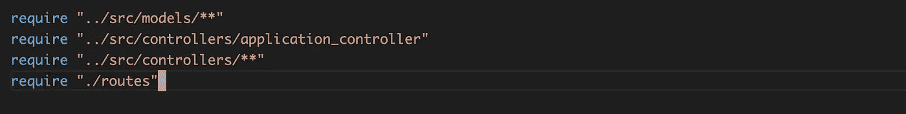
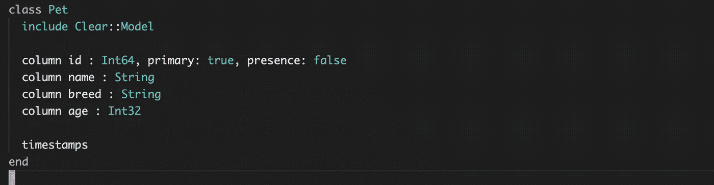
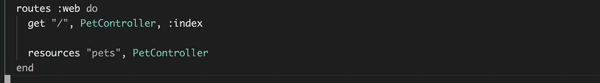
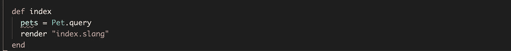
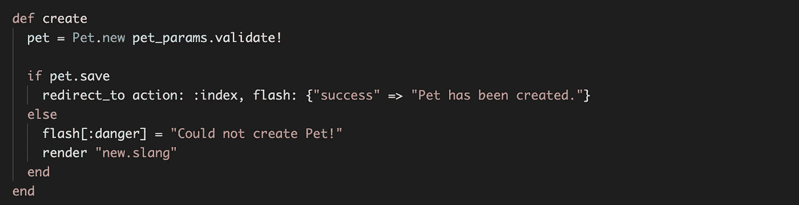
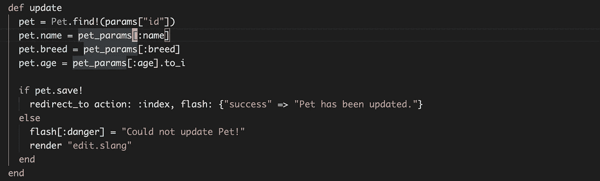
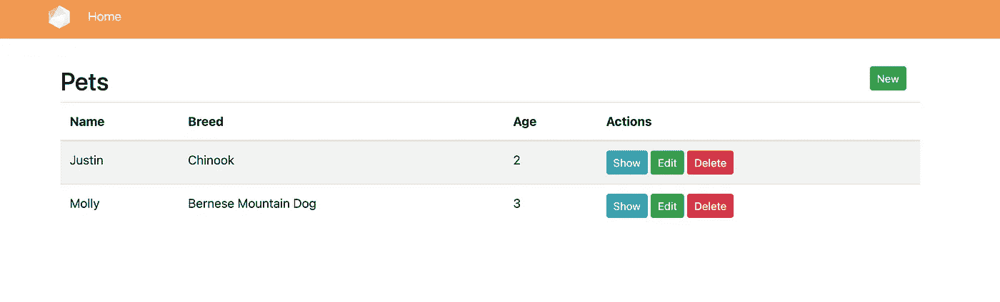

# 将 Clear ORM 与 Crystal 的 Amber 框架相集成

> 原文：<https://itnext.io/integrating-clear-orm-with-crystals-amber-framework-c0a55a67f4ca?source=collection_archive---------2----------------------->

[Amber](https://amberframework.org/) 是 Crystal 编程语言的 web 开发框架。它使用[花岗岩](https://github.com/amberframework/granite)作为它的默认 ORM。虽然 Granite 可以工作，但我认为如果你的数据库选择是 PostgreSQL，那么 [Clear](https://clear.gitbook.io/project/) 会更加丰富。我想把 Clear ORM 和 Amber 整合起来，试一试。本文的主要焦点是解释我将 Clear 与 Amber 集成所经历的过程，以及我如何解决在这个过程中所面临的一些问题。

在本文中，我将使用 Clear ORM 重写 [Amber 的快速入门指南](https://docs.amberframework.org/amber/getting-started)的宠物跟踪器示例。最终应用的源代码可以在这里找到—[https://github . com/imeraj/amber _ playground/tree/main/pet-track eer-clear](https://github.com/imeraj/amber_playground/tree/main/pet-trackeer-clear)。*注意项目名称中的错别字，我在完成 app 后注意到了:)*

# 版本信息

我用的是下面的版本—

*   晶体— 1.0.0
*   琥珀色— 1.0.0rc2
*   清除-最新的主文件
*   PostgreSQL — 12.1

# 创建新项目

首先，使用下面的命令创建一个新项目—

> 琥珀色新宠物跟踪器-透明

和 cd 到项目目录。

# 从项目中移除花岗岩

从项目中删除对花岗岩的任何引用。这意味着从 **shards.yml** 中删除以下内容

> 花岗岩:
> git:[https://github.com/amberframework/granite.git](https://github.com/amberframework/granite.git)
> 版本:0.23.0

从 **config/database.cr** 中删除以下内容

> 需要“花岗岩/适配器/pg”
> 
> granite::Connections<< Granite::Adapter::Pg.new(name: “pg”, url: ENV[“DATABASE_URL”]? || Amber.settings.database_url)

# Add Clear to project and configure

Add Clear in **shards . yml**

> clear:
> github:any keyh/clear
> 分支:主

更新 **config/database.cr** 以包含以下内容—

> 要求“清楚”
> 
> 要求"../db/migrations/* "
> 
> #初始化数据库连接池:
> 
> clear::SQL . init(" postgres://meraj @ localhost/pet _ tracker _ development ")

此外，在**config/environments/development . yml**中，更新数据库 url 以包含用户名和密码(如果您有一套)以及正确的数据库名称——

> database _ URL:postgres://meraj:@ localhost:5432/pet _ tracker _ development

随着这些添加，我试图做**碎片安装**，但我得到了以下错误—

这显示了**变形器**碎片的两个不同来源之间的冲突。所以我通过在项目根目录下创建 **shard.override.yml** 应用了一个覆盖，内容如下

在做了**碎片后，再次安装**，这成功地整合了清晰与琥珀色。

# **生成并应用迁移**

在**db/migrations(***clear)下生成一个迁移文件，似乎有一个 CLI 来执行此操作，但我手动生成了它—*

20210722001906661 _ create _ pet . Cr

使用 amber CLI 创建数据库并应用此迁移—

> 琥珀色数据库创建
> 
> amber exec Clear::Migration::manager . instance . apply _ all

这将创建包含上述列的数据库和 **pets** 表。

# 创建模型

更新 **config/application.cr** 文件以添加模型的位置—

这里新增加的是—

> 要求"../src/models/** "

在 **src/model** 内创建 **pet.cr** ，内容如下—

注意:*别忘了包括* ***时间戳*** *。如果这样做，* ***创建 _at*** *和* ***更新 _at*** *列中的* ***宠物*** *表格不会自动更新。*

# 更新路线

更新 **config/routes.cr** 以包含新的宠物路线—

# 创建控制器和视图

在这个阶段，项目应该很好地建立必要控制器和视图。在 **src/controllers** 下添加 **pet_controller.cr** ，在 **src/views/pet 下添加必要的视图。**

视图和控制器中的大多数内容都是从 amber 生成的视图和控制器中重用的，如果您遵循它们的快速入门指南，应该很容易理解。我只需要修改 **pet_controller** 中的查询来使用 Clear 的语法。

对于索引操作，更新后的代码如下所示—

对于创建操作，更新后的代码如下所示—

对于更新操作，更新后的代码如下所示—

观点有所调整，但应该很容易理解。所以我不会解释这些。

# 试验

在这个阶段，应用程序应该准备好使用下面的命令运行—

> 琥珀手表

app 首页截图(添加情侣宠物后)

# **结论**

在本文中，我使用 Amber 的快速入门演示应用程序演示了如何将 Clear ORM 与 Amber 框架集成。在这个过程中，我也解释了我是如何解决我在做这件事时所面临的一些问题的。希望这些信息对一些读者有用。

*更多详细和深入的未来技术帖子请关注我这里或点击* [*twitter*](https://twitter.com/meraj_enigma) *。*

# 参考

1.  清晰的 ORM—[https://clear.gitbook.io/project/](https://clear.gitbook.io/project/)
2.  琥珀色框架—[https://amberframework.org/](https://amberframework.org/)
3.  花岗岩 ORM—[https://github.com/amberframework/granite](https://github.com/amberframework/granite)
4.  本文最终 App 的源代码—[https://github . com/imeraj/amber _ playground/tree/main/pet-track eer-clear](https://github.com/imeraj/amber_playground/tree/main/pet-trackeer-clear)
5.  琥珀色快速入门指南—[https://docs.amberframework.org/amber/getting-started](https://docs.amberframework.org/amber/getting-started)