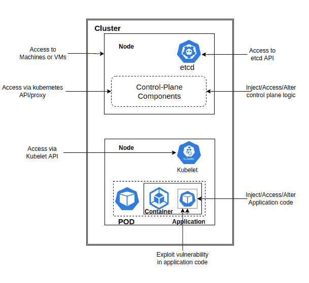

# Kubernetes 管道整合合规性

> 原文：<https://itnext.io/integrating-compliance-for-kubernetes-pipeline-c538415401c5?source=collection_archive---------2----------------------->

[图片](https://unsplash.com/photos/63Sg6s3EocE)由[在 Unsplash 上放飞:D](https://unsplash.com/@flyd2069?utm_source=unsplash&utm_medium=referral&utm_content=creditCopyText)

在我们与云无关的数字世界中，安全性是一个至关重要的方面，无论是《财富》500 强公司还是正在发展壮大的小型服务提供商。

当部署依赖于基于云的环境时，安全性的重要性就提高了。所有公司在部署应用程序或将功能集成到现有应用程序时，都广泛依赖于[微服务](https://en.wikipedia.org/wiki/Microservices)。由于其无与伦比的声誉，Kubernetes 是走向市场的领导者。

Kubernetes 是管理容器化应用程序的头号开源编排平台。当它第一次出现时，它彻底改变了 DevOps 团队创建、管理和操作基于容器的应用程序的方法。

Kubernetes 的一个独一无二的特点是，Kubernetes 是一个不断发展的项目，一直在进行改进。Kubernetes 团队已经在准备他们最新的解决方案和方法来解决已经暴露出来的安全漏洞，并将在他们的下一个版本中提供给我们。

为了充分利用这一工具的多功能性，在构建过程中保持明智是很重要的，了解这一点以便能够最好地利用它。这就是我们将在本文中讨论的内容。

当构建一个 CI/CD 管道来部署容器和映像时， [Kubernetes 安全最佳实践](https://www.armosec.io/blog/kubernetes-security-best-practices/)在 Kubernetes 的三个不同级别上出现:集群级、节点级和底层主机操作系统级。扫描和修补容器映像以检测漏洞并报告它们至关重要:

作者图片

**注意:**保持 K8s 最新，提高安全性。

让我们一个一个地解开关卡，探索最佳实践以及如何处理 K8s 的情况。

# 应用层安全性

这个级别是开发人员要考虑的，也是安全的最高层。通过应用程序的容器化实现了资源和数据的相互隔离，但这还不足以保证服务的安全。

应用程序级别的一些最佳安全实践如下

# 设置 API 服务器访问权限和使用机密

Kubernetes API 服务器为控制 Kubernetes 提供了一个强大的 REST API。这个 API 的写权限相当于群集中每台机器的根访问权限。

Kubectl 是这个 API 的 CLI 客户机。可以通过向 kubectl 发出请求来管理资源和工作负载。默认情况下，这个 API 服务器会监听*不安全端口*:端口 8080。对该端口的请求将*绕过认证和授权检查*。

如果你让这个端口打开，*任何获得运行你主人的主机的访问权的人都将完全控制你的整个集群*。

**解决方案**:确保未设置不安全绑定地址，并且所有敏感数据(如连接到应用程序 API 的密码或令牌)都存储在 Kubernetes [Secrets](https://kubernetes.io/docs/concepts/configuration/secret/) 中。

# 通过 RBAC 的出入控制

基于角色的访问控制( [RBAC](https://www.upguard.com/blog/rbac) )是一种基于角色来管理资源访问的方法，它帮助您定义谁可以访问 Kubernetes API，拥有什么样的权限。

随着不安全端口 8080 的关闭，只能通过安全加密的 TLS 连接来访问 API。您可能希望进一步限制已知的、经过身份验证的用户对 API 的访问。

**解法:** set — anonymous-auth=false。选择特定于命名空间的权限，而不是群集范围的权限。

只要我们利用 RBAC 的功能，我们就可以跳过上述步骤，允许匿名访问。RBAC [默认](https://kubernetes.io/docs/reference/access-authn-authz/rbac/#default-roles-and-role-bindings)设置会处理好的。

# 分散硬化

默认情况下，Docker 容器作为'**根用户**运行，这有时会导致安全问题。限制用户访问可能是保护 K8s 集群中部署的应用程序的最佳方式。

**解决方案:**在部署 YAML 文件中为 pod 定义指定运行方式用户/运行方式组。

# 集群级安全性

这是中层和中心层，K8s 集群和它们的组件在这里相互作用。

# 配置和限制 etcd

Kubernetes 将配置和状态信息存储在名为 etcd 的分布式键值存储中。获得 etcd 读/写权限的人可以控制 K8s 集群。

**解决方案:**通过设置—证书文件和—密钥文件建立 HTTPS 连接 etcd。

到 etcd 的流量应该加密。确保访问 etcd 需要将身份验证设置应用到-client-cert-auth = true。

通过指定-etcd-cert file 和-etcd-keyfile，并设置许多其他的[配置](https://etcd.io/docs/)，确保 API 服务器能够向 etcd 识别自身。

# 扫描和限制容器图像

软件通过容器映像导入 K8s 集群。当配置错误或使用过时的软件时，就会出现安全漏洞。利用容器映像扫描器来检查映像中包含的包有助于报告包中的已知漏洞。

**解决方案:**使用 AlwaysPullImages 准入控制器确保使用最新版本。

用语义版本控制标记图像。

使用集装箱扫描仪。

# 配置准入控制器

Kubernetes 准入控制器是一个高级插件，用于控制和管理集群的使用。利用准入控制器可以提供对安全性的更好的控制。

**解决方案:**定义对 API 服务器节点的访问限制，设计定制的网络策略。

实施动态准入控制，以确保仅部署成功扫描的映像。

# 主机级安全性

这是实际安装 Kubernetes 的层。

# 限制特权访问

应该限制通过应用程序单元的远程执行，并且不应该将主机级操作系统暴露给 ssh。

**解决方案:**设置 IAM 策略来限制对 K8s 资源的访问。

# 限制管理员的修改权限

在主机级别安装新软件和更新它们应该受到限制，因为这可能成为黑客安装恶意软件的后门。

**解决方案:**只允许系统管理员执行 sudo/yum 安装。

# 结论

当设计和开发针对最终用户或大公司的复杂和高级系统时，安全性应该是核心。构建复杂应用程序或系统最有效的方法是使用微服务和 Kubernetes 作为容器化的部署引擎。

作为开发人员和架构师，我们有责任通过避免任何可能成为整个生态系统的安全威胁或漏洞的弱点，来确保我们拥有最好、最安全的产品和应用程序。

本文提供了在 CI/CD 管道中构建容器化应用程序时要记住的最佳实践。