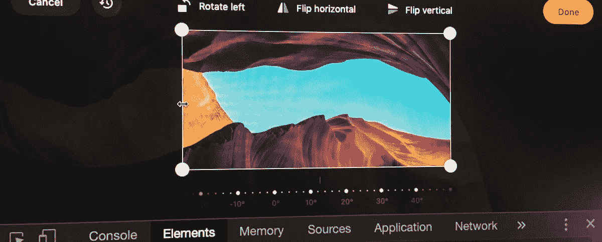
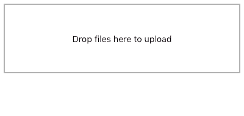
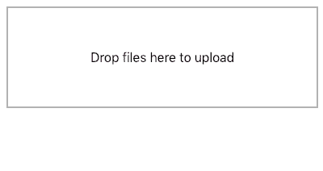
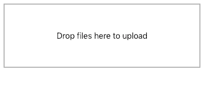
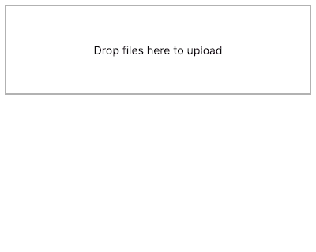
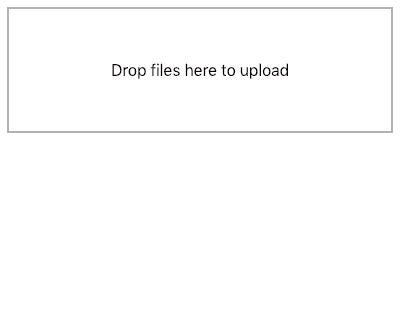
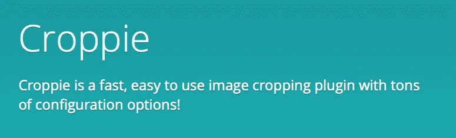
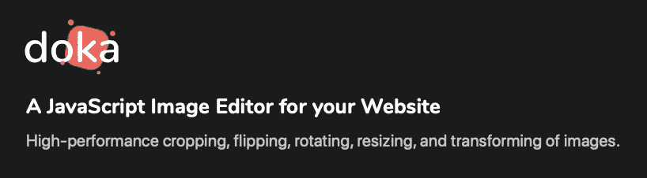

# 集成 DropzoneJS 和 JavaScript 图像裁剪器来优化图像上传

> 原文：<https://itnext.io/integrating-dropzone-with-javascript-image-cropper-optimise-image-upload-e22b12ac0d8a?source=collection_archive---------0----------------------->

在本教程中，我们将集成 Dropzone 与三个不同的图像裁剪插件，以优化图像数据上传到服务器之前。



如果我们能在图像发送到服务器之前对其进行优化，那不是很好吗？这可以节省带宽，使数据库更干净，并允许用户对自己的内容有更多的控制。使用本文中描述的技术，使您的用户能够编辑他们上传到服务器的个人资料图片、相册或任何其他图像。

我们将设置一个基本的[**drop zone js**](https://www.dropzonejs.com)vanilla JavaScript 拖放区，扩展它以更好地与第三方图像裁剪器集成，然后展示如何将它与三个流行的图像裁剪器链接起来: [**Cropper.js**](https://github.com/fengyuanchen/cropperjs) 、 [**Croppie**](https://github.com/foliotek/croppie) ，最后但同样重要的是 [**多卡**](https://pqina.nl/doka/)

我们先从设置 DropzoneJS 开始。

# 设置拖放区 JS

我们将创建一个基本的 HTML 页面，并添加 DropzoneJS 样式和脚本，如下所示。

```
<!DOCTYPE html>
<html lang="en">
<head>
  <meta charset="UTF-8">
  <title>JavaScript Image Cropping with DropzoneJS</title>
  **<link href="https://unpkg.com/dropzone/dist/dropzone.css" rel="stylesheet"/>**
</head>
<body>
  **<div class="dropzone" id="myDropzone"></div>**
  **<script src="https://unpkg.com/dropzone"></script>**
</body>
</html>
```

设置好基本页面后，我们现在可以专注于配置 DropzoneJS 了。在它要做任何事情之前，它希望我们设置一个上传文件的位置，让我们现在就这样做。我们可以使用分配给 DropzoneJS `<div>`的`id`将选项传递给我们特定的上传者。

*注意，我们已经放大了刚刚结束* `*body*` *标签之前的代码。*

```
<div class="dropzone" id="myDropzone"></div>
<script src="https://unpkg.com/dropzone"></script>**<script>
Dropzone.options.myDropzone = {
 url: '/post'
};
</script>**
```

我们现在应该看到页面上出现以下内容，如果我们拖放一个图像，DropzoneJS 将显示一个小缩略图。



我们可以在服务器上处理文件对象，就像使用经典多部分表单的`<input type=”file”/>`提交普通文件一样。本教程将侧重于在图像上传到服务器之前，在前端编辑图像。因此，我们将暂时保留服务器解决方案。

# 用图像编辑器弹出窗口扩展 Dropzone

Dropzone 有一个名为`transformFile`的特殊回调函数，当这个函数被调用时，我们可以让用户编辑一个文件。让我们

*注意，我们已经放大了* `*<script>*` *标签内的代码。*

```
Dropzone.options.myDropzone = {
  url: '/post',
  **transformFile: function(file, done) {**  **}**
};
```

Dropzone 锁定。编辑完文件后，我们需要调用`done`函数(第二个参数),我们会记住这一点。就目前而言，这很好。



好的，我们想要在一个图像编辑器覆盖图中编辑文件，在 Dropzone 的顶部，这自动地移动用户焦点到编辑器。

```
transformFile: function(file, done) { // Create the image editor overlay
  **var editor = document.createElement('div');
  editor.style.position = 'fixed';
  editor.style.left = 0;
  editor.style.right = 0;
  editor.style.top = 0;
  editor.style.bottom = 0;
  editor.style.zIndex = 9999;
  editor.style.backgroundColor = '#000';
  document.body.appendChild(editor);**}
```

下面的结果看起来各种各样的错误，但它实际上是我们想要的。黑色层将是我们稍后编辑的位置。坚持住。



我们需要一种方法来逃离这个黑色的空白，所以让我们向编辑器元素添加一个带有 click 事件的按钮。

```
transformFile: function(file, done) { // Create the image editor overlay
  var editor = document.createElement('div');
  editor.style.position = 'fixed';
  editor.style.left = 0;
  editor.style.right = 0;
  editor.style.top = 0;
  editor.style.bottom = 0;
  editor.style.zIndex = 9999;
  editor.style.backgroundColor = '#000';
  document.body.appendChild(editor); // Create confirm button at the top left of the viewport
  **var buttonConfirm = document.createElement('button');
  buttonConfirm.style.position = 'absolute';
  buttonConfirm.style.left = '10px';
  buttonConfirm.style.top = '10px';
  buttonConfirm.style.zIndex = 9999;
  buttonConfirm.textContent = 'Confirm';
  editor.appendChild(buttonConfirm);
  buttonConfirm.addEventListener('click', function() {** // Remove the editor from the view
    **document.body.removeChild(editor);** **});**}
```

耶！我们现在可以逃离虚空。精彩！


这就是我们需要设置的与第一个和第二个图像裁剪器候选对象集成的全部内容，让我们试一试 Cropper.js。

# 将 Dropzone 与 Cropper.js 集成


是时候连接我们的第一个图像裁剪器了。让我们添加 [Cropper.js](https://github.com/fengyuanchen/cropperjs) 所需的样式和脚本。

```
<!DOCTYPE html>
<html lang="en">
<head>
  <meta charset="UTF-8">
  <title>JavaScript Image Cropping with DropzoneJS</title>
  <link href="https://unpkg.com/dropzone/dist/dropzone.css" rel="stylesheet"/>
  **<link href="https://unpkg.com/cropperjs/dist/cropper.css" rel="stylesheet"/>**
</head>
<body>
  <div class="dropzone" id="myDropzone"></div>
  <script src="https://unpkg.com/dropzone"></script>
  **<script src="https://unpkg.com/cropperjs"></script>** </body>
</html>
```

一切还是老样子，没关系。

让我们将 Cropper.js 添加到编辑器元素中，并加载拖放的图像。Cropper.js 需要一个``元素，所以让我们将`file`对象转换成一个 URL，并将其提供给一个新的图像。

*注意，我们已经放大了* `*transformFile*` *函数本身。*

```
transformFile: function(file, done) { // Create the image editor overlay
  var editor = document.createElement('div');
  editor.style.position = 'fixed';
  editor.style.left = 0;
  editor.style.right = 0;
  editor.style.top = 0;
  editor.style.bottom = 0;
  editor.style.zIndex = 9999;
  editor.style.backgroundColor = '#000';
  document.body.appendChild(editor); // Create confirm button at the top left of the viewport
  var buttonConfirm = document.createElement('button');
  buttonConfirm.style.position = 'absolute';
  buttonConfirm.style.left = '10px';
  buttonConfirm.style.top = '10px';
  buttonConfirm.style.zIndex = 9999;
  buttonConfirm.textContent = 'Confirm';
  editor.appendChild(buttonConfirm);
  buttonConfirm.addEventListener('click', function() { // Remove the editor from the view
    document.body.removeChild(editor);}); // Create an image node for Cropper.js
 **var image = new Image();
  image.src = URL.createObjectURL(file);
  editor.appendChild(image);** // Create Cropper.js
  **var cropper = new Cropper(image, { aspectRatio: 1 });**}
```

Cropper.js 现在可以在编辑器弹出窗口中打开拖放的图像。



当我们点击按钮时，编辑器关闭。我们希望它告诉 Cropper.js 进行裁剪并更新 DropzoneJS 文件。

*注意，我们放大了确认按钮 addEventListener 函数。*

```
buttonConfirm.addEventListener('click', function() { // Get the canvas with image data from Cropper.js
  **var canvas = cropper.getCroppedCanvas({
    width: 256,
    height: 256
  });** // Turn the canvas into a Blob (file object without a name)
  **canvas.toBlob(function(blob) {**// Return the file to Dropzone **done(blob);** **});** // Remove the editor from the viewdocument.body.removeChild(editor);});
```

奇怪！文件缩略图不会更新。



Dropzone 不会自动创建新缩略图。我们将不得不指示它根据更新后的文件重新绘制它。我们可以使用 Dropzone `createThumbnail`函数来实现。但是由于我们需要访问 Dropzone 实例，我们还必须创建对该实例的引用(我们称之为`myDropZone`)。

```
transformFile: function(file, done) { // Create Dropzone reference for use in confirm button click handler
  **var myDropZone = this;** // Create the image editor overlay
  var editor = document.createElement('div');
  editor.style.position = 'fixed';
  editor.style.left = 0;
  editor.style.right = 0;
  editor.style.top = 0;
  editor.style.bottom = 0;
  editor.style.zIndex = 9999;
  editor.style.backgroundColor = '#000';
  document.body.appendChild(editor); // Create confirm button at the top left of the viewport
  var buttonConfirm = document.createElement('button');
  buttonConfirm.style.position = 'absolute';
  buttonConfirm.style.left = '10px';
  buttonConfirm.style.top = '10px';
  buttonConfirm.style.zIndex = 9999;
  buttonConfirm.textContent = 'Confirm';
  editor.appendChild(buttonConfirm);
  buttonConfirm.addEventListener('click', function() { // Get the canvas with image data from Cropper.js
    var canvas = cropper.getCroppedCanvas({
      width: 256,
      height: 256
    }); // Turn the canvas into a Blob (file object without a name)
    canvas.toBlob(function(blob) { // Create a new Dropzone file thumbnail
      **myDropZone.createThumbnail(
        blob,
        myDropZone.options.thumbnailWidth,
        myDropZone.options.thumbnailHeight,
        myDropZone.options.thumbnailMethod,
        false, 
        function(dataURL) {** // Update the Dropzone file thumbnail **myDropZone.emit('thumbnail', file, dataURL);**// Return the file to Dropzone **done(blob);** **});** }); // Remove the editor from the viewdocument.body.removeChild(editor); }); // Create an image node for Cropper.js
var image = new Image();
  image.src = URL.createObjectURL(file);
  editor.appendChild(image);// Create Cropper.js
  var cropper = new Cropper(image, { aspectRatio: 1 });}
```

就是这样！

参见下面的动画了解最终的解决方案，或者使用 CodePen 上的代码[进行试验。](https://codepen.io/rikschennink/pen/de53582f0ce6d723a47e0a99716a8cfd)


DropzoneJS 和 Cropper.js 集成

# 连接作物



链接 DropzoneJS 和 [Croppie](https://github.com/foliotek/croppie) 所需的大量代码与我们刚刚看到的 Cropper.js 相同。

```
<!DOCTYPE html>
<html lang="en">
<head>
  <meta charset="UTF-8">
  <title>JavaScript Image Cropping with DropzoneJS</title>
  <link href="https://unpkg.com/dropzone/dist/dropzone.css" rel="stylesheet"/>
  **<link href="https://unpkg.com/croppie/croppie.css" rel="stylesheet"/>**
</head>
<body>
  <div class="dropzone" id="myDropzone"></div>
  <script src="https://unpkg.com/dropzone"></script>
  **<script src="https://unpkg.com/croppie"></script>**
</body>
</html>
```

加载正确的文件后，我们可以放大`transformFile`功能。Croppie 可以加载一个`file`对象，而不需要先创建一个图像，它需要一个 URL。

```
function(file, done) { // Create Dropzone reference for use in confirm button click handler
  var myDropZone = this; // Create the image editor overlay
  var editor = document.createElement('div');
  editor.style.position = 'fixed';
  editor.style.left = 0;
  editor.style.right = 0;
  editor.style.top = 0;
  editor.style.bottom = 0;
  editor.style.zIndex = 9999;
  editor.style.backgroundColor = '#000';
  document.body.appendChild(editor); // Create confirm button at the top left of the viewport
  var buttonConfirm = document.createElement('button');
  buttonConfirm.style.position = 'absolute';
  buttonConfirm.style.left = '10px';
  buttonConfirm.style.top = '10px';
  buttonConfirm.style.zIndex = 9999;
  buttonConfirm.textContent = 'Confirm';
  editor.appendChild(buttonConfirm);
  buttonConfirm.addEventListener('click', function() { // Remove the editor from the viewdocument.body.removeChild(editor); });// Create the Croppie editor **var croppie = new Croppie(editor, {
    enableResize: true
  });** // Tell Croppie to load the file
 **croppie.bind({
    url: URL.createObjectURL(file)
  });**}
```

现在，我们放大确认按钮点击处理程序，并添加使其与 Croppie 一起工作所需的代码。

*注意，我们还添加了 Dropzone 缩略图创建逻辑。*

```
confirm.addEventListener('click', function() { // Get the output file data from Croppie
  **croppie.result({
      type:'blob',
      size: {
        width: 256,
        height: 256
      }
    }).then(function(blob) {** // Create a new Dropzone file thumbnailmyDropZone.createThumbnail(
        blob,
        myDropZone.options.thumbnailWidth,
        myDropZone.options.thumbnailHeight,
        myDropZone.options.thumbnailMethod,
        false, 
        function(dataURL) {

          // Update the Dropzone file thumbnail
          myDropZone.emit('thumbnail', file, dataURL); // Tell Dropzone of the new file
          done(blob); });}); // Remove the editor from vieweditor.parentNode.removeChild(editor);});
```

就是这样！我们已经做完了！

当一个文件被删除时，它会自动发送到 Croppie。裁剪过程接管，当点击确认按钮时，文件被返回到 Dropzone 进行上传。

下面的动画展示了结果，[CodePen 上的一个例子也是可用的](https://codepen.io/rikschennink/details/87fdcbf565d3dba6e248cf1788619493)。


DropzoneJS 和 Croppie 集成

# 将 DropzoneJS 与多卡整合



Doka.js 走了一条不同的路，它没有嵌入到页面中，而是带来了自己的编辑器弹出窗口。这意味着我们可以删除我们亲爱的编辑器和确认按钮代码。

*请注意，多卡是一个商业 JavaScript 插件，因此源文件是从服务器而不是 CDN 加载的。*

让我们来看看。首先，我们将链接 CSS 和 JavaScript 文件。

```
<!DOCTYPE html>
<html lang="en">
<head>
  <meta charset="UTF-8">
  <title>JavaScript Image Cropping with DropzoneJS</title>
  <link href="https://unpkg.com/dropzone/dist/dropzone.css" rel="stylesheet"/>
  **<link href="doka.min.css" rel="stylesheet"/>**
</head>
<body>
  <div class="dropzone" id="myDropzone"></div>
  <script src="https://unpkg.com/dropzone"></script>
  **<script src="doka.min.js"></script>**
</body>
</html>
```

源文件链接起来后，我们现在可以再看一下`transformFile`函数。使用多卡，我们将在 Dropzone 配置之外创建一个编辑器，如下所示。

*注意，我们再次放大了最后一个* `*<script>*` *标签。*

```
<script>
// Create our Doka image editor
**var doka = Doka.create({
  cropAspectRatio: 1
});**// Configure Dropzone
Dropzone.options.myDropzone = {
  url: '/post',
  transformFile: function(file, done) { }
};
</script>
```

有了多卡，我们可以调用`doka.edit`来打开文件。当作物得到确认时，它会自动解决一个承诺。让我们给`transformFile`函数添加所需的逻辑。

*drop zone 缩略图创建逻辑保持不变。*

```
function(file, done) {

  // Shortcut to this dropzone
  var myDropZone = this; // Edit the file and wait for confirm
  **doka.edit(file).then(function(output) {** // Get blob from Doka output object
    **var blob = output.file;**

    // Create a new Dropzone file thumbnailmyDropZone.createThumbnail(
      blob,
      myDropZone.options.thumbnailWidth,
      myDropZone.options.thumbnailHeight,
      myDropZone.options.thumbnailMethod,
      false, 
      function(dataURL) {

        // Update the Dropzone file thumbnail
        myDropZone.emit('thumbnail', file, dataURL); // Tell Dropzone of the new file
        done(blob); }); });}
```

我们完了！🎉

参见下面的结果，[在产品网站](https://pqina.nl/doka/)了解更多关于多卡的信息。


如果你喜欢这篇文章或者有任何问题，请在推特上告诉我