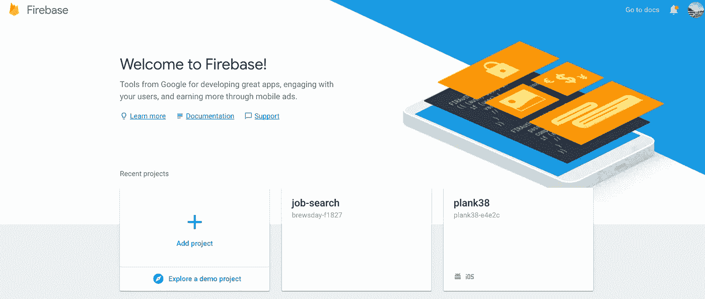
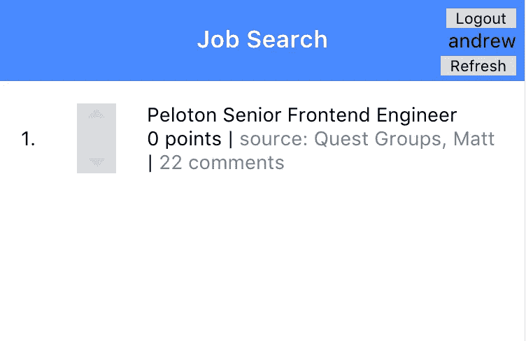

# 将 Firebase 与模板构建的 PWA 集成在一起

> 原文：<https://itnext.io/integrating-firebase-with-a-stencil-built-pwa-865d7800b5e6?source=collection_archive---------4----------------------->

[*点击这里在 LinkedIn* 上分享这篇文章](https://www.linkedin.com/cws/share?url=https%3A%2F%2Fitnext.io%2Fintegrating-firebase-with-a-stencil-built-pwa-865d7800b5e6)

一些应用程序仅依靠本地数据来提供出色的用户体验。我个人不知道那些是什么 app，但我确定它们是存在的。但一个常见的经验是，当你构建一个移动应用程序时，你会遇到一个需要开始将后端集成到该应用程序中的点。您可以构建自己的后端，但这可能需要大量的时间和经验，而您可能没有。取而代之的是 firebase，一个完全构建的后端即服务，它使得将后端集成到你的应用程序中变得相对容易。

# Firebase 实时数据库

> *Firebase 实时数据库是一个云托管的 NoSQL 数据库，可以让你在用户之间实时存储和同步数据。—火基*

Firebase 的实时数据库非常强大，消除了为应用程序构建 RESTFull 后端的整个过程。所以让我们开始将它添加到我们的应用程序中。

**配置 Firebase**

首先，你需要注册并启动一个 firebase 项目。一旦你注册了 firebase，进入你的仪表板，然后“添加一个项目”

‍



向您的 Firebase 帐户添加一个项目

在此之后，应该有一个简单的访问按钮，上面写着“将 Firebase 添加到您的 Web 应用程序中”。单击该按钮，您应该会看到如下所示的一些配置详细信息。

这种配置很重要，但这也是我们的配置过程不同于标准 web 应用程序配置的地方。

‍

# 用 Firebase 配置 PWA

我们不是按照 web 应用程序文档来设置 firebase，而是按照类似的过程来设置 node.js，因为它们使用模块导入和 npm 模块。

首先，在 web 应用程序的父目录中，使用以下命令安装 firebase

```
npm install --save firebase
```

然后，在模板项目的入口点文件中(对我来说，入口点是 ionic-pwa-toolkit 项目中的 my-app.tsx)，我们将导入 firebase 并创建一个配置文件来存储我们的配置。

**重要说明，使用新的 TypeScript 2.7 导入语句导入 firebase。我花了一段时间才明白。

```
**import firebase from ‘firebase’**
```

而不是

```
**import * as firebase from ‘firebase’**
```

现在，您可以在这段代码中看到，我正在从一个名为 config.js 的文件中导入我的配置。我们这样做是因为通常来说，将您的配置分离出来是一种很好的做法，这样我们就可以从源代码控制中删除我们的配置细节，这样我们就可以使我们的应用程序开源。

为此，在项目的“helpers”文件夹中，创建一个名为 config.ts 的文件，并添加以下代码(以及 firebase 配置细节)。

现在我们应该已经配置好了开始使用 firebase 的一切！

# 实时数据库

现在一切都配置好了，让我们添加一些真正的示例代码。我一直在开发一个样例应用程序，它有一个工作板，人们可以在那里为他们喜欢的工作投票，它反映了 reddit / hacker news 上的投票过程。我们将以此为例来展示我们能做些什么。



**工作清单示例**

现在不要讨厌我的设计，因为我从来没有真正学会如何画东西。在我们的工作列表应用程序中，有一个我们想要实现的投票系统，当其他人对工作进行投票时，我们想要监听并更新我们对每个工作列表的“分数”。为此，我们将在模板组件的 componentDidLoad 生命周期事件期间附加 firebase 侦听器。

该代码侦听作业上的 firebase 事件，并对特定项目的投票数进行统计。

# 使用 PWA 的更多 Firebase

Firebase 是一个非常强大的工具，可以添加到你的模板项目中，我知道我对我的实现非常满意。

如果你想了解更多关于利用 firebase 的其他特性，或者想更深入地了解如何在你的下一个 PWA 中实现 firebase，一定要查看我的课程“开始一个项目”。在这两个 PWA 课程中，我们将讨论如何在您的 web 应用程序中实现 firebase。

*最初发表于*[T5【www.pwatoday.com】](https://www.pwatoday.com/post/integrating-firebase-with-a-stencil-built-pwa)*。*