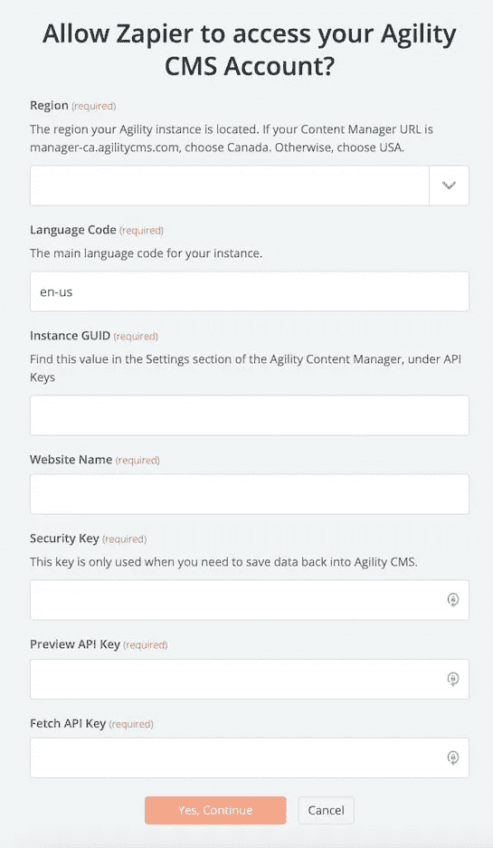
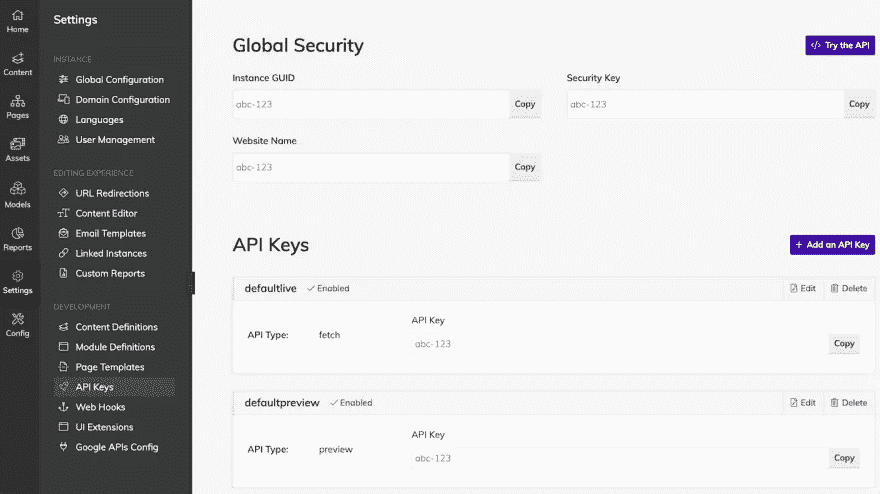

# 将 Headless CMS 与 Zapier 集成

> 原文：<https://itnext.io/integrating-headless-cms-with-zapier-2ac8137b9a9d?source=collection_archive---------3----------------------->

## 介绍

我在做项目时遇到的一个巨大问题是必须处理将内容和事件集成到第三方服务中。这很耗时，相关应用程序的需求在增长，要跟上 REST APIs 中所有相关变化的精神压力也在增长。如果这还不够具有挑战性，那么从长远来看，客户集成各种第三方服务的需求可能(如果不加以检查)是不可持续的。

## 扎皮尔:整合助手

Zapier 是一种网络服务，可以自动处理 500 多个网络应用之间的数据流，包括 MailChimp、Salesforce、GitHub 和 Trello。

想象一下，构建一个应用程序，当用户填写您的 Typeform 表单时触发，然后自动在您的 Google 日历上创建一个事件，发送一个延迟通知，最后通过向 Google Sheets 电子表格添加一行来结束。从头开始编写所有这些功能是多余的，而且非常耗时。在这种情况下，Zapier 非常方便。

对于负责编写手动集成或逆向工程的工程师来说，考虑用 Zapier 解决同样的问题可以减少他们可能需要做的大部分工作。
原因是不用处理 JSON 模式的解析和验证，也不用手动生成请求负载，所有这些都由 Zapier 的内部集成处理，消除了为每个 REST API 开发和维护代码的需要。

在内容管理方面，这对于管理各种渠道(包括其他 CMS 系统)的内容流非常有用。
例如，Agility CMS 已经有了一个 modern-webhook 系统，它与 [Zapier 的后端系统](https://zapier.com/engineering/automating-billions-of-tasks/)(以及这里的)集成得非常好。
因此，通过 Zapier 与订户 RestHook 系统的集成能力，Agility CMS 上的所有更改几乎都是即时可用的。这对于确保所有不同的渠道在新内容发布的那一刻就收到它们是至关重要的。

本文将使用 Agility CMS 作为案例研究，因为它与 Zapier 无缝集成，并且具有其他 headless CMS 可能没有的其他令人兴奋的特性。

## 与 Agility CMS 连接

在本教程中，我们将使用 Agility CMS 作为案例研究。
当您创建 Agility CMS Zap 时，您需要输入您的 Agility CMS API 密钥以及其他一些必填字段。

Agility CMS API 密钥

要在您的 Agility CMS 帐户中找到您的 API 密钥，请按照以下步骤操作:

1.登录 Agility 内容管理器。
2。点击左侧导航栏
3 上的“设置”。选择
的【API 键】4。单击每个授权值旁边的“复制”按钮，并将其粘贴到相应的字段中。

客户中的 Agility CMS API 密钥

将您的密钥粘贴回您的 Zapier 帐户，然后“继续”
如果所有步骤都成功，您的 Agility CMS 帐户现在将成功连接。

## 结论

Agility 允许你将你的内容集成到几乎任何网站和应用程序中，因为它在如何做方面具有灵活性(REST 端点，Webhooks)，现在有了 [Zapier Integration](https://zapier.com/help/doc/how-to-get-started-with-agility-cms-on-zapier) ，它可以集成更多内容！
如果您对使用 Agility CMS 构建应用程序有任何意见或问题，[请在 Twitter 上联系他们](https://twitter.com/AgilityCMS)。