# 将 Storyblok 集成到现有的 Vue 项目中

> 原文：<https://itnext.io/integrating-storyblok-into-existing-vue-project-a5ad4b320cc1?source=collection_archive---------2----------------------->


这是一个关于我们如何将 Storyblok CMS 集成到我们现有的 VueVixens 网站的故事(这是一个非常简单的 VueJS 单页应用程序)。

> [Vue Vixens](https://medium.com/@jenlooper/introducing-vue-vixens-82a36455438a) 是一个创建和主持研讨会的倡议，以一种酷而有趣的方式向代表不足的人教授 Vue.js。这种形式包括以小组研讨会形式完成的自我驱动的代码实验室，由会议参与者和自愿提供帮助的演讲者进行指导。
> 
> Storyblok 是一个无头的基于 API 的 CMS。

起初，我们的网站只是一个静态数据的 SPA，但我们希望为其动态部分(主要是事件)添加某种内容管理，而我们并不希望从头开始重新创建整个项目。因此，我们一直在寻找一种解决方案，允许我们获取 CMS 数据并将其呈现到现有的组件中，我们已经找到了 Storyblok。

如果你想用 Storyblok 从头开始一个新项目，我可以推荐这本非常好的指南。我的文章将只涉及将它集成到现有的 VueJS 网站。

# 创建一个空间

我们首先需要的实际上是保存与我们项目相关的所有内容的地方。在童话世界里，这叫做*一个空间。*我已经注册、登录并点击了“创建新空间”按钮(并为其提供了一个有意义的名称，如您所见)

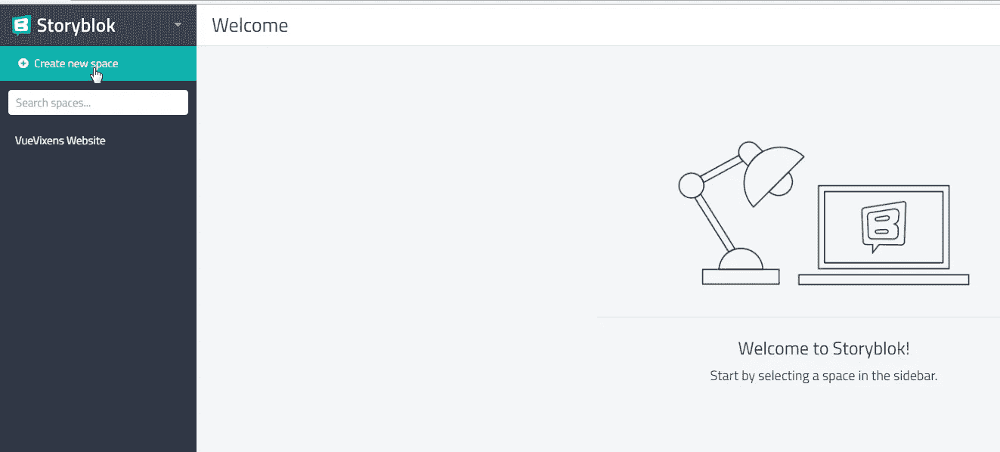

在 Storyblok 管理面板中创建空间

创建一个空间后，已经有一个名为“家”的*故事*,点击后会出现一个集成代码。这里最重要的是一个访问令牌(它也可以在“Dashboard”选项卡中找到)。

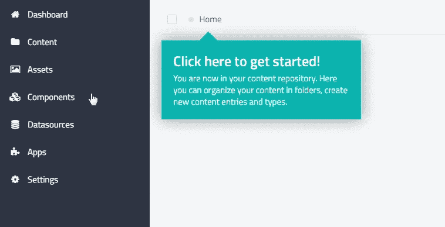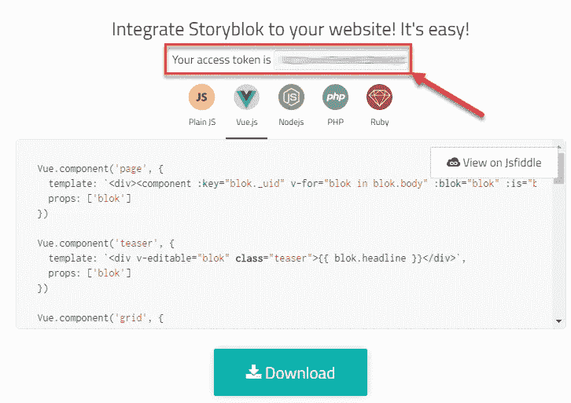

默认主页故事和集成令牌

有了这些数据，我开始将 Storyblok 集成到我们的应用程序中。首先，将 JS 桥脚本包含到`index.html:`中

```
<script type="text/javascript" src="//app.storyblok.com/f/storyblok-latest.js"></script>
```

并且安装了`storyblok-vue`插件:

```
npm install --save storyblok-vue
```

在`main.js`文件里面导入并使用了 Storyblok-Vue:

```
import StoryblokVue from 'storyblok-vue'
Vue.use(StoryblokVue);
```

要使用 Storyblok，我们必须用提供的访问令牌初始化它。我已经在我的根组件中完成了— `App.vue`

```
created() {
  this.$storyblok.init({
    accessToken: '<your-access-token-goes-here>'
  });
}
```

太好了！现在，我们已经可以从 Vue 应用程序访问我们的空间了。我们可以运行它，并将其地址(在大多数情况下，它将是`localhost:8080`)添加到集成页面或“设置”的“域”部分。有必要让您直接从应用程序视图中编辑 CMS 组件。

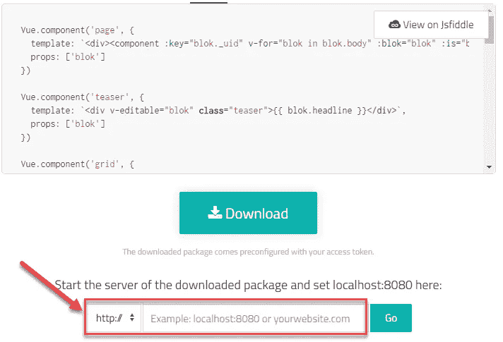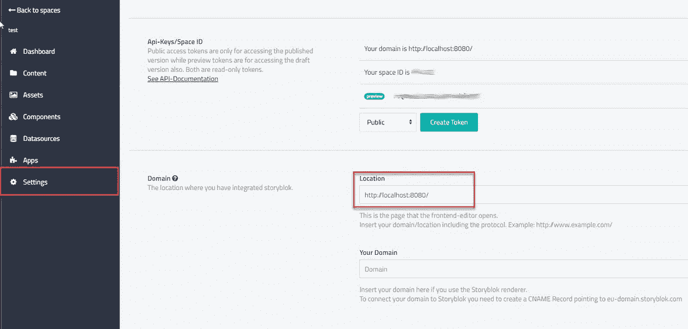

添加本地服务器地址

现在，当导航到“主页”故事时，我们可以看到我们的主页(尽管此时它相当静态)

# 写一个 mixin

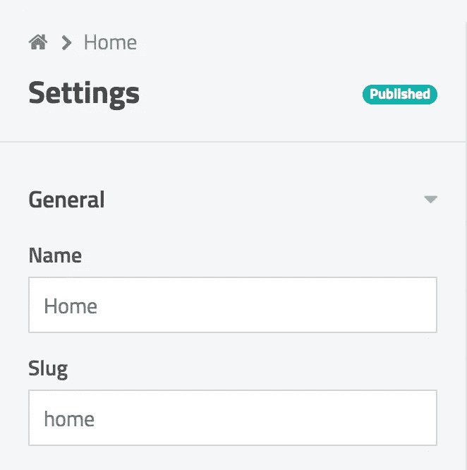

主页的 Slug 参数

要将任何故事加载到您的应用程序中，您需要它的 *slug —* 它可以在故事的左侧工具栏中找到。所以我们可以考虑像我们的应用程序页面这样的单个故事。

你可以在这个 [Storyblok JSFiddle 片段](https://jsfiddle.net/delooks/fmjmecf7/13/)中查看如何加载某个故事。我用这段代码创建了一个可重用的 mixin，它可以简单地包含在组件中，只需提供组件数据中的 slug 名称。

Mixin 代码如下:

```
export default {
  data() {
    return {
      *story*: {},
      *loading*: false,
    }
  },
  created: function () {
    this.*$storyblok*.on('change', () => {
      this.loadStory('draft')
    });
    this.*$storyblok*.on('published', () => {
      this.loadStory('draft')
    });

    this.*$storyblok*.pingEditor(() => {
      this.loadStory(this.*$storyblok*.inEditor ? 'draft' : 'published')
    })
  },
  *methods*: {
    loadStory(*version*) {
      this.*loading* = true;
      this.*$storyblok*.get({
        *slug*: this.*slug*,
        *version*: *version* }, (*data*) => {
        this.*story* = {
          *content*: {}
        };
        this.$nextTick(() => {
          this.*story* = *data*.*story*;
          this.*loading* = false;
        });
      }, (*error*) => {
        this.*loading* = false;
      });
    }
  }
}
```

# 向 CMS 添加内容

所以，现在我们准备添加一些 CMS 内容到我们的主页。我希望我们的主页事件列表可以从 CMS 管理面板编辑

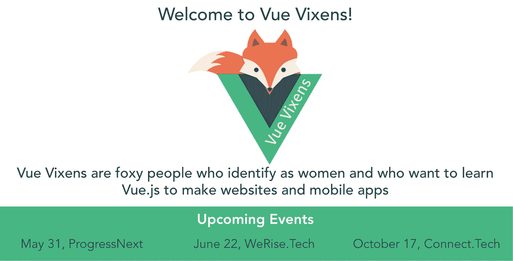

VueVixens 主页上的事件列表

我打开了“家”故事，选择了`Form only`编辑模式。

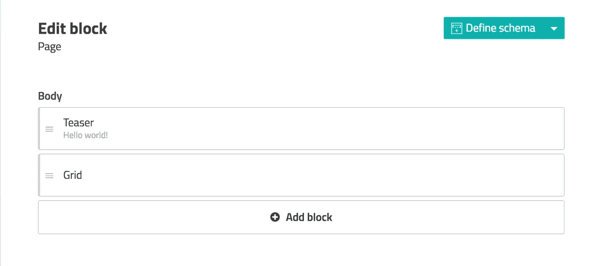

页面主体中有两个元素，`Teaser`和`Grid`——我真的不需要这个预告，所以我已经把它删除了。

我也删除了所有的`Feature`，因为我想用名为`Announce`的新区块来替换它们。每个公告都应该有一个名称(显示在主页的事件网格上)和一个指向事件页面的链接。因此，在删除特征后，我点击了`Add block`按钮，创建了一个新块。

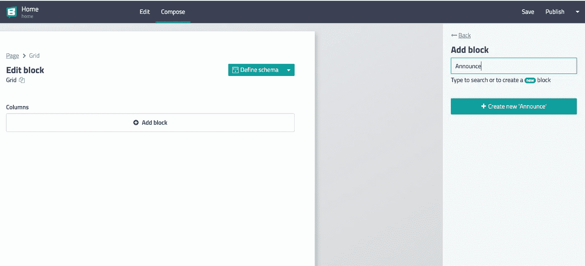

正在创建公告块

它有一个可嵌套的类型(意味着它不是一个根块，可以放在一个可嵌套的区域中)，并且包含两个字段:`name`(文本字段)和`url`(链接类型)

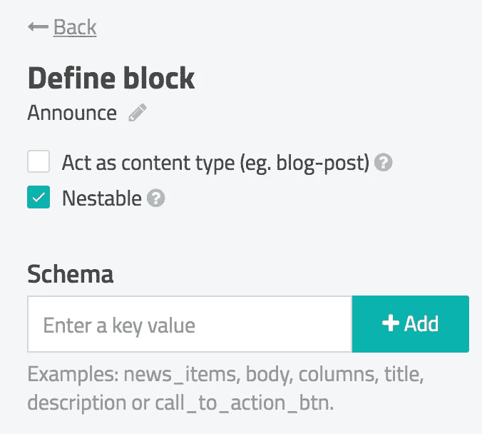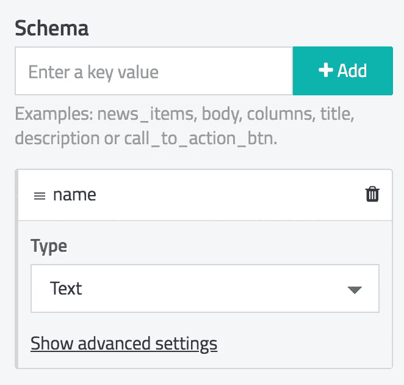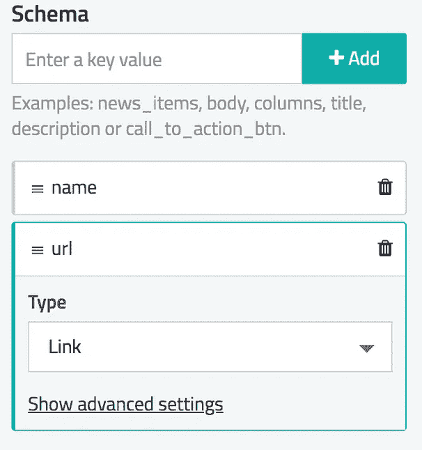

正在创建公告架构

> 不要忘记保存您的模式！

保存后，有一个表单编辑我们的第一个公告。起初，我只在名字中填入了`May 31, ProgressNext`文本。我还在`Grid`中增加了两个即将到来的事件公告

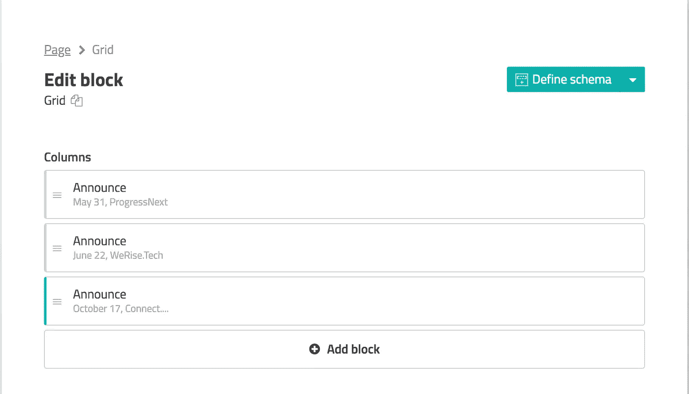

有三个公告的网格

# 在应用程序主页上显示 CMS 数据

为了将我们新创建的故事获取到`Home`组件中，我们必须包含 Storyblok mixin 并指定 slug(在故事中定义)

```
import storyblok from '../mixins/storyblok'
export default {
  *mixins*: [storyblok],
  data() {
    return {
      *slug*: 'home',
    }
  },
}
```

现在我们可以访问`story`对象了。它在 mixin 中被查询并保存到`story`属性中。这个对象的结构可以通过 Chrome DevTools 的网络选项卡轻松检查:

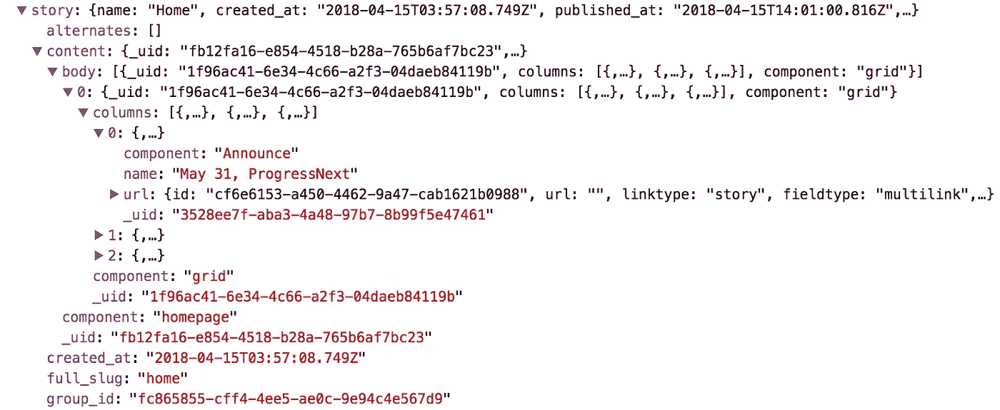

因此，我们必须获取`story.content.body[0].columns`内容以在组件模板中显示我们的公告(一些非标准的 HTML 标签来自`bootstrap-vue`

```
<**b-row** v-if=**"**!!*story*.*content* && !!*story*.*content*.*body***"**>
  <**b-col** v-for=**"***item* in *story*.*content*.*body*[0].*columns***"** :key=**"***item*.*name***"**>
    <**b-button** variant=**"link lg"** v-editable=**"***item***"**>**{{***item***.***name***}}**</**b-button**>
  </**b-col**>
</**b-row**>
```

`v-editable`指令允许我们在 Storyblok 管理面板“可视”模式下编辑块。

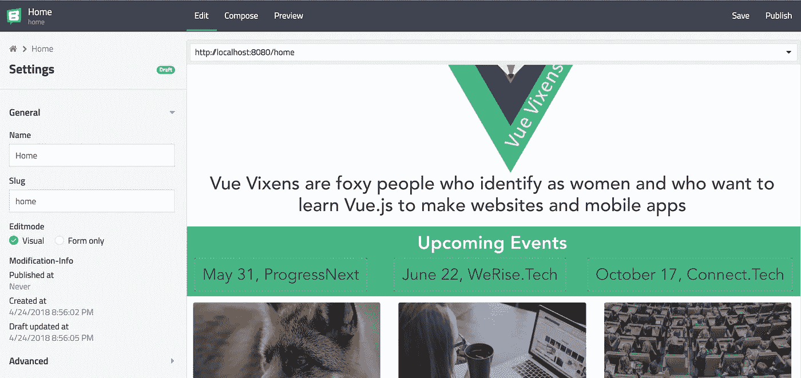

Storyblok 可视编辑模式

你可能会在我们的公告周围看到这些虚线；点击它们将打开某个公告的编辑表单。

耶，我们已经将第一个 CMS 数据集成到我们的应用程序中了！

# 用文件夹处理动态路线

在整合 CMS 之前，我们已经为每个事件页面建立了一个独立的静态路由。我想改变它的方式，当一个新的事件被创建时，它立即在一个匹配事件 slug 的路线上可用。

首先，我在路由器中添加了一条包含动态部分的新路由:

```
{
  *path*: '/events/:event',
  *component*: Event,
},
```

在 Storyblok 管理面板的“内容”选项卡中，我创建了一个名为`Events`的文件夹，并为它添加了一个新的默认类型，名为`event`

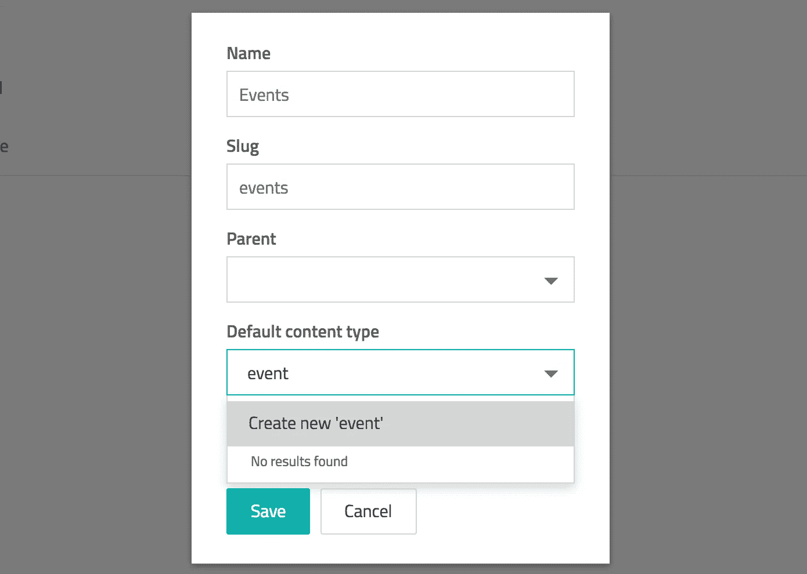

创建事件文件夹

之后，在“组件”选项卡中，我选择了`event`，勾选了`Act as content type (eg. blog-post)`，并添加了一些不同类型的字段。

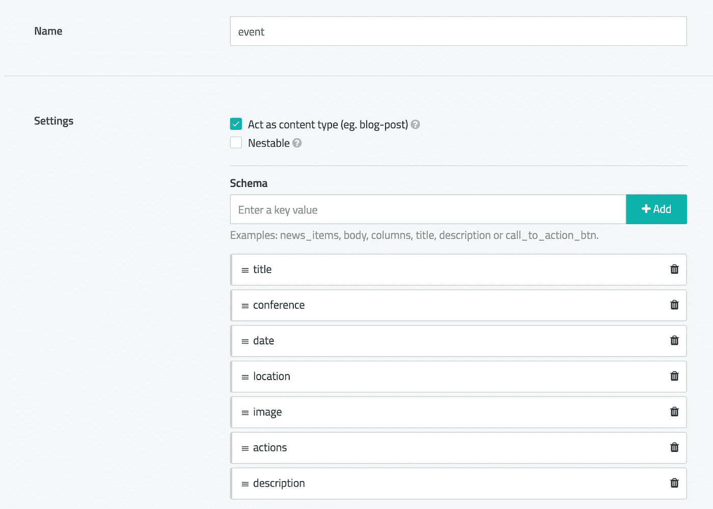

事件类型字段

这里使用的所有字段类型(`Image`、`Date/Time`、`Link`等)都非常直观，并且用 Storyblok 覆盖得非常好。请随意尝试不同的类型！

然后我回到“内容”= >“事件”并添加了一个名为`ProgressNext2018`的新故事，故事的段落完全相同。然后，我打开了这个新故事，并填写了所有字段

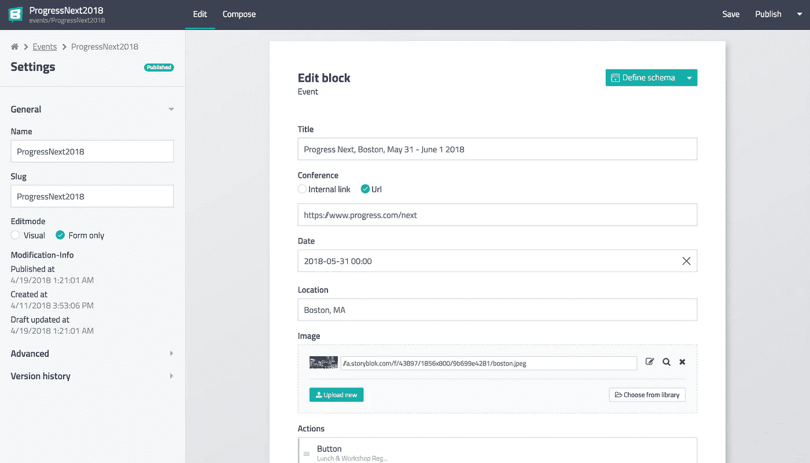

进展下一个事件数据

然后我切换到我的`Event`组件代码。我再次添加了一个 Storyblok mixin，并使用当前路径创建了一个计算属性，而不是从组件数据提供静态 slug:

```
import storyblok from '../mixins/storyblok'
export default {
  *mixins*: [storyblok],
  *computed*: {
    slug() {
      return `events/${this.$route.params.event}`;
    }
  },
}
```

因此，当我们在`events/ProgressNext2018`路线上时，我们将获取`events/ProgressNext2018`故事。当然，我们需要一个后备方案，以防没有故事与我们当前的路线相匹配。所以我又创建了一个计算属性:

```
*computed*: {
  currentEvent() {
    return this.*story*.*content* },
  slug() {
    return `events/${this.$route.params.event}`;
  }
},
```

并在组件包装器中添加了`v-if=**”**!!currentEvent**”**` (以及带有简单通用 404 组件的`v-else`案例)。

然后，我需要提供一个到我们主页事件列表的新组件的链接。因此，我转到“内容”= >“主页”= >“网格”，点击第一条公告，勾选`Internal link`选项，然后选择要链接的正确故事。

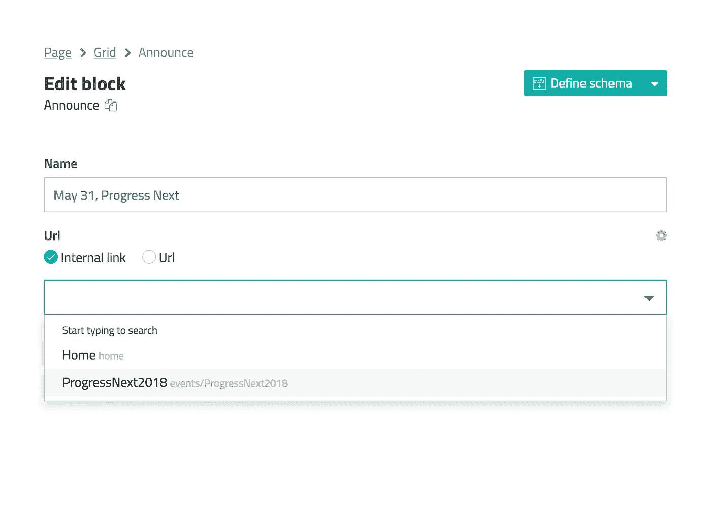

设置内部链接

在`Home`组件代码中，我已经向 link 元素添加了`:to`指令(它设置了到某个路由的路由器链接):

```
<**b-button** variant=**"link lg"** v-editable=**"***item***"** :to=**"***item*.*url*.cached_url**"**>**{{***item***.***name***}}**</**b-button**>
```

`cached_url`在 Storyblok 中用于路由器链接。

现在，点击“下一步进展”链接，我们将进入相应的活动页面(带有`ProgressNext2018`路线),并获取`ProgressNext2018`故事。

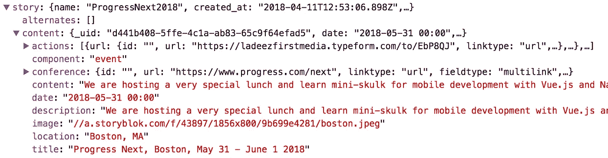

ProgressNext2018 响应结构

在将它的块解析成组件模板后，我们将得到类似这样的内容:

```
<**div** class=**"card"** v-editable=**"**currentEvent**"**>
  <**img** :src=**"**currentEvent.image**"** class=**"card-img-top"**/>
  <**div** class=**"card-body"**>
    <**h4** class=**"title"**><**p** align=**"center"**>**{{currentEvent.***title***}}**</**p**></**h4**>
    <**div** class=**"card-meta"**>
      <**p** v-if=**"**currentEvent.conference**"**>
        <**i** class=**"fas fa-link"**></**i**>
        <**a** :href=**"**currentEvent.conference.*url***"**>**{{currentEvent.conference.***url***}}**</**a**>
      </**p**>
      <**p** v-if=**"**currentEvent.*date***"**>
        <**i** class=**"far fa-calendar-alt"**></**i**>
        **{{currentEvent.***date***| moment('MMM Do, YYYY')}}** </**p**>
      <**p** v-if=**"**currentEvent.*location***"**>
        <**i** class=**"fas fa-map-marker-alt"**></**i**>
        **{{currentEvent.***location***}}** </**p**>
    </**div**>
    <**p**>
      **{{currentEvent.***description***}}** </**p**>
    <**p** align=**"center"**>
      <**template** v-for=**"***action* in currentEvent.*actions***"**>
        <**b-button** size=**"lg"** variant=**"success"** :key=**"***action*.*text***"** :href=**"***action*.*url*.*url***"**>
          **{{***action***.***text***}}** </**b-button**>
      </**template**>
    </**p**>
  </**div**>
</**div**>
```


所以对于每个新事件，我只需要在`Events`文件夹中创建一个新的`event`故事；在主页上创建新的`Announce`，并设置相应事件故事的发布链接。非常简单，不需要任何代码。

# 结论

我真的想保持简短(这里没有成功:)，所以我不会深入到事件结构或`Partners`页面。主要思想是展示如何从 Storyblok 获取故事数据，检查响应 JSON，并简单地在您的应用程序中使用它。我希望这篇文章能帮助任何想使用 CMS 并且已经有一个工作项目的人。