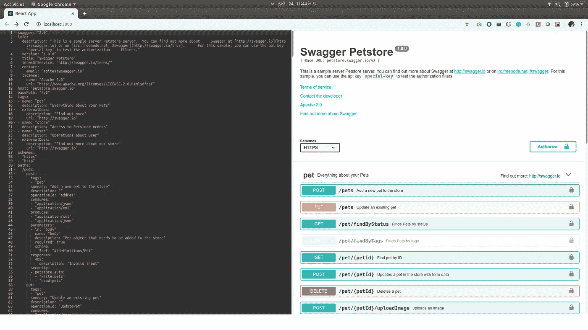

# 将 Swagger 编辑器与 React 应用程序集成

> 原文：<https://itnext.io/integrating-swagger-editor-with-your-react-application-e23e7c7a4625?source=collection_archive---------0----------------------->

最近，我在一个项目中工作，我必须将 Swagger 编辑器与 React 应用程序集成在一起。

但是，由于缺乏关于如何做到这一点的适当资源，我不得不深入研究代码，并确定如何在我们的应用程序中使用编辑器组件。所以，我想写这个小博客来告诉你我们该怎么做。

让我们从一个基本的 react 应用程序开始。

*npx create-react-app my-swagger-editor*

现在，安装 swagger-editor npm 模块。

*npm 安装招摇——编辑*

现在，让我们创建我们的编辑器。在应用程序中打开 App.js 文件，并添加以下导入。

在 render()函数中，创建一个带有 id 的空

。

然后添加 componentDidMount()函数，添加以下代码。

我们需要向 index.css 文件添加必要的样式。否则，嵌入式 swagger-ui 将无法滚动。:)

一切都准备好了。使用 *npm start* 运行您的应用程序。您将能够看到 swagger 编辑器打开。

# 添加一些功能。

我们已经将 swagger 编辑器集成到我们的应用程序中。我们可以对 swagger 文件做我们想做的修改。但是我们如何从中获取更新的内容呢？

swagger 编辑器有一个内置的拖放区。因此，我们不需要添加单独的组件来上传 swagger 文件。我要向你展示的是如何从编辑器中获取修改后的内容，并利用它做一些有用的事情。

Swagger 编辑器使用浏览器本地存储来存储编辑器内容。内容用一个键*‘swagger-editor-content*’存储。

您可以通过以下方式访问它:

*window . local storage . getitem(' swagger-editor-content ')；*

让我们通过添加一个保存 swagger 编辑器内容的按钮来修改我们的代码。

在本例中，我只将编辑器内容记录到控制台。但是你可以把它保存到一个文件中，或者根据你的需要把它发送到一个远程服务中进行存储。

您可以在我的 github 资源库[1]中找到完整的项目。

这是一个非常基本的帖子，让您知道如何将 swagger 编辑器与 react 应用程序集成在一起。

希望你喜欢。

[1][https://github.com/menakaj/my-swagger-editor](https://github.com/menakaj/my-swagger-editor)