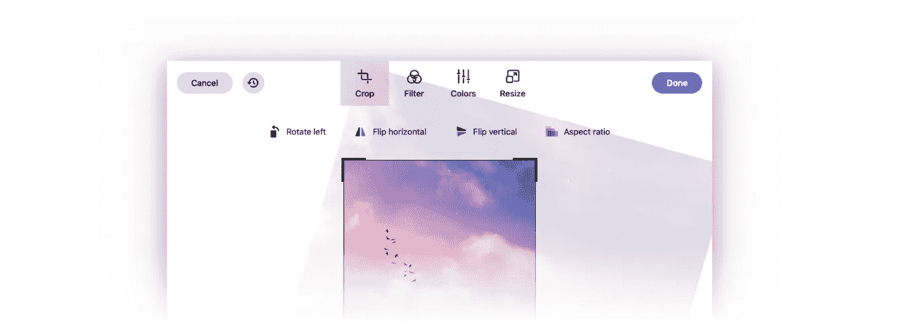
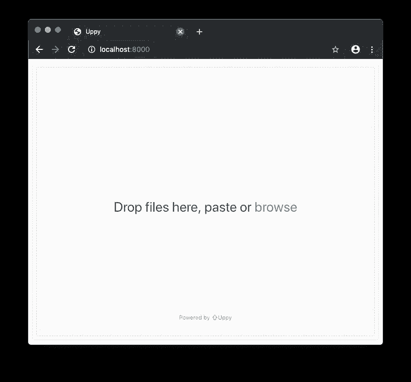
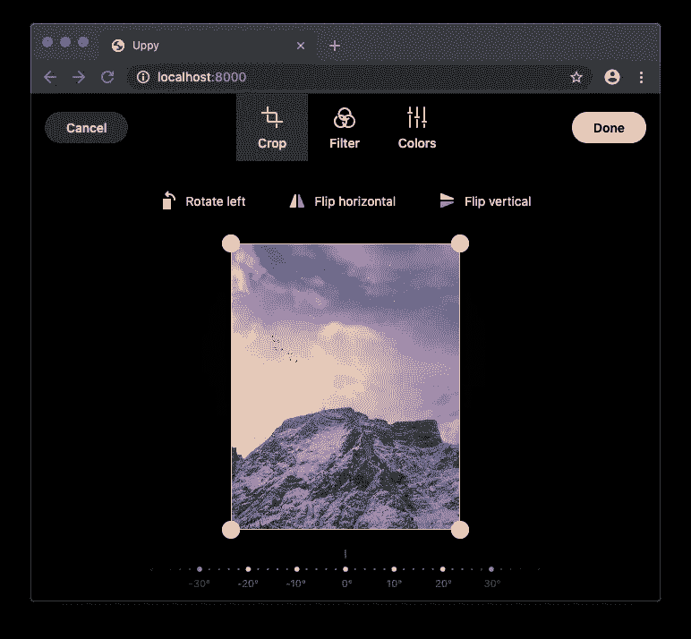
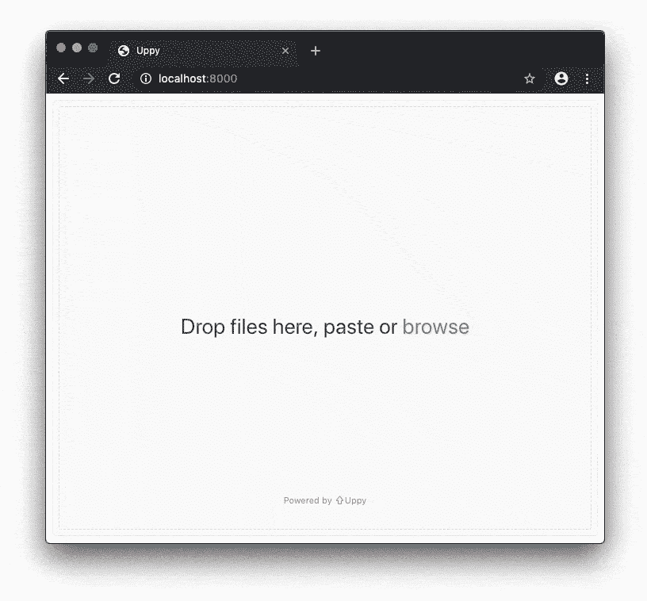

# 集成 Uppy 和多卡一个 JavaScript 图像编辑器

> 原文：<https://itnext.io/integrating-uppy-with-doka-a-javascript-image-editor-2bd8821f6adc?source=collection_archive---------5----------------------->

## Transloadit 最近发布了他们的 Uppy 文件上传程序的 1.0 版本。在本教程中，我们将整合 Uppy 和多卡视觉优化和压缩图像数据，然后再上传到服务器。



多卡图像编辑器

在将图像发送到服务器之前对其进行压缩和裁剪可以节省带宽，节省手动裁剪工作，并允许用户对自己的内容进行更多的控制。使用本文中描述的技术，使您的用户能够编辑他们上传到服务器的个人资料图片、相册或任何其他图像。同时仍然能够设置内容限制，如裁剪纵横比、最小图像大小和可用的过滤器。

我们将从默认的 [Uppy](https://uppy.io/) 实现开始。一旦我们启动并运行，我们将添加[多卡](https://pqina.nl/doka/)集成。

# 设置 Uppy

让我们从向页面添加 Uppy 样式表和脚本开始。

```
<!DOCTYPE html>
<html>
<head>
    <meta charset="UTF-8">
    <title>Uppy</title> **<!-- add the Uppy styles to the head -->
    <link href="**[**https://transloadit.edgly.net/releases/uppy/v1.2.0/uppy.min.css**](https://transloadit.edgly.net/releases/uppy/v1.2.0/uppy.min.css)**" rel="stylesheet">**

</head>
<body> **<!-- add the Uppy script to right before the closing body element -->
    <script src="**[**https://transloadit.edgly.net/releases/uppy/v1.2.0/uppy.min.js**](https://transloadit.edgly.net/releases/uppy/v1.2.0/uppy.min.js)**"></script>**</body>
</html>
```

现在我们将添加包含 Uppy 实例的 HTML 元素。

请注意，我已经缩短了样式和脚本标记，以保持代码片段的可读性。

```
<!DOCTYPE html>
<html>
<head>
    <meta charset="UTF-8">
    <title>Uppy</title>
    <link href="uppy.min.css" rel="stylesheet">
</head>
<body>
    **<!-- add the Uppy HTML element -->
    <div id="drag-drop-area"></div>** <script src="uppy.min.js"></script>
</body>
</html>
```

好了，让我们扩展`script`来加载 Uppy。

```
<body>
    <div id="drag-drop-area"></div>
    <script src="uppy.min.js"></script> **<!-- add the Uppy script init logic -->
    <script>
      var uppy = Uppy.Core()
        .use(Uppy.Dashboard, {
          inline: true,
          target: '#drag-drop-area'
        })
        .use(Uppy.Tus, {endpoint: '**[**https://master.tus.io/files/'**](https://master.tus.io/files/')**})****uppy.on('complete', (result) => {
        console.log('Upload complete! We’ve uploaded these files:', result.successful)
      })
    </script>**
</body>
```

刷新您的浏览器窗口，Uppy 现在应该如下所示:



你可以放下文件，也可以上传，这一切都会自动运行。

让我们继续多卡集成。

# 整合多卡和 Uppy

为了允许编辑图像，我们需要在图像被删除时加载多卡。我们可以通过利用`onBeforeFileAdded`函数来做到这一点。

然而，首先我们需要添加多卡脚本和样式。

```
<!DOCTYPE html>
<html>
<head>
    <meta charset="UTF-8">
    <title>Uppy</title>
    <link href="uppy.min.css" rel="stylesheet"> **<!-- add the Doka style tag -->
    <link href="doka.min.css" rel="stylesheet">**
</head>
<body>
    <div id="drag-drop-area"></div>
    <script src="uppy.min.js"></script> **<!-- add the Doka script tag -->
    <script src="doka.min.js"></script>**
</body>
</html>
```

现在我们将连接 Uppy `onBeforeFileAdded`函数。我们将放大 JavaScript 代码，使其更易于阅读。

`onBeforeFileAdded`功能允许我们验证丢弃的文件。如果我们返回`false`，文件将被拒绝，如果我们返回`true`，它将被添加到列表中。我们需要编辑文件，然后将用户编辑的结果添加到文件列表中。

我们需要做的是:

1.  防止添加原始文件
2.  用多卡编辑原始文件
3.  将多卡返回的文件添加到列表中

让我们从防止文件被添加开始。

```
**// our uppy options object
var uppyOptions = {
    onBeforeFileAdded: function(file) {** **// prevent the file from being added
        return false;** **}
}**// initialise Uppy
var uppy = Uppy.Core(**uppyOptions**)
    .use(Uppy.Dashboard, {
        inline: true,
        target: '#drag-drop-area'
    })
    .use(Uppy.Tus, {endpoint: '[https://master.tus.io/files/'](https://master.tus.io/files/')})
```

现在我们需要编辑刚刚被多卡拒绝的文件。我们将放大`uppyOptions`对象。

我们创建我们的多卡实例，然后我们用多卡`edit`文件数据。

```
**// create our Doka instance
var doka = Doka.create({
    utils: ['crop', 'filter', 'color']
});**var uppyOptions = {
    onBeforeFileAdded: function(file) { **// edit the file data with Doka
        doka.edit(file.data);** return false;
    }
}
```

太好了，多卡图像编辑器现在可以在拖放文件时打开。



当在多卡编辑器中按下 Done 按钮时，`Doka.edit`函数返回一个用 file 对象解析的`Promise`。当这种情况发生时，我们希望将结果文件返回给 Uppy。

```
var uppyOptions = {
    onBeforeFileAdded: function(file) { doka.edit(file.data).then(output => { **// add the Doka edit result back to Uppy
            uppy.addFile({
                ...file,
                data: output.file
            });**

        }); return false;
    }
}
```

这很好，但现在我们在兜圈子。当文件被多卡编辑时，输出文件被添加到 Uppy，然后再次被多卡编辑，这样继续下去，直到没有字节可编辑为止。不太好。

我们需要告诉 Uppy，正在添加的文件已经被编辑过了。让我们通过向文件添加一个特殊属性来实现这一点。

```
var uppyOptions = {
    onBeforeFileAdded: function(file) { **// only allow file if special boolean property is present
        if (file.handledByDoka) return true;** doka.edit(file.data).then(output => {
            uppy.addFile({
                ...file,
                data: output.file,

                **// add a special boolean to the file
                handledByDoka: true**
            });
        }); return false;
    }
}
```

就是这样！

当用户放下一个图像时，该图像现在被发送到多卡，然后用户可以编辑该图像，结果数据被发送到 Uppy。我们通过将`handledByDoka`属性设置为`true`来记住这个编辑。

通过设置裁剪纵横比、最小图像大小、可用的实用程序，您现在可以控制在图像数据上传到服务器之前允许用户编辑多少图像数据。

请注意，上面的例子不处理多个文件，这将触发一次多个图像编辑。多卡图书馆附带了一个方便的`useDokaWithUppy`功能，可以将图像排队，让它们很好地等待被编辑。

使用这个函数，JavaScript 代码片段现在看起来像这样:

```
// connect with `useDokaWithUppy` and pass Doka properties
var uppyOptions = {
    **onBeforeFileAdded: useDokaWithUppy({
        utils: ['crop', 'filter', 'color']
    })**
};// initialise Uppy
var uppy = Uppy.Core(uppyOptions)
    .use(Uppy.Dashboard, {
        inline: true,
        target: '#drag-drop-area'
    })
    .use(Uppy.Tus, {endpoint: '[https://master.tus.io/files/'](https://master.tus.io/files/')})
```

您现在可以使用 Uppy 文件上传库和多卡一起处理图像上传。

请看下面的结果。



[在产品网站上了解更多关于多卡的信息](https://pqina.nl/doka/)

如果你正在使用 DropZoneJS，你可能也会对[将 DropzoneJS 与 JavaScript 图像裁剪器集成以优化图像上传感兴趣](/integrating-dropzone-with-javascript-image-cropper-optimise-image-upload-e22b12ac0d8a)