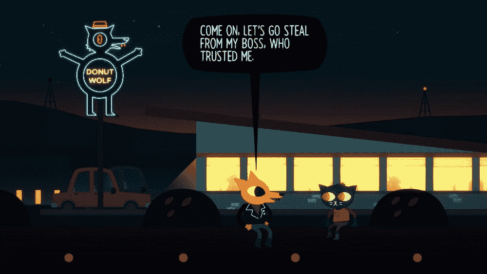
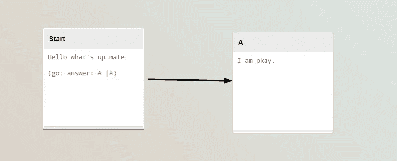
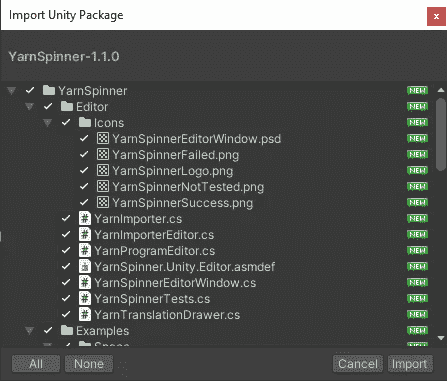
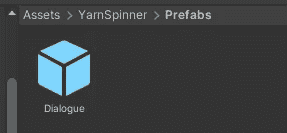
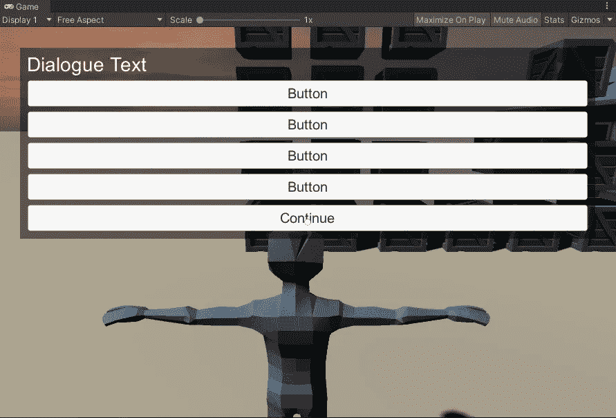
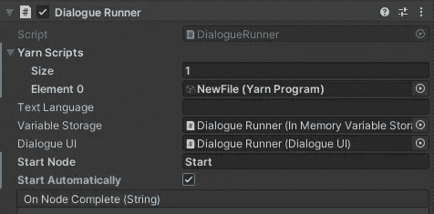
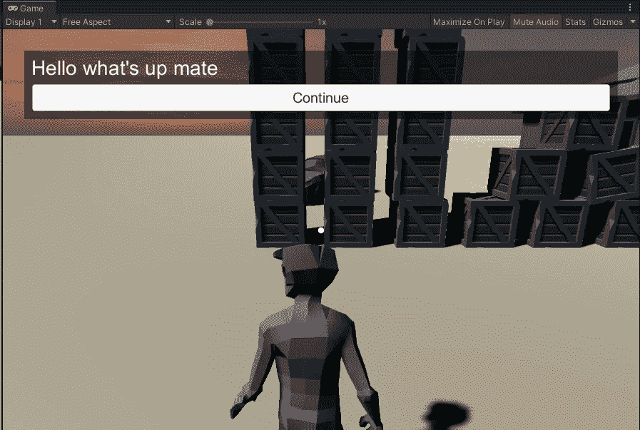

# (第五部分)将 YarnSpinner 对话系统集成到您的 Unity 游戏中

> 原文：<https://itnext.io/integrating-yarnspinner-conversation-system-into-your-unity-game-part-5-of-my-gamedev-series-bdc61b9d3bf7?source=collection_archive---------5----------------------->

Yarn Editor and Yarn Spinner 是一个用于轻松创建对话的框架，由 *Night In The Woods* 的作者创建。您将它们创建为节点树，保存为 json，框架会处理剩下的事情。

树林中的夜晚

 [## 纺纱机-秘密实验室

### 复杂的故事不一定要复杂才能构建。我们已经看到了 Twine 是如何让您比以往任何时候都更容易…

www.secretlab.com.au](https://www.secretlab.com.au/blog/2016/2/10/yarn-spinner) 

安装纱线编辑器工具。它将使你能够轻松地为你的游戏编写对话。像这样:

 [## yarnspinertool/YarnEditor

### 今天就创建您的免费 GitHub 帐户，订阅这个新版本库，并与 50…

github.com](https://github.com/YarnSpinnerTool/YarnEditor/releases) 

请访问 YarnSpinner github 并下载最新版本(。unitypackage)。将包导入到您的 Unity 项目中。

 [## yarnspinertool/yarnspiner

### Spinner v1.1 为创建内容添加了强大的新功能，并改善了开发体验…

github.com](https://github.com/YarnSpinnerTool/YarnSpinner/releases/tag/v1.1.0) 

因为 1.0 版的纺纱工有一个预置，它设置了你通常需要自己设置的所有东西。所以，把它拖进来。

它提供了画布和对话运行器、ui 和事件系统。

现在只需分配您的自定义 yarn 对话文件，或者只使用他们的示例文件— Sally 或 Ship。

我在 Yarn Editor 中创建了一个基本的对话，将其保存为 Yarn 并导入到 Unity 中。

然后把它连接到 Dialogue Runner，设置 Start 节点为 Start 并勾选 Start Automatically，因为我还没有任何 NPC 可以与之交互。

按播放，对话开始！

另一个步骤是将对话转轮添加到 NPC 中。

教程的下一部分:

 [## 在 Unity 中用隔空砖块杀死敌人[游戏开发教程第 6 部分]

### 在本教程中，我将向你展示如何用砖块杀死敌人，使用统一碰撞。

medium.com](https://medium.com/@janjilecek/killing-enemies-with-telekinetic-bricks-in-unity-gamedev-tutorial-part-6-4d43874eae29)