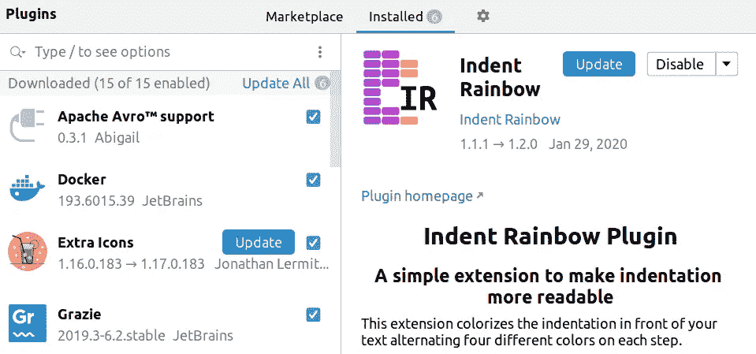
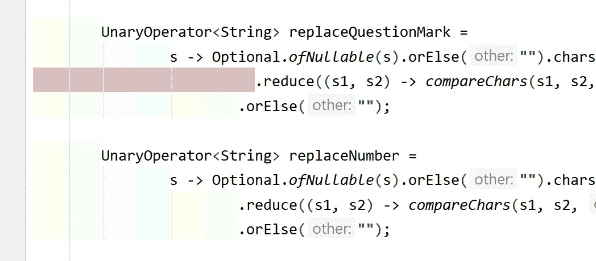
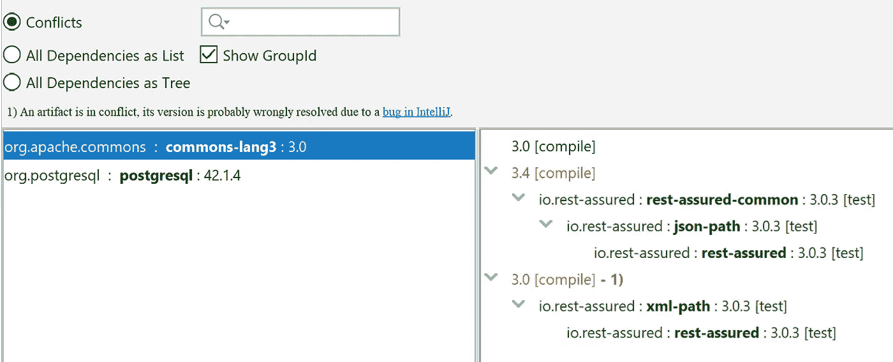
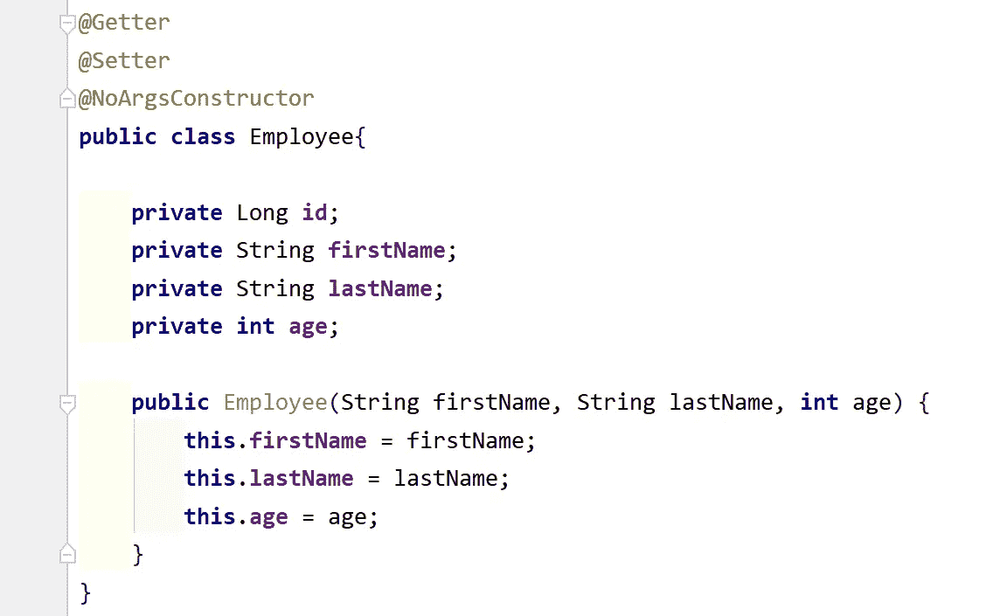
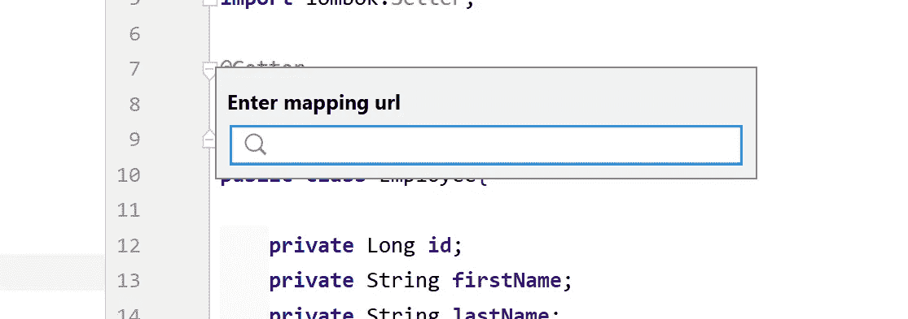
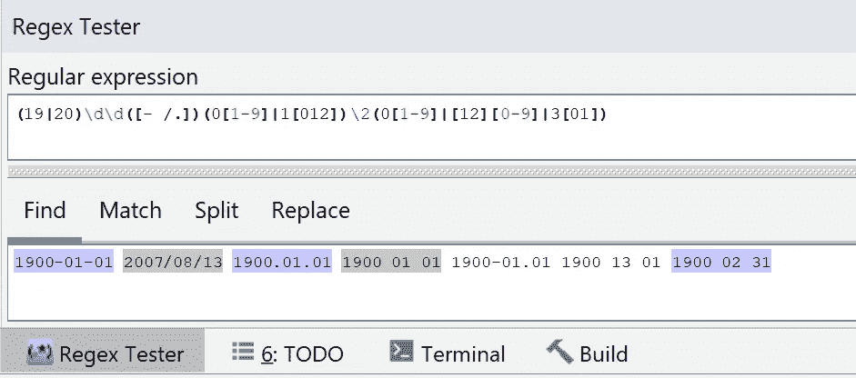
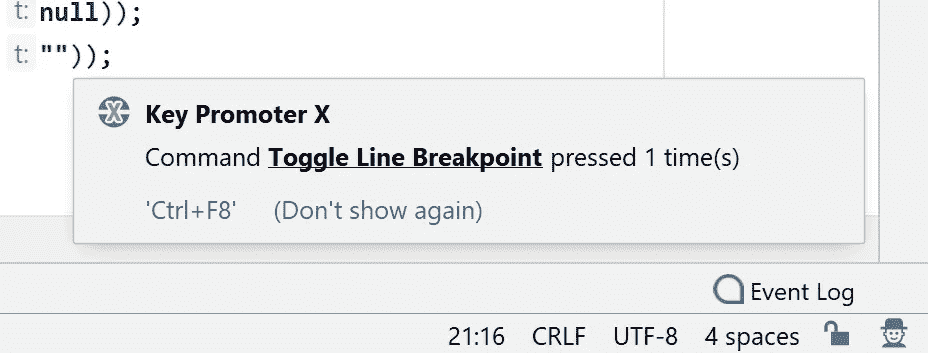
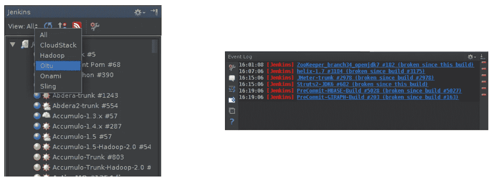
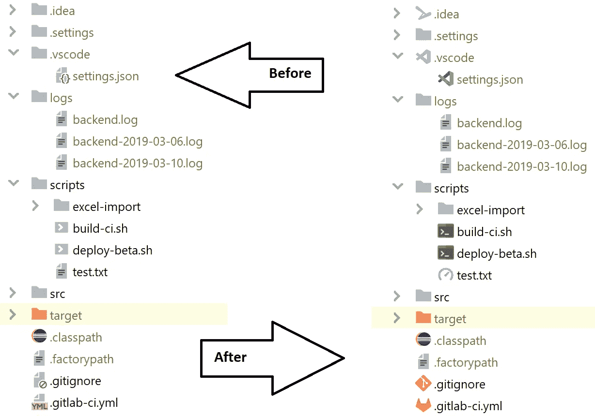

# 每个 Java 开发者都需要的 IntelliJ IDEA 插件

> 原文：<https://itnext.io/intellij-idea-plugins-which-every-java-developer-need-to-have-6017ef5c3de4?source=collection_archive---------0----------------------->

## 用 IntelliJ 理念让生活更快乐

我是一个完全沉迷于 IntelliJ 思想的 Java 开发人员。过去，我使用 NetBeans IDE(从版本 4.5 开始)并且玩得很开心，但是在开始使用 IntelliJ IDEA(大约 8 年前)开发之后，我就不能再使用 NetBeans 了。我习惯了 IntelliJ IDEA Community Edition(免费开源版本)，发现它对于 Java 和 Scala 开发来说非常棒(也更快)。在这篇文章中，我将介绍一些有用的 IntelliJ IDEA 插件，它们可以帮助我进行日常编码:

## [缩进彩虹](https://plugins.jetbrains.com/plugin/13308-indent-rainbow)和[彩虹括号](https://plugins.jetbrains.com/plugin/10080-rainbow-brackets/)

Java 编程语言使用括号来定义代码块，并且在 Java 程序代码中有几个嵌套的代码块。随着 Java 世界中函数式编程和反应式编程的流行，Java 代码中会有几个嵌套的块、缩进和括号。这两个插件帮助你更好地控制 Java 代码中的缩进和括号。[彩虹括号](https://plugins.jetbrains.com/plugin/10080-rainbow-brackets/)插件给你代码中的括号上色，这样你就可以很容易地通过颜色找到匹配的括号。缩进彩虹插件给代码的缩进着色，这个插件显示哪些行没有合适的红色缩进等级，这非常有用。

## [Maven 助手](https://plugins.jetbrains.com/plugin/7179-maven-helper)

如果你像我一样使用 IntelliJ IDEA Community Edition，并希望看到 Maven 项目的分层依赖关系，并在其中搜索或找到冲突和循环， [Maven Helper](https://plugins.jetbrains.com/plugin/7179-maven-helper) 是非常适合你的工具。

## [BashSupport](https://plugins.jetbrains.com/plugin/10080-rainbow-brackets)

BashSupport 提供了一个几乎完整的开发环境来处理 Bash 脚本，但 IntelliJ IDEA 附带了一个用于 shell 脚本的捆绑插件(来自 2019.2 版本)，它比 [BashSupport](https://plugins.jetbrains.com/plugin/10080-rainbow-brackets) 更轻。捆绑的 Shell 脚本插件与 BashSupport 不兼容，您不能同时使用 BashSupport 和捆绑的 Shell 脚本插件，应该禁用其中一个。一般来说，捆绑的 Shell 脚本插件对于基本的日常功能来说已经足够了，并且提供了更好的集成，但是如果你需要更高级的功能，比如重命名重构、文档查找、检查和……[bash support](https://plugins.jetbrains.com/plugin/10080-rainbow-brackets)将是你的选择。

将会有一个新的付费的 [**BashSupport Pro**](https://www.bashsupport.com/) 插件，提供高级支持来使用 Shell 脚本。它仍在积极开发中，将于 2020 年初上市。

## [龙目岛](https://plugins.jetbrains.com/plugin/6317-lombok)

我不想说 [Lombok 库](https://projectlombok.org/)的好处，但是如果你不想在你的 Java 类中编写另一个 getter 或 equals 方法，并且想要一个全功能的构建器，自动化你的日志记录变量，以及在你的类中使用一个注释等等，我建议使用 [Lombok 库](https://projectlombok.org/)，然后你需要安装这个插件来访问由 Lombok 库在 IntelliJ IDEA 中生成的东西！

## [请求映射器](https://plugins.jetbrains.com/plugin/9567-request-mapper)

如果你正在使用 Spring MVC (Boot)，JAX-RS，或者 Micronaut 来开发 REST API 或者 Java 的 web 应用，通过使用这个插件，你可以在这些框架中的 URL 映射声明之间快速找到并导航。按下`Ctrl (cmd) + Shift + Back slash`可以开始导航。

## [Json 解析器](https://plugins.jetbrains.com/plugin/10650-json-parser)

当我使用 ELK 或 Splunk 等监控和日志聚合工具来检查临时或生产服务器中的某些东西时，我通常需要一个 JSON 解析器。为什么我们应该使用在线服务在浏览器中搜索、格式化和验证 JSON？生产服务器日志安全吗？JSON 解析器插件使得在 ide 内部和离线时搜索、格式化和验证 Json 更加容易。

## [串操纵](https://plugins.jetbrains.com/plugin/2162-string-manipulation)和[茶座](https://plugins.jetbrains.com/plugin/7160-camelcase)

CamelCase 插件功能有限，专注于案例之间的切换，您可以在 CamelCase、CamelCase、snake_case 和 SNAKE_CASE 之间轻松切换。按下`SHIFT + ALT + U`。

[字符串操作](https://plugins.jetbrains.com/plugin/2162-string-manipulation)插件具有更高级的特性，并提供文本操作动作，如**切换大小写**、**大写**、**小写**、**反转大小写**、**编码/解码**、**递增/递减**、**排序**、**对齐**、**过滤**和…

没有更多的解释，请看下面的照片:

## [RegexpTester](https://plugins.jetbrains.com/plugin/2917-regexptester)

实际上，我并没有发现这个插件非常方便，但是对于在 ide 中测试正则表达式来说，它总比没有好。

## [关键启动子 X](https://plugins.jetbrains.com/plugin/9792-key-promoter-x)

如果你想学习更多的 IntelliJ IDEA 快捷方式，这个插件是为你准备的。当您在 IntelliJ IDEA 中的按钮上使用鼠标时，[按键提示器 X](https://plugins.jetbrains.com/plugin/9792-key-promoter-x) 会向您显示本应在弹出窗口中使用的键盘快捷键，对于没有快捷键的按钮，[按键提示器 X](https://plugins.jetbrains.com/plugin/9792-key-promoter-x) 会提示您可以直接创建一个快捷键。

## [詹金斯控制插件](https://plugins.jetbrains.com/plugin/6110-jenkins-control-plugin)

如果你的团队使用 Jenkins 做 CI 和 CD，这个插件会很有帮助，因为你不需要经常在浏览器中查看 Jenkins 的主页。当然，这不是一个完美的插件，但总比没有好。

## [额外图标](https://plugins.jetbrains.com/plugin/11058-extra-icons)

这个图标包为 GitLab 和 Travis 配置、package.json、shell 脚本、lint config 和许多其他文件类型等特殊文件提供了新图标。

# 结论

这是我最喜欢的 IntelliJ IDEA 插件列表，它让我每天都更有效率。当你启动 IntelliJ IDEA 并要求捐款时，一些插件显示弹出窗口或对话框，这让我很恼火，但我宁愿忽略而不是删除这些插件。