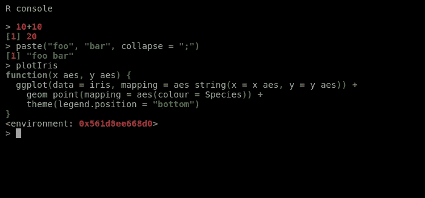

# 用于闪亮应用的交互式 R 调试器(REPL)

> 原文：<https://itnext.io/interactive-r-debugger-repl-for-shiny-apps-87c769be4859?source=collection_archive---------7----------------------->

我想到这个主意是为了帮助调试 R 闪亮的应用程序，当它运行时你可以与之交互。当闪亮的应用程序运行时，你可以在 R 控制台上输入任何内容。

于是我就想，用 JavaScript 写的浏览器内部交互 shell 可以吗？这个帖子是我写这个交互 shell 的结果。



首先，当我们想要编写 R 语言解释器时，我们需要 eval 函数，它将返回一个字符串的结果。这个函数看起来像这样。

```
r.eval <- **function**(code) {
  paste(capture.output(eval(parse(text = code))), collapse = "\n")
}
```

现在，在 JavaScript 中，我们需要从浏览器向 R 进程发送我们想要评估的字符串。

```
**var** index = 0;
**function** exec(str) {
  **var** id = index++;
  Shiny.onInputChange('__EVAL__', {id: id, value: str});
}
```

我们使用非常不寻常的事件名称，你应该选择另一个，这样你就不会被黑客攻击，如果有人试图在你的应用程序中公开这个字符串。另一种解决方案是只为特定用户(如开发人员或管理员)添加这些代码。

我们以后会改进这个函数，它将是从 r 返回一个承诺和结果的函数。

现在我们需要编写 observeEvent(在服务器函数内部)，从 JavaScript 中获取值，在 R 中计算该值，并将结果发送回浏览器。

```
observeEvent(input[["__EVAL__"]], {
  data <- input[["__EVAL__"]]
  tryCatch({
    payload <- list(id = data$id, result = r.eval(data$value))
    session$sendCustomMessage("__EVAL__", payload)
  }, error = function(cond) {
    error <- paste(capture.output(traceback(cond)), collapse = "\n")
    payload <-  list(id = data$id, error = error) 
    session$sendCustomMessage("__EVAL__", payload)
  })
})
```

在 R 里面我们什么都有。接下来我们需要更好的 JavaScript 代码。如果您不关心这些代码，并且想要解决方案，那么最后有一个书签，可以用来创建终端，而无需编写任何 JavaScript。

对于那些想要跟随的人，我们需要编写更好的 exec 函数。这是:

```
**var** exec = (**function**() {
  **var** handlers = [];
  **if** (**typeof** Shiny !== 'undefined') {
    Shiny.addCustomMessageHandler("__EVAL__", **function**(data) {
      handlers.forEach(**function**(handler) {
        handler(data);
      });
    });
  }
  **var** index = 0;
  **function** exec(str, callback) {
    **if** (!str.trim()) { // no data
      **return** Promise.resolve();
    }
    **return** **new** Promise(**function**(resolve, reject) {
      **var** id = index++;

      handlers.push(**function** handler(data) {
        **if** (data.id === id) {
          **if** (data.error) {
            reject(data.error);
          } **else** {
            resolve(data.result);
          }
        }
        handlers = handlers.filter(**function**(f) {
          **return** f !== handler;
        });
      });
      Shiny.onInputChange('__EVAL__', {id: id, value: str});
    });
  }
  **return** exec;
})();
```

代码使用 ES5 语法，可以随意重构它以使用 ES6 (ES2015)或任何新版本 JavaScript。

现在你可以在 JavaScript 开发工具控制台 writs 中评估 R 代码并得到响应:

```
await exec("10 + 10")
[1] 20
```

顶级 await 可能只在开发人员工具中工作。如果不起作用，您可以使用:

```
exec("10 + 10").then(result => console.log(result));
```

现在所有需要做的，就是写一个好看的终端，这样你就可以输入命令并从闪亮的应用程序中得到响应。我会用我的 [JavaScript 库 jQuery 终端](https://terminal.jcubic.pl/)。

我们需要首先包含库:

```
<script src="[https://unpkg.com/jquery.terminal/js/jquery.terminal.min.js](https://unpkg.com/jquery.terminal@2.10.0/js/jquery.terminal.min.js)"></script>
<link href="[https://unpkg.com/jquery.terminal/css/jquery.terminal.min.](https://unpkg.com/jquery.terminal@2.10.0/js/jquery.terminal.min.js)css" rel="stylesheet"/>
```

我们还可以突出显示 R 语法，这样看起来更好。我们需要这个 html 包含适当的库:

```
<link href="https://unpkg.com/prismjs/themes/prism-coy.css" rel="stylesheet"/>
<script src="https://unpkg.com/prismjs/prism.js"></script>
<script src="https://unpkg.com/jquery.terminal/js/prism.js"></script>
<script src="https://unpkg.com/prismjs/components/prism-r.min.js"></script>
```

添加完依赖项后，我们需要创建终端。我们希望终端在屏幕的底部，所以我们首先编写基本的 html 结构。

```
<div class="shell-wrapper">
  <span class="shell-destroy">[x]</span>
  <div id="r-term"></div>
</div>
```

现在我们需要给出一些风格:

```
.terminal {
  **--size**: 1.2;
  **height**: 100%;
}
.shell-wrapper {
  **position**: fixed;
  **z-index**: 99999;
  **bottom**: 0;
  **left**: 0;
  **right**: 0;
  **height**: 150px;
}
.shell-destroy {
  **position**: absolute;
  **right**: 10px;
  **color**: #ccc;
  **top**: 10px;
  **z-index**: 10;
  **cursor**: pointer;
  **font-family**: monospace;
}
```

现在最后的部分是创建具有交互式 R shell 的终端。

```
**var** term = $('#r-term').terminal(**function**(cmd, term) {
  **if** (!cmd.trim()) {
    // we ignore empty command but exec will also handle that
    **return**;
  }
  **return** exec(cmd).then(**function**(result) {
    result = result.trim();
    **if** (result) {
      term.echo($.terminal.escape_brackets(result));
    }
  }).catch(**function**(e) {
    term.error(e);
  });
}, {
  greetings: 'R console\n'
});
```

现在你在浏览器中有了真正终端，用 JavaScript 给你真正的交互式会话。

你也可以用一个叫做 tilda 的插件来代替上面的代码，你只需要用 tilda 来代替终端。你的应用程序中会有类似雷神之锤的控制台，当你按下键盘上的 tidla ~时就会打开。

Tidla 可以在 [GitHub 上找到，作为 jQuery 终端示例之一](https://github.com/jcubic/jquery.terminal/blob/master/examples/tilda-demo.html)。像 R 控制台一样添加 Quake 是留给读者的练习。

正如我所承诺的,[这里是书签的链接,](https://gist.github.com/jcubic/665c15b9867ef8d0d6f6f2f4509fa1f7),它看起来不是很好，但它有这篇文章的所有内容。它加载所有的文件，你可以点击它多次，它会破坏以前的终端。

**更新:**

当我将这个调试器集成到我闪亮的应用程序中时，我做了一些改进，我想分享一下。

我创建了两个函数 **debugger.init()** 和 **debugger()** 。Init 应该在服务器函数内部调用，因为它需要**输入**和**会话**。而调试器功能可以用来改变上下文，解释器在计算表达式，就像 **browser()** 一样，但是 app 还在运行。

这是代码，可以放在一个包里。

```
#' To use Debugger you need to call debugger.init(input, session)
#' inside shiny server function. Then you need complementary JS code
#' that is avaiable as bookmarklet. Then in any context you can
#' call debugger function to change the context (it's optional).
#' If you call that function in constructor  you will be able 
#' to access self and private properties of the object.#' eval to string function that work the same as R REPL
#' [**@param**](http://twitter.com/param) code - string to evaluate
#' [**@param**](http://twitter.com/param) env - enviroment in which to evaluate the code
#' [**@export**](http://twitter.com/export)
r.eval <- function(code, env = parent.frame()) {
  paste(
    capture.output(eval(parse(text = code), envir = env)),
    collapse = "\n"
  )
}#' debugger environment
.global <- list2env(list(env = NULL))#' function to use instead of browser() and put context of debugger in this place
#'[**@export**](http://twitter.com/export)
debugger <- function() {
   .global$env <- parent.frame()
}#' Initialization of the debugger
#' [**@param**](http://twitter.com/param) input - shiny input
#' [**@param**](http://twitter.com/param)session - shiny session
#' [**@export**](http://twitter.com/export)
debugger.init <- **function**(input, session, env = parent.frame()) {
  .global$env <- env
  shiny::observeEvent(input[["__EVAL__"]], {
    data <- input[["__EVAL__"]]
    tryCatch({
      payload <- list(
        id = data$id,
        result = r.eval(data$value, env = .global$env)
      )
      session$sendCustomMessage("__EVAL__", payload)
    }, error = function(cond) {
      error <- paste(
          capture.output(traceback(cond)),
          collapse = "\n"
      )
      payload <-  list(id = data$id, error = error)
      session$sendCustomMessage("__EVAL__", payload)
    })
  })
}
```