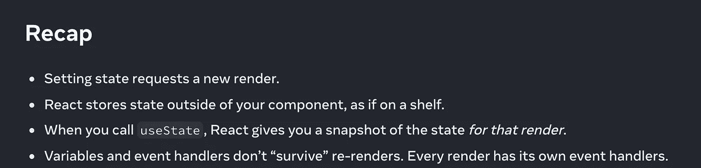
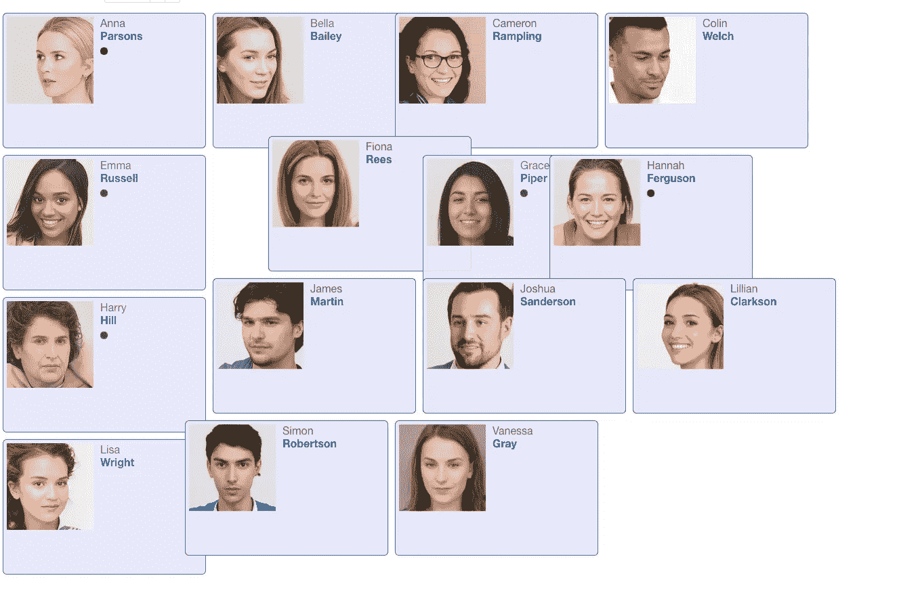

# 截取组件状态以确保平滑的动画转换

> 原文：<https://itnext.io/intercepting-component-state-to-ensure-smooth-animated-transitions-4facd46414dd?source=collection_archive---------3----------------------->

剧透:本文中的全部代码可以直接在你的浏览器中运行(不需要任何编译)。默认情况下，它甚至在一个 [WebWorker](https://developer.mozilla.org/en-US/docs/Web/API/Web_Workers_API/Using_web_workers) 中运行。

我们将介绍如何创建动画数据视图，以及实时调整已经运行的过渡。

例如，潜在的使用案例是基于网络的商店，在这些商店中，我们希望增强产品概述或包含客户或联系人的视图的用户体验。

# 内容

1.  演示视频
2.  详细的问题
3.  如何在应用程序中使用动画列表？
4.  需求:一个集合(数据存储)实现
5.  深入 list.plugin.Animate
6.  代码和在线演示
7.  改进想法
8.  学习 neo.mjs
9.  埃森哲正在德国招聘 neo.mjs 开发人员

# 1.演示视频

您可以在这里观看最终实现的视频:

# 2.详细的问题

要将数据视图转换成动画列表，我们需要支持 3 种操作:

1.  添加:淡入项目
2.  移动:调整项目位置
3.  移除:淡出项目

add 操作已经很特别了。虽然我们可以依靠 CSS 来创建淡入效果:

`transition: opacity 500ms ease-in-out;`

添加不透明度为 1 的新项目不会创建动画，因此我们需要先添加不透明度为 0 的新项目，然后在一个刻度后将不透明度更改为 1。

我们需要确保不透明度的变化发生在下一个`requestAnimationFrame()`调用中，所以为了安全起见，我们可以增加一个延迟，例如 50 毫秒。实际上，我们希望开始移动并移除回调中的 OPs，以确保所有动画同时结束。

对于移动操作，我们只需要改变绝对位置。CSS 在这方面也帮了我们:

`transition: transform 500ms ease-in-out;`

我们现在可以为每个项目分配位置，如下所示:

`transform: translate(200px, 300px);`

在移除操作之前，我们需要将一个项目的不透明度设置为 0，并在淡出完成后从 DOM 中移除该项目。

虽然到目前为止这听起来相当容易，但如果我们想在转换已经运行的情况下调整列表项**，这就变得非常棘手了。**

我们可以使用非常慢的转换持续时间，例如 3s，这允许我们在第一次转换完成之前多次改变列表项状态。

这里的关键是确保每个项目在 DOM 中保持唯一:

*   添加新项目时，它可能仍然存在(淡出)
*   我们可能需要移动淡入的项目
*   我们可能需要移除正在移动和/或正在淡入的项目

依靠虚拟 DOM 引擎可以大大简化给定的任务。

# 3.如何在应用程序中使用动画列表？

PoC 实现是为 [neo.mjs](https://github.com/neomjs/neo) 前端框架开发的，因此在此范围内使用动画列表并不重要:

以防您扩展[列表。Base](https://github.com/neomjs/neo/blob/dev/src/list/Base.mjs) 或者当把一个列表实例放到组件树中时，你可以只使用`animate`配置。

动画插件只会延迟加载，如果你真的使用它的话:

如您所见，`pluginAnimateConfig`可用于更改默认配置:

(您可以将这样的一个项目放入容器的`items`数组中)

如果您想知道这在内部是如何工作的，或者如果您想为不同的框架或库实现相同的行为，请密切关注下一节。

# 4.需求:一个集合(数据存储)实现

特别是在我们想要实现带有客户端过滤和排序的数据视图的情况下，我们需要一个集合类，它可以处理多个过滤器和排序器，并且能够动态调整它们。

看一看[系列。基地](https://github.com/neomjs/neo/blob/dev/src/collection/Base.mjs)得到的想法。

在这个演示应用程序中，我们使用以下商店:

如果仔细观察:我们希望允许按“姓名”过滤列表，这是名**或姓**中匹配的组合。除了通过给定的`property`、`operator`和`value`进行过滤，我们还可以传递一个自定义的`filterBy()`函数。

这使我们能够相当容易地连接演示控件，以调整过滤器和排序器:

显然，我们可以(应该)使用一个视图控制器来进一步简化这个逻辑。

# 5.深入 list.plugin.Animate

让我分享一个插件的当前快照，它包含“仅仅”350 行代码:

我们将重点关注 189 行的`onStoreFilter()`。

如前所述，如果我们不拦截正在运行的动画，逻辑相当简单，因为`filter`事件给了我们`data.items`和`data.oldItems`，这就是我们所需要的。

但是在截取动画时，DOM 内列表项的顺序和数量不需要和`data.items`的索引相匹配。

如您所知，对真实 DOM 的读写操作是非常昂贵的。我们很幸运，因为我们可以访问`this.owner.vdom`。

如果我们正在截取动画状态，我们将取消当前的`setTimeout()`逻辑，并在新动画完成后再次触发它。这可能会发生多次。

当添加新项目时，我们只需要进行以下检查:

```
// flag items which are still inside the DOM (running remove OP)
if (intercept && map.includes(owner.getItemId(record[key]))) {
    item.reAdded = true;
}
```

→只有在新项目此时不存在于真实 DOM 中的情况下，我们才会在动画开始前通过一个`requestAnimationFrame()`调用来添加不透明度为 0 的项目。

剩下的就很简单了:

1.  添加的项目= >不透明度 1
2.  移动的项目= >新位置
3.  移除的项目= >不透明度 0

回调 fn 将从真实 DOM 中清除所有“移除”的项目。

在运行时动态地改变过渡持续时间也值得一看:

我们可以将新的`transition`值应用于每个列表项本身，这将导致大量的 DOM 写操作。

我们也可以使用 CSS 变量，但是这会同时影响所有的实例。

因此，我们只是向动态添加的样式表中添加一个新的 CSS 规则。

# 6.代码和在线演示

你可以在这里找到新插件的代码:
[src/list/plugin/animate . mjs](https://github.com/neomjs/neo/blob/dev/src/list/plugin/Animate.mjs)

演示应用的代码在这里:
[示例/列表/动画](https://github.com/neomjs/neo/tree/dev/examples/list/animate)

**dist/production**
基于缩小的 webpack 构建，不带源地图:
[dist/production/examples/list/animate/index . html](https://neomjs.github.io/pages/node_modules/neo.mjs/dist/production/examples/list/animate/index.html)

**开发模式**(仅限 Chromium 或 Safari)
直接在浏览器中运行真正的 JS 代码，不需要源代码:[examples/list/animate/index . html](https://neomjs.github.io/pages/node_modules/neo.mjs/examples/list/animate/index.html)

# 7.改进想法

这个 PoC 实现留下了一些我们可以进一步完善或增强逻辑的地方。如果您对特定主题感兴趣，请在相关标签上添加评论。

[](https://github.com/neomjs/neo/issues/2797) [## list.plugin.Animate:支持动态添加和删除项目问题#2797 neomjs/neo

### 我们可以利用这些收藏。Base:mutate 事件，也包括移动和插入项目。大部分逻辑是…

github.com](https://github.com/neomjs/neo/issues/2797) [](https://github.com/neomjs/neo/issues/2812) [## examples . list . animate . maincontainercontroller 问题#2812 neomjs/neo

### 通过向演示实现添加一个视图控制器来简化主容器的逻辑。

github.com](https://github.com/neomjs/neo/issues/2812) [](https://github.com/neomjs/neo/issues/2813) [## list . plugin . animate:transitionEasing _ Issue # 2813 neom js/neo

### 使默认缓入缓出可在运行时配置。类似于 afterSetTransitionDuration()

github.com](https://github.com/neomjs/neo/issues/2813) [](https://github.com/neomjs/neo/issues/2814) [## list.plugin.Animate:结合 onStoreFilter()和 onStoreSort()问题#2814 neomjs/neo

### 两种功能都可以独立工作。然而，如果我们在一个过滤器运行时触发一个排序，这将会带来麻烦

github.com](https://github.com/neomjs/neo/issues/2814) [](https://github.com/neomjs/neo/issues/2815) [## list.plugin.Animate:不再需要为每个子节点指定 DOM ids 问题#2815 …

### 这是将来使用这个插件的基于组件的列表演示所特别需要的。vdom 引擎依赖于…

github.com](https://github.com/neomjs/neo/issues/2815) 

# 8.学习 neo.mjs

框架已经成长和发展了很多，这是一件好事。

虽然在很长一段时间内，只在博客部分分享知识就足够了:

[https://neomjs.github.io/pages/](https://neomjs.github.io/pages/)

现在肯定不再是这样了。

实际上，我非常喜欢新的 React 文档(向创建者致敬！)对于 neo.mjs 范围，我们需要类似的东西:

[](https://beta.reactjs.org/learn/state-as-a-snapshot) [## 状态为快照

### 状态变量可能看起来像普通的 JavaScript 变量，可以读写。然而，国家行为…

beta.reactjs.org](https://beta.reactjs.org/learn/state-as-a-snapshot) 

例如，查看这篇文章时:



如果我们直接将这些项目与 neo 进行比较:

*   设置状态不要求新的渲染(对于应用程序的主视图，渲染只发生一次)
*   neo 将状态存储在组件中
*   我们不需要快照(持久的 vdom 树)
*   变量和事件处理程序仍然存在

现在你可能会想:

“哇，这是完全相反的行为！那么利弊是什么？”

**解释优点和缺点将是新学习部分需要解决的一个方面。**

然而，作为一个框架，范围比 React 生态系统要大得多。我们可以很容易地得到 50 到 100 个指南/部分。

由于我的时间有限，了解你对哪些项目最感兴趣将有助于我确定工作的优先顺序:

[](https://github.com/neomjs/neo/projects/29) [## 学习部分/ Wiki neomjs/neo

github.com](https://github.com/neomjs/neo/projects/29) 

提前感谢！

# 9.埃森哲正在德国招聘 neo.mjs 开发人员

我在上一篇博文中已经提到了这一点，但我很乐意再分享一次，因为我们仍在招聘更多不同职位的开发人员。

虽然我能够主要靠自己来推动框架开发，但在此基础上为有需要的客户提供帮助和支持是非常棘手的。

为了解决这个问题，我在 9 月份加入了埃森哲。该公司正在德国创建一个新的云技术工作室(Kaiserslautern)，目标是将这个工程中心扩大到至少 500 名开发人员。

我的新前端领导角色使我能够为相关的应用程序开发创建一个 neo.mjs 专家知识库。我们现在可以在此基础上提供企业级框架支持和培训，以确保客户项目成功运行。

不用担心，该框架将保持开源。

如果你喜欢公司的理念:“创新”，并准备好迎接挑战，重新定义前端开发的工作方式，欢迎你加入这个团队。激励措施很有吸引力。

目前，这些角色仅限于德国:

[](https://www.accenture.com/de-de/careers/jobdetails?id=R00057924_de) [## 高级 neo.mjs 前端开发人员/架构师(所有性别)

### 我们陈苏人有自己的生活和工作。个人国家制服。维尔法特州…

www.accenture.com](https://www.accenture.com/de-de/careers/jobdetails?id=R00057924_de) 

问候&快乐编码，
托拜厄斯

附注:你实际上刚刚体验了使用基于 JSON 的虚拟 DOM 的一些好处。在模板驱动的范围内实现这个逻辑对我来说听起来更具挑战性。

预览图像:

