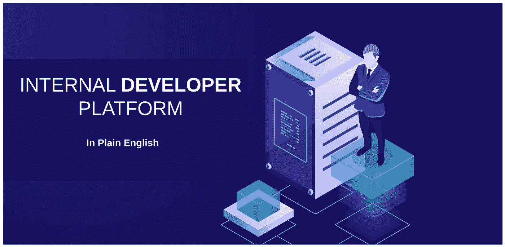
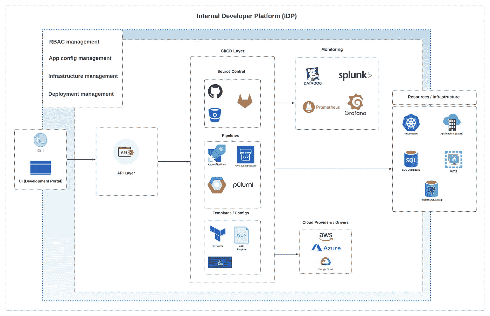
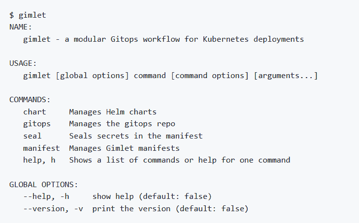
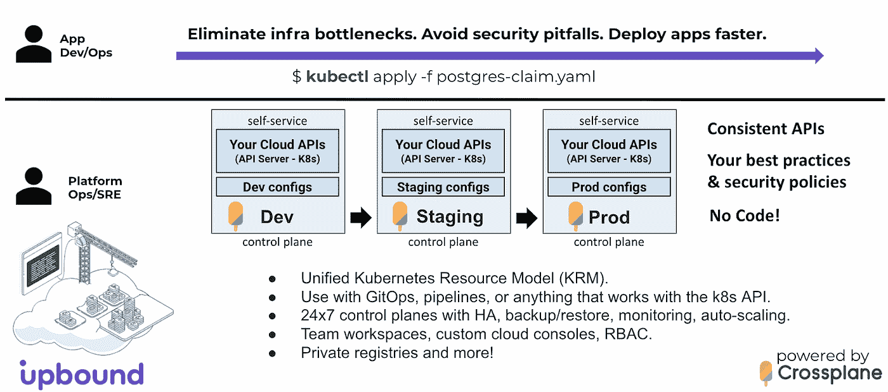
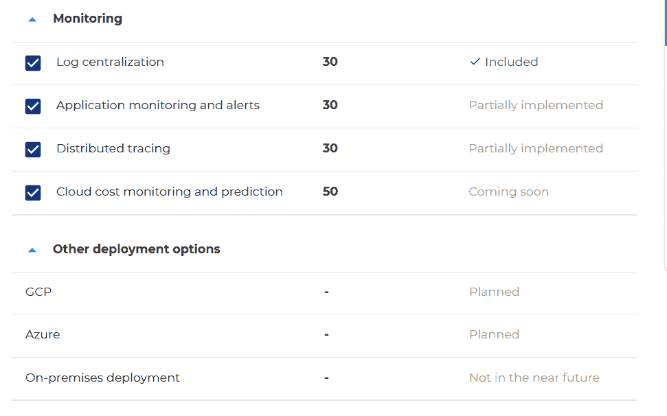
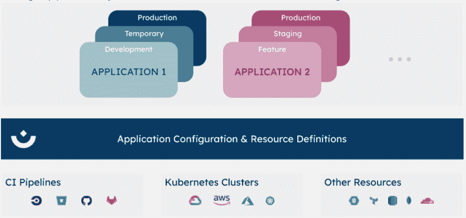
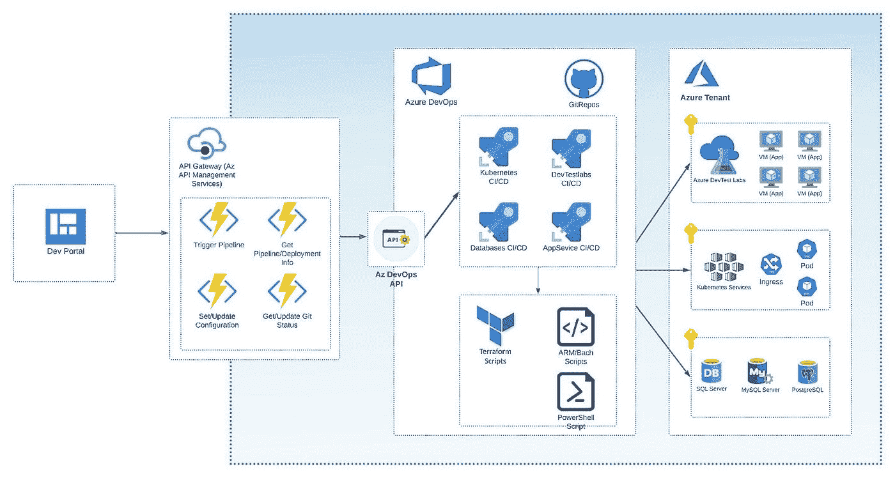

# 用简单的英语介绍内部开发人员平台

> 原文：<https://itnext.io/internal-developer-platform-in-plain-english-4d9059acc2fd?source=collection_archive---------0----------------------->

## 在云计算世界中使用内部开发平台的利弊

# 介绍

内部开发平台(IDP)是 DevOps 和产品开发中的一个全新词汇。在这篇文章中，我将解释:

*   IDP 到底是什么
*   如何让 it 融入您的组织
*   概述市场上现有的 IDP 平台及其优缺点
*   基于 Azure 云的 IDP 架构示例

# 什么是内部开发者平台？

作为一名软件架构师，我设计 DevOps 流程，花费大量时间选择 DevOps 工具集，构建管道，并与 DevOps 团队沟通，为开发团队实现一些过程。我们可以用内部开发平台(IDP)来解决这个问题。

内部开发人员平台(IDP)是开发和 DevOps 团队之间的附加层。IDP 背后的主要思想是消除开发人员和开发人员之间的依赖性。

让我们看看您应该在 IDP 中包括哪些功能和组件。IDP 平台应提供以下功能:

*   RBAC 管理
*   基础设施管理
*   结构管理
*   部署管理

让我们看看什么是来自 insights 的 IDP，以及它如何与 DevOps 工具和云提供商相联系。

# IDP 和 DevOps

如前面的例子所示，IDP 就像是构建在 DevOps 工具、资源和云提供商之上的框架。一些开发人员平台可能包括一个与众多 DevOps 工具和云提供商合作的选项，如上图所示。其他国内流离失所者侧重于具体的问题。

下图显示了 IDP 组件的示例，以及它们如何将 DevOps 工具和云提供商结合在一起。

*图 1*

我们来看看市面上有哪些开发者平台的选项。例如， [Gimplet。IO](https://github.com/gimlet-io) 是一个开源的 IDP，主要致力于运营 Kubernetes 部署。Gimlet 包含管理图表、部署、机密和 GitOps 的 CLI。

Gimlet 不包含应用程序配置管理，这使它成为部分 IDP。我喜欢 IDP 专注于特定平台的想法。比如 Kubernetes。这使得它比其他试图覆盖所有知名平台和云提供商的平台更加稳定。覆盖太多平台才能适合营销。然而，拥有多个平台和云提供商的适当支持需要付出巨大的努力，因为它们有不同的 API、标准，甚至命名约定。

另一个很好的例子是[上行](https://www.upbound.io)。Upbound 是一个强大的 IDP，允许您在 Kubernetes 集群中部署和构建应用程序。它支持 GCP、AWS 和谷歌云。我喜欢向上绑定的团队如何支持文档，并提供架构示例和架构参考。下面你可以看到 Kubernetes 的 [Azure 参考架构。](https://github.com/upbound/platform-ref-azure)

*图二*

有类似[后台](https://github.com/backstage/backstage)的产品在支持不同平台上取得了不错的进步。Backstage 是 Spotify 做的开源平台，由[云原生计算基金会(CNCF)](https://www.cncf.io) 支持。后台是一个旨在构建开发者门户的平台。它包括以下组件:

*   [后台软件目录](https://backstage.io/docs/features/software-catalog/software-catalog-overview)用于管理微服务、库、数据管道、网站、ML 模型。
*   [后台软件模板](https://backstage.io/docs/features/software-templates/software-templates-index)用于快速创建新项目。
*   用于生成项目文档的后台技术文档

[DevOpsBox](https://www.devopsbox.io/profit-calculator) 是一个支持众多 DevOps 平台的平台示例，云提供商提供应用配置管理、基础设施协调、环境管理和足够的 RBAC。然而，许多云提供商和工具仍处于实施阶段——例如， [Azure 和 Google Cloud](https://www.devopsbox.io/profit-calculator) 。

最后但同样重要的是一个人工机器人。它是一个连接多个 GitOps 工具和云平台的平台。我喜欢 Humanitec 带来的概念。例如，您可以通过 Azure 和 AWS[连接](https://docs.humanitec.com/introduction/how-does-humanitec-integrate)一个或多个 Kubernetes 集群。连接 Datadog 和 Grafana。您甚至可以重用现有的 Terraform 和 Pulumi 脚本。您可以通过 CLI、API 和面向开发人员的 UI 来操作所有这些基础设施。开发人员可以快速供应 Kubernetes 集群、启动数据库和 VM 实例，而无需编写管道、清单和 Terraform 脚本。

他们提供这个就不用等 DevOps 团队了。然而，开发运维专家仍应在以下方面花费时间:

*   选择 DevOps 工具
*   迁移现有脚本、管道和清单
*   连接环境

*图 3*

Humanitec 还支持围绕 IDP 和 DevOps 主题的 [PlatformCON](https://platformcon.com/) 社区。

# 内部开发平台示例

许多像 Spotify 这样的企业公司正在建立自己的 IDP。他们已经有了一个庞大的 DevOps 代码库，包括脚本和模板、大多数可用平台的管道和云提供商。

几年前，我在一家企业公司工作，该公司有 500 多个正在进行的项目，他们需要为新项目快速组建团队。所有项目都需要尽快提供基础设施。开发者没有时间做 DevOps 的东西。该公司要求构建内部开发人员平台(IDP)来调配和管理基础架构。这个想法很简单。当一个新项目出现时，算法应该如下:

*   加入开发团队。
*   支持工程师提供所有必需的基础架构。

*图 4*

如你所见，该架构主要基于 Azure 堆栈。但是，您可以轻松地将其扩展到 AWS、GoogleCloud 或任何其他云提供商。IDP 可以提供以下资源和应用程序:

*   Azure 开发测试实验室、虚拟机和扩展
*   库伯内特星团
*   数据库
*   应用服务

开发人员门户是一个使用内部 API 的简单 ReactJs 应用程序。该 API 基于 Azure API 管理，包含几个代表单个 API 调用的函数。例如，触发部署或接收部署状态。API 层连接到 Azure DevOps API。Azure DevOps 包含 YAML 管道、Terraform、Bash 和 PowerShell 脚本。

# 利弊

IDP 为您提供以下优势:

*   开发者的生产力。开发人员可以交付代码，减少对 DevOps 任务的关注。
*   DevOps 团队自由。IDP 减少了基础架构配置工作量，并专注于构建基线配置和模板。

IDP 可以为产品带来价值。然而，IDP 也有一些缺点。下面我列出了其中的一些:

*   成本和复杂性。构建开发者平台需要公司提供额外的资源来构建、支持和更新平台。我们可以通过购买外部开发平台来部分解决这个问题。我将在下面描述几个现有的平台。
*   文化变迁。涉及一个开发者平台需要开发和 DevOps 团队改变他们的文化和工作方式。这可能会导致团队损失时间。

这个列表可能是无穷无尽的，可能需要自己的文章。在文章:“[为什么构建内部开发平台的公司不会再这样做](https://www.bunnyshell.com/blog/companies-build-internal-dev-platforms-pitfalls)”中，你可以找到更多反对在内部构建 IDP 的理由。

# 结论

在这里，我试图阐明什么是内部开发人员平台，以及您和您的组织如何从参与 IDP 中获益。此外，我还补充了为什么使用 IDP 可能不合理。此外，我还分享了一个架构示例，该示例展示了一个组织如何构建其 IDP，并节省管理公司内多个开发运维团队的时间。