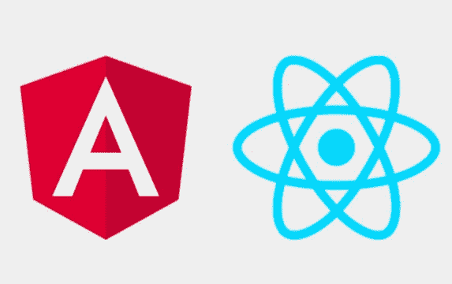
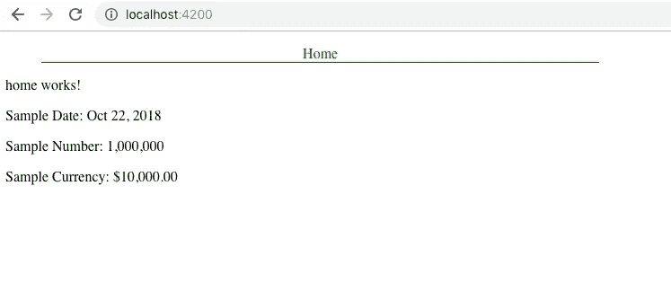
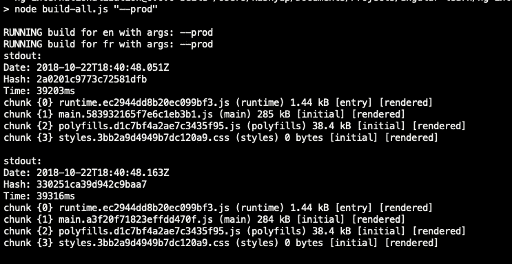
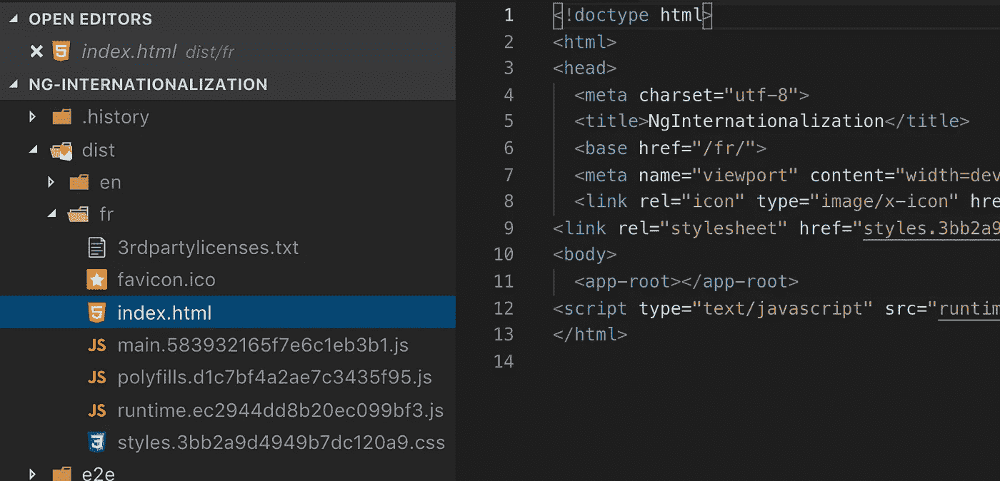
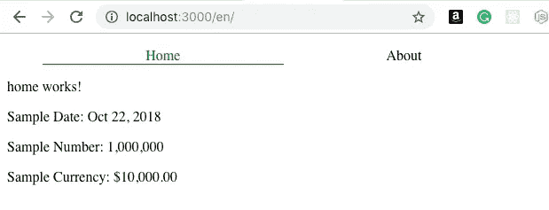
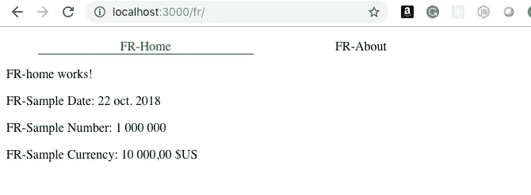
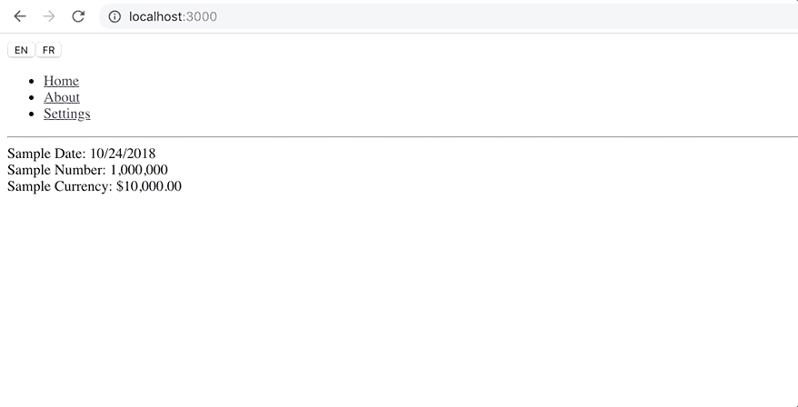

# Angular 和 React 应用程序的国际化—比较

> 原文：<https://itnext.io/internationalization-in-angular-and-react-applications-a-comparison-93883f4e1cdb?source=collection_archive---------1----------------------->



在本文中，我们将探讨 React 和 Angular 应用程序在国际化方面的比较(`i18n`)。我们将用英语创建一个示例应用程序，然后将内容转换成不同的语言环境。本文不会深入讨论这两个框架的细节，而是关注它们促进`i18n`的能力和易用性。

# 目录

1.  设定目标
2.  理解术语
3.  在角度应用程序中实现国际化
4.  在 React 应用程序中实现国际化
5.  警告和比较

# 设定目标

在我们开始编码和深入研究任何细节之前，为本文创建一个目标是很重要的。到本文结束时，我们将实现以下目标:

1.  创建一个没有国际化的 Angular 和 React 应用程序，然后将它们转换成一个能够处理多种语言的应用程序。
2.  确定以最小开销为应用程序提供服务的方式。
3.  比较和对比每个框架的`i18n`功能和易用性。

# 理解术语

首先，我们需要定义将在本文中使用的术语:

**区域设置**:用户已经配置或预配置的地理区域或一组设置，例如`en-US`是指美国区域设置的美式英语，而`en-GB`是指英国区域设置的英式英语。

**国际化:**应用程序支持多种语言环境的能力。

**本地化**:将(国际化的)应用程序翻译成不同的语言环境。

# 在角度应用程序中实现国际化

在添加国际化之前，我们需要创建一个包含一些基本路由和内容的裸应用程序。我们将使用 Angular CLI 创建一个新的应用程序:

```
ng new ng-internationalization
```

并添加一些组件:

```
ng g component homeng g component settingsng g component about
```

然后，在`src/app`文件夹中创建一个名为`app.routing.module.ts`的文件，并设置到达这些新创建的组件所需的基本路由，如下所示:

最后，将新创建的`AppRoutingModule`包含在`BrowserModule`之后的`imports`部分的`app.module.ts`中的主应用模块中。此外，在我们的`app.component.html`中添加链接，根据路线定义导航到这些组件。

有了中的这些变化，我们的基本应用程序就可以启动了。这也是向我们的主页添加一些内容的好时机，稍后我们将对这些内容进行本地化:

我们在组件中初始化这些变量:

从项目的根目录运行命令`npm start`并导航到 [http://localhost:4200](http://localhost:4200) 来查看您的应用程序运行情况。



## 添加国际化

现在我们已经有了基础应用程序，由于 Angular 提供的开箱即用的`[i18n](https://angular.io/guide/i18n)` [支持，启用`i18n`所需的更改相当简单。](https://angular.io/guide/i18n)

整个过程可以分为三个简单的步骤:

1.  标记可翻译的内容并生成翻译
2.  生成特定于语言环境的包
3.  创建一个服务器，根据所请求的语言环境来识别和提供正确的内容

**标记可翻译内容**

为了本地化应用程序，我们需要标记所有需要翻译的文本。在过去的 Angular 版本(即 1.x 版本，又名 AngularJS)中，我们被迫创建一个`json`文件，其中包含我们的各种英语翻译文本，然后将它们提供给翻译人员，翻译人员会将它们转换成我们需要的任何语言。然后，我们有能力在我们的应用程序中动态切换语言，这是使用`translation`指令解决的。

在 Angular 的最新版本中，情况有所不同。我们仍然可以使用旧的翻译方式，使用像 [ngx-translate](http://www.ngx-translate.com/) 这样的库。然而，不管国际化如何，我们都希望提前启用`AOT`构建，即[编译的代码，这样我们就可以从最终的分发包中删除任何不必要的负载/代码(如编译器、附加翻译文件等)。这样做的缺点是，我们最终每个地区只有一个分发文件夹。对于本文，我们假设我们的生产应用程序在 AOT 模式下运行。](https://angular.io/guide/aot-compiler)

我们首先需要使用`i18n`指令标记要翻译的文本。使用该指令非常简单，我们只需要以下面的格式提供值，整个事情都是可选的。

```
i18n="Meaning | Description @@UniqueIDToIdentifyThisElement"
```

一旦我们标记了需要翻译的整个文本，我们可以运行 Angular CLI 提供的`xi18n`命令，以 3 种支持的格式(XLF、XLF2 或 XMB)中的任何一种生成翻译文件，并将其传递给翻译人员。生成的文件还保存翻译的上下文，如翻译 id 的位置、含义和描述。

只要`@@id`没有被删除或更改，翻译就可以在整个应用程序中移动和重用。在我们的例子中，我们的基本语言环境是英语，也就是说，当我们编码时，我们在模板中用英语书写文本，所以当我们生成翻译文件时，我们希望表示相同的内容。这可以通过用正确的区域扩展名标记文件来轻松完成:

```
ng xi18n --output-path locale --out-file messages.en.xlf
```

运行这个命令会在`src/locale`文件夹下创建 XML 文件`messages.en.xlf`。

使用这个翻译文件作为默认文件的一个注意事项是 Angular 需要一个基本的`messages.xlf`文件，我们已经将其重命名为`messages.en.xlf` 。因此，为了弥补这一点，我们只需将翻译添加到与源文件相同的`en`语言环境文件中，例如，如果我们有一个标签为`Home`的`source`节点，我们需要在生成的 XML 文件中创建一个标签相同的`target`节点。

注意，在这种情况下，所有的`sources`和`target`节点都是相同的文本。

如果我们现在希望添加一种额外的语言，比如法语，我们只需要获得新的`xlf`文件。在我们的示例应用程序中，由于我们没有真正的翻译人员，我们可以简单地将英文的`xlf`文件复制粘贴到一个名为`messages.fr.xlf`的新文件中，然后添加`FR-`来表示法文翻译。

> 注意，目标节点与前缀为`FR-`的源节点相同。

**生成特定于语言环境的包**

为了构建代码，我们通常使用接受可选参数的`ng build`命令。在这种情况下，让我们假设在开发过程中，我们只希望使用英语版本的应用程序。我们做这个假设是为了避免改变`angular.json`文件。

可以更新`angular.json`文件来创建多个概要文件，用于构建和运行具有不同地区的应用程序，如此处的[所示](https://angular.io/guide/i18n#merge-with-the-aot-compiler)。

我们将创建一个小脚本，通过向`ng build`命令传递可选的特定于语言环境的参数，为我们支持的所有语言环境创建构建。

我们首先将受支持的地区列表作为`allLocales`添加到`package.json`文件中，这将作为我们的应用程序前进的唯一来源。

我们现在可以在自定义构建脚本中使用它:

上面脚本中最重要的一行是我们运行 build 命令的地方，该命令带有所有自定义的、特定于语言环境的参数:

```
ng build 
    --aot 
    --base-href=/${locale}/ 
    ${args} 
    --i18n-file src/locale/messages.${locale}.xlf 
    --i18n-format xlf 
    --i18n-locale ${locale} 
    --output-path dist/${locale}/
```

我们正在创建 AOT 构建，将应用程序的基本 href 设置为区域名称，这确保了来自特定于区域的模板的每个请求都将区域作为请求的前缀。

要生成特定于语言环境的构建，运行带有可选的`prod`标志的以下命令:

```
npm run build -- --prod
```

当构建成功运行时，它会记录以下内容:



我们还可以通过打开`dist`文件夹并验证任何语言环境的基本 href 路径来验证构建的结果:



**创建服务器**

既然我们已经准备好了特定于语言环境的包，我们需要一个服务器来检查来自浏览器的请求，然后根据请求的语言环境提供内容，或者将用户默认为一个预先确定的语言环境(假设为`en`)。

为此，我们将使用一个 Express 服务器，它有一个中间件来实现我们的语言环境逻辑:

我们简单地分解传入的请求，以确定该请求是否具有现有的区域设置、未知的区域设置，或者它是否是加载索引页面的基本请求，然后相应地处理它。我们还为每个受支持的地区生成一个静态路径，并确保它们指向`dist`下的正确文件夹。

为了测试更改，从项目的根目录运行`node server.js`，我们可以看到应用程序从端口 3000 开始。

打开`[http://localhost:3000](http://localhost:3000)`，我们可以看到它从`dist/en/`加载内容，这是在没有指定区域设置的情况下的默认设置，URL 现在包含了`/en/`，因为基本路径被设置为`/en/`:



我们也可以更改 URL 中的路径，从法语语言环境加载:



我们可以看到，它不仅按预期加载了翻译，还获得了我们使用的日期、数字和货币管道的本地化值，这要感谢我们在生成构建时传入的`--i18n-locale`标志。


# 在 React 应用程序中实现国际化

在 Angular 应用程序的情况下，我们需要首先设置基本项目，该项目有 3 条路线和一些主页上的基本本地化内容。

我们将使用`create-react-app`来建立项目:

```
create-react-app react-internationalization
cd react-internationalization
```

然后，创建 3 个组件 Home、Settings 和 About，现在看起来是一样的。

在家用组件中，我们将添加一些细微差别，就像我们在上面的角度示例中所做的那样:

我们现在可以通过使用`react-router`和`react-router-dom`从模板中调用这些组件作为路由，所以让我们安装这些组件:

```
npm i -S react-router react-router-dom
```

并更新我们的`App.js`文件:

为了模块化，我们将路线导出到它们自己的文件中:

最后，将主应用程序打包到`BrowserRouter`中，我们就可以开始了:

## 添加国际化

我们的基本应用程序现在可以国际化了。与大多数 React 项目一样，我们首先需要选择一个允许我们执行国际化的库。这无论如何都不是负面的，因为这就是 React 的本意。在本文中，我们将使用提供消息本地化所需组件的 [react-intl](https://www.npmjs.com/package/react-intl) 和帮助生成翻译文件的[react-intl-translations-manager](https://www.npmjs.com/package/react-intl-translations-manager)。

```
yarn add react-intl && yarn add --dev react-intl-translations-manager
```

与 Angular 相比，React 应用程序的流程没有那么复杂，因为它只需要我们做两件事:

1.  标记应用程序中的可翻译内容
2.  为区域设置生成翻译

**标记可翻译内容**

为了将内容标记为可翻译，我们将使用之前安装的翻译管理器。首先，我们需要标记内容，这需要我们将所有文本转换成一个 JSON 对象，该对象有一个与之相关联的`id`。因此，对于我们现有的内容，我们需要将其转换成如下所示的内容，放在`src/translations/extractedMessages`下的一个文件中:

在模板上，我们只需要引用使用`FormattedMessage`组件为每个消息定义的`id`:

要结合这两者，我们需要使用`react-intl` babel 插件，它需要所有`extractedMessages`的路径，也就是我们之前创建的`App.json`文件的路径。要调用插件，用新的 babel 配置更新`package.json`:

`enforceDescription`标志防止在 App.json 文件中的每个元素没有提供描述的情况下出现警告消息。

因此，我们做了必要的更改，将内容标记为可供翻译。

**为区域设置生成翻译**

我们现在已经准备好为每个地区生成翻译了。类似于 Angular 应用程序，让我们用一个名为`allLocales`的属性来更新我们的`package.json`文件，该属性列出了我们希望支持的所有可能的地区。现在分别是`en`和`fr`。

要生成翻译，我们可以使用在项目根目录下创建的一个小脚本，该脚本调用如下所示的翻译管理器，其中包含我们选择的本地文件、我们输入的提取翻译消息和我们输出的目标文件夹:

要调用它，只需运行`node translationRunner.js`，这将生成我们的`en.json`和`fr.json`文件，如下所示:

类似地，即使 fr.json 文件也有相同的内容需要翻译，但是，我们将添加`FR-`来表示两者之间的区别:

为了现在使用这些翻译，我们准备修改应用程序的根，并根据用户的选择提供必要的翻译。

在此之前，我们还有几项任务要做:

1.  在 locale 文件夹下创建一个`index.js`文件，该文件可以导出所有可用的翻译消息(本例中为`en.json`和`fr.json`)。
2.  更新`Home.js`以使用`FormattedDate`和`FormattedNumber`组件以及`FormattedMessage`组件，从而根据所选的语言环境显示正确的格式。

对于货币字段，我们使用了名为 USD 的自定义格式来表示货币是 USD，这不是 react-intl 库中内置的东西，但是它们为我们提供了创建和管理自己的格式的能力，这些格式实际上是可以传递给`react-intl`提供者的 JavaScript 对象:

然后我们可以将它嵌入到 index.js 文件中，以组合所有内容:

我们现在可以运行应用程序，并且可以动态切换区域设置并重新呈现整个应用程序:



# 警告和比较

既然我们的应用程序都按预期运行，让我们讨论一下每种方法中的一些注意事项:

1.  在我看来，这并不是最糟糕的主意，因为在运行时没有开销。另一方面，React 仍然必须评估和重新评估由`react-intl`提供的所有额外组件(我确信它在引擎盖下有某种形式的记忆)。
2.  与 React 不同，Angular `i18n`在尝试切换用户区域设置时需要刷新整个页面。根据个人喜好，这可能是优点也可能是缺点。
3.  在 Angular 的例子中，我们需要添加一个服务器，它可以根据所选的语言环境来处理和提供正确的分发文件。这意味着增加代码、测试等，你的应用不再是一个静态的捆绑包，更容易部署。
4.  Angular 提供了一些公共管道，如数字、货币和日期，它们在内部处理所有特定于地区的变化，不像`react-intl`那样，有时我们需要根据我们的用例和地区提供定制的格式。
5.  在 Angular 应用程序中，如果我们改变默认的输出文件名，我们需要手动将`targets`添加到 XLF 文件中，这很不理想，并且在有许多可翻译字段的情况下很痛苦。
6.  在 Angular 的例子中，我们需要依赖 ngx-translate 这样的库来提供缺失的功能，比如翻译模板中没有的字符串。使其成为开箱即用的有利选择`i18n`。关注[这个公开的 GitHub 问题](https://github.com/angular/angular/issues/11405)以了解更多信息，并查看一些可能的解决方法。
7.  Angular 和 React 应用程序模板都被翻译专用代码污染了，这些代码要么是`i18n`指令，要么是附加组件的使用。
8.  最终发行版的大约包大小(整个包的)比较如下(没有源地图。样式和功能尽可能相似):


> 该示例的 Angular 版本是在新的 Ivy 编译器推出之前完成的，启用 Ivy 的有效负载大小可能会有所不同，因为它现在是开箱即用的。

这两个示例项目的代码库都可以在这里找到: [Angular](https://github.com/40x/ng-internationalization) ， [React](https://github.com/40x/react-internationalization) 。

*如果你喜欢这个博客，一定要为它鼓掌，* [*阅读更多*](https://medium.com/@kashyap.mukkamala) *或者关注我的*[*LinkedIn*](https://www.linkedin.com/in/kashyap-mukkamala/)*和*[*Twitter*](https://twitter.com/JSSculptor)*。*