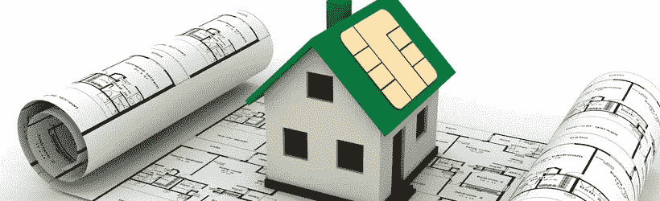
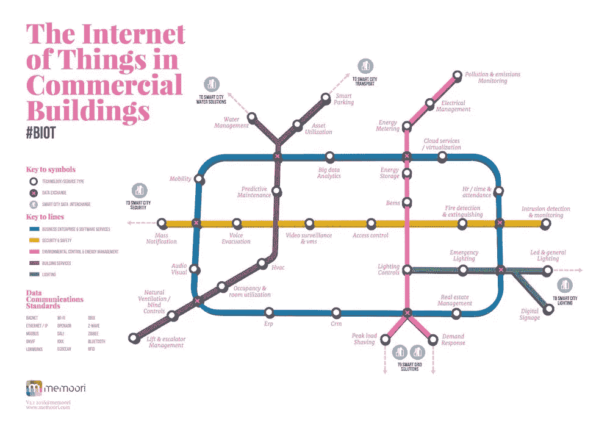
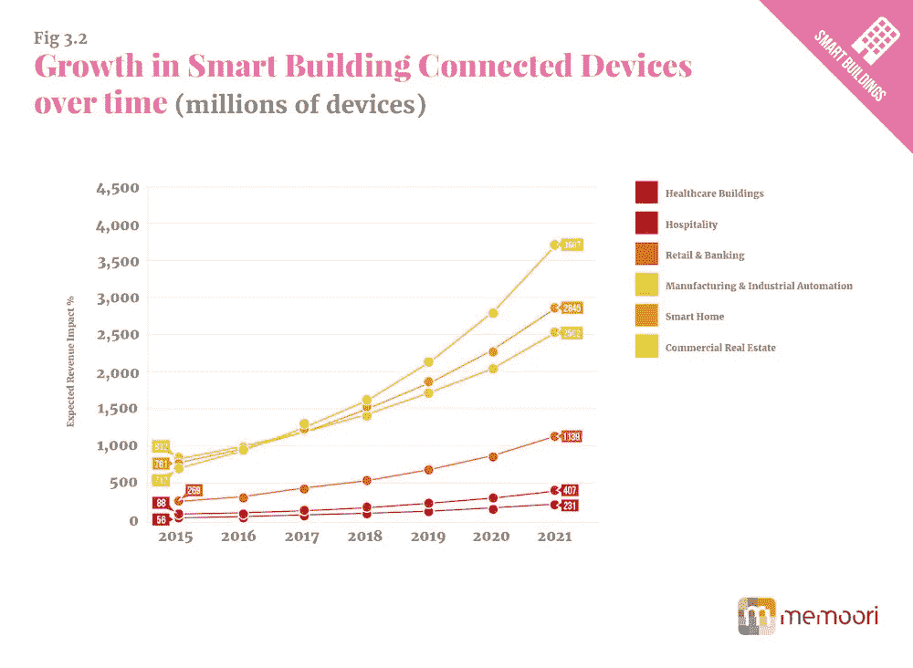

# 互联网或建筑中的东西正在急剧增长

> 原文：<https://itnext.io/internet-of-things-in-buildings-groeit-enorm-c15b39961f37?source=collection_archive---------0----------------------->

根据 mamoori research 最近发布的一份报告“2016-2021 年智能商业建筑中的物联网”显示，“t0”【3 月建筑设备连接】的支出将从 2015 年的 27 亿美元增长到 2021 年的 11.2 亿美元。

## 传感器越来越便宜了

物联网的快速发展与越来越多的高能效传感器相关。更多的使用降低了成本，从而刺激了更多*连接的事物*的实施。像 lorawan、[这样的节能网络在荷兰的存在，](https://www.linkit.nl/knowledge-base/171/Nederland_koploper_op_gebied_van_Internet_of_Things_netwerk_LoRa)已经在国内可用的东西，也伴随着物联网应用的强劲增长。传感器的成本在过去 10 年里下降了 50%以上，现在平均传感器的成本是 0.60 美元，而十年前是 1.30 美元。

## 影响和机会

对于商业建筑和建筑公司来说，这是一个激动人心的时刻，因为物联网技术与*楼宇自动化系统*相结合，从而创造了新的互联网或建筑(BIoT)中的东西。

全球约三分之一的“互联设备”已在商用建筑中使用，其中包括智能停车位和入口、时间管理和大数据系统，甚至包括自行维护和管理的冰箱和咖啡设备。

这种预测的增长为市场上最具前瞻性的玩家提供了巨大的机会。从短期来看，这对于连接性和移动性等建筑公司来说是一个机会，因为“互联建筑”的第一步是一个良好的电信基础架构，能够应对建筑产生的数据量不断增加的情况。此外，大数据和基于云的软件和服务是重要的参与者，预计 2021 年该行业的销售额将增长到 3200 亿美元。

完整的报告见这里的。