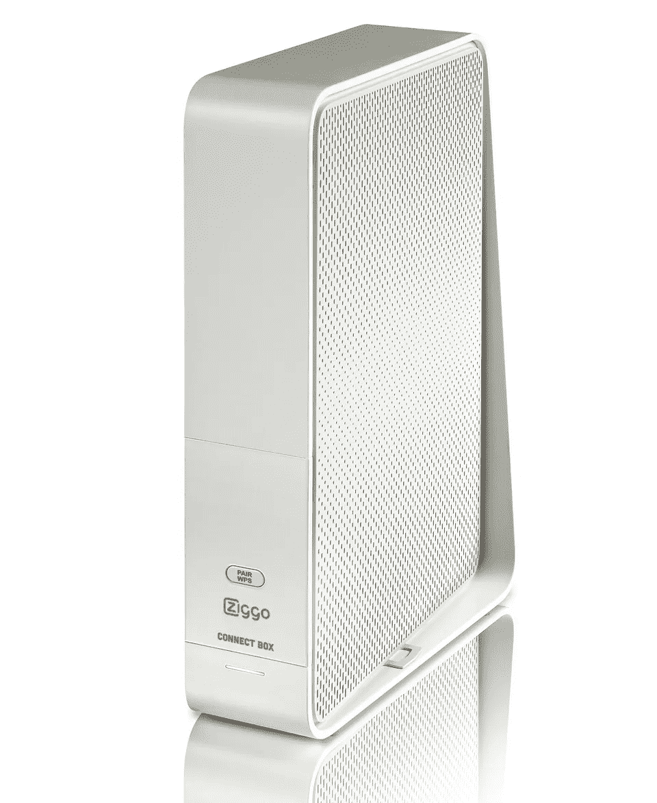
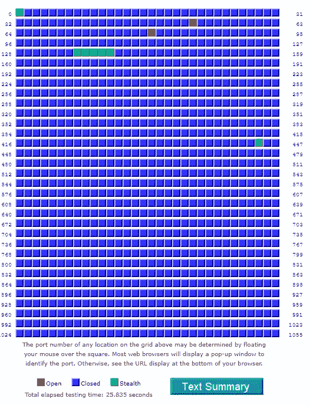

# 互联网安全和隐私—提供商提供的设备

> 原文：<https://itnext.io/internet-security-and-privacy-provider-supplied-equipment-9b3610f555d6?source=collection_archive---------2----------------------->

互联网是一个危险的地方，或者说我们总是被这样告知。虚拟专用网提供商赞助每一秒钟的 YouTube 视频，杀毒软件与消费类硬件捆绑在一起，许多在线服务都将互联网安全相关功能作为自己的差异化优势。我认为自己是一个见多识广的互联网用户——你知道，那种不会随意打开电子邮件附件或访问危险网站的人——但所有这些广告让我思考我自己对家庭互联网安全和隐私的做法。

数百万人和我走在同一条路上，那条通向你想要更快更便宜的互联网的路。在谷歌上快速搜索一下，你就会进入你所在国家排名第一的供应商比较网站，你在家里比较各种产品，然后选择最便宜、最快速的选项——你知道的——免费提供调制解调器，而且没有安装费。几天后，一个盒子送到了你的门口，通常是鲜艳的颜色，滴着公司的信息，分享他们对你即将拥有的改变生活的体验的兴奋。你撕开盒子，一个闪亮的新路由器从包装中挣脱出来，你匆忙撕掉玻璃纸，把它插上。几个月的游戏、深夜观看和黑色星期五购物之后，你已经忘记了放在你的壁橱里、床下或地板上你的 PC 箱后面的路由器积满灰尘，因为它继续为你提供互联网的好处…

# 互联网服务提供商——我们应该相信他们的设备吗？

想了一会儿，我第一次注意到了家里电视单元上的小白框。我住在荷兰，使用一个叫做 Ziggo 的服务提供商。

Ziggo 为他们的客户提供了一种叫做 Ziggo Connect Box 的设备，看起来有点像左边的图片。我不确定这是他们自己的设计，还是其他厂商授权的，还是两者的结合。无论哪种方式，如果我不得不诚实，这个设备非常简单。它有非常基本的 WiFi 功能，有限的可定制性，并且很慢…非常…非常…慢。我最终购买了一个谷歌 WiFi 集线器，因为 Ziggo 路由器上的 WiFi 不可靠。

不管怎样，这是我订购互联网时得到的，我必须充分利用它。

最近，我决定在我的 Ziggo 路由器上运行端口扫描。对于这个测试，我使用了[盾的上升](https://www.grc.com/x/ne.dll?bh0bkyd2)。网站上有一个小的灰色按钮测试，标签为“所有服务端口”，它扫描我的路由器，看看哪个端口是开放的。我的 Ziggo 路由器可以检测端口扫描，所以我必须禁用防火墙，以便该工具可以看到我的端口是开放的。如果你不关闭你的防火墙，所有的端口都会被工具显示为隐藏模式。结果如下所示:

两个打开的红色端口是端口 80 和端口 53 (DNS ),还有几个处于隐藏模式。不管怎样，这些端口是开放的，路由器固件中的任何漏洞理论上都可能允许攻击者/系统进入我的私人家庭网络。根据定义，ISP 是一群连接到由 ISP 拥有和控制的计算机网络的客户端。理论上，一个客户端可以通过错误配置或漏洞连接到另一个客户端的路由器，运行 DNS 查询并获得结果。

很好，所以我的 DNS 端口和 HTTP 端口对互联网开放。没问题，我只要登录路由器并关闭那些端口，很简单，对吗？好吧，如果它只是，它把我们的没有界面在管理面板的 Ziggo 连接盒关闭这些端口，所以另一个解决方案必须到位。

**这里的要点是，您的 ISP 为您提供的设备是为他们服务的，而不是为您服务的**。你的安全对他们来说有点重要，毕竟他们不希望被起诉，但最终开放某些端口也允许他们控制/排除故障，并监视他们在客户家中运行的小工具。**那么，你如何夺回控制权呢？**如何关闭不应该打开端口？建立你自己的网络，不要相信你的 ISP 的设备…完全不要。

# 保护您的网络

保护您的网络比您想象的要容易。就我而言，我的设备商店里有一台中小型企业路由器，我决定将它改造成网络的网关设备。这个设备位于我和 Ziggo (ISP)网络之间。本质上，这个设备现在是保护我远离互联网的东西。如果 Ziggo 路由器为我提供了额外的保护，我认为这是一个额外的收获。以下是我为确保家庭网络更加安全而采取的措施:

1.  从 Ziggo 路由器断开所有硬连线连接，包括我的 Google WiFi mesh 设备
2.  在 Ziggo 路由器上，我禁用了 DHCP。WiFi 以前是禁用的。
3.  安装了 Zyxel SBG3300 路由器。在这台路由器上，我禁用了 DHCP(一会儿你就知道为什么了)。我还确保 WiFi 被禁用，所有我不想打开的端口都被关闭，包括端口 80 和 53。在 Zyxel 这样的小型企业网关上，这很容易配置。
4.  我将 Ziggo 路由器插入 Zyxel 路由器的 WAN 端口，并将 Zyxel 路由器的 WAN 端口配置为桥接模式。然后我关闭了路由器的电源。
5.  我把从 Ziggo 路由器上拆下的所有有线连接都连接到了新的 Zyxel 路由器上。
6.  然后，我安装了一个带有 Pi-Hole 的 Raspberry Pi 设备，并启用了它的 DHCP 功能。该设备现在充当我的 DHCP 服务器。未来的博客文章将更深入地讨论 Pi-Hole，但本质上它是一个在你的内部网络上的广告拦截服务，拦截 DNS 请求，并在 URL 已知提供广告时拦截它们。Pi-Hole 还内置了一个方便的 DHCP 功能，充当我的网络范围的 DNS 服务。这里应该注意的是，使用不是 ISP 默认的 DNS 服务不会增加多少隐私，但它允许您选择使用哪个 DNS 解析器，这通常会导致更快的页面加载时间，具体取决于您使用的 DNS 服务。
7.  然后我打开了 Zyxel 设备。所有设备现在都从 Pi 获得 DHCP 地址。
8.  我重新设置了我的谷歌无线设备。出于某种原因，它不会连接，但经过硬重置后，它都同步到谷歌母舰。

这里只需要注意一点。在某些情况下，你可以给你的提供商打电话，让他们把你的调制解调器设置成桥接模式，我的提供商 Ziggo 就是这样。然而，我坚信“如果它没坏，就不要修理它”。与 ISP 打交道往往会破坏事情，鉴于我的工作需要互联网连接，我决定不惹麻烦。

# 结论

我的家庭网络现在稍微更安全了。我信任我安装的设备，因为我对它进行了配置，可以更改我想要的任何设置，并且可以阻止我认为合适的任何方向的流量。我们不应该想当然地认为我们的 ISP 发放的设备能够/将会保护我们的安全。