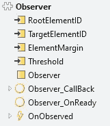
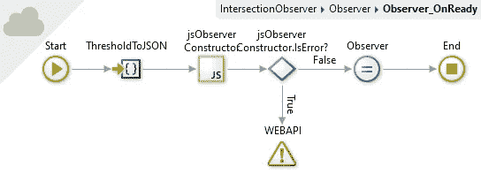
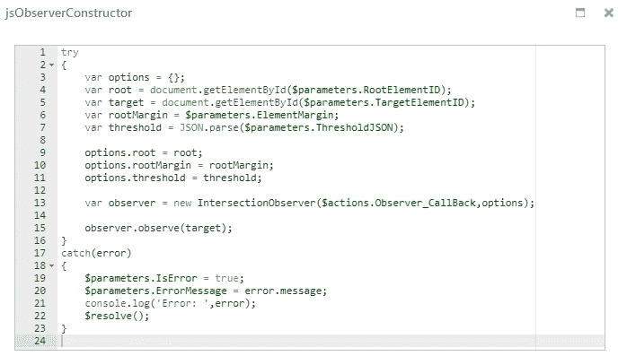
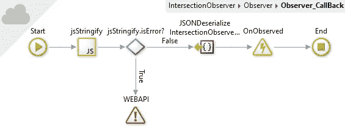
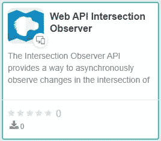

# 外部系统中的交叉点观测器

> 原文：<https://itnext.io/intersection-observer-in-outsystems-8f614bb24921?source=collection_archive---------4----------------------->


[亚历山大·奈特](https://unsplash.com/@agk42?utm_source=unsplash&utm_medium=referral&utm_content=creditCopyText)在 [Unsplash](https://unsplash.com/s/photos/technology?utm_source=unsplash&utm_medium=referral&utm_content=creditCopyText) 上拍照

弄清楚用户能在你的 web 应用上看到什么是一项复杂的任务。

无论您选择设置一个事件侦听器来检测滚动位置还是计算当前元素相对于顶部的偏移量，对于一些看起来微不足道的事情来说，这都是很大的努力。

然而，大多数现代浏览器都实现了交叉点观察器 Web API。

> 交叉点观察器 API 提供了一种异步观察目标元素与祖先元素或顶级文档的视口的交叉点变化的方法。
> 
> 历史上，检测元素的可见性或两个元素相对于彼此的相对可见性一直是一项困难的任务，其解决方案不可靠，并且容易导致浏览器和用户正在访问的网站变得缓慢。随着网络的成熟，对这类信息的需求也在增长。
> 
> ([在路口观察器 API](https://developer.mozilla.org/en-US/docs/Web/API/Intersection_Observer_API)

我想到了几个用例，即延迟加载、无限滚动、当动画实际可见时激活动画，或者在启用“我同意”按钮之前经典地滚动到 EULA 的结尾(反正没人看)。

## 外部系统实现

我们从库模块上的一个简单块开始。



只有 target 元素是必需的，它表示您想要监视的元素。

根元素表示目标的祖先元素，相对于它来测量可见性。默认情况下，它使用浏览器的视口。

阈值表示以百分比形式报告可见性的触发点。例如，如果您想在元素为 0%、25%、50%、75%和 100%可见时获取事件，您可以输入[0，0.25，0.5，0.75，1]。

每当超过这些阈值时，就会触发 OnObserved 事件。你所需要做的就是在你的应用程序中实现事件的逻辑。

这条路很窄:



和 JavaScript 细节:



```
var observer = new IntersectionObserver($actions.Observer_CallBack,options);
```

这一行使用 Observer_Callback 方法作为交叉点观察器的回调。

Observer_Callback 方法:



这将在对象的一些序列化之后触发 OutSystems 事件。

## 实施注意事项

Web API 交叉点观察器确实有更多的方法和功能。

它可以同时监视几个目标元素，可以根据需要添加目标元素，也可以通过编程启动和停止观察。

如果你需要的话，叫我一声。

# 使用组件

您需要做的就是将组件放到页面上(在您想要观察的内容之后)，为 target 设置元素并实现 OnObserve 事件。

像往常一样，该组件可在[锻造厂](https://www.outsystems.com/forge/component-overview/11709/web-api-intersection-observer)获得。



现在你所要做的就是去构建那些应用程序。