# 进入网络多元宇宙

> 原文：<https://itnext.io/into-the-web-multiverse-74a2535d1b32?source=collection_archive---------0----------------------->

这是我在多伦多的 Web Unleashed 和维也纳的 Halfstack 上演讲的文章版本。您还可以在这里 [*查看幻灯片*](https://noti.st/codepo8/obVKLu/into-the-web-multiverse) *。*

我热爱网络，从职业的角度来看，它对我来说是件好事。我也担心它会走向何方。我担心的是，我们如何继续以我发现它时的同样方式倡导它。也许是时候重新评估我们“拯救网络”的方法了。

在过去的 20 年里，我在不同的公司从事各种产品的网络工作。我建立了网站，电子商务平台和企业 CMS 的模板。我认为这在当时对 web 来说是最好的，因为后者有一种令人担忧的趋势，那就是创建可怕的标记。然后，我转到大型互联网门户网站工作，比如政府网站，随后是雅虎。在那里，我转向为开发人员构建东西，以创造更快更干净的产品。这方面的例子有内部构建工具、模板以及随后的库组件，比如 YUI。尽管如此，我还是觉得缺少了一些东西，所以我开始研究浏览器和它们周围的文档。现在我在一个空间里，我在浏览器和我们用来构建网络产品的开发工具上工作。

我喜欢这一点，因为它向我展示了支持网络的许多不同方式，以及我们在职业生涯中的灵活性。

# 我们眼中的网络

说到推广网络，我们一直在谈论它的好处:

*   它是分散的——没有一家公司拥有它，也不受制于它的价值观和需求
*   它独立于平台和设备
*   所有人都可以使用它
*   它的贡献门槛很低
*   它让你有能力拥有自己的沟通渠道
*   它是基于开放平台技术的标准化
*   它可以是人类知识的总和，因为它易于贡献和存档。

我们珍惜这些想法，并希望它们占上风。因此，当涉及到网络时，我们不断地交流和捍卫我们的价值观。人们在网上做的每件事都应该努力做到:

*   **开放和免费** —我们试图对抗封闭的应用基础设施
*   **读和写** —在一个完美的场景中，所有服务都应该提供 API 来访问内容
*   **可编辑的**——如果你发现了一个错误，给出反馈并改正它会很棒
*   包容性和易接近性——我们不应该因为人们的身体状况或受教育程度而将他们拒之门外
*   **公开可用**——我们讨厌付费墙和间隙墙
*   **基于开放标准** —我们厌倦了不得不去迎合公司的需求而不是平台的需求

我们还致力于为用户和我们自己提供选择。我们的世界包括:

*   不同的浏览器可定制的许多插件。
*   不同的编辑器——网络上没有“一个 IDE”
*   不同的外形和平台(台式机、笔记本电脑、平板电脑、手机、语音助手……)
*   不同的能力，这意味着设备能力和用户需求驱动我们的界面选择

# 网络获得了巨大的成功

很难想象一个没有万维网的世界。网络技术是标准化的，浏览器的差异可以忽略不计。开源已经从一个利基市场发展成为运行网络的技术——大多数服务器都是基于 Linux 的。文档是丰富的、免费的和交互式的。MDN 网络文档是一个共享平台，所有网络巨头都在这里贡献文档。我们有[我能使用](https://caniuse.com)来告诉我们实现什么功能是安全的吗，最近甚至有[我能发电子邮件](https://caniemail.com)来记录 HTML 电子邮件的(抱歉)状态吗。

> 那么，我们到底在为什么而战？我们试图解决的问题是什么？

# 网络是一个巨大的混乱

如果我们用质量和价值的眼光来看今天的网络，事情看起来一点也不乐观。

*   明显缺乏基本的无障碍环境。Webaim 对最大的一百万个网站做了一个分析，结果很糟糕。几乎所有的网站都没有通过最简单容易的检查测试。
*   安全问题是另一个大问题。在过去，一些垃圾邮件发送者试图插入反向链接已经够烦人的了。如今，当你的网站开始在后台挖掘比特币时，成本会高得多。几乎每个月我们都有用户数据泄露的报告。
*   性能问题也很严重。浏览新闻门户网站时，我结实的笔记本电脑开始转动风扇，这种情况并不少见。解释如何优化我们的代码的精彩演示和文章并不缺乏。开发人员工具让我们比以往更深入地了解内存和 CPU 的消耗情况。然而，由于性能问题，网络上的大量用户被阻挡在外。
*   这也导致了对屏蔽器的感知需求，以保证网络安全和不那么令人讨厌。追踪预防是目前所有浏览器厂商都在研究的课题。我们很大一部分终端用户甚至无法想象一个没有广告拦截器的网站。

# 为什么 web 会处于这样的状态？

当谈到指责和找人责怪当前的事态时，不乏各种观点。以下不是我的，但是我已经看到了很多关于这些或类似主题的演讲和帖子:

*   用户很糟糕，设置也很糟糕
*   web 堆栈还不够好
*   贪婪的公司在网络上贴满了广告，把用户看成是要挤奶的绵羊。)
*   我们没有合适的工具
*   科技公司不加考虑地制造可怕的东西
*   外星人

也许是时候找出我们自己的缺点了，或者至少重新评估我们让事情变得更好的努力。

# 计算未命中而不是命中

亚伯拉罕·瓦尔德是第二次世界大战中的一名统计学家，他拯救了很多人的生命。他被召来帮助分析从战场返回的飞机，努力使它们对飞行员更安全。

该小组查看了飞机上的弹孔，并想知道在哪里增加更多的镀层，以确保撞击不会造成太大的损害。

第一个可以理解的行动是加固那些弹孔最多的飞机。然而，沃尔德理直气壮地指出这是一种谬误。他解释说，尽管这些部分受损，飞机还是回来了。在没有标记的地方被击中的飞机是那些没有回来的飞机。因此，给没有弹孔的飞机部件增加装甲更有意义。

*(如果你想了解更多关于这种创新思维的优秀例子，* [*丹尼尔·西格尔对此进行了探讨*](https://dgsiegel.net/talks/the-bullet-hole-misconception) *，这种分析的结果被称为* [*生存偏差*](https://wikipedia.org/wiki/Survivorship_bias) *)*

我为什么要提这个？嗯，我发现当谈到倡导网络时，我们总是有一点浪漫或绝对的想法。我们天真地回想起网络更容易的时代。我们一直想知道为什么人们不遵循我们所说的简单而明智的建议。

长期以来，我一直是其中的一部分，我想知道我们是否正在陷入一个陷阱，即记住美好的事情并以此为目标重复这些事情。

> 如果我们是诚实的，那么网络从来就没有“美好的往昔”。W3C 和 WASP 从一开始就致力于平衡网络专有解决方案。

即使在过去，人们也将网络视为渲染目标。当时，它不是 React 或复杂的框架，而是像 enterprise CMS、Frontpage 甚至 Dreamweaver 这样的解决方案。也许是时候停止告诉人们什么是可能的，而是倾听他们需要什么了。如果我们填补了受众需求的空白，而不是专注于网络受到攻击的地方，我们也许就能让它变得更加坚固。

我们有两只耳朵和一张嘴——也许我们应该多花时间听，少说话。

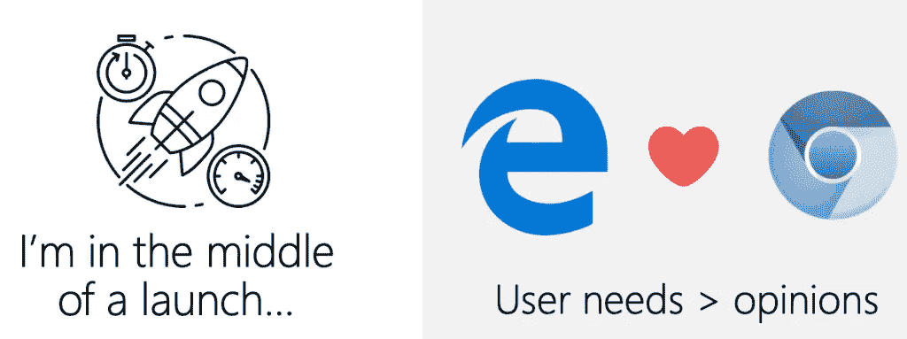

我很幸运目前正在为一个有趣的项目工作。出于非常实际的原因，我的公司正把我们的浏览器转移到 Chromium 项目上。事实证明，提供与市场领导者不兼容的替代浏览器并不像我们希望的那样令人兴奋。相反，我们听听人们想要什么，看看他们用什么。这是一个正在进行的事情。我们花了大量的时间和精力做用户研究。新产品的特性应该总是由明确要求它们的用户来支持。这样，我们就不会为了制造东西或比竞争对手多一个而制造东西。相反，我们将客户的需求置于我们不断告诉他们使用什么的动力之上。

对我来说，有趣的是，退一步听，你会得到各种各样的见解。你了解你的终端用户的多样性。这里是我们遇到的一些引用他们如何看待网络的例子。

# “保持最新”用户

对于热爱网络的人来说，这是一个梦想成真的用户。我们的尖端代码在这个群体中很受欢迎。然而，它没有我们希望的那么大。

# “我对我拥有的很满意”的用户

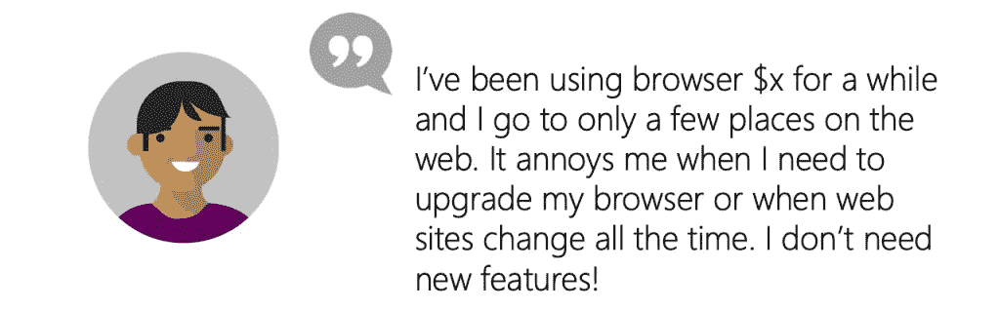

向后兼容性是我们对用户最关心的事情。虽然看起来他们阻碍了网络的发展，但他们是观看广告甚至订阅的忠实用户。

# “我只是上网”的用户

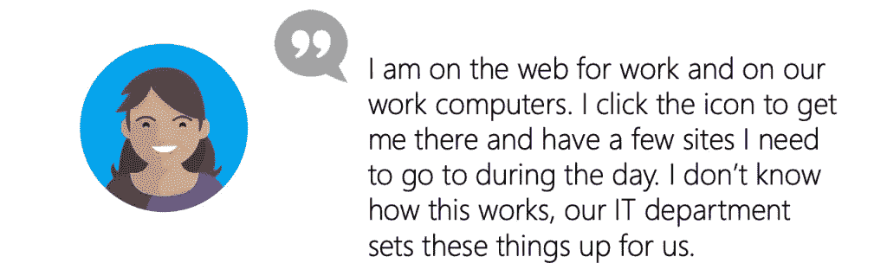

网络对这些用户来说并不令人兴奋。它是你在工作中使用的东西，你可能在家看电视或在平板电脑上玩几个游戏。把它们作为工作工具引入网络是一种耻辱，但如果没有欲望，我们也无能为力。

# 谨慎的用户

这个很有意思。我们希望人们质疑网页内容，不要陷入网络钓鱼和恶意软件下载的攻击。但我们也想确保他们获得最好的体验，并且他们中的一些人在他们的阻挡议程中走得太远。

# “斯德哥尔摩综合症”用户

我们从来不希望用户觉得自己很笨或者没有能力使用我们的产品。一个过于复杂的新功能会让人们变得保守，渴望更简单的时光。我们无权称他们为勒德分子，我们有责任让新技术和互动看起来不那么可怕。

# 难以下咽的苦果——第一部分

如果我查看这些用户测试和访谈的结果，会发现一些事情:

对不同的用户来说，浏览器

*   一些他们无法控制的事情
*   他们珍视并高度定制的东西
*   无关紧要，因为所有工作都足够好
*   没有什么值得改变他们的习惯

安全性和隐私不是人们能控制的，而是信任平台能为他们做的。

这有点违背了我们对一个由人驱动的开放网络的信念。而且，如果我们对自己诚实，这不应该是一个惊喜。

> 时代变了，网络不是一个很酷的新事物。相反，它类似于管道工程。我们不关心水从哪里来，也不关心整个交付周期是如何运作的。只要我们打开水龙头时有淡水。我们只关心出问题时的工作情况。

这就是人们对网络的感觉。它是一种商品。与其考虑内部运作，不如定制消费设备更令人兴奋。目前，这些都是移动设备和“智能”产品，但市场正在努力将 AR 和 VR 作为下一个大东西来销售。

# 拥有平台？

这也影响了我们对网络作为读写媒介的看法。说到“拥有平台”，这应该是一个简单的步骤。这是很容易得到一个域名和主机这些天。有很多 CMS 和静态页面生成器可以用来建立网站。

但是无论何时我们告诉人们这些，我们都忘了提及这些烦恼。你不仅需要建立存在感，还需要维护它。任何过时的设置都是潜在的攻击媒介。在过去，这意味着一些注入的垃圾链接，但如今，随着网络功能的增强，事情变得更加危险。比特币挖矿机或恶意软件下载注入并不少见。同样，这意味着不断警惕或成为僵尸网络的一部分。

其他需要考虑的是法律要求，如 GDPR 合规性和 cookie 许可。围绕这些问题有很多错误的信息和混乱。

对我来说，更大的担忧是网络不再像过去那样是一个简单而又令人愉悦的平台。我着迷于发表文章是多么容易，得到我的第一条评论是多么有趣。我很快开始害怕评论。我觉得自己像是“打地鼠”删除不想要的内容的军备竞赛的一部分。

如今，封闭的出版平台非常诱人。它们带有垃圾邮件保护、出色的编辑器和华丽的开箱即用设计。我第一次使用 Medium 时，这是一次有趣的体验，高亮/评论界面非常棒。当然，你也可以用 WordPress 和自托管实现同样的效果，但是这需要大量的工作，而且也没有惊人的数据可视化。

# 在其他地方寻找开放网络的解决方案…

我认为公平地说，从用户的角度来看，开放网络的风暴不再是一件事了——如果它曾经存在过的话。这意味着，作为关心网络的人，我们需要改变我们的方式。也许应该由我们来修复网络。这意味着当家作主，照顾不同群体的需求。如果我们不能期望用户足够关心去修复网络——也许我们需要授权给开发者？

开发人员进行的用户测试也很有趣。将来自 Twitter 和 Slack 的大量需求视为开发者需求的指标是很有诱惑力的。事实证明，即使在开发者空间，网络也早已超越了我们这个舒适的网络行善者小家庭。在研究过程中，我们发现了很多不同的 web 开发方法。

# “这是工作”开发者

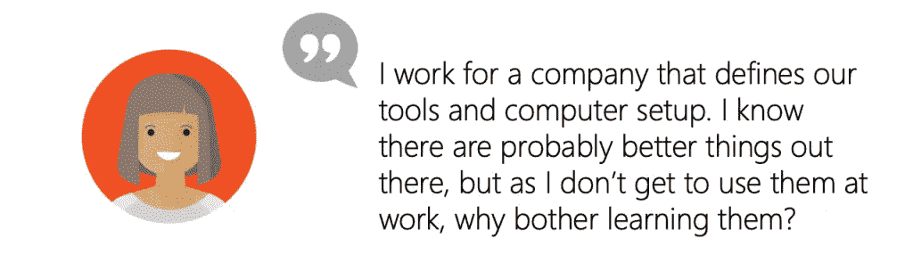

把网站开发看作一份工作，把你的交易工具看作是你的公司提供给你的东西是公平的。有趣的是，过时的设置并没有降低这些开发人员的效率。许多人创造了许多重要的、被广泛使用的网站内容。这里通常有高度的定制化。人们仍然使用 Dreamweaver 和许多公司认可的设置和模板。做得很好，那么我们有什么资格去评判呢？

# “开机”的开发人员

这些是我们想要的人，但是有点迷失了。他们对新的网络功能很感兴趣，但他们不相信采用的速度。因此，他们更喜欢库，并信任它们来处理向后兼容性。新的编程范式和开发方式更令人兴奋。再说一次，没有什么是卑鄙的，但完全可以理解。

# “我在这里交付”开发人员

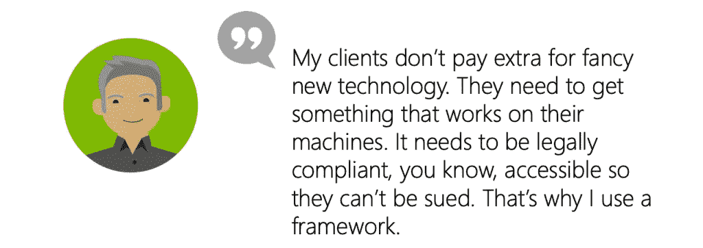

实用主义统治着这些开发者的世界。再一次，我们发现了对做正确事情的框架的盲目信任。在这种情况下，可访问性是工具做的事情，不需要额外的努力。没有被起诉是驱动力，没有创造无障碍产品。不过，如果你的目标是获得报酬并继续前进，这是完全明智的。

# “网络崩溃”的开发者

我可怕地回想起我职业生涯的开始，目睹了这种类型的开发人员。当时，“真正的开发人员”对我们试图让 JavaScript 这样的“玩具语言”在更大的团队中工作嗤之以鼻。有趣的是，他们确实有自己的观点。如果你看看封闭环境中的一些堆栈的丰富性(巨大的 ide，Flash…)，web 堆栈看起来像是粗制滥造的。

# “我是来学习的”开发者

这是最令人讨厌的一群人。我们应该更善于授权和欢迎新人进入我们的市场。

# 莫名其妙地吞下苦果(2)

专注于开发者的用户研究教会了我们一些东西。希望网络变得更好的有爱心的开发者只是市场的一小部分。对许多人来说，这是一份谋生的工作。这没关系，我们总是声称网络的美妙之处在于每个人都可以从中谋生。更令人沮丧的是新来者如何看待当前的 web 开发空间。他们没有发现一个移情的、开放的世界，而是选择和意见的雪崩。

然而，更大的洞见似乎是发人深省的。满足开发人员的需求与创造更好的用户产品没有直接关系。当然，开发者为其他人安装机器会产生涓滴效应。甚至告诉他们这件事。但是，似乎有一个问题，那就是如何影响大多数开发者，而不是迎合有发言权的少数人。经常提到的获得有影响力的人的心和思想的概念似乎没有我们想象的那么多。

# 为什么要学基础？

了解 web 开发的基础知识似乎不再有趣了。鉴于网络的宽容本质，这并不奇怪。

> 浏览器不能破坏网络——他们的宽容是无止境的。浏览器代码的很大一部分是为了确保过时的、糟糕的代码仍然产生可用的结果。

更糟糕的是，我们甚至不能删除许多庞大的 web 产品所依赖的非标准代码。所以，如果它有效，为什么还要费神去学习为什么呢？即使它不起作用，也有很多资源可以学习快速修复。W3Schools 和 Stackoverflow 的成功不在于他们告诉你为什么某些东西会起作用。这是他们给你复制和粘贴解决方案，产生你想要的结果。浏览器可以处理剩下的事情。

我们对持续创新和提高开发人员效率的关注也使得“了解网络”不再是一项令人向往的技能。相反，列出你对抽象的兴趣会让你在求职板上吸引眼球。抽象承诺更快的周转和伟大的产品——毕竟，大公司使用它们，对吗？

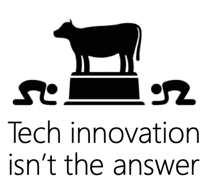

有明显的迹象表明，发明新技术不是保护网络的答案。开发者空间的不断变化是一把双刃剑。我们以压倒他人为代价，授权给一小群高度积极的人。我们创新以满足专业需求，称之为成功，因为它是新的，而不是解决真正的问题。我们没有发现真正的问题，因为我们没有问我们的泡泡之外的人

那么，作为网络爱好者，我们能做些什么呢？

暂时把技术放在一边，专注于终端用户的需求，这可能是明智的。我们不能指望他们关心所有这些事情，所以让我们按照重要程度来组织他们。我们首先要做的是满足基本需求。

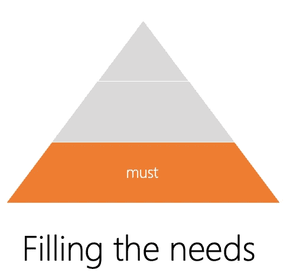

任何网络产品的“必备条件”是:

*   **可用性** —如果它不加载和渲染，或者如果域不可用，我们就完蛋了。
*   **可及性**——道德上和法律上都要求我们不得将任何人拒之门外。让自己变得有用是件好事
*   **安全**——用户通过访问我们并给我们信息来信任我们。这两种交互都不会导致第三方监听或恶意软件入侵
*   **用户需求的可变性** —人们将需要改变字体大小或使用高对比度模式(3%的 Windows 用户——这是一个很大的群体),其他人将希望使用浏览器提供的“简单阅读器模式”

一旦我们涵盖了这些基础知识，我们就可以继续为产品添加更多的质量。

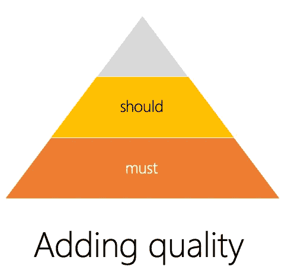

网络交付的下一个层次可能依赖于环境，不会适用于所有用户。

*   **增强的性能** —按需加载非必要内容，在设备上缓存静态资产
*   **扩展可用性** —使用 ServiceWorker 离线提供内容，预缓存后续页面
*   **可定制性** —允许用户根据自己的需求更改内容，或者在连接和设置允许的情况下要求更多内容

最后一步是创造一个完全愉快的体验。

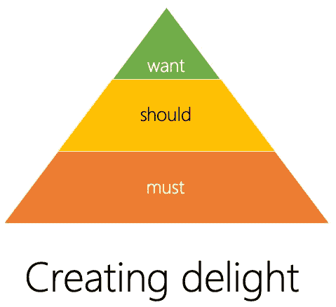

对于我们的一小部分用户，我们可以通过充分利用他们环境的功能来做更多的事情。

*   **充分利用平台** —推送通知、PWA 功能、设备的特殊功能……
*   **预测用例并防止简单错误** —如今我们可以增强任何文本输入字段，以允许人类输入，并使用自然语言处理来理解它们。我们可以允许扫描信用卡和从浏览器数据中挑选，以自动填写表格…
*   **提供扩展功能** —根据平台为我们提供的内容，我们可以使用生物识别技术登录或使用支付系统来提供更多内容。

通过专注于我们的方法的必须、应该和想要，我们也可以修剪我们谈论我们的工具的方式。

# 我们热爱工具

毫无疑问，如今的网络工具是惊人的。我们有如此多的好东西可供选择，我们花了很多时间讨论如何定制它们。我们有:

*   浏览器开发工具
*   编辑器、扩展和主题
*   终端仿真器及其配置
*   部署和优化工具链
*   抽象、组件和库

说到为 web 构建，有“web 开发的三位一体”:编辑器、浏览器和终端。每个人都有机会详细谈论我们的最爱，以及这些(只有这些)如何让你成为一名高效的开发人员。

# 这一切都有点过了…

我在这里实话实说。我在这个领域工作，不得不追逐下一个惊人的设置，这让我不知所措，甚至有点厌倦。我甚至无法想象现在作为一名开发人员是什么样子。

> 我们压倒了那些想从网络开始的人——或者只是想做他们的工作的人。通过要求人们建立复杂的开发环境，我们抑制了多样化的贡献。

我这么说是什么意思？前几天，我想为一个开源项目做贡献，这个项目实际上是一个 HTML 文档。我把它放在 GitHub 上，按照说明设置本地开发环境。结果是，构建下载了 150 兆字节的依赖项，在我能够编辑 HTML 文档中的几个单词之前，我必须调整我的设置。现在，我有一个 250 兆比特的连接和一台很棒的笔记本电脑。想象一下，某个有限连接的人在进入时遇到巨大障碍会有多失望。最后，我在“原始”视图中编辑了 GitHub 上的文件，并通过这种方式推送了我的更改。

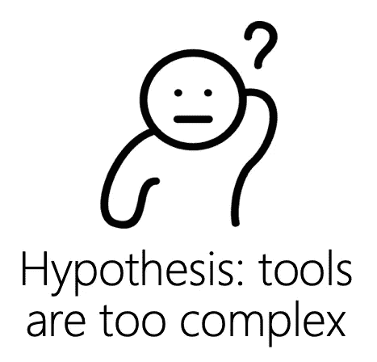

也许我们在假设开发人员设置和连接性方面走得太远了。我们非常关心最终用户的表现，但是贡献者的表现是你很少听到的。换句话说，在我们的工具中，我们没有足够关注人类的需求。

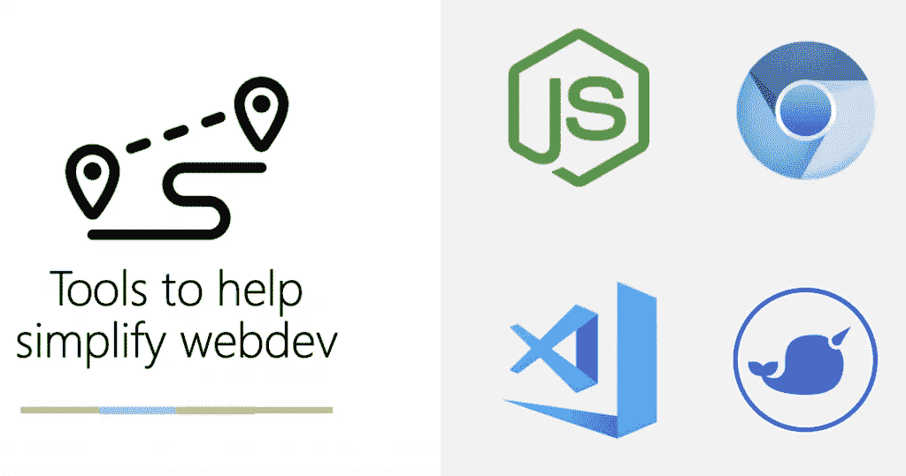

我现在要戴上产品管理的帽子，专注于我们可以用来做得更好的事情。这是一种非常务实的方法，着眼于人们使用的东西以及它们的用途。这里的一切都是开源和跨平台的，这让我很开心。接下来的每件事也是任何人都可以参与的，或者至少可以提交 bug 和特性请求。因此，与其提供另一种选择，我们可以为这些事情做出贡献，让网络变得更好。

# 节点:粘合剂

Node 公司迅速占领了市场。基于事件的服务器的想法并不新鲜，但它很大胆，而且确实满足了需求。Node 本质上是服务器端的 JavaScript。它通过允许在客户端和服务器上渲染组件，修复了“当 JavaScript 关闭时会发生什么”的问题。YUI 是第一个发挥这一想法的图书馆之一，许多与 Node 相关的人当时都在雅虎工作。

如今，可以公平地说，Node 将 JavaScript 从“browser X 如何突破”提升到了所有类型 web 任务的解决方案。你可以用它建立各种各样的服务。这允许高度可定制的 web 基础设施，如服务器和构建工具。在过去，你需要学习 C++或 Java，或者一口气学习 PHP，现在 JavaScript 就是答案。应该提到的是，为 Node 编写 JavaScript 与客户端脚本截然不同。但是我们从拓展业务中学到了很多。

# 铬:发动机

Chromium 是一个开源的多平台浏览器引擎。它不仅支持主流浏览器，也支持像 Electron 这样的应用框架。它还有一个无头版本，允许使用像[木偶师](https://pptr.dev/)这样的工具来自动化网络任务。需要指出的是，Chromium 不是 Chrome，而是一个开放源代码项目，开放给各种参与者的贡献，而不仅仅是 Google。Chromium 成为主流浏览器平台不仅是因为基于它的浏览器，还因为它可以轻松嵌入到其他产品中。这是一件正在进行的事情——引擎顶部的用户界面是浏览器制造商与众不同的地方。

# Visual Studio 代码:“可破解的”编辑器

VSCode 是电子和开放源码在 web 领域的巨大成功之一。在过去，用 web 技术构建文本编辑器是一种痛苦的经历。相当多的[基于 JavaScript 的代码编辑器](https://en.wikipedia.org/wiki/Comparison_of_JavaScript-based_source_code_editors)来来去去。一大突破是 Adobe 的支架和 Github 的 Atom 编辑器。两者都对 VSCode 产生了影响，后者采取了额外的步骤，将 Visual Studio 的智能感知添加到轻量级编辑器中。VSCode 是开源的，多平台的，基于电子/铬。它可以使用 JavaScript/TypeScript 进行扩展和定制。

这意味着一个社区可以围绕它快速成长，现在你可以找到几乎任何东西的扩展。对初学者帮助很大的一个特性是它包含了一个终端和 Git 版本控制。前者允许您在不离开编辑器的情况下运行构建命令，而后者消除了版本控制的痛苦。你看到一个“M”出现在文件名旁边，而不是教一个班级“保存你的工作，到终端键入这些命令”。然后告诉全班写一个好的提交消息，并单击一个按钮。这教导了版本控制是人类交流的工具，而不是要遵循的代码序列。ide 和编辑器在过去是黑洞，没有办法添加功能。VSCode 是开放的，邀请反馈，你可以自己使用它。

# web 提示:测试和最佳实践

“最佳实践”是一个奇怪的概念。肯定有一些真理适用于任何产品。但是你的工作方式会因项目不同而有很大差异。这就是为什么很多关于“如何做正确的事情”的文档没有到达预期的读者手中。这并不适用于他们，有时感觉像一个额外的步骤，不会产生任何合理的结果。这同样适用于“自以为是的测试工具”,可以理解的是，这种工具会告诉人们什么是好的产品。这些都是善意的，但会招致质疑其动机的言论。当搜索引擎通过降低搜索结果的排名来惩罚不良代码时，这是一个强大的惩罚。但这并不意味着人们同意这一决定，它会让其他人质疑一家公司是否应该拥有那么大的权力。

毫无疑问，这些年来我们学到了很多构建 web 项目的东西。假设每个新开发人员都知道它们或遵循它们是不明智的。

这是一个完全可定制的网络测试工具 [webhint](https://webhint.io) 的灵感。使用 webhint，您可以测试您的 web 项目:

*   无障碍问题
*   性能问题
*   应用就绪
*   与标准兼容
*   要避免的常见陷阱
*   安全问题

Webhint 有几种风格。你可以使用[网站的在线扫描仪来测试你的产品，并得到一份完整的报告。或者使用](https://webhint.io)[提示 npm 包](https://www.npmjs.com/package/hint)将其功能包含到您自己的产品或构建流程中。

Webhint 是高度可定制的，所以你可以打开和关闭不同的测试，而不是有一个“这就是 web 必须的样子”。您也可以根据自己的需要编写自己的提示，并且可以在自己的服务器上或防火墙后运行。

# 混合搭配这些工具

这些开放网络工具的伟大之处在于，我们可以混合搭配它们，为不同的受众提供工作上的帮助。

# Visual Studio 代码和 web 提示

Webhint 可作为 VSCode 的扩展[获得。这意味着你不必在浏览器中测试你的产品来找出你做错了什么。当你编码时，你学习最佳实践和要避免的错误。例如，webhint 将标记任何没有 alt 属性的图像元素。您不仅会得到一条错误消息，还会得到为什么这是一个问题的解释。这样可以避免很多问题，加快你的开发进程。这也意味着你不会得到一个令人沮丧的错误，而是解释为什么和如何修复它。通过这种方式，您可以偷偷地了解最佳实践，并在下次无需切换上下文的情况下记住它。](https://aka.ms/webhint4code)

# web 提示和浏览器

Webhint 也可以作为浏览器的扩展，在你选择的浏览器中测试你的站点。你现在可以在[微软 Edge](https://aka.ms/webhint4edge) 、[火狐](https://aka.ms/webhint4firefox)和 [Chrome](https://aka.ms/webhint4chrome) 中使用它。

# web 提示和节点

如前所述， [Webhint 也是一个 npm 模块](https://aka.ms/webhint4node)，这意味着您可以在任何节点环境中使用它，比如您自己的项目或您的持续集成/部署设置。它可以自动生成报告或充当看门人。

# 代码元素

我们分析了几组开发人员的需求，发现这些混合搭配的想法涵盖了很多领域。但是还缺少一样东西。浏览器开发工具是调整网站外观的好方法。一旦您对 CSS 所做的所有更改感到满意，问题是如何将它们放回代码中。更糟糕的是，你如何知道你的源代码中的哪一行代码创建了 CSS(如果你用 Sass 启动 f.e .)？

由于 Chromium 开发工具本身就是一个 web 应用程序(实际上是几个)，我们认为将它们放入 VSCode 是一个不错的计划。这就是代码扩展的[元素的作用。](https://aka.ms/elements4code)

*   VS 代码中的 Edge/Chromium 开发工具
*   不需要切换到浏览器来尝试一些东西
*   不需要在两个地方复制相同的功能

你可以在下面的截图中看到[是什么意思。您不仅可以使用熟悉的工具在编辑器中调整 CSS。还可以设置断点和观察事件。](https://twitter.com/EdgeDevTools/status/1172319011326984194)

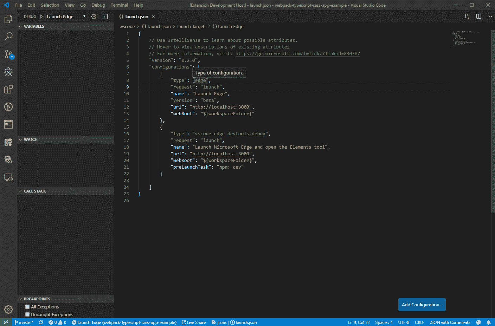

我们在这个实验中处于相当早期的阶段，欢迎反馈！

# 铬边

现在，如前所述，我们正在发布基于 Chromium 的微软 Edge 浏览器。你可以[下载并安装预览版](https://aka.ms/edgeinsider)作为每日金丝雀版、每周开发者版和更稳定的测试版。

我对此感到兴奋，不仅因为它为 Windows 10 以外的其他平台带来了优势，而且它对 Chromium 项目意味着什么。本质上，我们是在给网络的一个重要部分添加一个拥有大量用户的强大播放器。

微软在前面描述的所有领域都有很多用户。这意味着我们需要为 Chromium 贡献一些以前没有的东西。

*   浏览器和开发工具的国际化(30%的 VSCode 用户改变了语言)
*   浏览器和开发人员工具的辅助功能增强

仅举几个例子…

随着许多开发人员加入到项目中，我们也对修复 bug 感到兴奋。铬很大，帮助清理它很令人兴奋。

所以，现在看看什么是 Edge，点击笑脸图标给我们反馈。如果您对开发人员工具有具体的反馈，也会有一个笑脸。您将创建一个包含屏幕截图、遇到问题的 URL 和描述问题的表单字段的报告。我工作的一部分就是检查这些反馈，并相应地进行分类。

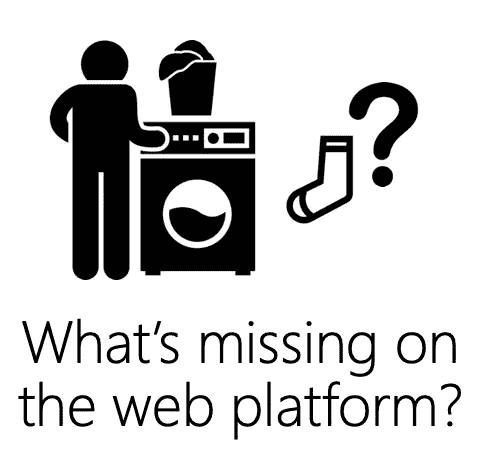

当然，我们也不应该停止创新网络。一种新的方式来表达你对它的关注，并获得各种浏览器制造商和标准机构成员的支持是[我们想要的网络](https://webwewant.fyi)。看一看，看看人们认为缺少了什么，并贡献您自己的想法。

# 总之:网络是一个多样化的地方

退一步，从用户的角度来看待网络，这是令人兴奋和谦卑的。我希望你能从中获得一些灵感，知道下一步该怎么做。我们有机会让每个人更容易为所有最终用户创造优质产品。我们有开源平台，有开放的交流渠道，为网络提供动力。我们积累了很多知识，为什么不把它添加到我们的工具中，在上下文中教授网络的创造者呢？