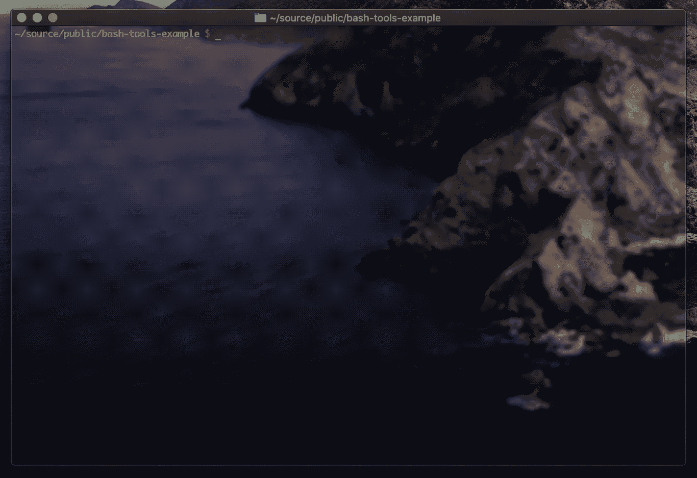

# Bash 脚本简介

> 原文：<https://itnext.io/intro-to-bash-scripting-95c5fbc2dcef?source=collection_archive---------2----------------------->

## 为 Bash 中的基本命令行任务构建工具


[GNU Bash](https://www.gnu.org/software/bash/)

## 介绍

D 开发软件通常需要花费大量时间在命令行上。各种任务需要向计算机输入非常详细的指令的能力，如果没有基于文本的界面和键盘(以及咖啡)，这是很难甚至不可能完成的。

在本文中，我们将了解在 [Bash](https://en.wikipedia.org/wiki/Bash_(Unix_shell)) 中创建有用工具的基础知识，Bash 是服务器端架构和 DevOps 中最常见的 shell。

虽然 shell 脚本实际上是*脚本，但是*会努力将尽可能多的产品级软件工程的概念应用到示例项目中，以建立导致高度成功的最佳实践(并且在出现问题时更容易发现发生了什么)。

本文的源代码副本可以在 GitHub 上的[处获得。](https://github.com/kenreilly/bash-tools-example)

## 概观

Bash 是一种[命令语言](https://en.wikipedia.org/wiki/Command_language)，其语法源自自然人类语言，其特性集包括命令执行、条件逻辑、计算、数组/字典、迭代/循环、函数、字符串操作、扩展等等——这使得它对于批处理、作业控制、维护和其他系统管理员任务非常有用。

关于 Bash 特性及其工作原理的概述，请查看这篇优秀的[备忘单](https://devhints.io/bash)。开始使用 Bash 很容易，只需要访问一个终端。要创建并运行基本脚本:

```
**$** echo 'echo "hello $1"' > hello.sh 
**$** chmod +x hello.sh
**$** ./hello.sh programmerhello programmer
```

第一行[将文字字符串`‘echo “hello $1"'`重定向](https://www.gnu.org/software/bash/manual/html_node/Redirections.html)到文件 *hello.sh* ，第二行[启用脚本的执行权限](https://en.wikipedia.org/wiki/Chmod)。第三行使用`programmer`作为参数运行脚本，通过`$1`变量输出回终端。这说明了什么是`.sh`文件，以及它们如何接受输入并从中产生输出。接下来，我们将看看将`.sh`文件格式化成结构化代码块的概念。

## 入口点

bash 脚本是自顶向下逐行解释的，其他 bash 文件可以使用`source *my-script-name.sh*` 命令导入，这对于将各种概念组织成可重用的库代码非常有用。

下面是我们的示例项目中的主文件， **bash-example.sh** :

第一行包含`#!/bin/bash`——一个称为 [shebang](https://en.wikipedia.org/wiki/Shebang_(Unix)) 的解释器指令方案，它告诉环境使用`bash`解释器处理这个文件的其余部分。第`source ./lib/main.sh`行将主函数导入到当前会话中，然后用`main $@`调用它，后者将当前范围内的所有参数(`@`参数)传递给主函数。该文件作为定义/条目文件保持干净。

## 主要功能

接下来是这个实用程序的主函数，在 **lib/main.sh** 中:

在 [shebang](https://en.wikipedia.org/wiki/Shebang_(Unix)) 之后，其余的库脚本都是源代码，稍后我们将进一步检查每一个。在入口点调用的 *main()* 函数(在前一个文件中)首先初始化这个示例实用程序处理的各种数据处理任务的目录。接下来，用 Bash 命令`declare -A -x command_table`创建 command_table 变量，该命令创建一个关联数组(`-A`)，并允许用一个值(`-x`)初始化该变量。这创建了一个简单的功能表，以避免使用更大的`if/elif`或`switch`模块。然后来自`command_table`的键被解析成简单的索引数组`commands`，当使用不正确的参数调用时，该数组用于显示帮助信息。

从命令行获取的第一个参数存储为`command`，然后调用`shift`，然后将该项从参数堆栈中推出。在命令表中查找该命令，如果存在匹配的键，则通过调用`$fn_name $@`使用剩余的参数堆栈调用相应的函数，该函数采用`fn_name`的值，并将其作为 shell 命令执行，同时传入参数。

这个小型 Bash 程序支持三个特性:

*   `scan-files ***num***:`递归扫描当前目录中 ***num*** 最大的文件，并将结果输出到`./data/logs`下的日志中
*   `process-logs :`处理日志文件，向`./data/reports`写入摘要，在`./data/archives`创建一个`tar.gz`文件，并删除日志文件
*   `get-photo :`获取 NASA 当天的天文照片，并将照片`.jpg`和相应的`.json`放在`./data/images`下

我们一会儿将讨论每一个函数，但是首先让我们看看在这个示例项目的其余部分中使用的底层配置和实用函数。

## 配置

没有一些初始设置和配置，任何项目都是不完整的。我们要检查的下一个文件是 **lib/config.sh** :

首先，错误处理是通过创建一个处理函数 *on_error()，*设置错误跟踪，然后设置一个错误陷阱，在出现`ERR`条件时调用 *on_error* (这在调试时提供了有用的反馈)。

接下来，启用别名扩展，以便轻松扩展和重用别名。这个功能在这个项目中用得不多，但是以防万一。

设置了另一个陷阱，这一次是针对`TERM`信号，以便在任何时候从任何点退出脚本。最后，当前的工作目录被发现并存储在`_ROOT`中，用于文件系统操作，以确保在代码库的其余部分使用正确的目录。

## 效用函数

下一个要检查的文件是 **lib/utility.sh** :

在这个文件中有几个简单的实用函数，使这个项目的工作变得更加容易。函数 *exit_with_help* 显示作为参数传入的消息，然后退出脚本。 *get_timestamp* 函数打印出带有格式字符串的`date`命令的结果，并且 *init_dir* 检查一个目录，如果它不存在，就创建它。

*str_split* 函数以一个字符串作为输入，通过设置一个全局关联数组`str_split_result`来“返回”一个数组，调用脚本在调用 *str_split* 后访问该数组。通过将内部 Bash 读取分隔符`IFS`设置为所提供的值，然后使用`read`读取字符串数据(通过`IFS`将字符串分解为一个数组)并将结果存储在`str_split_result`中以备后用，从而生成数组。

## 文件扫描

基本的配置和帮助函数已经完成，让我们来看看 **lib/file-io.sh** 中的第一个特性(文件扫描):

*write_file* 函数将 printf 语句的输出重定向到由根 url 和提供的字符串路径构建的路径。write_log 函数只是调用带有`‘logs/’`前缀的 *write_log* 来存储`data/logs`下的文件。

实际扫描功能在 *scan_large_files* 中实现，它首先检查以验证参数是否已传入(用于记录的最大文件数)，如果未提供，则打印帮助消息并退出。

接下来，运行一个`find`命令来搜索当前目录及其下的所有文件。这个命令的结果通过`awk`、`sort`和`head`来过滤、排序和提取列表中的前 x 个文件(有关 I/O 重定向的更多信息，[参见本页](https://www.tldp.org/LDP/abs/html/io-redirection.html))。其结果存储在`data`中，并产生一个`timestamp`。然后将`data`的内容保存到一个文件中。

这就完成了文件扫描器和日志生成器。这个文件中还有一个函数`create_archive`(我们将从下一个文件中调用它)，它实际上只是运行一个`tar`来归档和压缩日志文件，并将结果归档保存到`./data/archives`。

*create_report* 函数将`log_data`的内容写入一个格式化的`.yaml`文件，以便阅读。

## 数据处理

接下来是本例中的第二个特性，处理由文件扫描器生成的日志文件，在 **lib/log-processor.sh** 中实现:

这个文件是这个程序中大多数复杂工作完成的地方。文件中的第一个函数是 *process_logs，*，它从初始化一个全局关联数组`log_data`开始，该数组将保存用于创建报告的数据。使用另一个查找命令，结果存储在`logs`中。文件和行的总数的计数器也被初始化。接下来，执行检查，如果没有可用的日志文件，脚本将退出。

每个日志文件都作为`record`处理，通过使用下划线分隔符(`_`)调用`str_split`并从数组中检索第二项来提取日期。如果由于某种原因日期为空，则忽略该条目，脚本继续处理列表中的下一项。每个日志文件被读入到`line`中，然后被传递到`process_entry`函数中进行进一步处理，稍后我们将对此进行研究。

*process_entry* 函数设置一些局部变量，打印一些[彩色的](https://misc.flogisoft.com/bash/tip_colors_and_formatting)状态信息，然后查看文件是否已经存在于`log_data`中。如果是，则比较两个条目的日期，如果当前条目比数组中的条目新，则替换旧的条目。否则，只需将该项添加到数组中。

处理完每条记录后，会显示一些状态信息，脚本运行`create_report`和`create_archive`来生成报告，并将日志文件归档到各自的位置。

## 图像下载器

最后但同样重要的是，我们在 **lib/net-client.sh** 中有图像下载程序:

这里我们有一个函数`get_nasa_photo`，用于从 NASA 检索关于他们当前[天文图片](https://apod.nasa.gov/apod/astropix.html)的信息。这个函数首先定义这个服务的 NASA URL，对它执行一个 [cURL](https://en.wikipedia.org/wiki/CURL) 操作，并将结果存储在`json`中。`filename`变量也被初始化为空字符串。接下来，使用字符串扩展范围选择器`${json:1:-1}`修剪 json 的前后括号，该选择器接受`json`的值并返回开头的`+1`到结尾的`-1`。这被传递到 *str_split* 中，以通过`','`字符分割剩余的字符串，这将不允许对整个 JSON 数据进行正确的解析，但会让我们更接近我们需要的唯一值`url`。这是一个纯粹黑客的例子，这样做是为了在 pure Bash 中实现一个解决方案，但是对于生产场景，建议使用命令行 JSON 处理工具[，比如 jt](https://stedolan.github.io/jq/) 。

分割后的 JSON 数据的每一部分都作为`field`进行处理，当找到以`'"url":'`开头的部分时，它会被进一步处理以从字符串中检索实际的 URL。一旦获得了 URL，就从其中检索文件名并调用 *download_image* ，后者执行另一个`curl`操作来下载文件内容并将它们重定向到目标`.jpg`文件。

一旦下载完成，原始的未修改的 JSON 数据也被写入，文件名相同，但扩展名为`.json`，而不是`.jpg`。

## 结论

Bash 是一个强大的命令行环境，它为开发人员和系统管理员提供了各种各样的工具来快速自动化许多常见任务，尤其是在部署和维护方面。

这个项目演示了 Bash 中可以完成的几件事情。如需更详细的信息，请查看本[高级脚本指南](https://www.tldp.org/LDP/abs/html/)或参考前面提到的[备忘单](https://devhints.io/bash)。

感谢您的阅读，祝您的下一个 DevOps 项目好运！



运行中的 **bash-example.sh** 的屏幕截图

> 肯尼斯·雷利( [8_bit_hacker](https://twitter.com/8_bit_hacker) )是 [LevelUP](https://lvl-up.tech/) 的 CTO