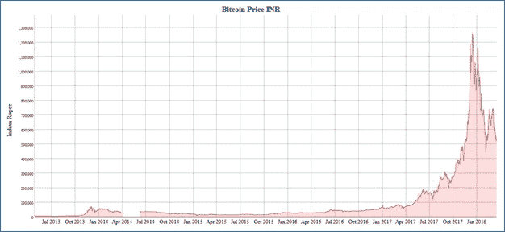
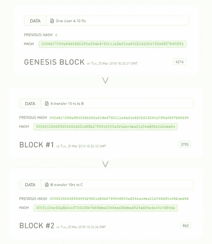
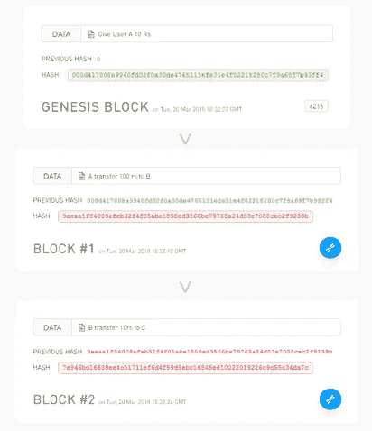

# 比特币简介——背后的经济和技术

> 原文：<https://itnext.io/intro-to-bitcoin-the-economics-and-technology-behind-it-18a29c1c45cc?source=collection_archive---------3----------------------->

## 介绍

比特币成为新闻已经有一段时间了，无论是神秘的创始人中本聪(没人知道他/她是谁)，还是由于不断波动的价格而在社会经济领域引起的涟漪，还是其底层的开源点对点区块链技术。从回避它的主要机构，到试图用科技复制他们选举的国家；从作为黑市的主要货币，到像微软和贝宝这样的科技巨头支持它，这是一段相当长的旅程。它抓住了经济学家和技术专家的兴趣，并有可能破坏银行体系的根本结构。在这里，让我们试着理解比特币背后的直觉，驱动它的技术，以及所有这些是如何协同工作的。



图 1:多年来以印度卢比计算的比特币价格

## 直觉——货币简史

经济学家把货币定义为交换媒介，某种价值单位。这一基本理念一直是货币体系的基石。人类花了几千年的时间来适应虚拟货币的概念，并放弃将货币定义为一张纸或一些金币。在这方面，远在太平洋上的雅浦部落比我们强得多。由于缺乏像银和金这样的珍贵矿物，他们用石灰石雕刻巨大的石盘，这是他们对贵金属的想法。由于很重，它们无法移动，这种非常具体的货币形式变得非常抽象。他们通常在不移动硬币的情况下交易硬币。只是村里的每个人都知道硬币有了新主人。根据这些故事，有一次一块石头掉进了海里，但这并没有改变石头的价值，因为每个人都认为钱仍然是好的——即使它在海底。这与当前的数字系统有着惊人的相似之处。网上交易只不过是对包含你所有交易历史的分类账(数据库)的修改。在某种程度上，我们对金钱的定义是一样的，尽管我们对金钱的定义一直在变。

在整个对话中，我们忽略了一些非常新但同时在货币体系中非常重要的东西。我们将由谁以及如何维护分类账，即我们所有交易的所谓历史。此外，谁应该拥有创造新货币的权力？在中世纪时期，许多私人机构建立起来，拥有独立的账簿和货币。这为现代政府控制的中央银行铺平了道路，中央银行在创造货币方面拥有完全的自主权，并让私人机构在严格的指导下运作。这导致了整个银行系统的集中化。无论是私人银行还是政府，当涉及到他们的资金时，人们都倾向于怀疑第三方。我们受制于他们的软骨头(政治周期影响银行利率)，他们的政策可以在一夜之间改变(去货币化)，许多机构已经显示出他们在处理全球危机(2008 年金融危机)方面的无能。这需要一个分散的银行环境，有固定的规则，独立公正的监管，这推动了对分散数字货币的研究。

## **创新——区块链技术及其如何帮助实现**梦想

如果设计一个独立的银行系统还不够困难，那么许多加密货币研究人员的主要障碍来自于系统的理想化，即执行中央银行的所有重要任务，同时保持自己的分散性。银行在交易中提供信任，保存记录和合同，并在违约时提供明确的赔偿。数字货币应该结合协议来考虑上述要求。分散式系统的一个主要问题是臭名昭著的双重支出问题，当你在同一借项上做多个贷项时。引入与多个账本持有者相关的风险，你就会陷入完全的混乱。

甚至在比特币出现之前，数字货币的想法已经流传了一段时间。然而，由于所讨论的问题，它尚未实现和大规模测试。区块链彻底改变了游戏。随着题为“比特币”的白皮书的发布，Nakamota 强调了去中心化加密货币的基础，一句话，这是革命性的。它提出了一种点对点的分布式网络结构，其中系统中的每个人都是总账持有者，并且加密签名标记交易。成束的最新事务请求被分组在块中，并被广播给系统的每个成员，在那里它们执行计算扩展操作以标记它们的工作证明。完成后，他们将新的数字散列块广播给各自的成员，这些成员将它添加到他们不断增长的块链中。从某种意义上来说，比特币的分类账只不过是一个长长的区块链，每个区块都包含一堆交易记录，从最初的时间到最近的时期。

区块链背后的技术可以通过一个接一个地解决它所要解决的问题来理解。让我们看看这个问题，

1.  **假币交易**

在集中式系统中，伪造先前交易的难度完全取决于第三方的安全措施。一旦欺诈实体获得对分类账的访问权，他可以简单地更新分类账并完全破坏系统。想象一下，一个人在账户余额上加了几个零，或者加了一笔假交易，显示你给他们转了一大笔钱。随着最近技术和计算能力的进步，以及最近整个机构非法攻击的增长趋势，有一点是清楚的，这些活动是很有可能的。

区块链通过维护开放的分布式点对点账本，解决了伪造交易的问题。由于分类帐是开放的，因此在系统中被称为矿工的用户可以访问分类帐，矿工的角色是维护完整分类帐的真实副本。由于是点对点的，矿工们不断在他们之间进行投票，以验证分类账的真实性。在比特币的情况下，分类账由区块链组成，每个区块包含交易信息。简而言之，单个块的剖析包含一些数据，这里是事务记录、前一个块的散列和当前块的散列(参见图 2)。由于第一个块没有任何前任，它的前一个散列是 0，它被称为起源块。使用散列值的前一个块与下一个块的这种链接形成了链状结构，其包括区块链。假设有人修改了区块链中的一个先前的条目，以增加转入其账户的金额(参见图 3)。在这里，他在第 1 块中进行了修改，将金额从 10 卢比增加到 100 卢比。然而，这种修改改变了块#1 的散列，并且作为线中的下一个块，即块#2 具有原始块散列，这只是扰乱了区块链的真实性。这种差异将在矿工之间的下一轮投票中被注意到，并将被整个系统拒绝。



*图二:原版区块链*



*图 3:改良版区块链 1 号区块*

2.**工作证明**

让我们以上一节中的例子为例。攻击者更改了块#1 中的事务历史，在任何人注意到之前，他以正确的顺序散列了块#1 和块#2。这可能会破坏网络，因为现在图 2 和图 3 中显示的两个不同的分类帐被正确映射，有效，并且没有办法验证哪个是正确的。这可能鼓励每个矿工根据他们的需要修改他们的分类帐，这将是灾难性的。为了解决这一问题，区块链实施了工作证明概念，根据这一概念，需要投入一些精力来生成区块。如果努力是公平，对所有人(大部分)都是平等的，足够随机和困难，它可能只是让攻击者的生活变得困难。让我们试着理解它。

假设有一些工作(在这种情况下是高数学计算)很难做，但很容易验证，我们要求矿工在任何有效块生成之前执行它。这意味着，任何攻击者改变一个区块，将不得不继续为每个区块做相同数量的工作，直到他到达区块链的最后一个区块。这是因为我们的工作很容易验证，任何松散的结束，(这里无效块)将被网络丢弃。这说明了一件事，新的积木比旧的更容易仿造。

在区块链工作的证明包括扫描一个值 nonce，当它被添加到块中时，使得块的散列从一定数量的零开始。任何块或任何值的散列都是该值的唯一表示。您可能已经见过提供了哈希值的大文件，以便在下载后检查其真实性。这里，计算每个块的唯一表示。然而，散列计算是相当快速和容易的，为了使这作为一个适当的工作证明，一点点扭曲被添加到它。现在我们想要一个散列块，它以一定数量的零开始。这使得问题在指数上变得困难，因为计算这种随机数的复杂度是 2^n，其中 n 是开始时零的数量。只有一种方法可以解决这个问题，我们增加 nonce，它被附加到块中，直到得到想要的散列。以下 python 脚本将阐明散列法，

```
>>> import hashlib>>> hashlib.sha256(“This is a block. I added a nonce:1”.encode(‘utf-8’)).hexdigest()
‘a8633ea60ffa0ad14a3589f35eacefda7c18e45eb600d504404e6d85798715b6’>>> hashlib.sha256(“This is a block. I added a nonce:2”.encode(‘utf-8’)).hexdigest()
‘5050787fe1c5350b9f40fe9483f0aed0818f620bd059219272aef4a03bad0107’>>> hashlib.sha256(“This is a block. I added a nonce:3”.encode(‘utf-8’)).hexdigest()
‘ff1b7e973471c3f196c3980252faf22d0a03b363153e80f63e958a8cce8ac502’>>> hashlib.sha256(“This is a block. I added a nonce:35600”.encode(‘utf-8’)).hexdigest()
'00002c0b233a9c4aca08ee71baaaa036c16f7780853c3c54418721c323e85e23'
```

现在，为了计算 nonce，它在开始时给我们四个零，我们继续进行这种计算，因为哈希是一个随机过程，因为即使输入的微小变化也可能导致哈希输出的完全变化。对于这个特定的字符串，我们在 nonce 35600 处找到了所需的散列。在每个固定的时间间隔之后，重新计算起始零的数量，以便将每个块生成的平均时间保持在 10 分钟左右。这是经过编码的，以适应多年来不断增长的计算能力。

3.**点对点**

让我们试着理解区块链的对等网络是如何工作的。每一笔新交易后，都在网络中广播给每一个矿工。每个矿工将它们收集成块，并试图找到该块的工作证明。在成功计算随机数并生成特殊散列后，成功的挖掘器在网络中广播该块。现在，每个接收矿工验证该块，在该块中，通过遵循诸如具有非正余额的用户不能进行交易之类的规则，检查块内的所有交易是否为欺诈性或不可能的交易。如果所有的交易都是有效的，并且区块的特殊散列也如最新难度规则中所指定的那样突出，则新的新区块在每个矿工的本地分类帐中被接受。在完全诚实的网络中，每个矿工都有正确的相同的账本。但也不一定每次都是这样。

现在，矿工们总是认为最长的链条是正确的，因为更多的工作或努力证明已经投入到那个链条中。在攻击者作为诚实的挖掘者同时广播欺诈块的情况下，来自原始链的两个并行分支可能起源于接收挖掘者。随着时间的推移，攻击者和诚实的矿工竞争生成下一个块。假设这个过程持续了一段时间，现在每个新的分支都有一些额外的块，攻击者仍然很难通过执行工作证明来跟上整个诚实的挖掘者网络来生成有效的块。这种想法要求网络中的大多数人要诚实，要工作。一旦诚实挖掘器比攻击挖掘器更快地生成新块，接收挖掘器就切换到诚实分支。这就是为什么总是建议在真正相信交易已经发生之前等待一些确认。确认是添加到包含您的交易的下一个块。您收到的确认越多，欺诈活动的可能性就越小。

4.**激励**

现在主要的问题来了，为什么会有人在没有任何赔偿的情况下进行这些数学计算？如果你为他们的努力给他们钱。而在这个网络中，比特币就是货币。因此，对于每个区块，矿工们都要竞争寻找随机数，首先找到随机数的人会因为他们的努力而获得一些比特币。这增加了矿工支持网络的动机，这样比特币的创造就得以流通，因为没有像中央银行系统那样凭空产生金钱的中央权力机构。2009 年，每块比特币产生的速度从每块 50 比特币开始，每四年减半。所以让我们做一点数学计算，

```
1 block per 10 mins
6 block per hour (60 mins / 10 mins)
144 blocks per day (6 * 24)
52560 blocks per year (144 * 365)
210240 blocks per cycle of 4 years (52560  * 4)
```

新区块产生的比特币数量正在减少，

```
g = 50 + 25 + 12.5 + ..... 
g = 100 (geometric series)
```

所以现存比特币的最大数量可以近似为，

```
# max bitcoin = 100 * 210240 ~ 21 million
```

额外的激励以交易费的形式出现。每笔交易消费零到多比特币零到多收款人。花费的金额和收到的金额之间的差额就是交易费。简而言之，如果一项交易的输出值小于其输入值，则差额为交易费，该交易费被添加到包含该交易的区块的激励值中。一旦我们达到 2100 万个比特币，那么交易费将单独计入激励，从而创建一个完整的无激励网络。

## 结论

我们试图对比特币有一个简单的了解，从对钱的一些直觉开始，然后深入研究区块链背后的技术。我试图保持帖子简单，仍然有很大一部分比特币技术要涵盖，如默克尔树，支付验证，交易简报，隐私等等。对于经济部分，我还有更多的话要说，但可能都在第二部分了。嗯，这完全取决于这个帖子的反应。

干杯。

## 参考

[1] [比特币:一种点对点的电子现金系统](https://bitcoin.org/bitcoin.pdf)

[2]区块链[演示](https://blockchaindemo.io/)

[3] [比特币维基](https://en.bitcoin.it/wiki/Main_Page)