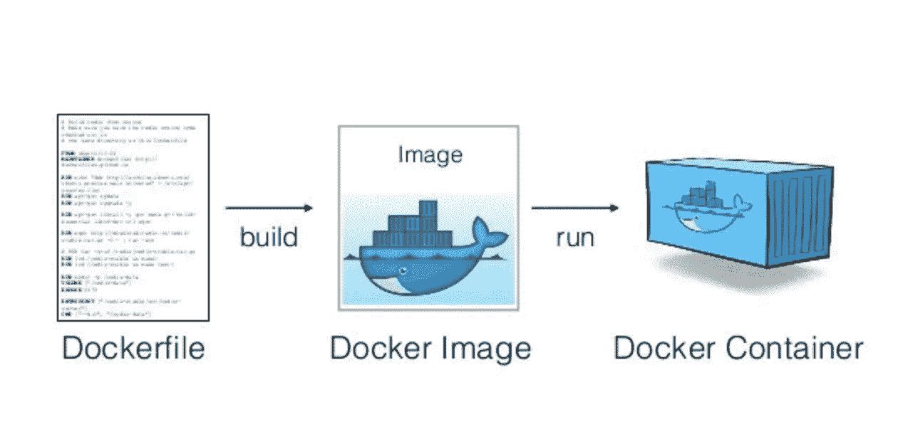

# Docker 简介—第 1 部分

> 原文：<https://itnext.io/intro-to-docker-part-1-5b1162c81735?source=collection_archive---------1----------------------->

docker 容器快速介绍

这是一个简短的 Docker 教程。

# 目标

快速学习 Docker 概念，而不会迷失在微小的细节中。提供使用 Docker 创建和运行您的第一个容器化应用程序所需的工具，使您能够在需要时自己寻找更多。

# 先决条件

不是这样的。只需从[这里](https://docs.docker.com/get-docker/)安装 Docker

# 基本概念

> 一个 ***容器*** 是我们最终想要用 Docker 引擎运行和托管的。

从概念的角度来看，*容器*运行在 **Docker 主机**内部，与其他容器甚至主机操作系统隔离。它看不到其他容器、物理存储或获取传入连接，除非您明确声明它可以。

这里需要注意的是，Linux 内核是与操作系统和所有其他容器共享的。*主机*可以看到/操纵容器中的一切；进程、文件系统等。

PS:- Docker 与虚拟机有很大不同，一些细节在这里[相同](http://www.munzandmore.com/2015/cc/docker-container-vs-virtualization)

典型的 Docker 服务器看起来像这样——许多容器的主机:


> 任何运行的容器都是从一个 ***图像*** 中创建的。图像描述了创建容器所需的一切；它是容器的模板。您可以根据需要从单个图像创建任意多个容器。

图像存储在**注册表中；注册表** *针对图像管理进行了优化。*

> Dockerfile 是一个文本文档，它包含用户可以在命令行上调用的所有命令来组合一个图像



我们将详细研究所有这些内容——需要抓住三个重要概念，即 Dockerfile、Docker image 和 Docker container。我们继续吧。

# 一些容器概念

强烈建议您在命令行终端上尝试这些命令。

> 问:当我们跑步时会发生什么

```
docker run hello-world
```

1.  您的命令要求 Docker 基于 *hello-world* 映像**创建并运行一个容器**。
2.  由于 *hello-world* 镜像还没有出现在你的磁盘上，Docker **从默认注册表**、Docker Hub 下载了它。
3.  Docker **基于 *hello-world* 映像创建了一个容器**。
4.  ***hello-world* 图像声明**当启动时，它应该向控制台输出一些文本，所以这是您在容器运行时看到的文本。
5.  **容器停止**。

如果您重新运行相同的命令，您将会看到除了步骤 2 之外，上述所有步骤都在重复；这是因为映像不需要下载，因为它在您第一次运行该命令时就已经存在于您的计算机上了。自己尝试一下，验证上面的话是否正确。

# 问:容器管理的一些基本命令？

> 码头运行—帮助

您可以使用以下命令进行容器管理:

> ***docker ps*** :列出仍在运行的容器。添加 **-a** 开关，以便查看已经停止的集装箱
> 
> ***docker 日志*** :即使容器已经停止，也可以检索容器的日志
> 
> *:获取正在运行或停止的集装箱的详细信息*
> 
> ****停靠站*** :删除一个仍在运行的集装箱*
> 
> ****docker rm*** :删除一个容器*

# *问:验尸检查？*

*让我们研究一下 hello-world 容器上的一些容器管理命令。*

***获取所有正在运行的容器***

*`docker ps`*

***获取所有容器***

*`docker ps -a`*

```
*CONTAINER ID        IMAGE                        COMMAND                  CREATED             STATUS                      PORTS                    NAMES33f2ca665467        hello-world                  "/hello"                 14 seconds ago      Exited (0) 12 seconds ago                            dazzling_morse*
```

***获取容器日志***

```
*docker logs 33f2ca665467`*
```

***获取集装箱信息***

```
*docker inspect 33f2ca665467*
```

***移除容器***

```
*docker rm 33f2ca665467*
```

*立即尝试日志和检查命令；码头工人不再知道这个集装箱了。*

# *码头运行(短寿命容器)？*

*你可以把 ***docker run* 命令**想象成相当于买了一台新电脑，在上面执行一些命令，然后把它扔掉。每次从一个映像创建一个容器时，您都会得到一个新的隔离的原始环境，可以在该容器中进行操作。*

*您在容器中获得的内容取决于您的容器基于哪个图像。在图像名称之后，您可以在容器内部传递想要执行的命令。*

```
*docker run alpine printenv*
```

*我们基本上要求使用 *alpine* 映像创建一个容器，并要求该容器执行 *printenv* 命令，这是打包在 *alpine* 映像中的二进制程序之一。*

*毫不奇怪， *alpine* 映像被下载来创建容器，因为它还不在我的磁盘上。*

*PS:-如果能理解 Docker 是一个让你获得相当于一次性、一次性使用的计算机的工具，那就太好了。一旦清楚了这一点，一个全新的世界就为你打开了。你来自这样一个世界，在那里获得一台新机器并对其进行配置需要足够的努力来证明保留它是正确的，尽管每次后续使用都会带来副作用。在容器世界中，获得一个全新的环境足够便宜，可以获得许多这样的环境。*

# *问:如何清理/删除容器？*

> ***有多种方式，其中一种方式使用***

```
*docker container prune -f*
```

*这相当于为每个停止的集装箱运行一个 *docker rm* 命令。 *-f* 开关是一个隐含的确认，表示立即继续并删除所有停止的集装箱，而不是要求确认该操作。*

# *码头运行(长寿命容器)？*

*我们刚刚看到了如何运行短命容器。它们通常会进行一些处理并显示一些输出。然而，长期容器有一个广泛的用途:服务器容器。无论您想要托管 web 应用程序、API 还是数据库，您都需要一个监听传入的网络连接并且可能是长寿命的容器。*

*简而言之，服务器容器*

*   *是长寿的*
*   *侦听传入的网络连接*

*让我们试着跑同样的路。*

```
*docker run alpine ping [www.docker.com](http://www.docker.com)*
```

*让我们尝试 pinging 相同的*

```
*docker run -d alpine ping [www.docker.com](http://www.docker.com)*
```

*让我们列出所有正在运行的容器*

```
*docker ps -a*
```

*现在让我们尝试获取日志；这是调试任何容器的最佳方式*

```
*docker logs <container_id>docker logs — since 10s*
```

***监听传入的网络连接***

*默认情况下，容器是独立运行的，因此，它不会在运行它的机器上监听传入的连接。您必须在主机上显式打开一个端口，并将其映射到容器上的一个端口。*

# *锻炼*

> *假设我们想运行 NGINX web 服务器，默认情况下，它在端口 80 监听传入的 HTTP 请求。如果我们只是运行服务器，我们的机器不会将传入的请求路由到它，除非我们在 *docker run* 命令上使用 *-p* 开关。*

***停在这里，在查看解决方案之前自己尝试一下***

***解决方案***

**-p* 开关带两个参数；您希望在主机上打开的传入端口，以及它应该在容器内映射到的端口。例如，下面是我如何声明我希望我的机器监听端口 8085 上的传入连接，并将它们路由到运行 NGINX 的容器内的端口 80:*

```
*docker run -d -p 8085:80 nginx*
```

*使用以下方式到达服务*

```
**http://localhost:8085**
```

*因为该容器在后台运行，所以它的输出不会显示在我的终端上。但是，我们可以使用*

```
**docker logs* <container_id>*
```

*现在让我们停下来，把容器拿走。*

```
*docker stopdocker rm*
```

*您是否注意到我们现在拥有了相当于全新服务器的产品？这意味着我们可以在上面安装任何我们想安装的东西，也可以随时丢弃它。*

*容器允许我们在不污染机器的情况下使用任何软件。通常，在你的机器上尝试一个新的软件之前，你会犹豫不决，因为如果你改变主意并卸载主软件，安装的几个依赖项可能会干扰现有的软件。多亏了容器，我们甚至可以在不污染我的机器的情况下尝试大块的服务器软件。*

# *问:设置 Jenkins 需要多长时间？*

*Jenkins 有像 java 和其他的依赖，这可能很难管理；Docker 让它变得非常简单。*

```
*docker run -p 8088:8080 jenkins[http://localhost:8088](http://localhost:8088)*
```

*我们将继续这个系列来研究 Docker 及其相关编排的更多概念。*