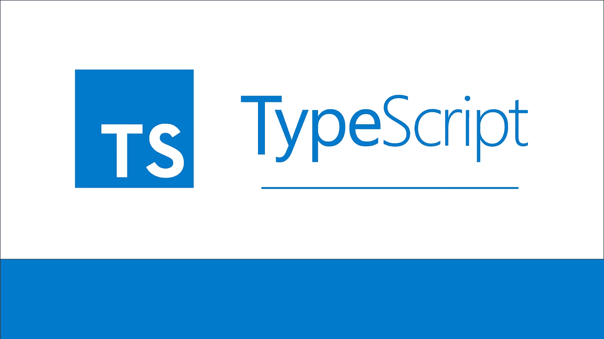

# TypeScript 中的泛型介绍

> 原文：<https://itnext.io/intro-to-generics-in-typescript-f7536375bc68?source=collection_archive---------4----------------------->

## 如何在 TypeScript 中使用泛型来编写结构化代码



## 什么是泛型类型？

默认情况下， [TypeScript](https://www.typescriptlang.org) 内置的一个更强大的特性是使用泛型类型将代码组织成易于理解和维护的抽象。基本上，泛型允许开发人员以有意义的方式对类进行分组和一般化，这使得控制可以对哪些对象执行什么类型的操作变得容易。

以现实世界中的仿制药为例:一台自动洗车机可以清洗任何尺寸的车辆，从小型紧凑型车到大型皮卡或 SUV。总的来说，任何有两个车轴的东西，只要在一定的重量和尺寸范围内，都可以使用洗车服务，不会有任何问题。你能想象如果每一类车辆都需要自己的洗车房吗？当然，还有另一个极端，没有任何类型的安全，因此，如果我们不亲自尝试并抱最大的希望，我们永远不会知道洗车是否安全。它可能会像预期的那样洗车，也可能不会洗得那么好，甚至可能以某种方式损坏它。

因此，利用泛型是一种简单的方法，可以将逻辑世界中的事物分成有意义的组，这些组共享相似的输入、输出、方法和其他属性，这样就可以以可预测的方式对这些事物采取行动，而不需要结合最佳猜测、异常和运气。

## 洗车场

进一步看一下洗车的例子，让我们在假设的应用程序中定义一些概念，即两种不同类型的车辆，以及与这些车辆类型相匹配的两种不同类型的洗车服务:

*   商务车→卡车停靠服务站
*   乘用车→加油站快速清洗

让我们来看看这个场景中车辆的一些基本定义:

```
abstract class Vehicle { }abstract class CommercialVehicle extends Vehicle { }abstract class PassengerVehicle extends Vehicle { }class LongHaulFuelTruck extends CommercialVehicle { }class FedUPSTruck extends CommercialVehicle { } class MidSizeSUV extends PassengerVehicle { }class CompactEV extends PassengerVehicle { }
```

这非常简单，有一个根 Vehicle 抽象类，两个扩展它的类定义了我们的两个主要分类(乘用车和商用车)，最后是每种类型的几个简单实现，比如长途半罐车和紧凑型电动车。

接下来，让我们看看该地区几种不同洗车服务的定义:

```
class JimsMagicCarWash { private queue: Array<Vehicle>
     public wash(vehicle: Vehicle) { ... }
}class GiantTruckStop { private queue: Array<CommercialVehicle>
     public wash(vehicle: CommercialVehicle) { ... }
}class QuickStop {

     public wash(vehicle: PassengerVehicle) { ... }
}
```

在上面的代码片段中，我们有三个可以洗车的地方的例子。第一个是 Jim's Magic Car Wash，它可以排队清洗任何类型的任何数量的车辆，包括商用车辆、客运车辆，也可能是扩展车辆的其他车辆，例如摩托车或沙滩车。吉姆只是想要你的生意，他会洗任何你能推到停车场的东西。

第二个例子是在主要高速公路旁常见的大型卡车停靠站。这个地方可以排队清洗任何数量的大型商用车辆，如半挂卡车和大型移动货车。虽然有人可能会说，一个更小的车辆在技术上适合洗湾，这些人不想乱搞小车，妨碍真正的卡车清洗。

第三个例子是当地的加油站便利店，一次只能洗一辆车，只能办理客运车辆。这些限制阻止了不兼容交通工具(如宇宙飞船运输工具)的驾驶员试图卷起并清洗和抛光所有 64 个轮子。把那东西拿到吉姆那里去——如果你有钱，他们有加班费。

注意上面前两个例子中队列的定义。它们中的每一个都使用了一个**数组**，通过提供一个数组的所有正常预期函数来利用泛型，同时约束它只接受为每个示例类工作的特定车辆类型。例如，试图在队列中放置错误类型的车辆将导致编译错误。

## 结论

虽然这是如何在 TypeScript 中使用泛型的一个非常简单的示例，但它概述了利用这一强大功能以灵活和可预测的方式定义应用程序逻辑所必需的所有关键概念。这种强大的语言功能的使用真的没有限制。要更深入地了解在 TypeScript 中使用泛型，请查看[这篇文章](https://medium.com/@rossbulat/typescript-generics-explained-15c6493b510f)。

我希望你喜欢这篇文章，并发现它很有用。感谢阅读！

> 肯尼斯·雷利( [8_bit_hacker](https://twitter.com/8_bit_hacker) )是 [LevelUP](https://lvl-up.tech/) 的 CTO