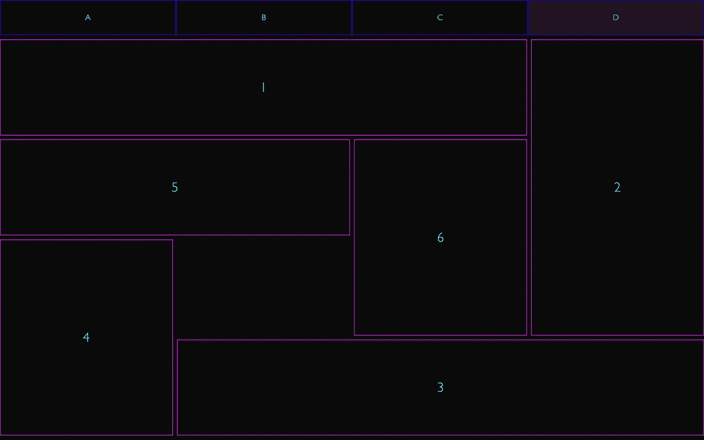
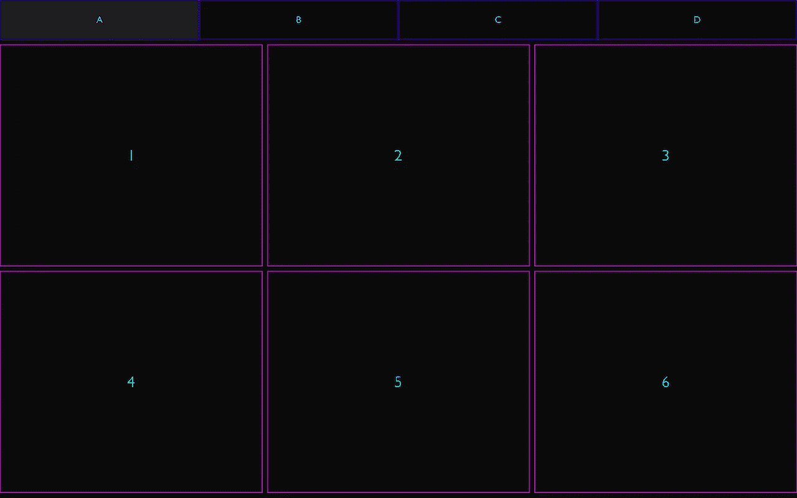
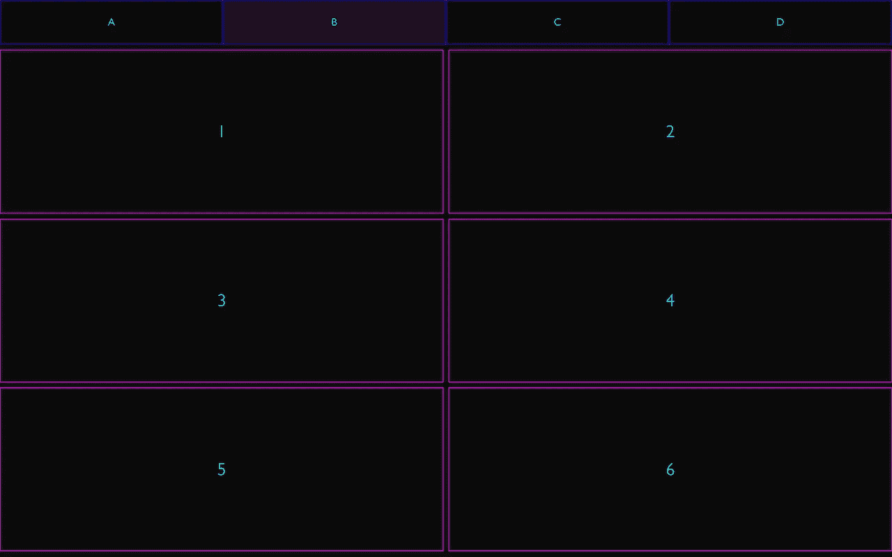
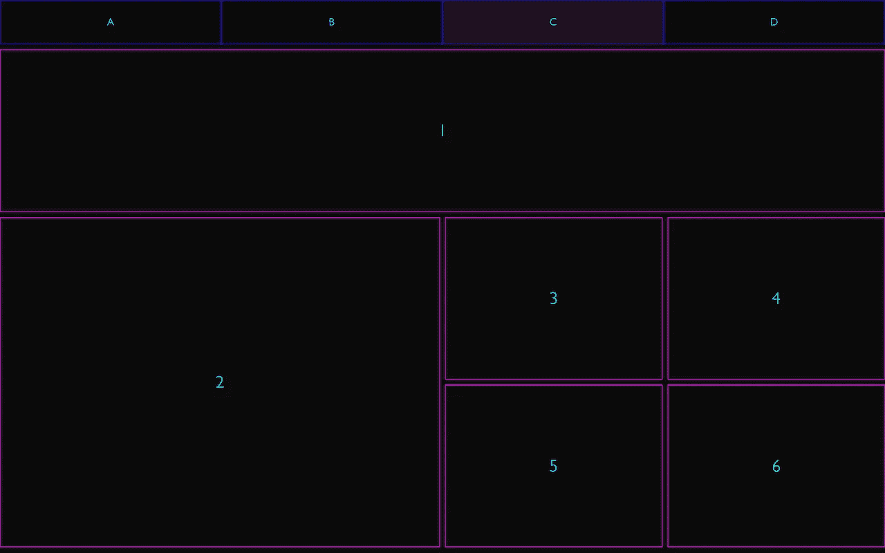
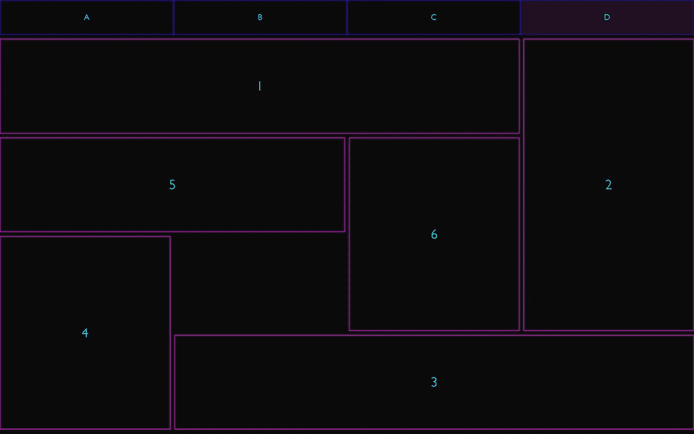

# CSS 中的网格布局介绍

> 原文：<https://itnext.io/intro-to-grid-layout-in-css-935ccb9ebc0d?source=collection_archive---------4----------------------->

## 如何在 HTML/CSS 中使用网格布局



显示布局 D 的示例项目的屏幕截图

## 介绍

在 web UI 的早期，开发人员不得不求助于各种各样的技巧和黑客技术来定位屏幕上的东西，以便在多种浏览器上产生一致的结果。今天，几乎所有的网络设备都支持最新的 CSS 功能，如网格布局，这是 W3C 在 2017 年推出的。在这篇文章中，我们将看看这个有用的 CSS 概念，并探索一些可能的方法来建立布局。

CSS 网格布局不同于 Flexbox，因为它跨二维而不是一维工作。虽然 Flexbox 适用于单行或单列项目，但网格布局可以用于对齐任意数量的项目，跨越任意数量的行和列。可能性是无限的。

网格布局简化了将屏幕上的东西与 CSS 对齐这一众所周知的令人沮丧的任务，这是许多开发人员都非常熟悉的事情。

关于本文中使用的示例项目的副本，请参见 [this GitHub repo](https://github.com/kenreilly/css-grid-layout-example) 。

## 概念

网格是一个二维容器，我们可以在其中定义列和行，还可以为其中的每个元素定义特定的位置。这意味着可以实现任何组合，跨越行和列的元素，甚至将东西放在彼此的顶部，并用`z-index`和其他酷的技巧控制它们的可见性。在这个例子中，我们将看看网格布局的基本概念，这些概念可以用来快速创建无需复杂的 CSS 技巧就能正确呈现的立体布局。

网格布局提供了许多属性，可以非常精确地控制网格行为。这个例子关注几个关键属性，这些属性用于快速建立一个具有各种配置的基本网格。这些是:

*   `grid-template-columns`:定义在作为网格容器的元素上，指定网格的列。
*   `grid-auto-rows`:也在网格容器上定义，指定要自动生成的行的大小
*   `grid-gap`:定义在容器上，指定元素之间的间隙
*   `grid-column` / `grid-row`:定义在网格子元素上，指定该元素将分别跨越哪些列或行

了解了基本概念之后，让我们来看看示例项目的 HTML 和 CSS 源代码。

## 超文本标记语言

网格及其控件的结构在**index.html**中:

这里我们有一个非常基本的 HTML 文件，有一些输入/标签组合作为控制按钮，还有网格及其内容。可以使用“ [CSS checkbox hack](https://css-tricks.com/the-checkbox-hack/) ”的实现来选择不同的网格布局，这是在纯 CSS 中创建简单控件的好方法。

## 半铸钢ˌ钢性铸铁(Cast Semi-Steel)

接下来我们来看看 **style.css** :

`body`被重置为`0`边距和填充，全高和深色背景。控件`label`和网格元素`div`都被设置为居中显示它们的内容(字母 A-D 表示控件，数字 1-6 表示元素)。

`main`元素用`display: grid`配置，行用`grid-auto-rows: minmax(100px, auto)`定义，这将自动生成最小高度为`100px`和最大高度为`auto`的行(自动在垂直轴上均匀分布行)。请注意，这些列还没有定义，它们将为每个布局(A 到 D)单独配置。

定义了字体、边框、颜色和其他基本元素，为示例提供了一个简单的外观。接下来，设置 checkbox/label hack，然后进一步利用它通过使用`~`操作符([通用兄弟组合符](https://developer.mozilla.org/en-US/docs/Web/CSS/General_sibling_combinator))来控制网格行为，该操作符将选择与操作符 ***右侧的选择器匹配的元素，只有当它是操作符左侧元素的兄弟元素时才选择*** 。这意味着我们可以选择任意组合的网格或其子网格，并应用不同的样式，这取决于当前选择了哪个`label`元素的单选按钮。



布局 A

**布局 A** 定义了一个具有三列的基本网格结构，每列占据一个单位的分数空间(`1fr`)。属性`grid-template-columns`用于此，其值为`repeat(3, 1fr).`



布局 B

**布局 B** 是一个两列网格，与前面的布局类似但方向相反。应用的样式是`grid-template-columns: repeat(2, 1fr).`



布局 C

布局 C 是开始变得稍微复杂的地方。在这里，我们开始更深入地选择网格，并通过利用强大的 CSS 选择器模式来修改实际的网格元素，如下所示:

```
input:checked:nth-of-type(3) ~ main > div:nth-child(1)
```

当单选按钮组的第三个`input`元素被选中时，这将选择`main`容器的第一个子元素。对于这个元素，应用了样式`grid-column: 1 / 5`，这意味着它将从列`1` 的开头开始，在列`5`的开头结束(这是一个四列网格，这意味着第 5 列的开头也是第 4 列的结尾，因此在这种情况下，它将跨越整个被占用的行)。

属性`grid-column`可以接受单个整数作为值(特定列)，也可以接受`a / b`格式的值，其中`a`是开始列，`b`是结束列。同样，`grid-row`用于定位框#2，使其从第 2 行跨越到第 4 行。使用`grid-column`和`grid-row`可以实现任意数量的组合，包括让多个元素占据网格上的相同空间，这对于构建具有重叠面板和/或组件的复杂 UI 非常有用。



布局 D

**布局 D** 将复杂性向前推进了一步，将子元素按顺时针螺旋排列，在网格中心附近留下一个洞。这里使用了与`grid-column`和`grid-row`相同的技术，以明确控制每个元素在网格中的显示位置。

## 结论

这个例子说明了网格布局的基本概念，以及如何使用它们来快速组合各种布局。有关网格布局及其支持的特性的更多信息，请参见[本参考](https://developer.mozilla.org/en-US/docs/Web/CSS/CSS_Grid_Layout)。

感谢您的阅读，祝您的下一个网络项目好运！