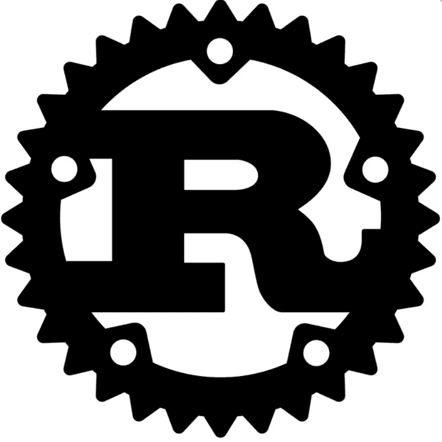
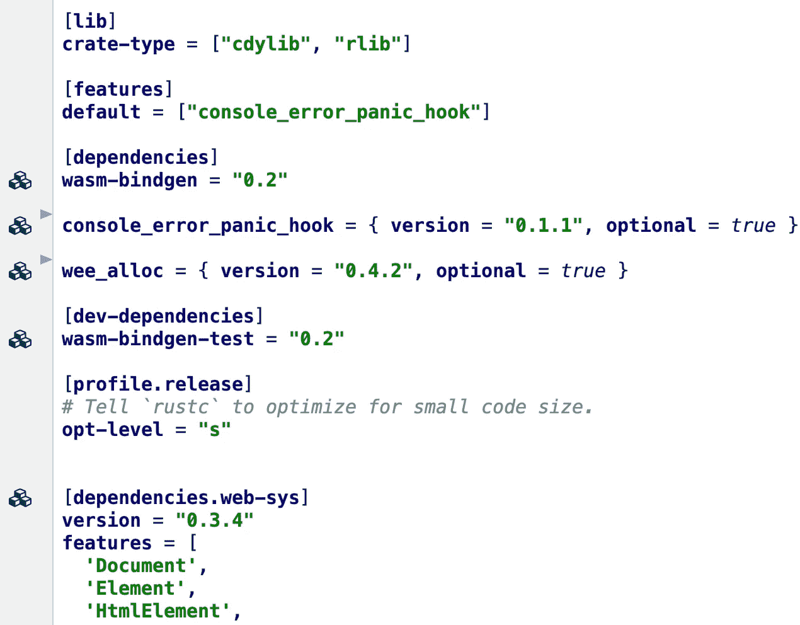

# 通过 Rust 介绍 WebAssembly

> 原文：<https://itnext.io/intro-to-webassembly-via-rust-7365464868bf?source=collection_archive---------3----------------------->

## 面向 Javascript 开发人员(但不仅仅是)！



声明:这篇文章不会教你 Rust，其动机是让你在直观的 Rust 生态系统上使用令人惊叹的 **wasm-pack** 工具快速进入 WASM。

不久前我开始对**锈感兴趣-** 怎么会这样？

围绕 WASM(网络组装)有一场炒作，它引发了我想尝试新事物的需求..我想成为那个派对的一部分🎉 🎊 🎈。

我开始阅读一些关于 wasm [这里](https://webassembly.org/)和[那里](https://developer.mozilla.org/en-US/docs/WebAssembly)的资料:

> “WebAssembly 是一种可以在现代 web 浏览器中运行的新型代码，它是一种低级的类似汇编的语言，具有紧凑的二进制格式，以接近本机的性能运行，并为 C/C++和 Rust 等语言提供编译目标，以便它们可以在 web 上运行。它还被设计成与 JavaScript 并行运行，允许两者协同工作。”

## 与 WASM 博士一起，我们可以:

*   编译其他高级语言代码并在浏览器中运行二进制文件！(太酷了😎).
*   获得(几乎)原生性能。
*   直接从 JavaScript 加载和执行 WASM 二进制文件，并与 JavaScript 代码交换数据。

## 为 WASM 而来，为铁锈而留

我可以运行一个“hello world”或其他基本示例，但是我有点想要学习另一种语言的机会(新的生态系统，新的世界！).

学习一门新的语言会让你更好地掌握你的主要语言，因为你会停下来思考不同之处，此外，你会寻找熟悉的模式，这会让你变得更敏锐。

我不得不选择 C/C++或 Rust，为什么我选择了 **Rust** ？

我没有进行任何彻底的研究就选择了 Rust，原因如下:

1.  它相当新， **new =闪亮的**，并且应用了从旧语言和生态系统“错误”中吸取的经验教训，或者采用了良好的实践。(我真的很好奇)。
2.  它是由我非常欣赏的 **Mozilla** 人创建的(他们与 mdn docs 一起做了一项了不起的工作，这个伟大的社区推动了有趣的开源项目，如 [a-frame](https://aframe.io/) 、 [servo](https://github.com/servo) 、[mozillating](https://iot.mozilla.org/)s 等等..
3.  它有一个很酷的名字！(我的直接内涵是 Megadeth 的专辑是《锈在和平中》..)
4.  快速谷歌搜索显示，它有一个“函数”的概念**，**函数可以作为参数传递给其他函数，内置高阶函数(如地图，过滤器折叠)用于迭代，有选项和结果和类型等..而且默认是**完全不可变**(除非用“mut”)。
5.  我看到它有一个**异步运行时** **支持**，我喜欢使用非阻塞函数，承诺很有趣，异步 await 模式也很有趣..
6.  我看到它有一个很好的**型系统**。

我的原因更多的是“开发”驱动，而不是性能或效率(例如，内存安全，小二进制)驱动，我想要一种语言，它能让我以我喜欢的风格编写(函数式的，但不仅仅是函数式的，具有类型、异步能力等)..).

## **我使用的学习资源:**

有一个很好的课程可以用复数形式观看，叫做: [**【铁锈基础】**](https://www.pluralsight.com/courses/rust-fundamentals) **，**我也经常使用 [**官方文件**](https://doc.rust-lang.org/book/) ..我真的认为他们做得很好。我只是希望我能像在 MDN 一样在那里度过我的时间:)

## **开发环境设置**

你需要安装 rust 工具**编译器**、**包管理器**、**版本管理器**等等..).遵循[指令](https://www.rust-lang.org/tools/install)。

**📝注意:** [**Cargo**](https://crates.io/) 就像 npm， [**rustup**](https://github.com/rust-lang/rustup/blob/master/README.md) 就像 nvm， [**rustc**](https://rustc-dev-guide.rust-lang.org/codegen.html) 就是编译器，我不会说它像 tsc 因为它实际上是把代码编译成二进制而不是其他高级语言。

## 回到 WASM —启动概念验证

[文档](https://rustwasm.github.io/docs)真的非常适合深入研究。如果你想快速开始，请遵循[这本](https://rustwasm.github.io/docs/book/game-of-life/setup.html)快速手册，安装为 Rust 和 WASM 设计的令人敬畏的开发工具。

**开始一个项目时你应该知道的事情:**

*   [**板条箱**](https://crates.io/) 是你可能要使用的第三方**依赖**(像 npm 门户回购)。
*   [**Cargo.toml**](http://Cargo.toml) 类似于 package.json — [学习如何读取和编辑它](https://doc.rust-lang.org/cargo/reference/manifest.html)，并运行它的[命令](https://doc.rust-lang.org/cargo/commands/cargo-install.html)(新建、安装、发布等..)—顺便说一句，还有一个自动生成的货物锁。
*   开发 web 应用程序时，Rust+WASM 的相关[板条箱](https://rustwasm.github.io/docs/book/reference/crates.html)。

为了启动概念验证，我按照[这本](https://rustwasm.github.io/docs/book/reference/project-templates.html)官方手册介绍了一个叫做 **wasm-pack:** 的工具

> **wasm-pack** 是您构建、测试和发布 Rust 生成的 WebAssembly 的一站式商店。

我在构建我的 POC 项目时使用了 **wasm-pack** ，你可以点击我的 POC repo [这里](https://github.com/LironHazan/rust-in-peace)和 web demo [那里](https://focused-booth-bb8cdc.netlify.com/)。

对于一个更“真实的生活使用”角+锈+ WASM 概念检查[我的另一个例子](https://github.com/LironHazan/angular-rust-wasm)。

让我们回顾一下该项目的有趣部分，这将使我们了解它是如何工作的:

**Cargo.toml:**



*   [**web _ sys**](https://docs.rs/web-sys/0.3.4/web_sys/)crate 依赖项真的很有趣——它提供了一个[绑定](https://developer.mozilla.org/en-US/docs/Mozilla/WebIDL_bindings)给浏览器提供的所有 API(据我从这里的阅读[所理解的，反映了 C++渲染引擎的代码)。](https://developer.mozilla.org/en-US/docs/Mozilla/WebIDL_bindings)
*   我在开发 app 时交互的依赖项是:`[**wasm-bindgen**](https://rustwasm.github.io/docs/wasm-bindgen/)`，(Rust 库和 CLI 工具，方便 wasm 模块和 JavaScript 的高层交互)。

[](https://github.com/LironHazan/rust-in-peace/blob/master/src/lib.rs)****:****

**注意`#[wasm_bindgen]` [属性](https://doc.rust-lang.org/reference/attributes.html)的使用，拥有它将导致 2 个包装器的生成:**

*   **接受 JS 类型转换成 wasm 的 JavaScript 包装器。**
*   **Rust 包装器接收 wasm 类型并转换为 Rust 类型。**

**你可以在[这篇不错的帖子](https://hacks.mozilla.org/2018/04/javascript-to-rust-and-back-again-a-wasm-bindgen-tale/)上阅读更多关于互动的内容。**

****wasm-pack 模板****

**运行 webpack 构建将生成 **pkg** 和 **dist** 文件夹(webpack 配置需要一个**@ wasm-tool/wasm-pack-plugin**来编译我们的 Rusty 代码并生成带有所有需要的模板的 pkg)**

**如果我们打开位于 **pkg** 文件夹中的 index.js，我们会看到以下内容:**

```
**import** * **as** wasm **from './index_bg.wasm'**;

*/**
*/* **export function** *rust_in_peace*() {
    wasm.rust_in_peace();
}
```

**您可以看到 wasm-pack 如何生成一个 JavaScript 包装器来调用我们的 Rusty 函数，该函数是从 wasm 二进制文件导入的。激动人心:)**

## **未来阅读—前端生锈的框架**

**有许多生锈的开源项目，只要看看[棒极了的](https://github.com/rust-unofficial/awesome-rust)回购就知道了。**

**放大到前端，我们可以使用一个框架来开发一个“本地”Rust (WASM)应用程序，以使体验更快/更容易/更具可扩展性(就代码库和软件架构而言)。**

**我个人的目标是检验[**Yew**](https://github.com/yewstack/yew)**—**(一个现代的 [Rust](https://www.rust-lang.org/) 框架，用于使用 [WebAssembly](https://webassembly.org/) 创建多线程前端 web 应用程序。)**

**目前就这些，如果你想开始使用 WASM+rust，我真的认为开始使用 wasm-pack 是最好的方式，并且[文档](https://rustwasm.github.io/docs/wasm-pack/)真的很棒。**

**我要感谢 [Uri Shaked](https://medium.com/u/355b1dfe86ae?source=post_page-----7365464868bf--------------------------------) 为我审阅这篇文章:)**

**干杯🥂**

**利伦。**