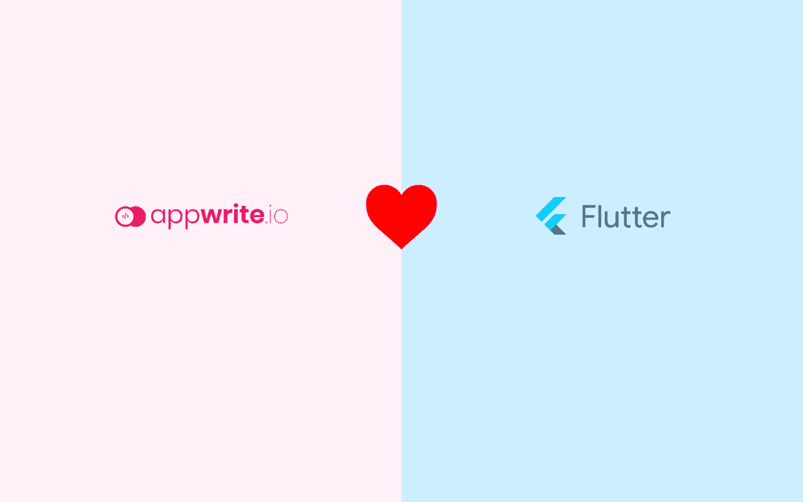
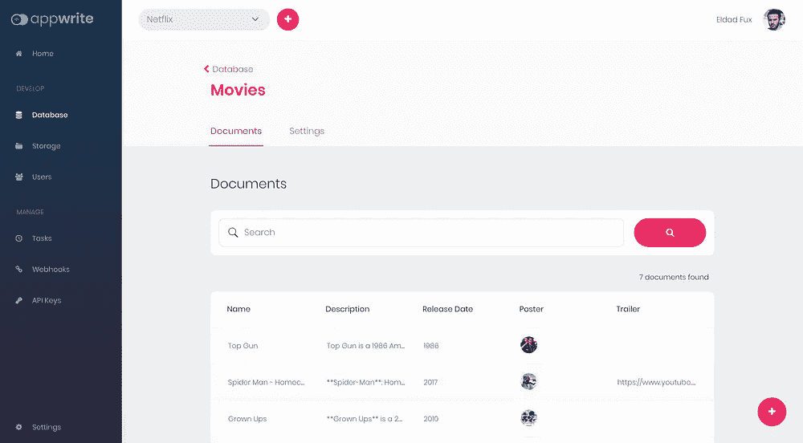
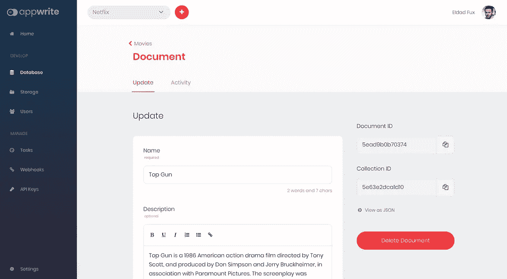
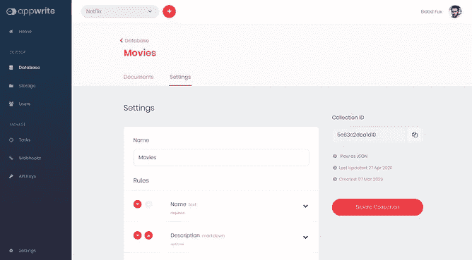
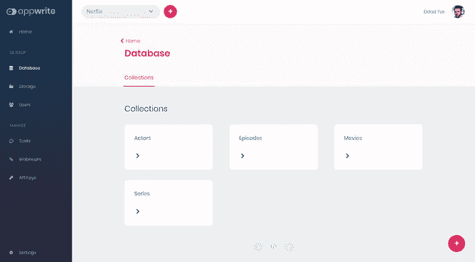
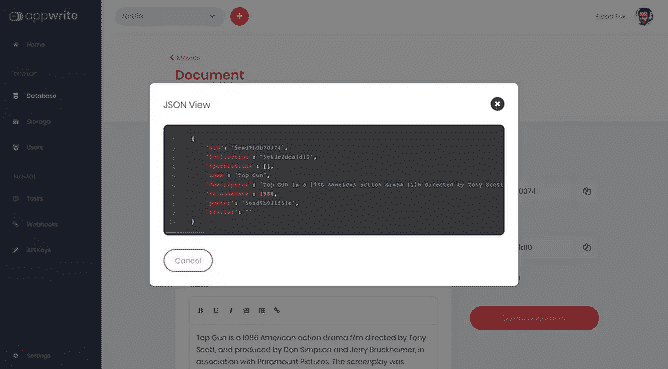

# 引入支持颤振的 Appwrite 0.6

> 原文：<https://itnext.io/introducing-appwrite-0-6-with-flutter-support-1eb4dce820f3?source=collection_archive---------8----------------------->

我们非常激动地宣布 Appwrite 0.6 的发布。新的 Appwrite 版本是我们自 8 个月前启动该项目以来的第 10 个版本，它有一些令人兴奋的新功能。

## 颤动支架

Appwrite 0.6 使用我们最新发布的 Flutter SDK 引入了期待已久的对 Flutter 应用程序的支持。新的 Flutter SDK 允许您非常容易地将您的 Flutter 应用程序与所有不同的 Appwrite 客户端 API 集成在一起。

你可以阅读我们新的【Flutter 应用入门指南来快速开始使用 Appwrite。我们的新集成可用于使用 Flutter 构建 Android 和 iOS 应用程序，在未来几周内，我们将努力增加对更多 Flutter 平台的支持。我们新的 Flutter SDK 现在可以作为一个 [Dart 包在 pub.dev](https://pub.dev/packages/appwrite) 上获得。

这是一个感谢我们的社区成员的好机会，他们帮助我们测试新的集成，并在此过程中为我们提供了许多反馈。特别感谢 Bartlomiej Tartanus(@[bartektartanus](https://github.com/bartektartanus))和 Ali Almoullim (@ [Almoullim](https://github.com/Almoullim) )。Bartlomiej 和 Ali 花了几个小时开发我们新的 Dart SDK 模板，验证 SDK 和服务器的集成，并在新版本的测试阶段帮助我们的 beta 测试人员。

## 新数据库用户界面

这是我们第一次推出 Appwrite 以来最期待的功能之一。有了新的 UI，你既可以浏览你的 Appwrite 集合和文档，也可以用一个漂亮的用户界面创建和编辑它们。

新的 UI 允许您使用新的表单或 JSON 视图来检查不同的数据库资源。到目前为止，您只能使用 Appwrite API 来执行大多数数据库操作，使用新的 UI，事情应该更容易管理和开始。

## 类型脚本支持、新的区域设置、健康 API 等等

0.6 版包含了更多的特性和错误修复。这个版本由六个开发人员提交的 238 个提交组成，更新了 500 多个文件。你可以在我们的 GitHub 库的官方发布页面上查看[完整的变更日志](https://github.com/appwrite/appwrite/releases/tag/0.6.0)。

# 下一步是什么？

加入我们的 [Github 知识库](https://github.com/appwrite/appwrite)和 [Discord 服务器](https://discord.gg/GSeTUeA)来分享你的想法和创意，并使用 Appwrite 寻求支持。

我们将很快发布 0.7 版本的目标。我们希望您能参与构建 Appwrite 的路线图。