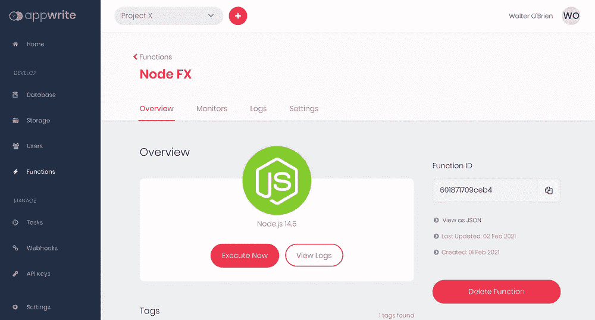
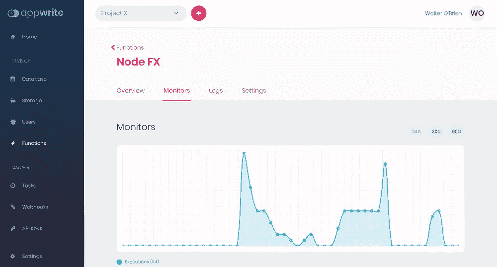
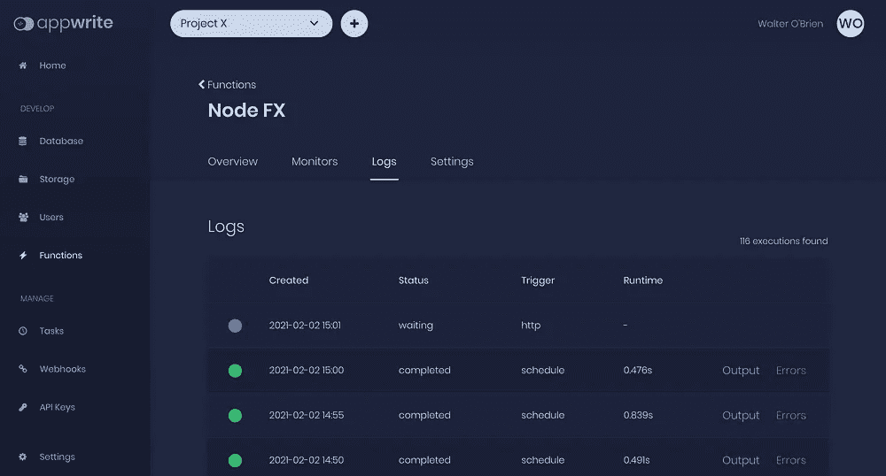
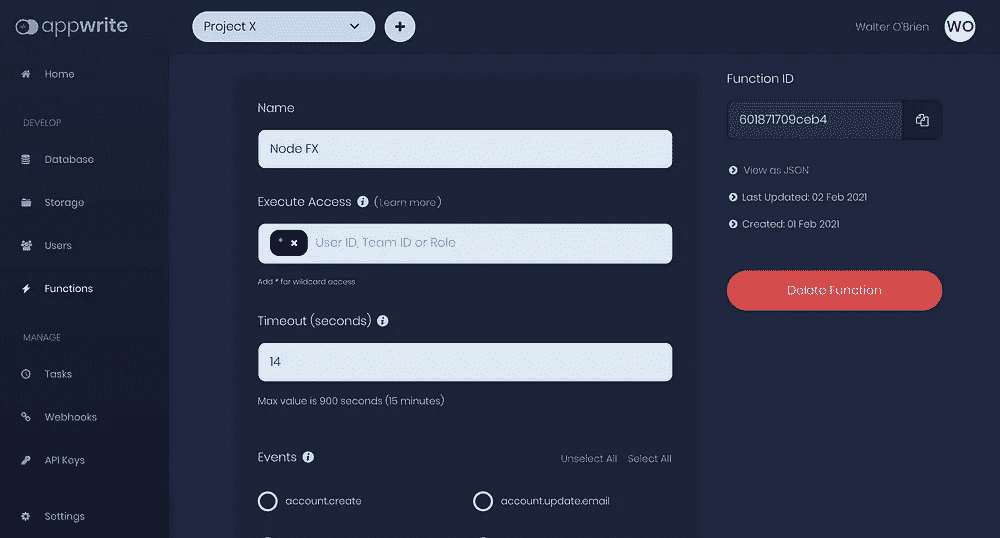
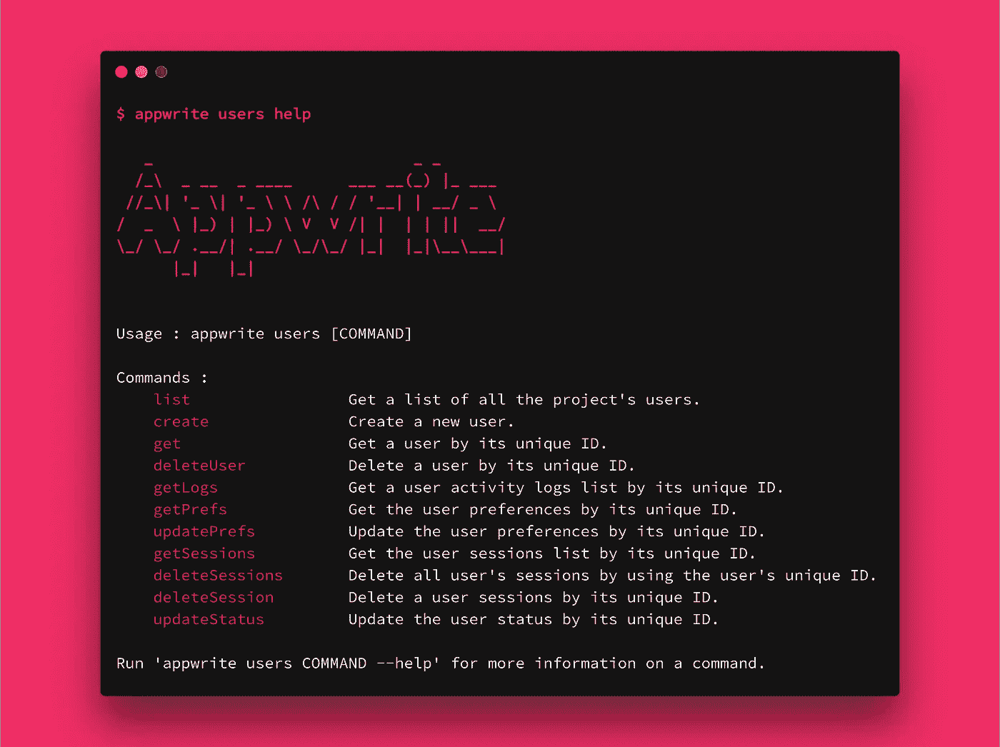
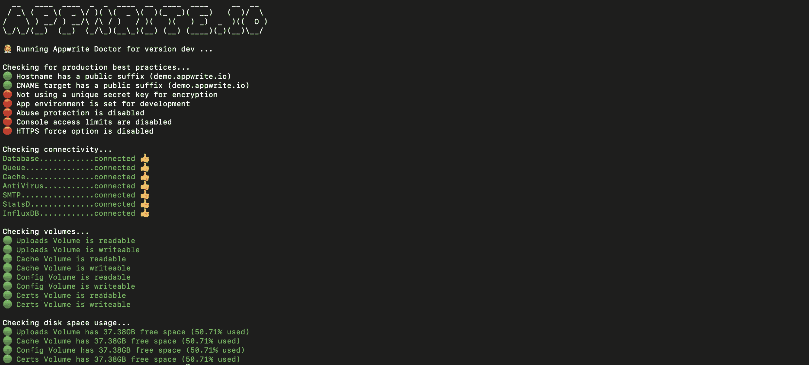

# 介绍具有云功能的 Appwrite BaaS v0.7、Appwrite CLI、Flutter Web 和+100 个新更新！

> 原文：<https://itnext.io/introducing-appwrite-baas-v0-7-1a73be195a85?source=collection_archive---------3----------------------->

比尔·杰伦在 [Unsplash](https://unsplash.com/s/photos/launch?utm_source=unsplash&utm_medium=referral&utm_content=creditCopyText) 上的照片

经过几个月的辛勤工作，+1，800 次提交，650 次拉请求，以及许多新贡献者加入 [Appwrite 社区](https://appwrite.io/discord)，我们很兴奋地宣布 [Appwrite 0.7](https://github.com/appwrite/appwrite) 的发布，这是我们有史以来最大的一次发布。新的 Appwrite 版本包括 100 多个新功能、错误修复、升级和安全补丁，以及一些主要功能，如云功能和新的 Appwrite CLI。

# 有什么新鲜事？

## 云函数

云功能可能是新版本最重要的更新。有了新的服务，您现在可以快速部署您的自定义后端代码来定制您的 Appwrite 服务器。您可以使用 Appwrite 仪表板和新的 Appwrite CLI 部署代码，并使用 API、特定的系统事件、预定义的计划甚至从仪表板执行代码。

根据 Appwrite 议程，创建一个跨平台的解决方案，不局限于客户端、服务器或编码语言，新服务将支持七种执行环境，包括 Node.js、Deno、Ruby、Python、PHP、。NET 和 Dart(更多内容即将推出)！

我们还公开了许多[新环境变量](https://appwrite.io/docs/environment-variables)，允许您根据自己的具体需求定制服务器设置。您可以在我们的教程中了解更多关于云函数解决方案的信息，以及 Appwrite 文档中提供的新 API 规范。我们的团队和社区还用不同的语言创建了[多个示例](https://github.com/appwrite/demos-for-functions)，用作设计新的云功能的示例和灵感。

## Appwrite CLI

Appwrite 堆栈的另一大亮点是新的 Appwrite CLI，我们对此感到非常兴奋。 [Appwrite CLI](https://github.com/appwrite/sdk-for-cli) 允许您与 [Appwrite 服务器端 API](https://appwrite.io/docs/command-line)进行交互，并使用您的终端快速执行服务器端任务。这些任务的几个例子包括管理资源(文档、文件、用户)、执行和打包云功能，以及通过 Appwrite API 可用的任何其他操作。

像我们的任何其他 SDK 一样，我们努力确保您获得相同的 Appwrite 体验。如果您使用过以前的 Appwrite SDK，使用新的 CLI 应该轻而易举。除了拥有从终端与 Appwrite 交互的工具之外，CLI 还非常适合将 Appwrite 轻松集成为 CI 流程的一部分。

您可以在 Appwrite 文档的新的专用部分安装并了解如何使用新的 CLI。

## 巨大的性能提升

性能是 Appwrite 团队的主要关注点之一，从版本 0.7 开始，您会注意到 Appwrite API 的巨大提升，这要归功于我们团队对 Appwrite HTTP 服务器所做的一些内部工作。我们的一些测试表明，与 0.6 版本相比，每秒请求数提高了 **~90%。在接下来的几天里，我们将分享一些公开的基准测试，通过更多关于使这种提升成为可能的变化的见解来展示差异。**

性能是我们路线图的一个重要部分，在接下来的几个版本中，我们将关注更多领域，以使 Appwrite 服务器在不同的端点和操作上更快。作为该流程的一部分，我们还将自动化我们的基准测试，并在专用平台上分享结果。

## 布罗特利压缩

如上所述，我们真的很关心性能，并在 Appwrite 1.0 的发布上投入了大量资金。作为这项工作的一部分，新版本将在我们的 HTTP API 中引入 Brotli 压缩支持。Appwrite 0.6 版本在 HTTP 2.0 中引入了支持，再加上 Brotli 压缩，预计 app write 的响应时间会更短。

如果你不熟悉 Brotli，它是 Google 开发的一种压缩算法，针对 API 和 web 流量的压缩进行了优化。一些基准测试显示，与传统的 GZIP 相比，Brotli 减少了 14%-21%的网络流量。

## 微服务架构

我们扩展了我们的[微服务架构](https://en.wikipedia.org/wiki/Microservices)，以获得更好的可扩展性和可见性。每个 Appwrite 进程现在都是一个独立的容器，具有独立的日志和救援使用指标。为您的系统增加了许多可观察性，并使错误或瓶颈更容易检测和调试。在 v0.7 中，整个 Appwrite 堆栈已经迁移到了 [Alpine OS 基础映像](https://hub.docker.com/u/appwrite)，导致映像大小更小，Docker 缓存的使用更好。 [ARM 支持](https://github.com/appwrite/appwrite/pull/726)即将推出，我们计划在下一个 Appwrite 版本中引入多架构支持。

## **app write 医生**

受令人敬畏的 Flutter Doctor 的启发，我们很高兴地推出了 Appwrite 等价物。像 Flutter 命令一样，Appwrite Doctor 允许您快速调试和分析您的服务器健康状况。

使用一个终端命令，您将获得一份关于 Appwrite 服务器健康状态的完整报告。除了告诉您什么可能在您的服务器上工作得不好之外，新命令还将告诉您您的服务器设置是否是最佳的，是否符合一些 Appwrite 最佳实践。

您可以在我们的[专用调试文档](https://appwrite.io/docs/debugging)中了解更多关于 Appwrite 医生和其他调试您的 appwrite 服务器的有用方法。

## 颤振腹板的支撑

Appwrite 0.7 和新的 Appwrite Flutter SDK 0.3.0 增加了对 Flutter Web 的支持。要成功构建与 Appwrite 集成的 web 应用程序，您只需在 Appwrite 项目的仪表板上添加一个 web 平台，并列出您的网站将用于允许与 Appwrite API 通信的域。

我们已经开始为 macOS、Linux 和 Windows 添加对 Flutter 桌面的支持，我们希望很快能与 Flutter 粉丝分享一些令人兴奋的消息。

# 了解更多信息

变化和升级的列表确实很长，如果你去我们的[变化日志](https://github.com/appwrite/appwrite/blob/0.7.x/CHANGES.md)了解更多关于新的 Appwrite 版本中等待你的所有酷的新东西，那将是最好的。在接下来的几天和几周内，我们将发布 features spotlight、新教程以及如何使用新功能来最大化您的 Appwrite 堆栈的用例。

# 下一步是什么？

在你拿到新版 Appwrite 服务器的副本后，你可以查看我们的一些入门指南，包括 [Web](https://appwrite.io/docs/getting-started-for-web) 、 [Flutter](https://appwrite.io/docs/getting-started-for-flutter) 或[服务器](https://appwrite.io/docs/getting-started-for-server)，并访问我们的 [Discord 社区](https://appwrite.io/discord)，在那里我们与 1200 多名应用程序作者不停地讨论 Appwrite。

如果你对这个版本感到兴奋，你可能也应该通过访问我们的 [Github 项目](https://github.com/appwrite/appwrite/projects)来跟踪接下来会发生什么。您还可以在我们的 [Github 问题](https://github.com/appwrite/appwrite/issues)上询问新特性，并在 [Appwrite RFCs 资源库](https://github.com/appwrite/rfc)上查看我们即将发布的特性规范。