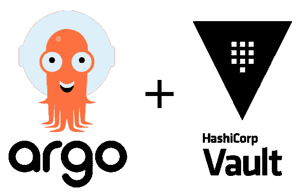
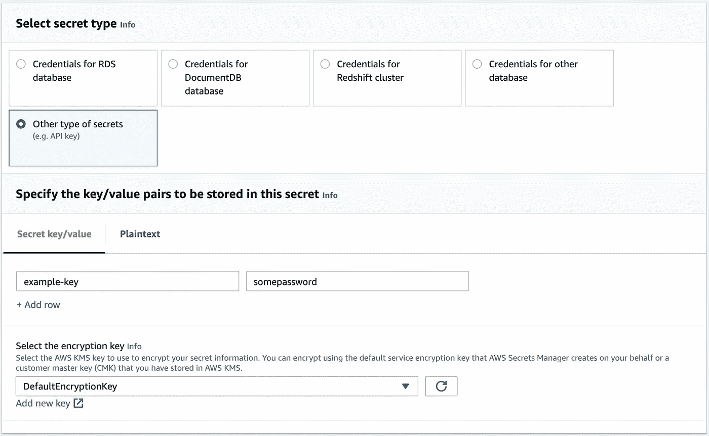
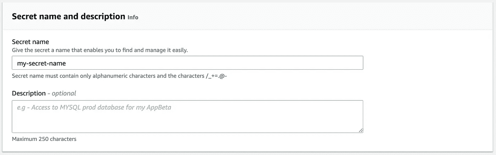

# 介绍 argocd-vault-plugin 1.0 版！

> 原文：<https://itnext.io/introducing-argocd-vault-plugin-v1-0-708433294b2d?source=collection_archive---------4----------------------->



* *更新:我们已经将 argocd-vault-plugin 库转移到 argoproj-labs 组织，您现在可以在这里找到用途[https://github.com/argoproj-labs/argocd-vault-plugin](https://github.com/argoproj-labs/argocd-vault-plugin)

argocd-vault-plugin 背后的团队很高兴地宣布我们的 1.0 版本！在这个版本中，我们添加了几个非常酷的新功能，同时也修复了一些 bug。由于这是一个主要版本，有几个突破性的变化，我们将在这里讨论。

# 新的内嵌路径格式

在 argocd-vault-plugin 之前的版本中，您要么必须指定一个`PATH_PREFIX`环境变量，要么必须设置一个`avp_path`注释。在一个秘密中有许多密钥的情况下，这些方法是有效的，但如果只有一个密钥或者想要将多个秘密组合在一个文件中，这些方法就无效了。使用 1.0 版，您现在可以在占位符中设置单独的路径。这允许一个 Kubernetes 秘密文件从多个 Vault 秘密中提取，并且不需要注释或额外的环境变量。

内嵌路径的格式是`<path:your/vault/path#keyname>`

例如:

```
apiVersion: v1
kind: Secret
metadata:  
  name: inline-secret
stringData:  
  inlineSecret: <path:path/to/vault#somekey>
  otherInlineSecret: <path:path/to/another/vault#someOtherkey>
type: Opaque
```

我们希望这增加了组织 Kubernetes 资源的灵活性，以及从 Vault 后端获取价值的方式。

# 支持 AWS 机密管理器

当我们开始构建 argocd-vault-plugin 时，我想确定的一件事是，我们比 HashiCorp Vault 支持更多的工具(尽管工具的名称不同)。

从 1.0 版开始，您现在可以选择使用 AWS Secret Manager 和 argocd-vault-plugin！

AWS Secrets Manager 的工作方式与任何其他 backed 一样，在`argocd-repo-server`窗格中设置所需的环境变量:

```
AVP_TYPE: awssecretsmanager
AVP_AWS_ACCESS_KEY_ID: Your AWS Access Key ID
AVP_AWS_SECRET_ACCESS_KEY: Your AWS Secret Access Key
```

然后在 AWS Secrets Manager 中，创建一个新的密钥/值机密:



给这个秘密起个名字:



然后，您可以像这样引用 yaml 中的秘密:

```
apiVersion: v1
kind: Secret
metadata:
  name: example-secret
stringData:
  sample-secret: <path:my-secret-name#example-key>
type: Opaque
```

我们希望继续扩大我们的支持后端列表。如果您希望添加一个后端，您可以在这里提出功能请求[。我们也接受贡献，所以请随意为您选择的后端创建一个拉请求！](https://github.com/IBM/argocd-vault-plugin/issues/new?assignees=&labels=&template=feature_request.md&title=)

# 支持所有 HashiCorp Vault 环境变量

我们之前看到的一个问题是，用户希望能够使用 HashiCorp Vault 后端接受的默认环境变量。到目前为止，我们一直在包装某些变量。但是从 1.0 版开始，如果使用`vault`后端，所有 HashiCorp Vault 环境变量都被接受！

# 从 0.x 迁移到 1.0

随着主要版本的发布，在升级到 1.0 版时需要解决一些突破性的变化。

**改变注释**

在 1.0 版中，我们更新了注释以适应 Kubernetes 命名约定。这些变化是:

```
avp_path -> avp.kubernetes.io/path
avp_ignore -> avp.kubernetes.io/ignore
kv_version -> avp.kubernetes.io/kv-version
```

**环境变量的 AVP 前缀**

现在所有与 AVP 相关的环境变量都需要前缀`AVP`。这不包括 Vault 环境变量。在 0.x 版本中，您可以使用配置文件或 Kubernetes secret 而不使用前缀`AVP`。在 1.0 版中，即使使用配置文件或密码，也必须使用`AVP`。

**弃用路径前缀**

从 1.0 版开始，我们移除了对`PATH_PREFIX`环境变量的支持。升级时，您会希望使用内嵌路径或`avp.kubernetes.io/path`。

**IBM Secret Manager 名称变更**

因为我们添加了 AWS Secrets Manager，所以我们希望更新环境变量中的命名，使其更加一致。对于 1.0 版，`secretmanager`现在应被称为`ibmsecretsmanager.`

# 摘要

我们非常高兴这个 1.0 版本，我们希望你也喜欢它！您可以查看[发行说明](https://github.com/IBM/argocd-vault-plugin/releases/tag/v1.0.0)和[迁移指南](https://github.com/IBM/argocd-vault-plugin/blob/main/README.md#0x-to-1x-migration-guide)以获得关于新版本的更多信息。我们期待您的反馈，并期待未来的新功能！